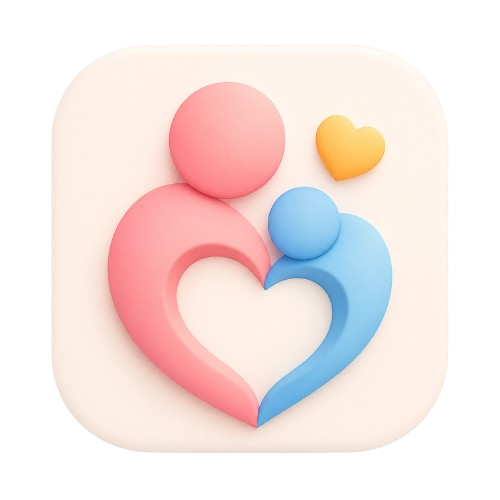
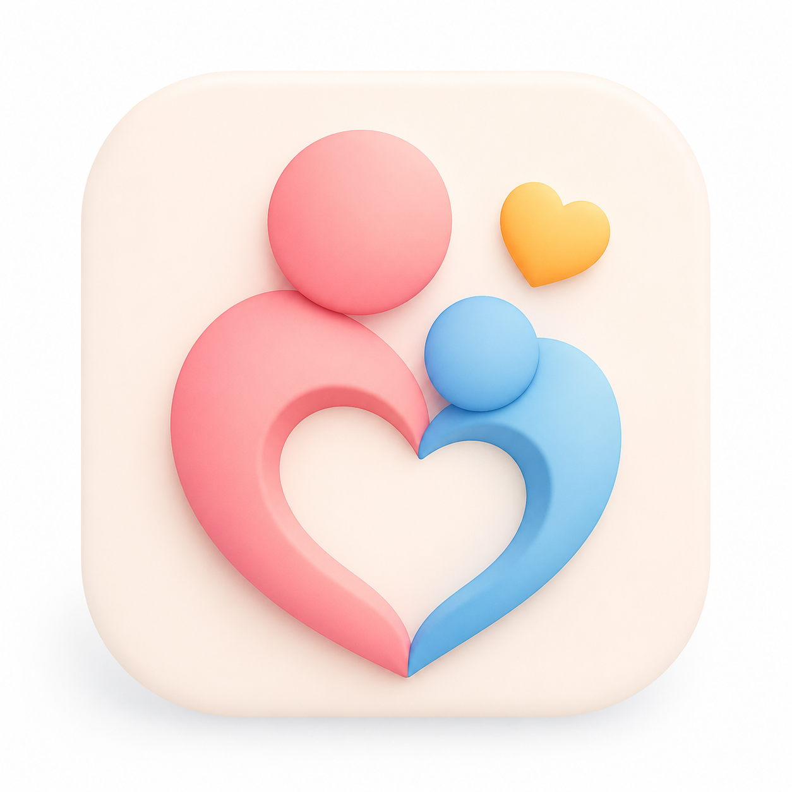

# ForMysha - Roadmap Pengembangan

## Mengapa Bernama ForMysha?

**ForMysha** bukan berarti aplikasi yang hanya dibuat untuk seseorang bernama **Mysha**.

Nama ini memiliki filosofi yang sederhana namun bermakna.

* **For** berarti **"untuk"**.
* **My** berarti **"milikku"** atau **"kesayanganku"**.
* **Sha** melambangkan **buah hati**, sebagai nama simbolis yang mewakili setiap anak.
* **.my.id** adalah domain Indonesia yang sekaligus memperkuat makna "My Identity" dan "My Indonesia", sehingga terasa personal namun tetap relevan untuk semua keluarga.

Secara sederhana, **ForMysha** dapat dimaknai sebagai:

> **"Untuk buah hati tercinta."**

Bukan hanya untuk satu anak, tetapi untuk **setiap anak yang menjadi kebanggaan keluarganya**.

---

## Filosofi Brand

Setiap anak memiliki cerita.

Setiap momen layak dikenang.

Setiap keluarga berhak memiliki tempat yang aman untuk menyimpan kenangan tersebut.

ForMysha hadir sebagai rumah digital untuk menyimpan perjalanan hidup anak, mulai dari hari pertama lahir hingga mereka tumbuh dewasa.

---

## Makna Domain

Domain:

**formysha.my.id**

memiliki tiga lapisan makna.

### For

Untuk.

Platform ini dibuat **untuk keluarga**.

### My

Milikku.

Melambangkan hubungan emosional antara orang tua dan anak.

Bukan sekadar kepemilikan, tetapi rasa sayang, perhatian, dan kenangan yang ingin dijaga.

### Sha

Simbol anak.

"Sha" dipilih sebagai representasi universal, sehingga setiap pengguna dapat membayangkan nama anak mereka sendiri.

Misalnya:

* For My Aisyah
* For My Adit
* For My Raka
* For My Nara
* For My Bintang

Intinya adalah **"For My Child"**, bukan terbatas pada nama tertentu.

### .my.id

Domain **.my.id** dipilih karena:

* Identitas Indonesia.
* Mudah diingat.
* Memberikan kesan personal.
* Mendukung konsep bahwa setiap anak memiliki identitas digitalnya sendiri.

---

## Brand Story

ForMysha berawal dari sebuah ide sederhana.

Bagaimana jika setiap anak memiliki tempat yang aman untuk menyimpan seluruh perjalanan hidupnya?

Bukan hanya foto.

Bukan hanya video.

Tetapi juga cerita, pertumbuhan, kesehatan, pendidikan, prestasi, dan kenangan yang dapat dikenang sepanjang hidup.

Dari pertanyaan itulah lahir ForMysha.

Sebuah Digital Life Book yang dapat digunakan oleh siapa pun, untuk anak siapa pun.

---

## Pesan Brand

> **ForMysha bukan tentang satu nama. Ini tentang setiap anak yang menjadi dunia bagi orang tuanya.**

Atau versi yang lebih singkat:

> **ForMysha berarti "Untuk Buah Hatiku". Sebuah ruang digital untuk menyimpan setiap momen, kenangan, dan perjalanan hidup anak sejak lahir hingga dewasa.**

---

## Personal Digital Identity

Setiap anak yang didaftarkan akan memiliki **slug unik** yang menjadi identitas digitalnya.

Contoh:

```
formysha.my.id/mysha
```

atau

```
formysha.my.id/qaireen
```

atau

```
formysha.my.id/alexa
```

Slug tersebut menjadi halaman utama perjalanan hidup anak dan hanya dapat diakses sesuai pengaturan privasi yang dipilih keluarga.

---

## Custom Public URL (Opsional)

Pengguna dapat mengaktifkan halaman publik dengan URL seperti:

```
formysha.my.id/mysha
```

Halaman ini dapat menampilkan informasi yang dipilih pengguna, misalnya:

* Foto profil.
* Nama panggilan.
* Timeline pilihan.
* Ucapan ulang tahun.
* Prestasi.
* Galeri pilihan.

Data sensitif seperti dokumen, kesehatan, atau informasi pribadi tetap bersifat privat.

---

## Konsep "My"

Kata **My** menjadi inti identitas platform.

Contohnya:

* My Story
* My Timeline
* My Memories
* My Growth
* My Health
* My Documents
* My School
* My Awards
* My Family
* My Gallery
* My Diary

Semua modul menggunakan awalan **My** agar konsisten dengan nama **ForMysha**.

---

## URL Structure

```
formysha.my.id/
```

Landing Page

```
formysha.my.id/login
```

Login

```
formysha.my.id/register
```

Register

```
formysha.my.id/dashboard
```

Dashboard

```
formysha.my.id/mysha
```

Profil anak

```
formysha.my.id/mysha/timeline
```

Timeline

```
formysha.my.id/mysha/gallery
```

Album

```
formysha.my.id/mysha/health
```

Kesehatan

```
formysha.my.id/mysha/documents
```

Dokumen

```
formysha.my.id/mysha/family
```

Family Sharing

### Future Roadmap

Apabila nanti memiliki domain internasional (misalnya `formysha.com`), struktur URL dan slug tetap sama sehingga migrasi tidak mengubah pengalaman pengguna.

Contoh:

```
formysha.com/mysha
```

atau

```
formysha.my.id/mysha
```

Keduanya dapat menggunakan sistem yang sama.

---

## Design Brief

### Design Philosophy

ForMysha dirancang sebagai aplikasi yang memberikan rasa hangat, aman, dan menyenangkan bagi orang tua dalam mendokumentasikan perjalanan hidup anak.

Desain harus mengutamakan **kesederhanaan**, **kemudahan penggunaan**, dan **emosi positif**, sehingga setiap interaksi terasa ringan dan menyenangkan.

Inspirasi desain berasal dari dunia bayi dan keluarga modern, dengan pendekatan minimalis yang tetap profesional.

### Design Style

Konsep desain:

* Modern
* Cute
* Clean
* Friendly
* Soft
* Minimalist
* Family Oriented
* Emotional
* Premium
* Playful (secukupnya)

Targetnya adalah tampilan yang tetap elegan untuk orang tua, tetapi memiliki sentuhan visual yang ramah untuk dunia anak.

### Design Keywords

* Baby
* Family
* Memory
* Growth
* Love
* Happiness
* Smile
* Story
* Journey
* Safe

### UI Character

Antarmuka harus memberikan kesan:

* Ramah.
* Menenangkan.
* Ceria.
* Tidak membingungkan.
* Mudah dipahami oleh semua usia.

Pengguna harus merasa nyaman menggunakan aplikasi setiap hari.

### Visual Direction

Gunakan elemen visual yang lembut seperti:

* Sudut membulat (rounded corners).
* Ikon bergaya outline atau rounded.
* Ilustrasi sederhana.
* Empty state yang lucu.
* Maskot atau karakter kecil sebagai pendamping (opsional).
* Animasi halus untuk transisi dan interaksi.

Hindari tampilan yang kaku, penuh garis tajam, atau terlalu teknis.

### Color Palette

Gunakan warna pastel modern dengan kontras yang tetap baik agar mudah dibaca.

Contoh palet:

* Sky Blue
* Mint Green
* Soft Pink
* Lavender
* Warm Yellow
* Peach
* Soft Orange
* White
* Light Gray

Warna utama sebaiknya menciptakan rasa tenang dan aman, bukan terlalu mencolok.

### Typography

Gunakan font modern dengan bentuk huruf yang membulat dan mudah dibaca.

Karakter font:

* Friendly
* Soft
* Clean
* Modern
* Tidak terlalu formal

Ukuran teks harus nyaman untuk dibaca di berbagai perangkat.

### Icon Style

Ikon harus:

* Rounded.
* Minimalis.
* Konsisten.
* Mudah dikenali.

Hindari ikon yang terlalu rumit atau bergaya korporat.

### Illustration Style

Gunakan ilustrasi bergaya:

* Flat Illustration.
* Soft Gradient (opsional).
* Cute Character.
* Family Friendly.
* Gender Neutral.
* Modern.

Ilustrasi berfungsi sebagai pendukung, bukan elemen utama yang mengganggu fokus.

### Components

Semua komponen UI harus memiliki bentuk yang konsisten.

* Rounded Card.
* Rounded Button.
* Rounded Input.
* Rounded Avatar.
* Soft Shadow.
* Clean Layout.
* White Space yang cukup.

### Dashboard Style

Dashboard harus terasa seperti melihat album kenangan, bukan laporan bisnis.

Elemen utama:

* Foto terbaru anak.
* Timeline singkat.
* Pengingat penting.
* Ringkasan pertumbuhan.
* Akses cepat ke fitur utama.

### User Experience

Prinsip UX:

* Maksimal tiga klik untuk mencapai fitur penting.
* Navigasi sederhana dan konsisten.
* Bahasa yang mudah dipahami.
* Proses tambah foto, video, atau catatan dibuat secepat mungkin.
* Fokus pada kemudahan penggunaan bagi orang tua yang sibuk.

### Responsive Design

Website harus responsif dan nyaman digunakan pada:

* Desktop.
* Laptop.
* Tablet.
* Smartphone.

Prioritaskan desain **mobile-friendly**, meskipun produk pertama adalah aplikasi web.

### Accessibility

Perhatikan:

* Kontras warna yang baik.
* Ukuran tombol yang mudah disentuh.
* Ukuran teks yang nyaman dibaca.
* Fokus keyboard yang jelas.
* Alt text untuk gambar penting.

### Brand Personality

ForMysha harus dikenal sebagai:

* Hangat.
* Ceria.
* Aman.
* Ramah.
* Modern.
* Terpercaya.
* Profesional.
* Penuh kasih sayang.

### Emotional Experience

Setiap kali orang tua membuka ForMysha, mereka harus merasakan:

> "Ini adalah tempat terbaik untuk menyimpan setiap kenangan berharga anakku."

Aplikasi bukan sekadar alat penyimpanan data, tetapi sebuah **ruang digital penuh cerita dan kasih sayang**, yang membuat orang tua ingin kembali menggunakannya setiap kali ada momen baru.

### Referensi Nuansa Desain

Sebagai acuan visual (bukan untuk ditiru), nuansa yang ingin dicapai adalah kombinasi:

* **Apple** → bersih, sederhana, premium.
* **Airbnb** → hangat dan ramah.
* **Duolingo** → karakter yang menyenangkan tanpa berlebihan.
* **Headspace** → ilustrasi lembut dan menenangkan.

Dengan kombinasi tersebut, ForMysha akan terasa seperti aplikasi keluarga modern: lucu, ringan, profesional, dan tetap dipercaya untuk menyimpan kenangan yang paling berharga.

### Brand Assets

#### Logo



Logo ForMysha menampilkan dua figur (orang tua dan anak) dalam bentuk hati dengan warna pastel — pink untuk orang tua dan biru untuk anak — melambangkan kasih sayang dan kebersamaan keluarga. Hati kuning kecil menambahkan sentuhan keceriaan.

#### Favicon



Favicon menggunakan desain yang sama dengan logo dalam ukuran yang lebih kecil, memastikan konsistensi visual di semua perangkat dan browser.

#### Lokasi Aset

```
public/logo.png      → Logo utama
public/favicon.png   → Favicon browser
public/favicon.ico   → Favicon legacy
```

---

## Phase 1 — MVP ✅ Selesai

* Authentication ✅
* Dashboard ✅
* Profil Anak ✅
* Timeline ✅
* Album ✅
* Diary ✅
* Dokumen ✅
* Kalender ✅
* Family Sharing ✅
* Public Profile ✅

---

## Phase 2 — Parenting ✅ Selesai

* Pertumbuhan (tinggi badan, berat badan, lingkar kepala, grafik SVG)
* Kesehatan (imunisasi, penyakit, obat, alergi, checkup, dokter)
* Pencarian lintas modul (Timeline, Diary, Dokumen, Kesehatan)
* Notifikasi sistem (badge counter, mark as read, mark all as read)
* Dashboard update (widget pertumbuhan & kesehatan, akses cepat)
* Total: 299 tests, 633 assertions

---

## Phase 3 — Quality Improvement ✅ Selesai

* Fixed critical bugs: Dashboard child_name error, Public Profile $album->cover, .env timezone capitalization
* Fixed medium bugs: .env.example sync, footer dead links, Dashboard closure → DashboardController, object access standardization
* Child ownership middleware (`child.ownership`) — sentralisasi otorisasi di routes
* Toast notification system global (`x-toast` component)
* Confirm delete modal (`x-confirm-delete` component)
* Static pages: Tentang Kami, Kebijakan Privasi, Syarat & Ketentuan
* Dashboard extracted to `DashboardController`
* 299 tests, 633 assertions — all passing
* Laravel Pint formatting applied

---

## Phase 3.5 — Comprehensive Improvement ✅ Selesai

* **Quick Wins:**
  * Welcome page CSS fallback修复 (G1)
  * Mobile bottom nav: 4 visible + overflow dropdown (G2)
  * Bottom nav padding agar konten tidak tertutup (G3)
  * Dashboard growth items clickable (G4)
  * Child show page: child-nav sidebar (G5)
  * Dead code cleanup: 27 clearCache() no-op calls removed (G6)
  * Health index filter link konsistensi (G7)
  * ROADMAP.md assertion count fix (G8)
* **Medium Features:**
  * Search: Growth records ditambahkan (M1)
  * Loading skeleton component `x-loading-skeleton` (M2)
  * Photo upload di child create/edit form (M3)
  * Export ZIP: bulk download semua data anak (M4)
  * Rate limiting export PDF: 5 req/min, ZIP: 3 req/min (M5)
  * Calendar monthly grid view dengan toggle grid/list (M6)
* **Architecture:**
  * Dashboard caching: `Cache::remember()` 5 menit TTL (A1)
  * Pagination konsisten di semua index views (A2)
  * Documentation sync: FEATURES.md & ROADMAP.md updated (A3)

---

## Phase 4 — SaaS ✅ Selesai

### Phase 4.1 — SaaS Architecture

* Multi Tenant (column-based tenancy dengan `tenant_id`)
* Subscription Management (pending → active lifecycle)
* Billing & Payment (manual bank transfer: BRI, JAGO, BTN, BSI)
* Tenant Management (CRUD, toggle status, soft delete)
* Plan Management (Gratis, Basic, Premium, Enterprise)
* Feature Limit Middleware (`EnsureFeatureLimit`)
* Subscription Enforcement (`EnsureActiveSubscription`)

### Phase 4.2 — Tenant Admin

* Tenant Admin Dashboard
* Branding Management (logo, warna, identitas visual)
* Settings Management (domain, notifikasi, konfigurasi)
* Usage Monitoring (anak, foto, video, storage)

### Phase 4.3 — Super Admin Panel

* Super Admin Dashboard
* Analytics Dashboard (pendapatan, pertumbuhan tenant, distribusi langganan)
* Monitoring (health check, login activity, storage usage)
* Payment Approval Workflow (approve/reject dengan catatan)
* Audit Log

### Phase 4.4 — Custom API Integration

* REST API dengan API key
* OAuth authentication
* Webhook support
* Request/Response logging
* API Documentation

### Phase 4.5 & 4.6 — Testing Suite & Documentation

* Feature Tests: TenantTest (7), PlanTest (7), SubscriptionTest (5), PaymentTest (7), TenantAdminTest (5), AnalyticsTest (3), FeatureLimitTest (3)
* Unit Tests: TenantServiceTest (3), SubscriptionServiceTest (4), AuditServiceTest (2)
* Total: 46 test SaaS, 345 test keseluruhan (738 assertions)
* Pest PHP dengan `describe/it` blocks
* Pint formatter untuk kode bersih
* Documentation: FEATURES.md & ROADMAP.md updated

### Bug Fixes (Phase 4)

* Fixed: `toggle-status` → `toggleStatus` (PHP method naming)
* Fixed: `tenant_branding` → `tenant_brandings` (table name mismatch)
* Fixed: `Tenant::media()` — replaced `HasManyThrough` dengan polymorphic query
* Fixed: `Tenant::activeSubscription()` — `latestOfMany()` → `latest()` (UUID compatibility)
* Fixed: `AuditService::log()` — `property_exists()` → null coalescing (Eloquent attribute detection)
* Fixed: `getStorageUsed()` — `sum('size')` → `sum('file_size')` (correct column name)
* Fixed: `getPhotoCount()`/`getVideoCount()` — `type` → `file_type` (correct column name)

---

## Phase 5 — UX & Documentation Final ✅ Selesai

* Welcome page: link "Tentang Kami" di navigasi
* Dashboard: empty states dengan guidance text untuk setiap section
* Navigation: link "Paket Langganan" dan "Langganan Saya" untuk role parent
* Footer minimalis di semua halaman terautentikasi
* Fitur Backup: ✅ (Export PDF & ZIP)
* Fitur Custom API Integration: ✅ (REST API, API Key, OAuth, Webhook)
* Quality Assurance audit selesai: 345 tests, 738 assertions — all passing
* Documentation sync: FEATURES.md, ROADMAP.md, AGENTS.md updated

---

## Phase 6 — Integration ✅ Selesai

### Sub-Phase 6.1 — Foundation & Authentication ✅

* Sanctum installation & configuration
* Personal access tokens table migration
* Auth API endpoints (login, register, logout, me, updateProfile, updatePassword)
* API base controller (`ApiController`) with response helpers
* Rate limiting (60/min general, 5/min auth)

### Sub-Phase 6.2 — Core Resources API ✅

* Children CRUD API
* Timeline CRUD API
* Albums CRUD API
* Diaries CRUD API
* Growth CRUD API (including chart data endpoint)
* Health Records CRUD API
* Events CRUD API
* Family Members CRUD API
* Eloquent API Resources for all models

### Sub-Phase 6.3 — Support Features API ✅

* Notification API (list, mark read, mark all, unread count)
* Search API (cross-module search)
* Dashboard API (user dashboard data)
* Plan API (public, listing & detail)

### Sub-Phase 6.4 — Super Admin & Tenant Admin API ✅

* Super Admin: Tenant management (list, toggle status)
* Super Admin: Payment management (list, approve, reject)
* Super Admin: Plan management
* Super Admin: Analytics & Monitoring endpoints
* Role-based middleware (`role:super_admin`)

### Sub-Phase 6.5 — Webhook System ✅

* Webhook model & migration (UUID, events JSON, secret)
* WebhookLog model & migration
* WebhookService (register, unregister, trigger, verify signature)
* WebhookController (CRUD, test, logs)
* StoreWebhookRequest & UpdateWebhookRequest validation
* Webhook events definition (tenant, subscription, payment, child, timeline, album, diary, document, growth, health_record, event)

### Sub-Phase 6.6 — Documentation & Finalisasi ✅

* API route definitions (`routes/api.php`)
* FEATURES.md updated with REST API documentation
* ROADMAP.md updated (Phase 6 marked complete)
* AGENTS.md updated with API conventions

### Sub-Phase 6.7 — Migration & Configuration ✅

* `personal_access_tokens` table migration
* Sanctum configuration in `config/sanctum.php`
* CORS configuration for API access
* API middleware group in `bootstrap/app.php`

### Sub-Phase 6.8 — Testing Suite ✅

* 15 API test files in `tests/Feature/Api/`
* 62 API tests covering all endpoints
* AuthTest (8), ChildApiTest (7), TimelineApiTest (5), DiaryApiTest (5), AlbumApiTest (5)
* GrowthApiTest (3), HealthApiTest (3), EventApiTest (2), FamilyApiTest (2)
* NotificationApiTest (4), SearchApiTest (2), PlanApiTest (2), DashboardApiTest (1)
* SuperAdminApiTest (8), WebhookApiTest (5)
* Total: 407 tests, 800+ assertions — all passing

### Sub-Phase 6.9 — Documentation Update ✅

* FEATURES.md: REST API section added with full endpoint documentation
* ROADMAP.md: Phase 6 marked complete with sub-phase details
* AGENTS.md: API conventions, routes, and test patterns documented

---

## Phase 7 — Enterprise ✅

* White Label solution
* Custom Domain per tenant
* Multi Bahasa (i18n)
* Marketplace Plugin
* Enterprise Dashboard & Analytics

---

## Phase 8 — Responsive Design Overhaul ✅

Perubahan responsive design besar-besaran pada **88+ file view Blade** untuk memastikan pengalaman pengguna yang optimal di semua perangkat (mobile, tablet, desktop).

### Landing Page (`welcome.blade.php`)

* Header: Hamburger menu mobile dengan full-screen overlay
* Footer: Centered layout dengan flex-wrap

### Auth Views (`layouts/guest.blade.php` + `auth/*.blade.php`)

* Split design layout: branding panel (kiri) + form panel (kanan)
* Mobile: logo kecil di atas form
* Desktop: branding area dengan dekorasi animasi
* Brand color updates: primary-button (softPink), text-input (softPink focus)
* Semua auth views diperbarui dengan header emoji, placeholder, link navigasi

### Module Views (children, timeline, albums, health, diary, growth, documents, calendar, family)

* Header flex responsive: stack di mobile, row di desktop
* Container padding: `px-4 sm:px-6 lg:px-8`
* Form/card padding: `p-4 sm:p-6 lg:p-8`
* Submit buttons: stack di mobile, row di desktop
* Touch targets: `min-h-[44px]` pada semua tombol
* Table wrapper: `overflow-x-auto` dengan edge-to-edge padding di mobile

### SaaS Views (subscription, super-admin, admin)

* Sidebar responsive dengan mobile drawer
* Dashboard cards responsive grid
* Tabel data scrollable di mobile

### Support Views (notifications, search, profile, public profile)

* Semua header responsive
* Modal: `max-h-[90vh] overflow-y-auto`
* Dropdown: `max-h-[70vh] overflow-y-auto`

### Blade Components

* `child-nav`: scrollable horizontal di mobile
* `empty-state`: responsive padding
* `confirm-delete`, `modal`: responsive layout
* `toast`: touch-friendly close button
* `dropdown`: responsive overflow
* `calendar-grid`: responsive header
* `growth-chart`: flexible tabs
* Semua buttons: `min-h-[44px]`, `rounded-xl`

### Pages Layout (`components/pages-layout.blade.php`)

* Back link: icon di mobile, text di desktop

### Responsive Design Patterns (Standar)

```
Header:           flex flex-col sm:flex-row sm:items-center sm:justify-between gap-3
Container:        px-4 sm:px-6 lg:px-8
Card/Form:        p-4 sm:p-6 lg:p-8
Submit buttons:   flex flex-col sm:flex-row items-stretch sm:items-center gap-3
Touch targets:    min-h-[44px] pada semua tombol
Table:            overflow-x-auto -mx-4 sm:mx-0 px-4 sm:px-0
Modal:            max-h-[90vh] overflow-y-auto
Dropdown:         max-h-[70vh] overflow-y-auto
Child nav:        scrollable horizontal di mobile
Button rounded:   rounded-xl (konsisten)
```

---

## Phase 9 — Comprehensive Improvement ✅

### Sub-Phase 9.1 — Bug Fix & Documentation Sync ✅

* Sync `.env.example` — tambah `SAAS_MODE`, `BILLING_*`, `SUPER_ADMIN_PASSWORD`
* Sync `AGENTS.md` — update Laravel 12 → Laravel 13
* Sync test counts di `FEATURES.md` & `ROADMAP.md`
* Standardisasi delete confirm di 3 views (timeline/show, diaries/show, albums/show)

### Sub-Phase 9.2 — Light Features ✅

* Loading state pada form submit utama (children, timeline, albums, diaries, children/edit)
* Loading state pada auth forms (login, register) — fix Blade/Alpine conflict
* Audit & pastikan pagination konsisten — already consistent

### Sub-Phase 9.5 — Comprehensive Improvement ✅

* **Loading States Ekstensif**: Tambah Alpine.js loading states pada 15 form tambahan:
  - Core: growth (create/edit), health (create/edit), documents (create/edit), calendar (create/edit), family (create/edit)
  - Admin: subscription/payment-upload, super-admin/tenants (create/edit), super-admin/plans (create/edit)
  - Total: 25 form memiliki loading state konsisten
* **`.env.production` Sync**: Perbaikan LOG_LEVEL (debug→warning)
* **Pint Formatter**: Semua file PHP terformat dengan Laravel Pint

### Sub-Phase 9.3 — UX Improvements ✅

* Child selector di dashboard — pills + filter + Quick Access fix
* Quick actions buttons di child show — Share (copy URL) + Edit
* Keyboard shortcut Ctrl+K → Search
* Audit toast notification — all controllers consistent

### Sub-Phase 9.4 — Architecture ✅

* **API Versioning**: Semua API routes menggunakan prefix `/api/v1/` via `Route::prefix('v1')->group()`
* **Rate Limiting**: `throttle:upload` (20/min) untuk media upload, `throttle:auth` (5/min) untuk auth, `throttle:api` (60/min) untuk general
* **Email Notification System**: `NotificationService` (centralized), `WelcomeMail`, `SubscriptionMail` — async via `ShouldQueue`
* **Automated Backup Command**: `php artisan backup:child-data` — JSON export, cleanup options
* **Image Optimization Service**: Auto-resize & compress images via GD extension, thumbnail generation, `ImageOptimizationService`
* **Full-text Search Enhancement**: `SearchService` — centralized search across children, timelines, diaries, documents, events, health, growth, family members
* **New Migration**: `add_optimization_fields_to_media_table` — `thumbnail_path`, `optimized_size` columns

## Phase 10 — Comprehensive Quality & Enhancement ✅ Selesai

### Sub-Phase 10.1 — Verifikasi & Sync ✅

* Verifikasi semua fitur Phase 1-9 berfungsi dengan benar
* Sync database migrations, factories, dan seeder
* Validasi semua routes terdaftar dan berfungsi

### Sub-Phase 10.2 — Bug Fix & Konsistensi UX ✅

* Standarisasi delete confirmation pattern (x-confirm-delete component)
* Fix dashboard quick access ke child yang benar (bukan selalu anak pertama)
* Audit routes & dead links
* Audit tombol & event handler

### Sub-Phase 10.3 — Light Features ✅

* Advanced filtering: date range, type, dan status filter
* Sort options: newest, oldest, name (A-Z, Z-A)
* Print-friendly views: `@media print` rules untuk document views
* Empty state improvements: konsisten di semua halaman
* Data validation: standardisasi document type, date field, form rules

### Sub-Phase 10.4 — Big Features ✅

* **PWA Support**: `manifest.json`, `service-worker.js`, offline support, install prompt
* **Social Sharing**: share button (Facebook, Twitter/X, WhatsApp, Telegram, copy link), Open Graph meta tags
* **Data Import**: CSV/JSON import untuk children, timelines, diaries, growth records via `DataImportService`

### Sub-Phase 10.5 — Architecture & Performance ✅

* **Database Query Optimization**: N+1 fix pada API ChildController (`withCount()` untuk 7 relasi), eager loading audit
* **Caching Strategy**: `CacheService` — branding (60min), subscription status (5min), tenant usage (5min) dengan cache tags
* **Subscription Lifecycle Automation**: `CheckExpiredSubscriptions` (harian 02:00), `SendSubscriptionReminders` (harian 08:00), backup cleanup (mingguan 03:00)

### Sub-Phase 10.6 — Testing & Documentation ✅

* **New Tests**: `CacheServiceTest` (6 tests), `SubscriptionLifecycleTest` (6 tests)
* **Documentation**: Updated FEATURES.md, ROADMAP.md, AGENTS.md dengan Phase 10 content
* **Pint**: Semua file PHP terformat dengan Laravel Pint

### Quality Assurance ✅

* **Total Tests**: 516 tests, 1174 assertions — all passing
* **Pint**: Semua file PHP terformat dengan Laravel Pint
* **Loading States**: 25 form submit memiliki Alpine.js loading states (animasi spinner + disabled button)
* **Subscription Flow Fix**: Perbaikan bug kritis pada flow subscription/payment — tenant_id di-set saat pembuatan anak, feature limit middleware diterapkan, redirect ke payment upload untuk paket berbayar
* **Family Sharing Fix**: Perbaikan 6 bug pada fitur family sharing — variable name view, tenant_id, feature limit, photo upload, resource fields, model fillable — 25 tests baru

---

## Phase 11 — Comprehensive Audit & Security Hardening ✅

### Sub-Phase 11.1 — Security & Environment Fixes
* Fix hardcoded bank account details di `config/saas.php` (empty string fallback)
* Sync `.env.example` — tambah `SAAS_DEFAULT_TENANT_ID`
* Update `update.sh` — PHP_VERSION 8.3 → 8.4
* Verifikasi `.env.production` di `.gitignore` — aman

### Sub-Phase 11.2 — Navigation & Link Audit
* Route verification: 284 routes, 203 href, 85 form action — semua valid
* Responsive tables: semua tabel pakai `overflow-x-auto`
* Button & event handler audit: 43 handlers semua valid
* Mobile navigation: responsive patterns verified

### Sub-Phase 11.3 — UX Improvements
* Open Graph meta tags di public profile page
* Empty state standardization: calendar & notifications → `<x-empty-state>`
* CSS cleanup: hapus `has-bottom-nav` class (tidak ada bottom nav)
* Loading states: 32 form submit — termasuk auth forms (forgot-password, reset-password, confirm-password, verify-email), subscription plans, admin settings/domain/plugins, super-admin payments approve/reject

### Sub-Phase 11.4 — Architecture & Security Audit
* RBAC verification: 4 middleware aktif
* Toast notification audit: konsisten di semua controllers
* Fallback image audit: semua gambar punya `@if/@else`
* Advanced feature documentation: 12 ide tingkat lanjut
* Clean code: Laravel Pint passed, 516 tests passing (1174 assertions)

## Phase 12 — Verification, Enhancement & Advanced Features ✅ Selesai

### Sub-Phase 12.1 — Route & Navigation Audit
* Route verification: dead links di enterprise views diperbaiki
* Responsive tables: semua 12 tabel pakai `overflow-x-auto`
* Mobile navigation: desktop sidebar, mobile bottom nav, hamburger menu — verified

### Sub-Phase 12.2 — Flow & Button Audit
* Flow end-to-end: 62 controller redirect diverifikasi
* Dead buttons: semua onclick/onsubmit/x-on:click valid
* Keyboard shortcuts: Ctrl+N (new), ? (help), Escape (close)
* Toast positioning: responsive (center mobile, right desktop)
* Print-friendly CSS: rules untuk documents, health, growth, charts, family

### Sub-Phase 12.3 — Achievement & Gamification System
* Achievement system: 11 tipe pencapaian, service-based architecture
* AchievementController, AchievementService, AchievementFactory
* View: resources/views/achievements/index.blade.php
* Tests: AchievementTest (7), AchievementServiceTest (4) — 11 tests, 24 assertions

### Sub-Phase 12.4 — Milestone Alerts System
* Milestone alerts: 5 tipe (birthday, monthly_age, yearly_age, growth_record, immunization)
* MilestoneService: cek semua tipe milestone, cegah duplikat
* MilestoneController: index, check, dismiss
* Scheduled command: `milestone:check` daily at 06:00
* Navigation: link di child-nav component
* Tests: MilestoneTest (7), MilestoneServiceTest (6) — 14 tests, 32 assertions

### Sub-Phase 12.5 — Final Test Suite & Quality
* Final test suite: 540 tests, 1226 assertions — all passing
* Laravel Pint: semua file PHP ter-format
* Bug fix: `whereDate` untuk `milestone_date` comparison di MilestoneService

---

## Phase 13 — B2B Healthcare ✅

### Sub-Phase 13A — B2B Foundation ✅

* Tenant Type System: Enum `TenantType` — Family, Hospital, Clinic, Midwifery, Posyandu, Daycare, School
* Staff Model: `Staff` dengan role — doctor, midwife, nurse, staff_admin, staff
* Clinical Notes: Model `ClinicalNote` untuk catatan klinis pasien
* Referrals: Model `Referral` untuk rujukan antar-fasilitas
* Patient Links: Model `PatientLink` untuk tautan pasien-orang tua
* Migrations: 8 migration baru untuk tabel B2B

### Sub-Phase 13B — Facility Admin Panel ✅

* 19 view Blade: dashboard, staff CRUD, patients, clinical notes, referrals, reports, settings
* Sidebar responsive dengan mobile drawer
* 7 form dengan loading states (Alpine.js)
* 5 view dengan confirm-delete modal
* Breadcrumb navigation pada sub-halaman
* Empty state standarisasi
* 53 tests, 108 assertions

### Sub-Phase 13C — B2B Super Admin Polish ✅

* Sidebar navigation: responsive mobile drawer
* Loading states: Alpine.js pada semua form
* Confirm-delete: component pada view yang relevan
* Breadcrumb: `<x-breadcrumb>` pada sub-halaman
* Empty state: `<x-empty-state>` standarisasi
* Bug fix: `$users` undefined variable di `staff/create.blade.php`

### Sub-Phase 13D — B2B Super Admin Dashboard Integration ✅

* Dashboard B2B: stat cards — fasilitas B2B, staf aktif, catatan klinis, revenue breakdown
* Tenant Detail B2B: stat cards, info fasilitas, daftar staf
* Analytics B2B: pertumbuhan fasilitas, catatan klinis, rujukan, top fasilitas
* Monitoring B2B: fasilitas staf terbanyak, catatan klinis terbanyak, rujukan pending
* Full test suite: 607 tests, 1383 assertions — all passing

## Phase 14 — Comprehensive Audit & Bug Fixes ✅

### Sub-Phase 14.1 — Critical Bug Fixes

* **SQLite/MySQL Compatibility**: `ReportController` — `strftime()` → `DATE_FORMAT()` dengan `DB::getDriverName()` untuk cross-database support
* **Staff Role Security**: `StaffController` — role `tenant_admin` → `parent` saat pembuatan staf baru
* **B2B Child Queries**: `PatientLinkController`, `ClinicalNoteController`, `ReferralController` — query children melalui relasi `PatientLink` (bukan `tenant_id` langsung)
* **Achievement di Public Profile**: Menampilkan data achievement aktual dengan grid layout responsif

### Sub-Phase 14.2 — UX Improvements & Documentation

* **Breadcrumb di Profile Edit**: `<x-breadcrumb>` component pada halaman profil
* **Status Label Konsisten**: Mobile cards subscription history menggunakan emoji + label
* **Child Model**: Relasi `achievements()` HasMany
* **Public Profile Controller**: Eager-load earned achievements
* **Test Update**: FacilityAdminTest & PublicProfileTest updated
* **Full Test Suite**: 614 tests, 1404 assertions — all passing
* **Laravel Pint**: Semua file ter-format

## Phase 15 — Bug Fixes & UX Improvements ✅

### Sub-Phase 15.1 — Bug & Quick Fixes

* **User Model Dead Code**: Menghapus `isAdmin()` dan `isGuardian()` (role inexisten)
* **User Model Role Label**: Membersihkan dead code role dari `getRoleLabelAttribute()`
* **currentSubscription()**: Filter by active status + latest
* **Environment Fixes**: `MAIL_ENCRYPTION=null` di `.env`, `APP_URL` placeholder di `.env.example`
* **Child Nav**: Sederhanakan conditional redundant
* **Facility Admin Navigation**: Link "Fasilitas" di header dan mobile menu

### Sub-Phase 15.2 — Feature Gaps

* **Dashboard Recent Timelines**: Section "Timeline Terbaru" di dashboard
* **Dashboard Quick Access**: Tambah Album, Dokumen, Keluarga (total 9 modul)
* **Dashboard Grid**: 3-column di mobile untuk menampung 9 modul

### Sub-Phase 15.3 — Quality & Verification

* **Test Verification**: 614 tests, 1404 assertions — all passing
* **Laravel Pint**: Semua file ter-format

### Sub-Phase 15B — B2B/B2C Login Differentiation ✅

* **Smart Login Redirect**: `AuthenticatedSessionController` mendeteksi user type dan redirect ke route yang sesuai
* **B2B Login Flow**: Tenant admin B2B otomatis diarahkan ke `/facility/dashboard`
* **B2C Login Flow**: User keluarga tetap diarahkan ke `/dashboard`
* **Test Verification**: 615 tests, 1407 assertions — all passing
* **Laravel Pint**: Semua file ter-format

---

### Sub-Phase 16A — Quick Fixes ✅

* **PublicProfileController Eager Loading**: Menambahkan `albums` relationship ke eager loading untuk mencegah N+1 query
* **ExportController Authorization**: Verifikasi otorisasi sudah ditangani oleh `child.ownership` middleware
* **AlbumController Redundant withCount**: Menghapus `withCount('media')` yang redundant di sorting `most_media`
* **DI untuk MediaService**: Refaktor DiaryController dan AlbumController menggunakan constructor injection
* **PatientLinkController Privacy**: Scoped query parents hanya menampilkan user yang memiliki child tertaut ke fasilitas
* **ExportTest**: 9 tests baru memverifikasi otorisasi export (owner bisa, user lain di-block)
* **.env.example**: Menambahkan `AWS_URL` dan `AWS_ENDPOINT` untuk MinIO/S3 storage
* **Test Verification**: 624 tests, 1417 assertions — all passing

### Sub-Phase 16B — Medium Fixes ✅

* **Dashboard Eager Loading**: Verifikasi semua relasi di dashboard view sudah di-load oleh DashboardService
* **Album is_public Flag**: DITUNDA ke Phase 17 — memerlukan database migration

---

## Phase 17 — Comprehensive Audit & Code Quality ✅

### Bug Fix

* **TenantAdmin Media Column**: Perbaikan kolom `type` → `file_type` di TenantAdminController (web & API) — Media model menggunakan `file_type`, bukan `type`

### Responsive Fix

* **Facility Admin Tables**: Menambahkan wrapper `overflow-x-auto -mx-4 sm:mx-0 px-4 sm:px-0` pada 5 facility-admin views untuk konsistensi mobile edge-to-edge tables

### UI/UX

* **Button Touch Target**: Menambahkan `min-h-[44px]` ke base CSS classes (`btn-primary`, `btn-secondary`, `btn-accent`) untuk memastikan semua tombol memiliki minimum touch target 44px

### Verification

* **Eager Loading**: Verifikasi semua controller sudah proper eager loading relasi `child`, `media`, `staffUser`, `parentUser`
* **Navigation Flow**: Verifikasi navigation responsive lengkap
* **Empty States**: Verifikasi semua facility-admin views sudah menggunakan `<x-empty-state>`
* **Breadcrumb**: Verifikasi semua facility-admin views sudah menggunakan `<x-breadcrumb>`
* **Confirm Delete**: Verifikasi semua facility-admin delete actions sudah menggunakan `<x-confirm-delete>`

### Status

* 624 tests, 1417 assertions — all passing
* Laravel Pint formatting passed

---

## Tujuan Jangka Panjang

ForMysha bertujuan menjadi platform dokumentasi digital keluarga yang dipercaya oleh jutaan orang tua. Produk dikembangkan secara bertahap, dimulai dari **web SaaS** sebagai fondasi utama, kemudian dapat diperluas ke aplikasi mobile, desktop, dan solusi enterprise sesuai kebutuhan pasar.

### Motto

> **Every Moment, Every Memory, One Lifetime.**
