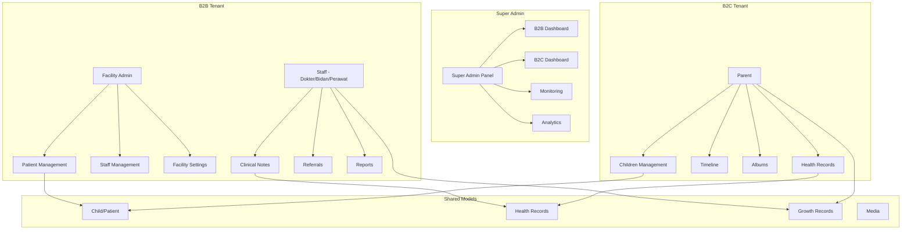
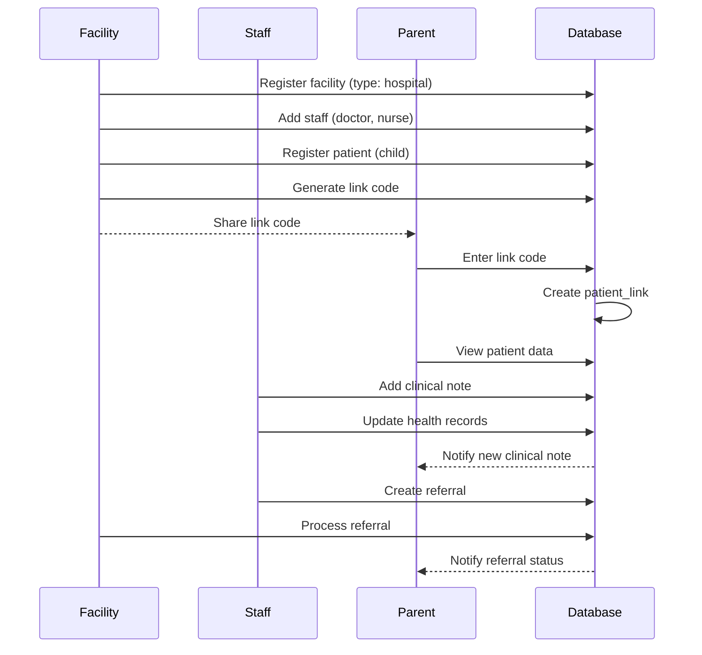

# ForMysha — Blueprint B2B Healthcare

**Status:** Draft untuk Review
**Tanggal:** 2026-08-10
**Phase:** 13+

---

## Ringkasan Eksekutif

ForMysha saat ini dirancang untuk **B2C** (individu/keluarga) dengan arsitektur SaaS multi-tenant yang sudah kuat. Untuk mendukung **B2B** (rumah sakit, klinik, posyandu, daycare, sekolah), diperlukan ekstensi arsitektur yang memungkinkan:

1. **Tenant Type** — Klasifikasi tenant (B2C vs B2B)
2. **Facility Management** — Profil dan manajemen fasilitas kesehatan
3. **Staff Management** — Staf medis (dokter, bidan, perawat, admin)
4. **Patient Management** — Registrasi pasien oleh fasilitas
5. **Parent-Patient Linking** — Hubungan orang tua ↔ pasien
6. **Clinical Features** — Catatan klinis, rujukan, riwayat medis bersama
7. **B2B Admin Panel** — Dashboard admin untuk fasilitas
8. **Super Admin B2B Monitoring** — Monitoring tenant B2B dari Super Admin
9. **B2B Plans** — Paket langganan khusus institusi

---

## Arsitektur Saat Ini

### Yang Sudah Ada

```
┌─────────────────────────────────────────────┐
│                 SUPER ADMIN                  │
│  Tenant Management | Plans | Payments       │
│  Analytics | Monitoring | Audit Log          │
└─────────────────┬───────────────────────────┘
                  │
┌─────────────────▼───────────────────────────┐
│               TENANT ADMIN                   │
│  Branding | Settings | Usage | Plugins       │
│  Enterprise: Domain, Invitations, Import     │
└─────────────────┬───────────────────────────┘
                  │
┌─────────────────▼───────────────────────────┐
│                 PARENT                        │
│  Children | Timeline | Albums | Diary        │
│  Health | Growth | Documents | Calendar      │
│  Family Sharing | Search | Export            │
└─────────────────────────────────────────────┘
```

### Roles Saat Ini

| Role | Deskripsi |
|------|-----------|
| `super_admin` | Platform administrator |
| `tenant_admin` | Tenant administrator (branding, settings) |
| `parent` | Orang tua yang mengelola data anak |

### Limitasi untuk B2B

1. **Tidak ada Tenant Type** — Semua tenant diperlakukan sama (keluarga)
2. **Tidak ada Staff Management** — Tidak ada peran medis (dokter, bidan, perawat)
3. **Tidak ada Patient Management** — Hanya parent yang bisa mendaftarkan anak
4. **Tidak ada Parent-Patient Linking** — Tidak ada mekanisme menghubungkan parent ke pasien di fasilitas
5. **Tidak ada Clinical Features** — Catatan kesehatan bersifat personal, bukan klinis
6. **Tidak ada B2B Dashboard** — Admin fasilitas tidak punya panel khusus
7. **Tidak ada B2B Plans** — Paket langganan hanya untuk keluarga

---

## Arsitektur Target

### Tenant Type System

```
┌─────────────────────────────────────────────────────┐
│                    TENANT TYPES                       │
├─────────────────┬───────────────────────────────────┤
│   B2C Family    │         B2B Institution            │
├─────────────────┼───────────────────────────────────┤
│ parent          │ facility_admin                     │
│ (keluarga)      │ staff (dokter, bidan, perawat)    │
│                 │ staff_admin (admin fasilitas)      │
└─────────────────┴───────────────────────────────────┘
```

### Model: TenantType Enum

```php
enum TenantType: string
{
    case Family = 'family';        // B2C — Keluarga/Individu
    case Hospital = 'hospital';    // B2B — Rumah Sakit
    case Clinic = 'clinic';        // B2B — Klinik
    case Midwifery = 'midwifery';  // B2B — Praktik Bidan
    case Posyandu = 'posyandu';    // B2B — Posyandu
    case Daycare = 'daycare';      // B2B — Daycare
    case School = 'school';        // B2B — PAUD/TK/Sekolah
}
```

### Model: StaffRole Enum

```php
enum StaffRole: string
{
    case Doctor = 'doctor';        // Dokter
    case Midwife = 'midwife';      // Bidan
    case Nurse = 'nurse';          // Perawat
    case Admin = 'staff_admin';    // Admin Fasilitas
    case Staff = 'staff';          // Staf Umum
}
```

### Flow B2B

```
┌──────────────┐     Register      ┌──────────────┐
│   Orang Tua  │ ──────────────── │   ForMysha   │
│   (B2C)      │                   │   (B2C Flow) │
└──────────────┘                   └──────────────┘

┌──────────────┐     Register      ┌──────────────┐
│  Fasilitas   │ ──────────────── │   ForMysha   │
│  (B2B)       │                   │   (B2B Flow) │
└──────┬───────┘                   └──────────────┘
       │
       │  Daftarkan pasien
       ▼
┌──────────────┐     Link          ┌──────────────┐
│   Pasien     │ ◄─────────────── │   Orang Tua  │
│   (Child)    │                   │   (Parent)   │
└──────────────┘                   └──────────────┘
```

---

## Phase 13 — B2B Foundation

### 13.1 Tenant Type & Migration

**Tujuan:** Klasifikasi tenant menjadi B2C dan B2B

**Database Changes:**

```sql
-- Tabel tenants: tambah kolom type
ALTER TABLE tenants ADD COLUMN type VARCHAR(20) DEFAULT 'family' AFTER name;
ALTER TABLE tenants ADD COLUMN facility_type VARCHAR(20) NULL AFTER type;
ALTER TABLE tenants ADD COLUMN address TEXT NULL;
ALTER TABLE tenants ADD COLUMN phone VARCHAR(20) NULL;
ALTER TABLE tenants ADD COLUMN email_institution VARCHAR(255) NULL;
ALTER TABLE tenants ADD COLUMN website VARCHAR(255) NULL;
ALTER TABLE tenants ADD COLUMN license_number VARCHAR(100) NULL;
ALTER TABLE tenants ADD COLUMN description TEXT NULL;
```

**Model Changes:**

- [`app/Models/Tenant.php`](app/Models/Tenant.php) — Tambah `type`, `facility_type`, `facility_*` fields
- Create [`app/Enums/TenantType.php`](app/Enums/TenantType.php) — Enum tenant type
- Create [`app/Enums/FacilityType.php`](app/Enums/FacilityType.php) — Enum facility type (hospital, clinic, midwifery, posyandu, daycare, school)

**Migration:**

- Create `database/migrations/2026_08_1X_add_b2b_fields_to_tenants_table.php`

**Config Updates:**

- [`config/saas.php`](config/saas.php) — Tambah B2B plan configs

**Tests:**

- Update [`tests/Feature/TenantTest.php`](tests/Feature/TenantTest.php) — Test tenant type
- Update [`tests/Feature/Api/SuperAdminApiTest.php`](tests/Feature/Api/SuperAdminApiTest.php) — Filter by type

---

### 13.2 Registration Flow B2B

**Tujuan:** Pemisahan flow registrasi B2C dan B2B

**Web Routes:**

```
/register              → B2C (keluarga) — default
/register/facility     → B2B (fasilitas) — form tambahan
```

**API Routes:**

```
POST /api/v1/auth/register              → B2C (type: family)
POST /api/v1/auth/register/facility     → B2B (type: hospital/clinic/etc)
```

**Form Registrasi B2B Tambahan:**

| Field | Tipe | Keterangan |
|-------|------|------------|
| `facility_name` | text | Nama rumah sakit/klinik |
| `facility_type` | select | hospital, clinic, midwifery, posyandu, daycare, school |
| `address` | textarea | Alamat fasilitas |
| `phone` | text | Telepon fasilitas |
| `license_number` | text | Nomor izin praktek |
| `description` | textarea | Deskripsi singkat |

**Controller Updates:**

- [`app/Http/Controllers/Auth/RegisteredUserController.php`](app/Http/Controllers/Auth/RegisteredUserController.php) — Handle B2B registration
- [`app/Http/Controllers/Api/Auth/AuthController.php`](app/Http/Controllers/Api/Auth/AuthController.php) — Handle B2B API registration

**Service Updates:**

- [`app/Services/TenantService.php`](app/Services/TenantService.php) — `createB2BTenant()` method

**Views:**

- Create [`resources/views/auth/register-facility.blade.php`](resources/views/auth/register-facility.blade.php)

**Tests:**

- Feature test B2B registration flow
- API test B2B registration

---

### 13.3 Staff Model & Management

**Tujuan:** Mengelola staf dalam tenant B2B

**New Models:**

- [`app/Models/Staff.php`](app/Models/Staff.php) — Profile staf medis
  - `id`, `user_id`, `tenant_id`, `staff_role` (enum), `specialization`, `license_number`, `phone`, `is_active`, `settings`
- [`app/Models/Facility.php`](app/Models/Facility.php) — Detail fasilitas (terpisah dari Tenant untuk fleksibilitas)
  - `id`, `tenant_id`, `facility_type`, `address`, `city`, `province`, `postal_code`, `phone`, `email_institution`, `website`, `license_number`, `operating_hours`, `description`, `facilities` (JSON — ruangan, layanan)

**Database:**

```sql
CREATE TABLE staff (
    id BIGINT UNSIGNED AUTO_INCREMENT PRIMARY KEY,
    user_id BIGINT UNSIGNED NOT NULL,
    tenant_id VARCHAR(36) NOT NULL,
    staff_role VARCHAR(20) NOT NULL, -- doctor, midwife, nurse, staff_admin, staff
    specialization VARCHAR(100) NULL,
    license_number VARCHAR(100) NULL,
    phone VARCHAR(20) NULL,
    is_active BOOLEAN DEFAULT TRUE,
    settings JSON NULL,
    created_at TIMESTAMP NULL,
    updated_at TIMESTAMP NULL,
    FOREIGN KEY (user_id) REFERENCES users(id),
    FOREIGN KEY (tenant_id) REFERENCES tenants(id)
);

CREATE TABLE facilities (
    id BIGINT UNSIGNED AUTO_INCREMENT PRIMARY KEY,
    tenant_id VARCHAR(36) NOT NULL UNIQUE,
    facility_type VARCHAR(20) NOT NULL,
    address TEXT NULL,
    city VARCHAR(100) NULL,
    province VARCHAR(100) NULL,
    postal_code VARCHAR(10) NULL,
    phone VARCHAR(20) NULL,
    email_institution VARCHAR(255) NULL,
    website VARCHAR(255) NULL,
    license_number VARCHAR(100) NULL,
    operating_hours JSON NULL,
    description TEXT NULL,
    facilities JSON NULL, -- array of facility features
    created_at TIMESTAMP NULL,
    updated_at TIMESTAMP NULL,
    FOREIGN KEY (tenant_id) REFERENCES tenants(id)
);
```

**Migrations:**

- `database/migrations/2026_08_1X_create_staff_table.php`
- `database/migrations/2026_08_1X_create_facilities_table.php`

**Staff Roles (dalam konteks B2B):**

| Role | Kemampuan |
|------|-----------|
| `facility_admin` | Full access kelola fasilitas, staf, dan pasien |
| `doctor` | Lihat/tambah catatan klinis pasien, rujukan |
| `midwife` | Lihat/tambah catatan persalinan, imunisasi |
| `nurse` | Lihat/tambah vital signs, catatan perawatan |
| `staff_admin` | Kelola data administrasi pasien |
| `staff` | Akses terbatas sesuai kebutuhan |

**Middleware:**

- Create [`app/Http/Middleware/EnsureFacilityAccess.php`](app/Http/Middleware/EnsureFacilityAccess.php) — Cek akses ke fasilitas
- Create [`app/Http/Middleware/EnsureStaffRole.php`](app/Http/Middleware/EnsureStaffRole.php) — Cek role staf

---

### 13.4 Parent-Patient Linking

**Tujuan:** Menghubungkan orang tua (B2C) dengan data pasien di fasilitas (B2B)

**Concept:**

```
Parent Account (B2C)           Facility Account (B2B)
       │                              │
       │    ┌──────────────────┐      │
       └───►│   Child/Patient  │◄─────┘
            │   (shared data)  │
            └──────────────────┘
```

**New Model:**

- [`app/Models/PatientLink.php`](app/Models/PatientLink.php) — Menghubungkan parent ke child di fasilitas
  - `id`, `child_id`, `parent_user_id`, `facility_tenant_id`, `link_code` (unique), `status` (pending, active, revoked), `linked_at`, `revoked_at`

**Flow:**

1. **Fasilitas daftarkan pasien** → Data child dibuat dengan `tenant_id` fasilitas
2. **Fasilitas generate link code** → Kode unik untuk parent
3. **Parent masukkan link code** → Verifikasi dan hubungkan
4. **Parent akses data pasien** → Read-only atau read-write sesuai setting

**Database:**

```sql
CREATE TABLE patient_links (
    id BIGINT UNSIGNED AUTO_INCREMENT PRIMARY KEY,
    child_id BIGINT UNSIGNED NOT NULL,
    parent_user_id BIGINT UNSIGNED NOT NULL,
    facility_tenant_id VARCHAR(36) NOT NULL,
    link_code VARCHAR(20) NOT NULL UNIQUE,
    status VARCHAR(20) DEFAULT 'pending', -- pending, active, revoked
    permissions JSON NULL, -- {view_health: true, edit_growth: false, ...}
    linked_at TIMESTAMP NULL,
    revoked_at TIMESTAMP NULL,
    created_at TIMESTAMP NULL,
    updated_at TIMESTAMP NULL,
    FOREIGN KEY (child_id) REFERENCES children(id),
    FOREIGN KEY (parent_user_id) REFERENCES users(id),
    FOREIGN KEY (facility_tenant_id) REFERENCES tenants(id)
);
```

**API Endpoints:**

```
POST   /api/v1/facility/patients              → Daftarkan pasien baru
GET    /api/v1/facility/patients              → List pasien
GET    /api/v1/facility/patients/{child}      → Detail pasien
PUT    /api/v1/facility/patients/{child}      → Update pasien
POST   /api/v1/facility/patients/{child}/link → Generate link code
DELETE /api/v1/facility/patients/{child}/link/{link} → Revoke link

POST   /api/v1/patient/link                   → Parent: masukkan link code
GET    /api/v1/patient/linked-facilities      → Parent: lihat fasilitas terhubung
```

---

### 13.5 B2B Admin Panel

**Tujuan:** Dashboard khusus untuk admin fasilitas kesehatan

**New Routes (routes/facility-admin.php):**

```php
Route::middleware(['auth', 'verified', 'role:facility_admin,staff_admin'])
    ->prefix('facility')
    ->name('facility.')->group(function () {

    // Dashboard
    Route::get('/dashboard', [FacilityDashboardController::class, 'index'])
        ->name('dashboard');

    // Patient Management
    Route::resource('patients', PatientController::class);
    Route::post('/patients/{patient}/link', [PatientController::class, 'generateLink'])
        ->name('patients.link');
    Route::delete('/patients/{patient}/link/{link}', [PatientController::class, 'revokeLink'])
        ->name('patients.revoke-link');

    // Staff Management
    Route::resource('staff', StaffController::class);
    Route::post('/staff/{staff}/toggle-active', [StaffController::class, 'toggleActive'])
        ->name('staff.toggle-active');

    // Facility Settings
    Route::get('/settings', [FacilitySettingsController::class, 'edit'])
        ->name('settings.edit');
    Route::put('/settings', [FacilitySettingsController::class, 'update'])
        →name('settings.update');

    // Clinical Records (read-only untuk semua staff, write untuk dokter/bidan)
    Route::get('/patients/{patient}/clinical-notes', [ClinicalNoteController::class, 'index'])
        ->name('clinical-notes.index');
    Route::post('/patients/{patient}/clinical-notes', [ClinicalNoteController::class, 'store'])
        ->middleware('staff.role:doctor,midwife,nurse')
        ->name('clinical-notes.store');

    // Referrals
    Route::resource('referrals', ReferralController::class);
    Route::post('/referrals/{referral}/accept', [ReferralController::class, 'accept'])
        ->name('referrals.accept');
    Route::post('/referrals/{referral}/complete', [ReferralController::class, 'complete'])
        ->name('referrals.complete');

    // Reports
    Route::get('/reports/patients', [ReportController::class, 'patients'])
        ->name('reports.patients');
    Route::get('/reports/immunizations', [ReportController::class, 'immunizations'])
        ->name('reports.immunizations');
    Route::get('/reports/growth', [ReportController::class, 'growth'])
        ->name('reports.growth');
});
```

**New Controllers:**

- [`app/Http/Controllers/Facility/FacilityDashboardController.php`](app/Http/Controllers/Facility/FacilityDashboardController.php)
- [`app/Http/Controllers/Facility/PatientController.php`](app/Http/Controllers/Facility/PatientController.php)
- [`app/Http/Controllers/Facility/StaffController.php`](app/Http/Controllers/Facility/StaffController.php)
- [`app/Http/Controllers/Facility/FacilitySettingsController.php`](app/Http/Controllers/Facility/FacilitySettingsController.php)
- [`app/Http/Controllers/Facility/ClinicalNoteController.php`](app/Http/Controllers/Facility/ClinicalNoteController.php)
- [`app/Http/Controllers/Facility/ReferralController.php`](app/Http/Controllers/Facility/ReferralController.php)
- [`app/Http/Controllers/Facility/ReportController.php`](app/Http/Controllers/Facility/ReportController.php)

**New Views:**

- `resources/views/facility/dashboard.blade.php`
- `resources/views/facility/patients/index.blade.php`
- `resources/views/facility/patients/show.blade.php`
- `resources/views/facility/patients/create.blade.php`
- `resources/views/facility/staff/index.blade.php`
- `resources/views/facility/staff/create.blade.php`
- `resources/views/facility/settings/edit.blade.php`
- `resources/views/facility/clinical-notes/index.blade.php`
- `resources/views/facility/referrals/index.blade.php`
- `resources/views/facility/reports/patients.blade.php`

---

### 13.6 Clinical Features

**Tujuan:** Fitur klinis untuk fasilitas kesehatan

**New Models:**

- [`app/Models/ClinicalNote.php`](app/Models/ClinicalNote.php) — Catatan klinis
  - `id`, `child_id`, `staff_user_id`, `tenant_id`, `type` (consultation, examination, treatment, follow-up), `title`, `content`, `vitals` (JSON: temperature, heart_rate, blood_pressure, weight, height), `diagnosis`, `medications` (JSON), `attachments` (JSON), `created_at`
- [`app/Models/Referral.php`](app/Models/Referral.php) — Rujukan
  - `id`, `child_id`, `from_tenant_id`, `to_tenant_id`, `referring_staff_id`, `reason`, `clinical_summary`, `status` (pending, accepted, completed, cancelled), `notes`, `created_at`, `updated_at`

**Database:**

```sql
CREATE TABLE clinical_notes (
    id BIGINT UNSIGNED AUTO_INCREMENT PRIMARY KEY,
    child_id BIGINT UNSIGNED NOT NULL,
    staff_user_id BIGINT UNSIGNED NOT NULL,
    tenant_id VARCHAR(36) NOT NULL,
    type VARCHAR(30) NOT NULL, -- consultation, examination, treatment, follow-up
    title VARCHAR(255) NOT NULL,
    content TEXT NOT NULL,
    vitals JSON NULL, -- {temperature, heart_rate, blood_pressure, weight, height}
    diagnosis TEXT NULL,
    medications JSON NULL, -- [{name, dosage, frequency, duration}]
    attachments JSON NULL,
    created_at TIMESTAMP NULL,
    updated_at TIMESTAMP NULL,
    FOREIGN KEY (child_id) REFERENCES children(id),
    FOREIGN KEY (staff_user_id) REFERENCES users(id),
    FOREIGN KEY (tenant_id) REFERENCES tenants(id)
);

CREATE TABLE referrals (
    id BIGINT UNSIGNED AUTO_INCREMENT PRIMARY KEY,
    child_id BIGINT UNSIGNED NOT NULL,
    from_tenant_id VARCHAR(36) NOT NULL,
    to_tenant_id VARCHAR(36) NOT NULL,
    referring_staff_id BIGINT UNSIGNED NOT NULL,
    reason TEXT NOT NULL,
    clinical_summary TEXT NULL,
    status VARCHAR(20) DEFAULT 'pending', -- pending, accepted, completed, cancelled
    notes TEXT NULL,
    created_at TIMESTAMP NULL,
    updated_at TIMESTAMP NULL,
    FOREIGN KEY (child_id) REFERENCES children(id),
    FOREIGN KEY (from_tenant_id) REFERENCES tenants(id),
    FOREIGN KEY (to_tenant_id) REFERENCES tenants(id),
    FOREIGN KEY (referring_staff_id) REFERENCES users(id)
);
```

**Integration dengan Health Records yang Sudah Ada:**

- [`app/Models/HealthRecord.php`](app/Models/HealthRecord.php) — Extend untuk mendukung clinical context
- Clinical notes akan terhubung ke health records yang sudah ada
- Staff bisa menambah catatan klinis yang otomatis terhubung ke data kesehatan pasien

---

### 13.7 Super Admin B2B Monitoring

**Tujuan:** Dashboard Super Admin untuk memantau tenant B2C dan B2B

**New Routes (routes/saas.php):**

```php
// B2B-specific routes (dalam group super_admin yang sudah ada)
Route::get('/b2b-dashboard', [SuperAdminB2BDashboardController::class, 'index'])
    ->name('b2b-dashboard');
Route::get('/b2b/facilities', [SuperAdminFacilityController::class, 'index'])
    ->name('b2b.facilities');
Route::get('/b2b/facilities/{tenant}', [SuperAdminFacilityController::class, 'show'])
    ->name('b2b.facilities.show');
Route::get('/b2b/analytics', [SuperAdminB2BAnalyticsController::class, 'index'])
    ->name('b2b.analytics');
Route::get('/b2b/referrals', [SuperAdminReferralController::class, 'index'])
    ->name('b2b.referrals');
```

**New Controllers:**

- [`app/Http/Controllers/SuperAdmin/B2BDashboardController.php`](app/Http/Controllers/SuperAdmin/B2BDashboardController.php)
- [`app/Http/Controllers/SuperAdmin/FacilityController.php`](app/Http/Controllers/SuperAdmin/FacilityController.php)
- [`app/Http/Controllers/SuperAdmin/B2BAnalyticsController.php`](app/Http/Controllers/SuperAdmin/B2BAnalyticsController.php)

**Dashboard Metrics:**

| Metrik | Deskripsi |
|--------|-----------|
| Total B2B Tenants | Jumlah fasilitas terdaftar |
| Total Patients | Jumlah pasien di semua fasilitas |
| Active Staff | Jumlah staf aktif |
| Referrals | Jumlah rujukan (pending/active/completed) |
| Revenue B2B | Pendapatan dari paket B2B |
| Facility Types | Distribusi tipe fasilitas |
| Geographic Distribution | Distribusi geografis fasilitas |

**New Views:**

- `resources/views/super-admin/b2b/dashboard.blade.php`
- `resources/views/super-admin/b2b/facilities/index.blade.php`
- `resources/views/super-admin/b2b/facilities/show.blade.php`
- `resources/views/super-admin/b2b/analytics.blade.php`

---

### 13.8 B2B Plans & Pricing

**Tujuan:** Paket langganan khusus untuk fasilitas kesehatan

**Plan Structure:**

| Plan | Harga/Bulan | Harga/Tahun | Max Patients | Max Staff | Max Storage | Fitur |
|------|-------------|-------------|--------------|-----------|-------------|-------|
| **Free Clinic** | Rp 0 | Rp 0 | 50 | 3 | 1 GB | Basic patient management |
| **Basic Clinic** | Rp 299.000 | Rp 2.990.000 | 500 | 10 | 5 GB | + Clinical notes, Reports |
| **Pro Clinic** | Rp 599.000 | Rp 5.990.000 | 2.000 | 25 | 20 GB | + Referrals, Bulk import |
| **Enterprise** | Rp 1.499.000 | Rp 14.990.000 | Unlimited | Unlimited | 100 GB | + API, White Label, Custom Domain |

**Plan Model Updates:**

- [`app/Models/Plan.php`](app/Models/Plan.php) — Tambah `max_patients`, `max_staff`, `target_type` (family, institution)
- [`config/saas.php`](config/saas.php) — Tambah B2B plan configs

---

## Phase 14 — Advanced B2B Features

### 14.1 Bulk Import Pasien

- Import CSV/JSON untuk data pasien
- Template download untuk format standar
- Progress tracking

### 14.2 Patient Portal

- Parent bisa melihat data klinis pasien
- Download riwayat kesehatan
- Jadwal kunjungan

### 14.3 Appointment Scheduling

- Jadwal kunjungan pasien
- Reminder otomatis
- Integration dengan kalender

### 14.4 Multi-Facility Support

- Satu organisasi bisa punya beberapa fasilitas
- Data terisolasi per fasilitas
- Dashboard konsolidasi

### 14.5 API untuk Integrasi Sistem Eksternal

- HL7 FHIR compatibility (standar kesehatan)
- Integration dengan Sistem Informasi Manajemen (SIM)
- Integration dengan BPJS
- Webhook untuk notifikasi real-time

### 14.6 White Label untuk Fasilitas

- Custom branding per fasilitas
- Custom domain
- Custom login page
- Custom email templates

---

## Diagram Arsitektur



---

## Diagram Data Flow B2B



---

## Estimasi Komponen Baru

### Models Baru
| Model | Deskripsi |
|-------|-----------|
| `Staff` | Profile staf medis |
| `Facility` | Detail fasilitas kesehatan |
| `PatientLink` | Hubungan parent ↔ patient |
| `ClinicalNote` | Catatan klinis |
| `Referral` | Rujukan antar fasilitas |

### Enums Baru
| Enum | Values |
|------|--------|
| `TenantType` | family, hospital, clinic, midwifery, posyandu, daycare, school |
| `FacilityType` | hospital, clinic, midwifery, posyandu, daycare, school |
| `StaffRole` | doctor, midwife, nurse, staff_admin, staff |
| `ClinicalNoteType` | consultation, examination, treatment, follow-up |
| `ReferralStatus` | pending, accepted, completed, cancelled |
| `PatientLinkStatus` | pending, active, revoked |

### Controllers Baru
| Controller | Group |
|------------|-------|
| `FacilityDashboardController` | Facility Admin |
| `PatientController` | Facility Admin |
| `StaffController` | Facility Admin |
| `FacilitySettingsController` | Facility Admin |
| `ClinicalNoteController` | Facility Admin |
| `ReferralController` | Facility Admin |
| `ReportController` | Facility Admin |
| `B2BDashboardController` | Super Admin |
| `SuperAdminFacilityController` | Super Admin |
| `B2BAnalyticsController` | Super Admin |

### Middleware Baru
| Middleware | Fungsi |
|------------|--------|
| `EnsureFacilityAccess` | Verifikasi akses ke fasilitas |
| `EnsureStaffRole` | Verifikasi role staf |

### Services Baru
| Service | Fungsi |
|---------|--------|
| `FacilityService` | Manajemen fasilitas |
| `StaffService` | Manajemen staf |
| `PatientLinkService` | Manajemen link parent-patient |
| `ClinicalNoteService` | Catatan klinis |
| `ReferralService` | Manajemen rujukan |

---

## Implementation Order

### Phase 13A — Foundation (Prioritas Tinggi)
1. Tenant Type enum & migration
2. Facility model & migration
3. Staff model & migration
4. Registration flow B2B
5. B2B Plans

### Phase 13B — Facility Admin Panel
6. Facility Dashboard
7. Patient Management
8. Staff Management
9. Facility Settings
10. Middleware (EnsureFacilityAccess, EnsureStaffRole)

### Phase 13C — Clinical Features
11. Clinical Notes
12. Referrals
13. Reports
14. Patient-Parent Linking

### Phase 13D — Super Admin B2B
15. B2B Dashboard
16. B2B Analytics
17. B2B Monitoring

### Phase 14 — Advanced
18. Bulk Import
19. Patient Portal
20. Appointment Scheduling
21. API Integration (HL7 FHIR)
22. White Label B2B

---

## Breaking Changes & Migration Strategy

### Backward Compatibility
- Semua tenant yang ada akan mendapat `type = 'family'` (default)
- Flow B2C tetap berfungsi tanpa perubahan
- Role `tenant_admin` tetap ada untuk backward compatibility
- Role baru (`facility_admin`, `staff`) hanya untuk tenant B2B

### Database Migration
- Kolom `type` di `tenants` table default `'family'`
- Tabel baru: `staff`, `facilities`, `patient_links`, `clinical_notes`, `referrals`
- Tidak ada perubahan pada tabel yang sudah ada (hanya penambahan kolom)

### Route Safety
- Route B2B menggunakan prefix `/facility/` terpisah dari B2C `/children/`
- Catch-all route `/{slug}` tetap LAST di `routes/web.php`
- Route B2B dilindungi middleware `role:facility_admin,staff_admin`

---

## Pertanyaan untuk Review

Sebelum implementasi, beberapa keputusan perlu dikonfirmasi:

1. **Registrasi B2B** — Apakah perlu approval Super Admin sebelum fasilitas bisa digunakan, atau langsung aktif?

2. **Patient Linking** — Apakah parent harus membuat akun ForMysha sendiri dulu, atau bisa langsung link tanpa akun?

3. **Clinical Notes** — Apakah catatan klinis harus mengikuti standar tertentu (misal: SOAP notes) atau cukup free-form?

4. **Referrals** — Apakah rujukan hanya antar tenant B2B, atau juga bisa dari B2B ke B2C?

5. **Pricing** — Apakah paket B2B menggunakan mata uang RIBU (Rp 299.000) atau ada preferensi lain?

6. **Data Isolation** — Apakah data pasien di fasilitas A bisa diakses oleh fasilitas B (hanya untuk rujukan)?

7. **Mobile App** — Apakah B2B juga perlu mobile-first experience untuk staf medis?

8. **Integrasi BPJS** — Apakah ini prioritas untuk phase awal atau bisa di fase lanjutan?

---

> **Next Step:** Setelah review dan approval, implementasi dimulai dari Phase 13A — Foundation.
