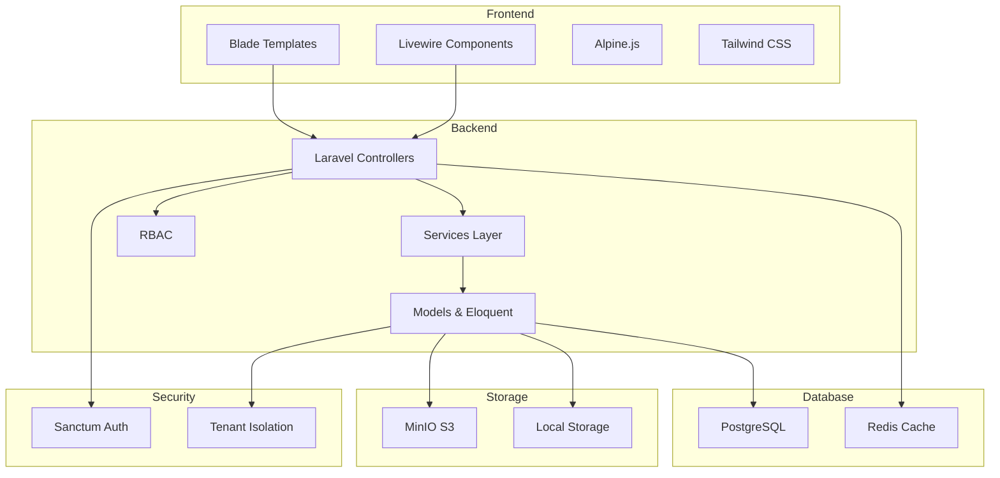

# ForMysha — Laporan Audit Komprehensif

**Tanggal:** 8 Agustus 2026
**Scope:** Seluruh berkas proyek — routes, controllers, models, views, services, middleware, tests, dokumentasi

---

## Ringkasan Temuan

| Kategori | Jumlah |
|----------|--------|
| 🔴 Bug / Security | 8 |
| 🟡 Improvements (Light Features) | 12 |
| 🔵 Big Features / Architecture | 8 |
| 📝 Dokumentasi | 4 |

---

## 🔴 Bagian 1: Bug & Security Issues

### 1.1 XSS Risk di Branding Footer

**File:** [`resources/views/components/branding/footer.blade.php`](resources/views/components/branding/footer.blade.php:15)
**Severity:** Tinggi

```blade
{!! $footerText !!}
```

Footer menggunakan unescaped output `{!! !!}` yang memungkinkan tenant admin menyisipkan HTML/JavaScript berbahaya. Meskipun ini fitur "Custom Footer", tidak ada sanitasi yang mencegah XSS serius.

**Rekomendasi:**
- Gunakan `strip_tags()` dengan whitelist tag yang diizinkan, atau
- Gunakan `clean()` dari HTMLPurifier, atau
- Batasi output hanya teks biasa dengan `e($footerText)`

---

### 1.2 Branded Footer & Favicon Query DB Langsung di Blade

**File:** [`resources/views/components/branding/footer.blade.php`](resources/views/components/branding/footer.blade.php:6) dan [`resources/views/components/branding/favicon.blade.php`](resources/views/components/branding/favicon.blade.php:6)

```php
$branding = \App\Models\TenantBranding::where('tenant_id', $tenant->id)->first();
```

Komponen Blade melakukan query database langsung ke `TenantBranding` setiap kali halaman dirender. Seharusnya menggunakan relationship `$tenant->branding` yang sudah didefinisikan di model.

**Dampak:** N+1 query pada setiap halaman yang menggunakan layout.

**Rekomendasi:**
- Gunakan `$tenant->branding` relationship
- Cache branding data di middleware atau view composer

---

### 1.3 Hardcoded Copyright Year 2026

**File:** [`resources/views/layouts/app.blade.php`](resources/views/layouts/app.blade.php)

Footer layout utama menampilkan copyright year yang hardcoded `© 2026` alih-alih menggunakan `{{ date('Y') }}`.

**Rekomendasi:** Ganti dengan `© {{ date('Y') }} {{ config('app.name') }}. Semua hak dilindungi.`

---

### 1.4 PaymentController Tidak Verifikasi Tenant Ownership

**File:** [`app/Http/Controllers/Subscription/PaymentController.php`](app/Http/Controllers/Subscription/PaymentController.php:31)

Metode `store()` tidak memverifikasi bahwa `subscription_id` yang dikirim milik tenant yang sedang login. Seorang pengguna bisa mengirim bukti pembayaran untuk subscription tenant lain.

**Rekomendasi:**
- Tambahkan validasi: `abort_unless($subscription->tenant_id === $tenant->id, 403)`
- Pastikan subscription yang di-upload milik tenant yang benar

---

### 1.5 Media Relationship Tidak Konsisten

| Model | Relationship | Method |
|-------|-------------|--------|
| [`Child.php`](app/Models/Child.php:131) | `MorphMany` | ✅ Benar |
| [`Album.php`](app/Models/Album.php:63) | `MorphMany` | ✅ Benar |
| [`Timeline.php`](app/Models/Timeline.php:87) | `HasMany` + manual filter | ⚠️ Fragile |
| [`Diary.php`](app/Models/Diary.php:76) | `HasMany` + manual filter | ⚠️ Fragile |

```php
// Timeline & Diary - Fragile pattern
public function media(): HasMany
{
    return $this->hasMany(Media::class, 'mediable_id')
        ->where('mediable_type', static::class);
}
```

Pola `HasMany` dengan `where('mediable_type', ...)` tidak dioptimalkan oleh Eloquent dan tidak mendukung eager loading polymorphic dengan benar.

**Rekomendasi:** Standarisasi ke `MorphMany` seperti Child dan Album.

---

### 1.6 Growth Module Tidak Ada Show Route

**File:** [`routes/web.php`](routes/web.php:108)

Semua modul lain memiliki route `show` (timeline, diary, album, document, health, calendar), tetapi growth tidak memiliki `show` route. User harus mengedit dari index.

**Rekomendasi:** Tambahkan route `growth.show` untuk konsistensi.

---

### 1.7 `x-cloak` Digunakan Tanpa CSS Rule

**File:** [`resources/views/documents/show.blade.php`](resources/views/documents/show.blade.php:65), [`resources/views/diaries/show.blade.php`](resources/views/diaries/show.blade.php:65), [`resources/views/albums/show.blade.php`](resources/views/albums/show.blade.php:62)

Beberapa view menggunakan atribut `x-cloak` pada elemen modal, tetapi tidak ada CSS rule `[x-cloak] { display: none !important; }` yang didefinisikan. Ini menyebabkan flash of unstyled content (FOUC) sebelum Alpine.js dimuat.

**Rekomendasi:** Tambahkan `[x-cloak] { display: none !important; }` di `resources/css/app.css`.

---

### 1.8 EnterpriseController Import Tidak Memproses File

**File:** [`app/Http/Controllers/TenantAdmin/EnterpriseController.php`](app/Http/Controllers/TenantAdmin/EnterpriseController.php:128)

Metode `processImport()` menerima file upload tetapi tidak memprosesnya. File di-upload tetapi hanya membuat `ImportJob` record tanpa memproses isi file.

**Rekomendasi:** Implementasikan pemrosesan file atau tandai sebagai "coming soon" dengan pesan yang jelas.

---

## 🟡 Bagian 2: Improvements & Light Features

### 2.1 Public Profile Menggunakan CDN Tailwind

**File:** [`resources/views/public/profile.blade.php`](resources/views/public/profile.blade.php)

```html
<script src="https://cdn.tailwindcss.com"></script>
```

Halaman publik menggunakan Tailwind CDN alih-alih Vite build. Ini:
- Mengunduh ~300KB Tailwind runtime setiap kunjungan
- Konsisten dengan approach CDN, tetapi tidak optimal untuk production
- Tidak menggunakan custom color palette yang didefinisikan di `tailwind.config.js`

**Rekomendasi:** Gunakan Vite build atau buat CSS standalone yang di-build sebelumnya.

---

### 2.2 Branding Footer Seharusnya Menggunakan Relationship

**File:** [`resources/views/components/branding/footer.blade.php`](resources/views/components/branding/footer.blade.php:6)

```php
// Current - Direct query
$branding = \App\Models\TenantBranding::where('tenant_id', $tenant->id)->first();

// Recommended - Use relationship
$branding = $tenant->branding;
```

---

### 2.3 Growth Chart Tidak Ada Head Circumference Tab

**File:** [`resources/views/components/growth-chart.blade.php`](resources/views/components/growth-chart.blade.php:77)

Growth chart hanya menampilkan tab Berat Badan dan Tinggi Badan. Data lingkar kepala yang tersimpan tidak divisualisasikan dalam grafik, meskipun data WHO untuk lingkar kepala sudah tersedia di `GrowthService`.

**Rekomendasi:** Tambahkan tab "Lingkar Kepala" di growth chart.

---

### 2.4 Dashboard "Lihat Semua" Hanya ke Anak Pertama

**File:** [`resources/views/dashboard.blade.php`](resources/views/dashboard.blade.php:95)

```blade
<a href="{{ route('timeline.index', $children->first()) }}">
```

Link "Lihat Semua" di section "Momen Terbaru" selalu mengarah ke timeline anak pertama. Jika pengguna memiliki banyak anak, ini bisa membingungkan.

**Rekomendasi:** 
- Tampilkan momen dari semua anak, atau
- Tambahkan selector anak di section momen

---

### 2.5 Growth Index Menggunakan `confirm()` Bawaan Browser

**File:** [`resources/views/growth/index.blade.php`](resources/views/growth/index.blade.php:158)

```javascript
x-on:click.prevent="if(confirm('Yakin ingin menghapus data pengukuran ini?')) $el.closest('form').submit()"
```

Beberapa halaman menggunakan `confirm()` bawaan browser yang tidak konsisten dengan komponen `<x-confirm-delete>` yang sudah tersedia.

**Rekomendasi:** Standarisasi penggunaan `<x-confirm-delete>` component di semua halaman.

---

### 2.6 Tidak Ada Loading State pada Form Submit

Beberapa form tidak menampilkan loading state saat submit. Pengguna bisa mengklik tombol submit berkali-kali.

**Rekomendasi:** Tambahkan loading state menggunakan Alpine.js:
```html
x-data="{ loading: false }" x-on:submit="loading = true"
```

---

### 2.7 Tidak Ada Toast untuk Success/Error di Beberapa Halaman

Beberapa halaman menggunakan inline alert untuk success message, tetapi tidak konsisten. Sebagian menggunakan `<x-toast>`, sebagian menggunakan inline div.

**Rekomendasi:** Standarisasi penggunaan `<x-toast>` component.

---

### 2.8 Export Tidak Ada Progress Indicator

**File:** [`app/Http/Controllers/ExportController.php`](app/Http/Controllers/ExportController.php:20)

Export PDF dan ZIP dilakukan synchronously. Untuk data yang besar, ini bisa menyebabkan timeout.

**Rekomendasi:** 
- Untuk MVP, tambahkan loading state di UI
- Pertahankan queue untuk export besar di masa depan

---

### 2.9 Tidak Ada Validasi Ukuran File di Semua Upload

Media upload memiliki validasi ukuran di `MediaService`, tetapi tidak semua controller memverifikasi ukuran file sebelum memproses.

**Rekomendasi:** Tambahkan validasi konsisten di semua form upload.

---

### 2.10 Subscription Plans Page Tidak Ada Loading Skeleton

**File:** [`resources/views/subscription/plans.blade.php`](resources/views/subscription/plade.php)

Halaman plans tidak menampilkan loading skeleton saat data dimuat.

**Rekomendasi:** Tambahkan loading skeleton untuk UX yang lebih baik.

---

### 2.11 Tidak Ada Confirm Dialog untuk Subscribe

**File:** [`resources/views/subscription/plans.blade.php`](resources/views/subscription/plans.blade.php:116)

Tombol "Pilih Paket Ini" langsung submit tanpa konfirmasi. Pengguna bisa tidak sengaja memilih paket yang salah.

**Rekomendasi:** Tambahkan konfirmasi sebelum submit.

---

### 2.12 Mobile Navigation Tidak Menampilkan Badge Jumlah Anak

**File:** [`resources/views/components/child-nav.blade.php`](resources/views/components/child-nav.blade.php)

Bottom navigation tidak menampilkan jumlah anak atau badge untuk notifikasi.

**Rekomendasi:** Tambahkan badge count untuk notifikasi di mobile navigation.

---

## 🔵 Bagian 3: Big Features & Architecture

### 3.1 Multi-Tenancy Tanpa Global Scope

Model Tenant menggunakan `tenant_id` column-based tenancy, tetapi tidak ada global scope yang memfilter data otomatis berdasarkan tenant. Setiap controller harus secara manual memfilter berdasarkan tenant.

**Arsitektur Saat Ini:**
```php
// Setiap query harus manual filter
Child::where('tenant_id', $tenant->id)->get();
```

**Rekomendasi:**
- Pertimbangkan Laravel Tenant-scoped traits
- Atau buat base query scope yang otomatis filter by tenant

---

### 3.2 Tidak Ada Image Optimization

File media di-upload tanpa kompresi atau resizing. Foto berukuran besar (5-10MB) disimpan apa adanya.

**Dampak:** Storage cepat penuh, loading lambat untuk thumbnail.

**Rekomendasi:**
- Implementasi image processing (intervention/image)
- Buat multiple sizes (thumbnail, medium, large)
- Gunakan queue untuk processing async

---

### 3.3 Tidak Ada Email Notification

Sistem hanya memiliki in-app notification. Tidak ada pengiriman email untuk:
- Welcome email
- Payment verification
- Subscription expiry reminder
- Imunisasi reminder

**Rekomendasi:** Implementasi email notification menggunakan Laravel Mail + Queue.

---

### 3.4 Tidak Ada Automated Backup System

Meskipun disebutkan di ROADMAP Phase 3, tidak ada sistem backup otomatis yang terimplementasi.

**Rekomendasi:**
- Implementasi scheduled backup menggunakan Laravel Backup
- Simpan ke MinIO/S3
- Tambahkan admin dashboard untuk monitoring backup

---

### 3.5 Tidak Ada API Versioning

**File:** [`routes/api.php`](routes/api.php)

API routes tidak menggunakan versioning (`/api/v1/...`).

**Rekomendasi:** Pertahankan untuk saat ini, tetapi siapkan versiing jika ada breaking changes di masa depan.

---

### 3.6 Search Tidak Menggunakan Full-Text Index

**File:** [`app/Http/Controllers/SearchController.php`](app/Http/Controllers/SearchController.php:54)

Search menggunakan `LIKE '%query%'` yang tidak dioptimalkan dan bisa lambat untuk dataset besar.

**Rekomendasi:**
- Untuk PostgreSQL, gunakan full-text search (`to_tsvector` / `to_tsquery`)
- Atau gunakan Laravel Scout dengan driver yang sesuai

---

### 3.7 Tidak Ada Rate Limiting pada File Upload

**File:** [`app/Http/Controllers/MediaController.php`](app/Http/Controllers/MediaController.php:19)

Upload media tidak memiliki rate limiting. Pengguna bisa mengupload file dalam jumlah besar dalam waktu singkat.

**Rekomendasi:** Tambahkan rate limiting pada upload endpoint.

---

### 3.8 Subscription Lifecycle Tidak Terautomasi

**File:** [`app/Models/Subscription.php`](app/Models/Subscription.php:113)

Tidak ada scheduled command yang otomatis:
- Memperpanjang subscription setelah pembayaran
- Menandai subscription yang expired
- Mengirim reminder sebelum expired
- Mengubah status ke `past_due`

**Rekomendasi:** Buat scheduled command untuk subscription lifecycle management.

---

## 📝 Bagian 4: Dokumentasi

### 4.1 AGENTS.md Menyebutkan Laravel 12, tetapi Project Menggunakan Laravel 11

**File:** `AGENTS.md`

Dokumentasi menyebutkan "Laravel 12" tetapi `composer.json` menunjukkan Laravel 11.x.

**Rekomendasi:** Update AGENTS.md dengan versi yang benar.

---

### 4.2 Database MySQL vs PostgreSQL

**File:** `AGENTS.md`

Dokumentasi menyebutkan PostgreSQL sebagai database, tetapi `.env.example` dan konfigurasi default menggunakan MySQL.

**Rekomendasi:** Pastikan dokumentasi sesuai dengan konfigurasi aktual.

---

### 4.3 MinIO Storage Tidak Terkonfigurasi

**File:** `AGENTS.md`

Dokumentasi menyebutkan MinIO sebagai storage utama, tetapi `.env.example` tidak memiliki konfigurasi MinIO.

**Rekomendasi:** Tambahkan konfigurasi MinIO di `.env.example` atau update dokumentasi.

---

### 4.4 Redis & Laravel Horizon Tidak Terkonfigurasi

**File:** `AGENTS.md`

Dokumentasi menyebutkan Redis dan Laravel Horizon untuk queue/cache, tetapi tidak ada konfigurasi Horizon di project.

**Rekomendasi:** Update dokumentasi atau implementasi Horizon.

---

## Peta Arsitektur



---

## Prioritas Eksekusi

### Prioritas 1: Bug Fixes (Mendesak)
1. Fix XSS risk di branding footer
2. Fix PaymentController tenant verification
3. Add `x-cloak` CSS rule
4. Fix hardcoded copyright year
5. Fix branding component DB query

### Prioritas 2: Light Features (Minggu Ini)
1. Standarisasi media relationship ke MorphMany
2. Tambahkan growth show route
3. Tambahkan head circumference chart tab
4. Standarisasi confirm delete dialog
5. Tambahkan loading states
6. Fix public profile CDN issue

### Prioritas 3: Architecture (Bulan Depan)
1. Implementasi tenant global scope
2. Image optimization pipeline
3. Email notification system
4. Automated backup system
5. Subscription lifecycle automation
6. Full-text search optimization

---

## Kesimpulan

Proyek ForMysha memiliki fondasi yang solid dengan fitur lengkap. Temuan utama yang perlu diperbaiki:
1. **XSS risk** di branding footer (keamanan)
2. **Tenant verification** di payment (keamanan)
3. **Konsistensi** dalam media relationships dan UI patterns
4. **Otomasi** untuk subscription lifecycle

Dokumentasi perlu diperbarui agar sesuai dengan kondisi aktual project.
