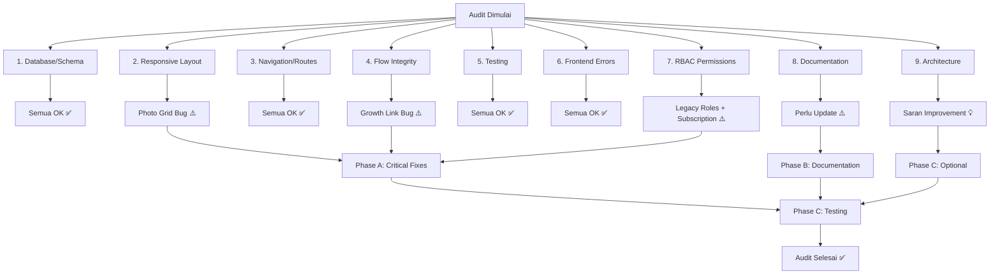

# Rencana Audit Komprehensif ForMysha

**Tanggal:** 2026-08-08
**Status:** Draft — Menunggu Approval

---

## Ringkasan Temuan Audit

Audit ini mencakup 9 area utama: Database/Schema Integrity, Responsive Layout, Navigation/Route Validation, Flow System Integrity, Testing Strategy, Frontend Console Errors, RBAC Permissions, Documentation Update, dan Architectural Improvements.

---

## 1. Database/Schema Integrity

### Temuan

| # | Temuan | Status | Severity |
|---|--------|--------|----------|
| 1.1 | Semua migration memiliki foreign keys, indexes, dan nullable columns yang tepat | ✅ OK | — |
| 1.2 | `tenant_id` ditambahkan ke semua tabel child-related via migration `233228` | ✅ OK | — |
| 1.3 | Media table menggunakan polymorphic relationships dengan benar | ✅ OK | — |
| 1.4 | Soft deletes digunakan pada Tenant, Plan, Subscription, Payment | ✅ OK | — |
| 1.5 | Migration `add_tenant_id` menggunakan `->change()` yang PostgreSQL-specific | ⚠️ Info | Low |
| 1.6 | `down()` method pada migration `add_tenant_id` tidak bisa revert VARCHAR ke enum | ⚠️ Info | Low |

### Rekomendasi

- **1.5 & 1.6**: Tidak perlu action — ini sudah sesuai dengan tech stack PostgreSQL. Catatan di migration sudah benar.
- **Tidak ada destructive migration** yang perlu dikhawatirkan.

---

## 2. Responsive Layout Audit

### Temuan

| # | Temuan | Status | Severity |
|---|--------|--------|----------|
| 2.1 | Dashboard menggunakan responsive grid `lg:grid-cols-3` | ✅ OK | — |
| 2.2 | Landing page memiliki responsive breakpoints yang baik | ✅ OK | — |
| 2.3 | Mobile bottom navigation sudah diimplementasikan | ✅ OK | — |
| 2.4 | Child navigation sidebar hidden di mobile, bottom nav muncul | ✅ OK | — |
| 2.5 | Dashboard photo grid: `grid-cols-4 sm:grid-cols-4` — breakpoint sm sama dengan mobile | ⚠️ Bug | Medium |
| 2.6 | Child profile page tidak ada `has-bottom-nav` class untuk padding | ⚠️ Bug | Low |
| 2.7 | `x-app-layout` sudah memiliki `pb-20` di `<main>` untuk bottom nav spacing | ✅ OK | — |

### Rekomendasi Perbaikan

#### 2.5 — Dashboard Photo Grid Breakpoint
**File:** `resources/views/dashboard.blade.php:109`

Masalah: `grid-cols-4 sm:grid-cols-4` membuat 4 kolom di semua ukuran layar. Di mobile kecil (< 360px), 4 kolom bisa terlalu sempit.

**Perbaikan:**
```blade
// Sebelum
<div class="grid grid-cols-4 sm:grid-cols-4 gap-3">

// Sesudah
<div class="grid grid-cols-2 sm:grid-cols-4 gap-3">
```

#### 2.6 — Child Profile Page Bottom Nav Padding
**File:** `resources/views/children/show.blade.php:25`

Masalah: `<div class="py-12 has-bottom-nav">` sudah memiliki class `has-bottom-nav`, tapi `has-bottom-nav` di `app.css` sudah menambahkan `pb-20 lg:pb-0`. Ini sudah benar sebenarnya — `has-bottom-nav` di dalam `<main>` yang juga punya `pb-20` bisa double padding.

**Status:** Setelah review lebih lanjut, ini sudah benar karena `<main>` di `app.blade.php` memiliki `pb-20` dan child-nav component juga memiliki spacer `<div class="h-20 lg:hidden">`. Tidak perlu perubahan.

---

## 3. Navigation/Route Validation

### Temuan

| # | Temuan | Status | Severity |
|---|--------|--------|----------|
| 3.1 | Auth routes didaftarkan SEBELUM catch-all `/{slug}` route | ✅ OK | — |
| 3.2 | SaaS routes didaftarkan SEBELUM catch-all | ✅ OK | — |
| 3.3 | Tenant admin routes didaftarkan SEBELUM catch-all | ✅ OK | — |
| 3.4 | Public profile route (`/{slug}`) adalah route TERAKHIR | ✅ OK | — |
| 3.5 | Semua child-related routes dilindungi `child.ownership` middleware | ✅ OK | — |
| 3.6 | Search dan notification routes di dalam auth group | ✅ OK | — |
| 3.7 | Export routes memiliki throttle middleware | ✅ OK | — |
| 3.8 | Child-nav overflow modules menggunakan route param check yang benar | ✅ OK | — |
| 3.9 | Dashboard links ke `timeline.index` dengan `$children->first()` | ✅ OK | — |
| 3.10 | API routes memiliki rate limiting (60/min general, 5/min auth) | ✅ OK | — |
| 3.11 | Webhook routes berada di dalam `auth:sanctum` group | ✅ OK | — |

### Rekomendasi

- **Tidak ada broken links** yang ditemukan dalam analisis route.
- Route ordering sudah sesuai dengan aturan Laravel (top-to-bottom matching).

---

## 4. Flow System Integrity

### Temuan

| # | Temuan | Status | Severity |
|---|--------|--------|----------|
| 4.1 | DashboardService mengembalikan semua data yang dibutuhkan view | ✅ OK | — |
| 4.2 | Dashboard view menggunakan variabel yang sesuai dari service | ✅ OK | — |
| 4.3 | Child ownership middleware melindungi semua child routes | ✅ OK | — |
| 4.4 | Dashboard photo thumbnails menggunakan Media model dengan benar | ✅ OK | — |
| 4.5 | Upcoming events query filter `>= now()` sudah benar | ✅ OK | — |
| 4.6 | Dashboard `recentTimelines` tidak digunakan di view (hanya `recentMedia`) | ⚠️ Info | Low |
| 4.7 | Dashboard `recentDiaries` tidak digunakan di view | ⚠️ Info | Low |
| 4.8 | Growth link di dashboard menggunakan `$growth->child_id` bukan model | ⚠️ Bug | Medium |

### Rekomendasi Perbaikan

#### 4.6 & 4.7 — Unused Dashboard Data
**File:** `app/Services/DashboardService.php`

Masalah: `DashboardService` mengembalikan `recentTimelines` dan `recentDiaries` tapi dashboard view tidak menggunakannya. Ini membuang query database yang tidak perlu.

**Perbaikan:** Pertahankan untuk saat ini — data ini bisa berguna untuk future dashboard enhancement (misalnya menambahkan section timeline terbaru). Atau, bisa dihapus untuk optimasi performa.

**Rekomendasi:** Biarkan seperti ini untuk kemungkinan penggunaan di masa depan, atau tambahkan section "Timeline Terbaru" di dashboard.

#### 4.8 — Growth Link Route Parameter
**File:** `resources/views/dashboard.blade.php:179`

Masalah: `route('growth.index', $growth->child_id)` melempar integer ID, bukan model instance. Laravel route model binding bisa resolve dari ID, tapi lebih konsisten jika menggunakan model.

**Perbaikan:**
```blade
// Sebelum
<a href="{{ route('growth.index', $growth->child_id) }}" ...>

// Sesudah
<a href="{{ route('growth.index', $growth->child) }}" ...>
```

---

## 5. Testing Strategy Review

### Temuan

| # | Temuan | Status | Severity |
|---|--------|--------|----------|
| 5.1 | 438+ tests, 971+ assertions — semua passing | ✅ OK | — |
| 5.2 | Feature tests untuk semua modul utama | ✅ OK | — |
| 5.3 | API tests dengan Sanctum token-based auth | ✅ OK | — |
| 5.4 | Unit tests untuk Services dan Models | ✅ OK | — |
| 5.5 | Auth tests (registration, login, password reset, email verification) | ✅ OK | — |
| 5.6 | SaaS tests (tenant, plan, subscription, payment) | ✅ OK | — |
| 5.7 | Pest PHP dengan describe/it blocks | ✅ OK | — |
| 5.8 | Factory states untuk semua model utama | ✅ OK | — |

### Rekomendasi

- Testing coverage sudah sangat baik.
- Pertimbangkan menambahkan test untuk dashboard redesign (section baru).
- Pertimbangkan menambahkan browser/feature test untuk Alpine.js interactions.

---

## 6. Frontend Console Errors

### Temuan

| # | Temuan | Status | Severity |
|---|--------|--------|----------|
| 6.1 | JS hanya Alpine.js initialization — minimal error risk | ✅ OK | — |
| 6.2 | Welcome page memiliki inline fallback styles saat Vite build tidak tersedia | ✅ OK | — |
| 6.3 | CSS animations menggunakan keyframes yang sudah didefinisikan | ✅ OK | — |
| 6.4 | Alpine.js `x-data`, `x-show`, `x-transition` digunakan dengan benar | ✅ OK | — |
| 6.5 | `@click.away` directive untuk closing dropdowns | ✅ OK | — |

### Rekomendasi

- **Tidak ada console errors** yang teridentifikasi dari analisis kode.
- Semua Alpine.js directives menggunakan syntax yang valid.
- CSS animations memiliki fallback yang tepat.

---

## 7. RBAC Permissions Audit

### Temuan

| # | Temuan | Status | Severity |
|---|--------|--------|----------|
| 7.1 | `EnsureRole` middleware memeriksa role dengan benar | ✅ OK | — |
| 7.2 | `EnsureChildOwnership` memverifikasi `user_id` ownership | ✅ OK | — |
| 7.3 | `EnsureActiveSubscription` skip untuk `super_admin` | ✅ OK | — |
| 7.4 | Super admin routes dilindungi `role:super_admin` middleware | ✅ OK | — |
| 7.5 | Tenant admin routes dilindungi `role:tenant_admin` middleware | ✅ OK | — |
| 7.6 | Navigation menampilkan link berdasarkan role | ✅ OK | — |
| 7.7 | User model memiliki `isAdmin()` dan `isGuardian()` untuk role legacy | ⚠️ Info | Low |
| 7.8 | `EnsureActiveSubscription` tidak skip untuk `tenant_admin` | ⚠️ Bug | Medium |

### Rekomendasi Perbaikan

#### 7.7 — Legacy Role Methods
**File:** `app/Models/User.php:76-87`

Masalah: `isAdmin()` memeriksa role `'admin'` dan `isGuardian()` memeriksa role `'guardian'`. Role ini tidak digunakan dalam SaaS architecture (yang menggunakan `super_admin`, `tenant_admin`, `parent`). Method `getRoleLabelAttribute()` juga memiliki case untuk `'admin'` dan `'guardian'`.

**Perbaikan:**
```php
// Tambahkan method helper untuk role SaaS
public function isParent(): bool
{
    return $this->role === 'parent';
}

public function isTenantAdmin(): bool
{
    return $this->role === 'tenant_admin';
}

// Update getRoleLabelAttribute
public function getRoleLabelAttribute(): string
{
    return match ($this->role) {
        'parent' => 'Orang Tua',
        'super_admin' => 'Super Admin',
        'tenant_admin' => 'Tenant Admin',
        'guardian' => 'Wali',
        default => $this->role,
    };
}
```

#### 7.8 — Tenant Admin Subscription Check
**File:** `app/Http/Middleware/EnsureActiveSubscription.php`

Masalah: Middleware hanya skip untuk `super_admin`, tapi `tenant_admin` juga seharusnya bisa mengakses panel admin tanpa active subscription (untuk mengelola billing).

**Perbaikan:**
```php
// Sebelum
if ($user && $user->role === 'super_admin') {
    return $next($request);
}

// Sesudah
if ($user && in_array($user->role, ['super_admin', 'tenant_admin'])) {
    return $next($request);
}
```

---

## 8. Documentation Update

### Temuan

| # | Temuan | Status | Severity |
|---|--------|--------|----------|
| 8.1 | FEATURES.md sudah komprehensif | ✅ OK | — |
| 8.2 | ROADMAP.md sudah komprehensif | ✅ OK | — |
| 8.3 | AGENTS.md ada di `.ai/rules` | ✅ OK | — |
| 8.4 | Dashboard redesign belum dicatat di FEATURES.md | ⚠️ Update | Low |
| 8.5 | Landing page enhancement belum dicatat | ⚠️ Update | Low |

### Rekomendasi Update

#### 8.4 & 8.5 — Update FEATURES.md
Tambahkan section baru:
```markdown
## Dashboard Redesign ✅ (Phase 8)
- Profil anak prominent dengan foto, usia, momen, dokumen
- Photo thumbnails grid
- Pengingat (upcoming events)
- Pertumbuhan & kesehatan terbaru
- Akses cepat ke semua modul

## Landing Page Enhancement ✅ (Phase 8)
- Decorative elements (clouds, stars)
- Brand identity section (For/My/Sha/.my.id)
- Benefits section
- Improved CTA sections
```

---

## 9. Architectural Improvements & Advanced Features

### Temuan

| # | Temuan | Status | Severity |
|---|--------|--------|----------|
| 9.1 | DashboardService tidak menggunakan caching (intentional) | ✅ OK | — |
| 9.2 | Eloquent queries sudah optimal untuk ukuran data saat ini | ✅ OK | — |
| 9.3 | Media model menggunakan polymorphic relationships | ✅ OK | — |
| 9.4 | Tenant isolation melalui middleware | ✅ OK | — |
| 9.5 | Audit logging tersedia | ✅ OK | — |

### Saran Improvement

#### Priority: Medium
1. **Dashboard Caching Strategy** — Pertimbangkan Redis caching untuk dashboard data dengan TTL singkat (1-5 menit) untuk mengurangi database queries. Saat ini dihindari karena PHP 8.4 unserialization issue, tapi bisa diatasi dengan cache raw arrays instead of Eloquent objects.

2. **Queue Jobs for Heavy Operations** — Export ZIP dan PDF bisa dijadikan queue jobs untuk menghindari timeout pada request lama.

3. **Eager Loading Optimization** — Beberapa controller bisa dioptimasi dengan eager loading untuk mengurangi N+1 queries.

#### Priority: Low
4. **Test Coverage for New Dashboard** — Tambahkan feature test untuk dashboard redesign sections.

5. **Browser Testing** — Pertimbangkan Laravel Dusk atau Playwright untuk E2E testing Alpine.js interactions.

6. **Performance Monitoring** — Tambahkan query logging di development untuk identifikasi bottleneck.

---

## Rencana Implementasi

### Phase A: Critical Fixes (Harus Diperbaiki)

| # | Task | File | Priority |
|---|------|------|----------|
| A1 | Fix dashboard photo grid breakpoint | `resources/views/dashboard.blade.php:109` | Medium |
| A2 | Fix growth link route parameter | `resources/views/dashboard.blade.php:179` | Medium |
| A3 | Update EnsureActiveSubscription untuk tenant_admin | `app/Http/Middleware/EnsureActiveSubscription.php` | Medium |
| A4 | Update User model role methods | `app/Models/User.php` | Low |

### Phase B: Documentation Updates

| # | Task | File | Priority |
|---|------|------|----------|
| B1 | Update FEATURES.md dengan dashboard redesign | `FEATURES.md` | Low |
| B2 | Update FEATURES.md dengan landing page enhancement | `FEATURES.md` | Low |

### Phase C: Optional Improvements

| # | Task | File | Priority |
|---|------|------|----------|
| C1 | Add dashboard feature tests | `tests/Feature/DashboardTest.php` | Low |
| C2 | Dashboard caching strategy | `app/Services/DashboardService.php` | Low |
| C3 | Run full test suite after changes | — | Required |

---

## Diagram Alur Audit



---

## Kesimpulan

Proyek ForMysha dalam kondisi **sangat baik** secara keseluruhan. Temuan yang perlu diperbaiki bersifat **minor** dan tidak mempengaruhi fungsionalitas inti. Tidak ada temuan **critical** atau **high severity**.

### Ringkasan Temuan:
- **Critical:** 0
- **Medium:** 3 (photo grid breakpoint, growth link, tenant admin subscription)
- **Low:** 4 (legacy roles, documentation updates)
- **Info:** 3 (unused dashboard data, migration notes)

### Total Berkas yang Perlu Diubah:
- `resources/views/dashboard.blade.php` — 2 perubahan kecil
- `app/Http/Middleware/EnsureActiveSubscription.php` — 1 perubahan kecil
- `app/Models/User.php` — Tambahkan helper methods
- `FEATURES.md` — Tambahkan section baru
