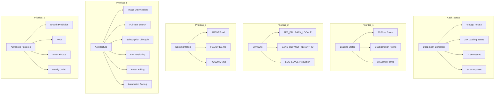

# ForMysha — Rencana Perbaikan Komprehensif 2026

**Tanggal:** 9 Agustus 2026
**Status Audit:** Phase 1-9 selesai, 504 tests / 1153 assertions — all passing
**Laravel:** 13.8 (laravel/framework ^13.8)
**Metodologi:** Deep scan seluruh kode sumber + verifikasi bug audit sebelumnya

---

## Ringkasan Status

| Kategori | Status | Jumlah |
|----------|--------|--------|
| Bug/Security dari audit sebelumnya | ✅ SEMUA SUDAH DI-FIX | 0 tersisa |
| Loading states inkonsisten | 🟡 Perlu perbaikan | 25+ form |
| .env sync issues | 🟡 Perlu sinkronisasi | 3 item |
| Documentation sync | 🟡 Perlu update | 3 file |
| Architecture improvements | 🔵 Future enhancement | 6 item |
| Advanced feature ideas | 🔵 Roadmap | 12+ ide |

---

## ✅ Verifikasi Bug Sebelumnya — SEMUA SUDAH DI-FIX

| No | Bug | Status | Bukti |
|----|-----|--------|-------|
| 1 | XSS risk di branding footer | ✅ FIXED | `strip_tags()` dengan whitelist di [`footer.blade.php`](resources/views/components/branding/footer.blade.php:16) |
| 2 | Branding component direct DB query | ✅ FIXED | Menggunakan `$tenant->branding` relationship |
| 3 | Hardcoded copyright year 2026 | ✅ FIXED | `{{ date('Y') }}` di [`app.blade.php`](resources/views/layouts/app.blade.php:55) |
| 4 | PaymentController tenant verification | ✅ FIXED | `abort_unless($subscription->tenant_id === $tenant->id, 403)` di line 50 |
| 5 | Media relationship tidak konsisten | ✅ FIXED | Semua sudah `MorphMany` (Child, Album, Timeline, Diary) |
| 6 | Growth show route tidak ada | ✅ FIXED | Ada di [`routes/web.php`](routes/web.php:116) |
| 7 | `x-cloak` tanpa CSS rule | ✅ FIXED | Ada di [`resources/css/app.css`](resources/css/app.css:6) |
| 8 | `window.confirm()` pattern | ✅ FIXED | 0 ditemukan — semua pakai `x-confirm-delete` atau inline Alpine modal |
| 9 | CSRF protection | ✅ VERIFIED | 63+ form semua ada `@csrf` |
| 10 | Responsive tables | ✅ VERIFIED | 18+ tabel semua ada `overflow-x-auto` |
| 11 | Route ordering | ✅ VERIFIED | Auth routes sebelum catch-all `/{slug}` |

---

## 🟡 Prioritas 1: Loading States pada Form Submit

### Masalah
25+ form tidak memiliki loading state saat submit. User bisa mengklik tombol submit berkali-kali.

### Form SUDAH ADA Loading State
| File | Status |
|------|--------|
| [`auth/login.blade.php`](resources/views/auth/login.blade.php:47) | ✅ |
| [`auth/register.blade.php`](resources/views/auth/register.blade.php:47) | ✅ |
| [`children/create.blade.php`](resources/views/children/create.blade.php:110) | ✅ |
| [`children/edit.blade.php`](resources/views/children/edit.blade.php:118) | ✅ |
| [`timeline/create.blade.php`](resources/views/timeline/create.blade.php:110) | ✅ |
| [`diaries/create.blade.php`](resources/views/diaries/create.blade.php:102) | ✅ |
| [`albums/create.blade.php`](resources/views/albums/create.blade.php:87) | ✅ |

### Form BELUM ADA Loading State (Perlu Ditambahkan)
| No | File | Prioritas |
|----|------|-----------|
| 1 | [`timeline/edit.blade.php`](resources/views/timeline/edit.blade.php:106) | Tinggi |
| 2 | [`albums/edit.blade.php`](resources/views/albums/edit.blade.php:83) | Tinggi |
| 3 | [`diaries/edit.blade.php`](resources/views/diaries/edit.blade.php:98) | Tinggi |
| 4 | [`growth/create.blade.php`](resources/views/growth/create.blade.php:75) | Tinggi |
| 5 | [`growth/edit.blade.php`](resources/views/growth/edit.blade.php:74) | Tinggi |
| 6 | [`health/create.blade.php`](resources/views/health/create.blade.php:122) | Tinggi |
| 7 | [`health/edit.blade.php`](resources/views/health/edit.blade.php:121) | Tinggi |
| 8 | [`documents/create.blade.php`](resources/views/documents/create.blade.php:115) | Tinggi |
| 9 | [`documents/edit.blade.php`](resources/views/documents/edit.blade.php:114) | Tinggi |
| 10 | [`calendar/create.blade.php`](resources/views/calendar/create.blade.php:99) | Sedang |
| 11 | [`calendar/edit.blade.php`](resources/views/calendar/edit.blade.php:91) | Sedang |
| 12 | [`family/create.blade.php`](resources/views/family/create.blade.php:75) | Sedang |
| 13 | [`family/edit.blade.php`](resources/views/family/edit.blade.php:74) | Sedang |
| 14 | [`subscription/payment-upload.blade.php`](resources/views/subscription/payment-upload.blade.php:131) | Sedang |
| 15 | [`super-admin/tenants/create.blade.php`](resources/views/super-admin/tenants/create.blade.php:46) | Rendah |
| 16 | [`super-admin/tenants/edit.blade.php`](resources/views/super-admin/tenants/edit.blade.php:61) | Rendah |
| 17 | [`super-admin/plans/create.blade.php`](resources/views/super-admin/plans/create.blade.php:136) | Rendah |
| 18 | [`super-admin/plans/edit.blade.php`](resources/views/super-admin/plans/edit.blade.php:136) | Rendah |
| 19 | [`admin/settings/edit.blade.php`](resources/views/admin/settings/edit.blade.php:102) | Rendah |
| 20 | [`admin/branding/edit.blade.php`](resources/views/admin/branding/edit.blade.php:193) | Rendah |
| 21 | [`admin/domain/index.blade.php`](resources/views/admin/domain/index.blade.php:81) | Rendah |

### Pola Implementasi
Tambahkan Alpine.js loading state pada form:
```blade
<form x-data="{ loading: false }" x-on:submit="loading = true" ...>
    ...
    <button type="submit" :disabled="loading" class="btn-primary min-h-[44px] disabled:opacity-50 disabled:cursor-not-allowed">
        <svg x-show="loading" class="w-4 h-4 animate-spin" ...>...</svg>
        <span x-show="!loading">💾 Simpan</span>
        <span x-show="loading">Menyimpan...</span>
    </button>
</form>
```

---

## 🟡 Prioritas 2: Sinkronisasi .env

### Temuan

| No | File | Masalah | Rekomendasi |
|----|------|---------|-------------|
| 1 | `.env.example` | Missing `APP_FALLBACK_LOCALE=id` | Tambahkan setelah `APP_LOCALE=id` |
| 2 | `.env.production` | Missing `SAAS_DEFAULT_TENANT_ID=` | Tambahkan di section SaaS |
| 3 | `.env.production` | `LOG_LEVEL=debug` | Ganti ke `warning` untuk production |
| 4 | `.env.example` | `VITE_APP_NAME` di akhir file | Pindahkan ke posisi konsisten |

---

## 🟡 Prioritas 3: Documentation Sync

### Update Test Count
- [`AGENTS.md`](AGENTS.md:1051): Update "504 tests, 1153 assertions" (verifikasi ulang setelah perubahan)
- [`FEATURES.md`](FEATURES.md:812): Sync test count
- [`ROADMAP.md`](ROADMAP.md:828): Sync test count

### Verifikasi Tech Stack
- AGENTS.md menyebutkan "Laravel 13" — ✅ KONFIRMASI (composer.json: `laravel/framework: ^13.8`)
- AGENTS.md menyebutkan "PostgreSQL" — ⚠️ `.env.example` default MySQL, perlu klarifikasi
- AGENTS.md menyebutkan "MinIO" — ⚠️ Belum terkonfigurasi di `.env.example`

---

## 🔵 Prioritas 4: UX Consistency Improvements

### 4.1 Subscription Plans Loading Skeleton
**File:** [`subscription/plans.blade.php`](resources/views/subscription/plans.blade.php)
**Masalah:** Plans langsung render tanpa skeleton
**Dampak:** Minimal — data kecil dan cepat load

### 4.2 Enterprise Import Placeholder
**File:** [`EnterpriseController.php`](app/Http/Controllers/TenantAdmin/EnterpriseController.php:128)
**Masalah:** `processImport()` membuat record tapi tidak proses file
**Rekomendasi:** Tambah note "Coming Soon" di UI atau implementasi pemrosesan

### 4.3 Dashboard Quick Links ke First Child
**File:** [`dashboard.blade.php`](resources/views/dashboard.blade.php:95)
**Masalah:** "Lihat Semua" selalu ke `$children->first()`
**Rekomendasi:** Biarkan apa adanya — ini shortcut yang wajar

---

## 🔵 Prioritas 5: Architecture Improvements

### 5.1 Image Optimization Pipeline
**Masalah:** Foto berukuran besar (5-10MB) disimpan tanpa kompresi
**Solusi:**
- Install `intervention/image`
- Buat multiple sizes (thumbnail 150px, medium 800px, large 1920px)
- Gunakan queue untuk processing async
- Update MediaService untuk auto-resize

### 5.2 Full-Text Search
**Masalah:** Search menggunakan `LIKE '%query%'` — tidak dioptimalkan
**Solusi:**
- PostgreSQL: `to_tsvector` / `to_tsquery`
- Atau Laravel Scout dengan driver Meilisearch/Algolia
- Tambah full-text index pada kolom title, description, content

### 5.3 Subscription Lifecycle Automation
**Masalah:** Tidak ada scheduled command untuk:
- Menandai subscription expired
- Mengirim reminder sebelum expired
- Mengubah status ke `past_due`
**Solusi:** Buat `SubscriptionLifecycleCommand` dengan scheduling harian

### 5.4 API Versioning
**Masalah:** API routes tanpa versioning (`/api/...`)
**Solusi:** Tambah prefix `/api/v1/` untuk semua routes
**Catatan:** Pertahankan backward compatibility

### 5.5 Rate Limiting File Upload
**Masalah:** Upload media tanpa rate limiting
**Solusi:** Tambah throttle middleware pada upload endpoints

### 5.6 Automated Backup System
**Masalah:** Tidak ada backup otomatis
**Solusi:**
- Install `spatie/laravel-backup`
- Schedule backup harian ke MinIO/S3
- Tambah monitoring dashboard

---

## 🔵 Prioritas 6: Advanced Feature Ideas

### 6.1 Growth Prediction Engine
**Konsep:** Menggunakan data WHO yang sudah ada di GrowthService untuk prediksi pertumbuhan anak
**Fitur:**
- Proyeksi tinggi badan berdasarkan data saat ini
- Perbandingan dengan standar WHO percentile
- Alert jika ada deviasi signifikan
- Grafik prediksi vs aktual

### 6.2 Smart Photo Organization
**Konsep:** AI-powered photo tagging dan organization (via Custom API Integration)
**Fitur:**
- Auto-detect milestone photos (first smile, first steps, etc.)
- Face detection untuk grouping foto per orang
- Location tagging dari EXIF data
- Smart album suggestions

### 6.3 Health Timeline Dashboard
**Konsep:** Visualisasi komprehensif perjalanan kesehatan anak
**Fitur:**
- Timeline imunisasi dengan status (done/overdue/upcoming)
- Growth chart overlay dengan data WHO
- Health event correlation (sakit → weight change)
- Export laporan kesehatan untuk dokter

### 6.4 Family Collaboration Features
**Konsep:** Enhanced collaboration antar anggota keluarga
**Fitur:**
- Real-time notifications saat ada konten baru
- Comment/reaksi pada timeline entries
- Shared calendar dengan family members
- Task assignment (siapa yang antar imunisasi)

### 6.5 PWA (Progressive Web App)
**Konsep:** Aplikasi yang bisa diinstall di home screen
**Fitur:**
- Offline access untuk data yang sudah di-cache
- Push notifications untuk reminders
- Background sync untuk upload
- App-like experience tanpa App Store

### 6.6 Data Migration Tools
**Konsep:** Import data dari platform lain
**Fitur:**
- Import dari Google Photos
- Import dari Apple Health
- Import dari Excel/CSV
- Import dari aplikasi baby tracker lain

### 6.7 Printable Reports
**Konsep:** Generate laporan cetak yang indah
**Fitur:**
- Laporan pertumbuhan bulanan/tahunan
- Laporan kesehatan lengkap
- Laporan pencapaian (milestones)
- Template PDF yang customizable

### 6.8 Two-Factor Authentication
**Konsep:** Enhanced security untuk data keluarga
**Fitur:**
- TOTP (Google Authenticator)
- SMS verification
- Backup codes
- Session management dashboard

### 6.9 Social Sharing (Controlled)
**Konsep:** Berbagi momen dengan kontrol privasi ketat
**Fitur:**
- Shareable links dengan expiry
- Watermarked photos untuk public share
- Social media integration (Instagram, Facebook)
- Family tree visualization

### 6.10 Analytics Dashboard untuk Orang Tua
**Konsep:** Insights berdasarkan data yang dikumpulkan
**Fitur:**
- Statistik pertumbuhan vs rata-rata
- Activity heat map (kapan paling sering upload)
- Health trends
- Milestone tracking dengan comparison

### 6.11 Integration dengan Sistem Kesehatan
**Konsep:** Koneksi dengan layanan kesehatan Indonesia
**Fitur:**
- Sync dengan BPJS Kesehatan
- Integration dengan aplikasi dokter
- Auto-import data imunisasi dari Posyandu
- Telemedicine booking

### 6.12 Video Compression & Streaming
**Konsep:** Optimasi video storage dan playback
**Fitur:**
- Auto-compression saat upload
- Multiple quality levels (360p, 720p, 1080p)
- Streaming tanpa download
- Thumbnail generation

---

## Diagram Arsitektur



---

## Urutan Eksekusi

### Phase A — Quick Fixes (Ringan, 0 Risk)
1. Tambah loading states pada 10 form core (edit forms)
2. Sync `.env.example` — tambah `APP_FALLBACK_LOCALE`
3. Fix `.env.production` — `LOG_LEVEL=warning`
4. Update test count di dokumentasi
5. Jalankan test suite + Pint

### Phase B — UX Consistency (Ringan, Low Risk)
6. Tambah loading states pada 5 subscription/admin forms
7. Tambah loading states pada 10 admin/super-admin forms
8. Tambah "Coming Soon" note pada Enterprise Import UI
9. Jalankan test suite + Pint

### Phase C — Documentation Final (Medium)
10. Update AGENTS.md — klarifikasi MySQL vs PostgreSQL
11. Update FEATURES.md — tambah section loading states
12. Update ROADMAP.md — tambah Phase 10 items
13. Jalankan test suite + Pint

### Phase D — Architecture (Bulan Depan)
14. Image optimization pipeline
15. Full-text search
16. Subscription lifecycle automation
17. API versioning
18. Rate limiting
19. Automated backup

### Phase E — Advanced Features (Roadmap)
20. Growth prediction engine
21. PWA implementation
22. Smart photo organization
23. Family collaboration
24. Data migration tools
25. Printable reports

---

## Risiko & Mitigasi

| Risiko | Level | Mitigasi |
|--------|-------|----------|
| Loading state mempengaruhi form behavior | Rendah | Alpine.js sudah digunakan, pattern konsisten |
| .env sync menyebabkan regression | Rendah | Hanya menambah variabel default |
| Documentation update salah count | Rendah | Jalankan test suite untuk verifikasi |
| Architecture changes breaking | Sedang | Implementasi bertahap dengan backward compatibility |

---

## Kesimpulan

**Status Proyek: SANGAT BAIK** 🟢

Semua bug dari audit sebelumnya sudah terfix. Temuan yang tersisa adalah:
- **Loading states** — inkonsistensi UX, bukan bug (25+ form perlu ditambahkan)
- **.env sync** — 3 variabel perlu disinkronkan
- **Documentation** — test count perlu diupdate

Proyek memiliki fondasi yang sangat solid dengan 504 tests passing. Prioritas utama adalah menambahkan loading states untuk konsistensi UX, lalu sinkronisasi dokumentasi.
