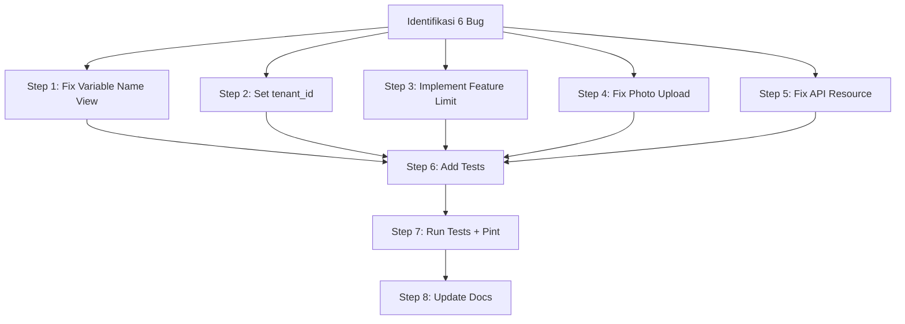

# Family Sharing — Fix Plan

## Hasil Investigasi

### Status Saat Ini

Fitur Family Sharing sudah **aktif dan bisa digunakan secara dasar**. Komponen berikut sudah ada:

| Komponen | Status | Detail |
|----------|--------|--------|
| Database | ✅ | Table `family_members` dengan schema lengkap |
| Model | ✅ | `FamilyMember` dengan relationships dan accessor |
| Web Controller | ✅ | CRUD lengkap (index, create, store, edit, update, destroy) |
| API Controller | ✅ | CRUD lengkap dengan authorization |
| Form Requests | ✅ | `StoreFamilyMemberRequest`, `UpdateFamilyMemberRequest` |
| Views | ✅ | index, create, edit — responsive design |
| Navigasi | ✅ | Di child-nav (label "Keluarga" + ikon 👨‍👩‍👧‍👦) |
| Routes | ✅ | Terlindungi `child.ownership` middleware |
| API Resource | ✅ | `FamilyMemberResource` |
| Tests | ⚠️ | Feature (8 tests), API (2 tests — minim) |

### Bug yang Ditemukan

---

#### BUG 1 — Variable Name Mismatch di View Index (CRITICAL)

**File:** [`resources/views/family/index.blade.php`](resources/views/family/index.blade.php:106)

```blade
{{-- Line 106 — SALAH --}}
@foreach ($members as $member)
    <x-confirm-delete ... />
@endforeach
```

Controller mengirim variabel `$familyMembers`, tapi view menggunakan `$members` di loop delete confirmation modal. Akibatnya **modal konfirmasi hapus tidak akan muncul** — tombol hapus tidak berfungsi sama sekali.

**Impact:** Pengguna tidak bisa menghapus anggota keluarga dari UI.

**Fix:** Ganti `$members` menjadi `$familyMembers`.

---

#### BUG 2 — `tenant_id` Tidak Di-Set saat Create/Update Family Member

**File:** [`app/Http/Controllers/FamilyMemberController.php`](app/Http/Controllers/FamilyMemberController.php:49)

```php
// Line 49 — tenant_id tidak di-set
$child->familyMembers()->create($request->validated());
```

Di multi-tenant context, family member tidak akan ter-scope ke tenant yang benar. Ini bug yang sama seperti yang sudah diperbaiki di ChildController sebelumnya.

**Impact:** Data family member tidak terisolasi antar tenant.

**Fix:** Set `tenant_id` dari `$child->tenant_id` saat store dan update.

---

#### BUG 3 — Feature Limit `family_members` Belum Diimplementasi

**File:** [`app/Http/Middleware/EnsureFeatureLimit.php`](app/Http/Middleware/EnsureFeatureLimit.php:32) + [`app/Services/TenantService.php`](app/Services/TenantService.php:109)

- Plans table sudah memiliki field `max_family_members` (default: 5)
- Tapi `TenantService::checkFeatureLimit()` belum memiliki case untuk `family_members`
- `Tenant` model belum memiliki method `canAddFamilyMember()`
- Middleware `feature.limit:family_members` belum diterapkan ke rute

**Impact:** Pengguna bisa menambah unlimited family members tanpa batasan paket.

**Fix:**
1. Tambah `canAddFamilyMember()` ke Tenant model
2. Tambah case `family_members` ke `TenantService::checkFeatureLimit()`
3. Tambah feature limit label ke `EnsureFeatureLimit` middleware
4. Tambah `feature.limit:family_members` ke rute `family.store`

---

#### BUG 4 — Photo Upload Tidak Ditangani di Controller

**File:** [`app/Http/Controllers/FamilyMemberController.php`](app/Http/Controllers/FamilyMemberController.php:49)

Form validation mengizinkan field `photo` (image, max 2048KB), tapi controller hanya melakukan `create($request->validated())` tanpa memproses upload file. Photo tidak akan tersimpan ke storage.

**Impact:** Form upload photo tampil tapi tidak berfungsi.

**Fix:** Handle file upload menggunakan `Storage::put()` sebelum create/update.

---

#### BUG 5 — API Tests Terlalu Sedikit

**File:** [`tests/Feature/Api/FamilyApiTest.php`](tests/Feature/Api/FamilyApiTest.php:1)

Hanya ada 2 tests (list dan create). Missing tests untuk:
- Show single family member
- Update family member
- Delete family member
- Authorization (preventing other users' access)
- Validation errors

---

#### BUG 6 — FamilyMemberResource Tidak Include `photo` Field

**File:** [`app/Http/Resources/FamilyMemberResource.php`](app/Http/Resources/FamilyMemberResource.php:25)

Resource tidak mengembalikan field `photo`, sehingga API consumers tidak bisa mendapatkan URL photo.

---

## Rencana Eksekusi

### Step 1: Fix Variable Name di View Index
- **File:** `resources/views/family/index.blade.php:106`
- Ganti `$members` menjadi `$familyMembers`

### Step 2: Set `tenant_id` di FamilyMemberController
- **File:** `app/Http/Controllers/FamilyMemberController.php`
- Set `tenant_id` dari `$child->tenant_id` saat store dan update

### Step 3: Implementasi Feature Limit `family_members`
- **File:** `app/Models/Tenant.php`
  - Tambah `canAddFamilyMember(): bool` method
- **File:** `app/Services/TenantService.php`
  - Tambah case `family_members` ke `checkFeatureLimit()`
  - Tambah `getFamilyMemberCount()` method
- **File:** `app/Http/Middleware/EnsureFeatureLimit.php`
  - Tambah label `family_members` → 'anggota keluarga'
- **File:** `routes/web.php`
  - Tambah `feature.limit:family_members` ke rute `family.store`

### Step 4: Handle Photo Upload
- **File:** `app/Http/Controllers/FamilyMemberController.php`
  - Handle file upload di `store()` dan `update()`
  - Gunakan `Storage::disk('public')->put()` untuk menyimpan file
  - Hapus photo lama saat update

### Step 5: Fix FamilyMemberResource
- **File:** `app/Http/Resources/FamilyMemberResource.php`
  - Tambah field `photo` dan `photo_url` ke response

### Step 6: Tambah Tests
- **File:** `tests/Feature/FamilyMemberTest.php`
  - Tambah test untuk photo upload
  - Tambah test untuk feature limit
  - Tambah test untuk tenant_id
- **File:** `tests/Feature/Api/FamilyApiTest.php`
  - Tambah tests untuk show, update, delete, authorization, validation

### Step 7: Jalankan Test Suite + Pint
- Pastikan semua tests passing
- Format dengan Pint

### Step 8: Update Documentation
- Update jumlah test di AGENTS.md, FEATURES.md, ROADMAP.md

---

## Diagram Alur Perbaikan



---

## File yang Akan Diubah

| # | File | Perubahan |
|---|------|-----------|
| 1 | `resources/views/family/index.blade.php` | Fix `$members` → `$familyMembers` |
| 2 | `app/Http/Controllers/FamilyMemberController.php` | Set tenant_id + photo upload |
| 3 | `app/Models/Tenant.php` | Tambah `canAddFamilyMember()` |
| 4 | `app/Services/TenantService.php` | Tambah case `family_members` + `getFamilyMemberCount()` |
| 5 | `app/Http/Middleware/EnsureFeatureLimit.php` | Tambah label `family_members` |
| 6 | `routes/web.php` | Tambah feature limit middleware |
| 7 | `app/Http/Resources/FamilyMemberResource.php` | Tambah `photo` field |
| 8 | `tests/Feature/FamilyMemberTest.php` | Tambah tests |
| 9 | `tests/Feature/Api/FamilyApiTest.php` | Tambah tests |
| 10 | `AGENTS.md` | Update test count |
| 11 | `FEATURES.md` | Update test count |
| 12 | `ROADMAP.md` | Update test count |
