# ForMysha — Phase 10: Comprehensive Quality & Enhancement

**Tanggal:** 9 Agustus 2026  
**Status:** Perencanaan  
**Tests Saat Ini:** 504 tests, 1153 assertions — all passing

---

## Ringkasan Eksekutif

Phase 10 berfokus pada peningkatan kualitas menyeluruh, standardisasi UX, dan penambahan fitur yang meningkatkan nilai aplikasi. Rencana ini dibagi menjadi 6 sub-task dengan prioritas eksekusi yang jelas.

---

## Arsitektur Phase 10

```mermaid
graph TD
    A[Phase 10] --> B[10.1 Verifikasi Sync]
    A --> C[10.2 Bug Fix Konsistensi]
    A --> D[10.3 Light Features]
    A --> E[10.4 Big Features]
    A --> F[10.5 Architecture Performance]
    A --> G[10.6 Testing Documentation]
    
    B --> B1[Jalankan Test Suite]
    B --> B2[Jalankan Pint]
    B --> B3[Sync Dokumentasi]
    
    C --> C1[Delete Confirm Standard]
    C --> C2[Dashboard Quick Access]
    C --> C3[Audit Routes Links]
    C --> C4[Audit Tombol Handler]
    
    D --> D1[Advanced Filtering]
    D --> D2[Sort Options]
    D --> D3[Print Friendly]
    D --> D4[Empty State Improve]
    D --> D5[Validation Improve]
    
    E --> E1[PWA Support]
    E --> E2[Analytics Charts]
    E --> E3[Social Sharing]
    E --> E4[Data Import]
    
    F --> F1[Query Optimization]
    F --> F2[Caching Strategy]
    F --> F3[Subscription Lifecycle]
    
    G --> G1[New Tests]
    G --> G2[Update FEATURES]
    G --> G3[Update ROADMAP]
    G --> G4[Update AGENTS]
```



---

## SUB-TASK 10.1: Verifikasi & Sync

### Tujuan
Memastikan kondisi proyek saat ini stabil sebelum penambahan fitur baru.

### Checklist

- [ ] **Jalankan test suite** — `php artisan test --compact` untuk verifikasi 504 tests masih passing
- [ ] **Jalankan Laravel Pint** — `vendor/bin/pint --dirty --format agent` untuk format kode
- [ ] **Sync angka tests** — Update FEATURES.md dan ROADMAP.md jika ada perubahan jumlah tests

### Output yang Diharapkan
- Semua tests passing
- Kode terformat dengan Pint
- Dokumentasi sinkron dengan kondisi aktual

---

## SUB-TASK 10.2: Bug Fix & Konsistensi UX

### Tujuan
Standardisasi UX dan perbaikan masalah konsistensi yang teridentifikasi dari audit.

### 10.2.1 Standarisasi Delete Confirmation

**Masalah:** 17 instances menggunakan browser `confirm()` bawaan, bukan komponen `x-confirm-delete` yang sudah tersedia.

**Views yang Perlu Diupdate:**
- `resources/views/timeline/show.blade.php`
- `resources/views/health/index.blade.php`
- `resources/views/family/index.blade.php`
- `resources/views/calendar/index.blade.php`
- `resources/views/documents/index.blade.php`
- `resources/views/diaries/index.blade.php`
- `resources/views/albums/index.blade.php`
- Dan lainnya yang menggunakan `confirm()`

**Pola Implementasi:**
```blade
{{-- Sebelum --}}
x-on:click.prevent="if(confirm('Yakin ingin menghapus?')) $el.closest('form').submit()"

{{-- Sesudah --}}
<x-confirm-delete 
    id="delete-{{ $item->id }}" 
    title="Hapus {{ $item->name }}" 
    message="Apakah Anda yakin ingin menghapus data ini?" 
    action="{{ route('route.destroy', [$child, $item]) }}" 
    method="DELETE" 
/>
```

### 10.2.2 Fix Dashboard Quick Access

**Masalah:** Link "Akses Cepat" selalu mengarah ke `$firstChild` tanpa memperhatikan child yang dipilih.

**Solusi:** Gunakan `$selectedChild ?? $children->first()` untuk semua quick access links.

### 10.2.3 Audit Routes & Dead Links

**Pemeriksaan:**
- [ ] Validasi semua `route()` calls memiliki target yang valid
- [ ] Cek semua `href="{{ route(...) }}"` tidak mengarah ke 404
- [ ] Pastikan sidebar navigation links semua valid
- [ ] Pastikan breadcrumb links semua valid

### 10.2.4 Audit Tombol & Event Handler

**Pemeriksaan:**
- [ ] Semua tombol submit memiliki handler yang benar
- [ ] Semua tombol delete memiliki konfirmasi
- [ ] Semua tombol aksi memiliki feedback (loading/sukses/error)
- [ ] Tidak ada tombol "mati" tanpa efek

---

## SUB-TASK 10.3: Light Features

### Tujuan
Penambahan fitur ringan yang meningkatkan UX tanpa perubahan arsitektur besar.

### 10.3.1 Advanced Filtering

**Index Pages yang Perlu Ditambah Filter:**

| Modul | Filter yang Ditambahkan |
|-------|------------------------|
| Timeline | Date range, tag |
| Diary | Date range, mood |
| Health Records | Date range, type (imunisasi/penyakit/checkup) |
| Growth | Date range |
| Documents | Type (akta/KK/BPJS/dll) |
| Calendar | Date range, event type |
| Family Members | Relationship type |

**Pola Implementasi:**
```blade
<div class="flex flex-col sm:flex-row gap-3 mb-6">
    <select x-model="filterType" class="...">
        <option value="">Semua Tipe</option>
        <option value="imunisasi">Imunisasi</option>
        <option value="penyakit">Penyakit</option>
    </select>
    <input type="date" x-model="dateFrom" class="..." />
    <input type="date" x-model="dateTo" class="..." />
</div>
```

### 10.3.2 Sort Options

**Opsi Sort yang Ditambahkan:**
- Terbaru dulu (default)
- Terlama dulu
- Nama A-Z
- Nama Z-A

**Implementasi:** Query parameter `?sort=newest|oldest|name_asc|name_desc`

### 10.3.3 Print-Friendly Views

**Halaman yang Perlu Print Style:**
- Child profile (biodata lengkap)
- Health records (riwayat kesehatan)
- Growth records (riwayat pertumbuhan)
- Documents list (daftar dokumen)

**Implementasi:** Tambah `@media print` CSS rules

### 10.3.4 Empty State Improvements

**Enhancement:**
- Tambah ilustrasi SVG yang lebih menarik
- Tambah guidance text yang lebih informatif
- Tambah quick action button di empty state

### 10.3.5 Data Validation Improvements

**Penambahan Validasi:**
- Date range validation (from <= to)
- File size validation di semua upload forms
- Max length validation untuk text fields
- Phone number format validation

---

## SUB-TASK 10.4: Big Features

### Tujuan
Penambahan fitur besar yang meningkatkan nilai aplikasi secara signifikan.

### 10.4.1 PWA (Progressive Web App) Support

**Komponen yang Diperlukan:**
- `public/manifest.json` — Web app manifest
- `public/sw.js` — Service worker untuk offline support
- `resources/views/layouts/app.blade.php` — Tambah meta tags untuk PWA

**Fitur PWA:**
- Installable di mobile dan desktop
- Offline access untuk halaman yang sudah di-cache
- Push notification support (future)
- App-like experience

**Implementasi:**
```json
// public/manifest.json
{
    "name": "ForMysha",
    "short_name": "ForMysha",
    "start_url": "/dashboard",
    "display": "standalone",
    "background_color": "#ffffff",
    "theme_color": "#f9a8d4",
    "icons": [...]
}
```

### 10.4.2 Advanced Analytics Dashboard

**Fitur Analytics:**
- Growth charts interaktif (tinggi, berat, lingkar kepala)
- Timeline statistics (jumlah momen per bulan)
- Health summary (imunisasi completion rate)
- Family activity heatmap

**Teknologi:** Chart.js atau Apex.js via CDN

### 10.4.3 Social Sharing

**Fitur Sharing:**
- Share momen ke WhatsApp, Facebook, Twitter
- Share public profile link
- Generate shareable image card

**Implementasi:** Web Share API + share buttons

### 10.4.4 Data Import

**Replace Placeholder Import:**
- Import dari CSV (family members, growth records)
- Import dari JSON (backup restore)
- Import validation & preview
- Progress indicator

---

## SUB-TASK 10.5: Architecture & Performance

### Tujuan
Peningkatan performa dan optimasi arsitektur.

### 10.5.1 Database Query Optimization

**Identifikasi N+1 Queries:**
- Dashboard queries (children + timelines + events)
- Index pages (relations loading)
- API responses (eager loading)

**Solusi:**
- Tambah `with()` eager loading
- Gunakan `select()` untuk data yang dibutuhkan saja
- Pertimbangkan database indexing untuk kolom yang sering di-query

### 10.5.2 Caching Strategy

**Peningkatan Caching:**
- Cache child data (5 menit TTL)
- Cache dashboard data (5 menit TTL)
- Cache subscription status (15 menit TTL)
- Cache tenant branding (1 jam TTL)

### 10.5.3 Subscription Lifecycle Automation

**Scheduled Commands:**
- `subscription:check-expired` — Tandai subscription yang sudah expired
- `subscription:send-reminder` — Kirim reminder 3 hari sebelum expired
- `subscription:activate-pending` — Aktifkan subscription yang sudah dibayar

---

## SUB-TASK 10.6: Testing & Documentation

### Tujuan
Memastikan semua fitur baru ter-test dan dokumentasi sinkron.

### 10.6.1 New Tests

**Tests yang Perlu Ditambahkan:**
- Feature tests untuk advanced filtering
- Feature tests untuk sort options
- Feature tests untuk data import
- Unit tests untuk new services

### 10.6.2 Documentation Updates

**FEATURES.md:**
- Tambah section "Phase 10 Features"
- Update test counts
- Update feature list

**ROADMAP.md:**
- Tambah "Phase 10 — Quality & Enhancement"
- Detail sub-tasks dan status

**AGENTS.md:**
- Update jika ada perubahan arsitektur
- Tambah PWA conventions
- Tambah analytics conventions

---

## Prioritas Eksekusi

### P1: Critical (Hari 1-2)
1. Jalankan test suite & Pint formatter
2. Sync dokumentasi test counts
3. Standarisasi delete confirmation (17 instances)

### P2: High (Hari 3-5)
4. Fix dashboard quick access
5. Audit routes & dead links
6. Audit tombol & event handler
7. Advanced filtering di index pages

### P3: Medium (Minggu 2)
8. Sort options di list views
9. Print-friendly views
10. Empty state improvements
11. Data validation improvements

### P4: Feature (Minggu 3-4)
12. PWA support
13. Advanced analytics dashboard
14. Social sharing
15. Data import

### P5: Architecture (Minggu 4-5)
16. Database query optimization
17. Caching strategy improvements
18. Subscription lifecycle automation

### P6: Final (Minggu 5)
19. Tambah tests untuk fitur baru
20. Update semua dokumentasi
21. Final test suite & Pint

---

## Estimasi Files yang Akan Diubah

### Views (Blade)
- `resources/views/dashboard.blade.php` — Quick access fix
- `resources/views/timeline/index.blade.php` — Filter + delete confirm
- `resources/views/timeline/show.blade.php` — Delete confirm
- `resources/views/diaries/index.blade.php` — Filter + delete confirm
- `resources/views/health/index.blade.php` — Filter + delete confirm
- `resources/views/growth/index.blade.php` — Filter
- `resources/views/documents/index.blade.php` — Filter + delete confirm
- `resources/views/calendar/index.blade.php` — Filter + delete confirm
- `resources/views/family/index.blade.php` — Delete confirm
- `resources/views/albums/index.blade.php` — Delete confirm
- `resources/views/layouts/app.blade.php` — PWA meta tags
- `resources/css/app.css` — Print styles

### Controllers
- `app/Http/Controllers/DashboardController.php` — Quick access fix
- Semua index controllers — Filter support

### New Files
- `public/manifest.json` — PWA manifest
- `public/sw.js` — Service worker
- `resources/views/exports/print-friendly.blade.php` — Print template

### Config
- `config/saas.php` — Subscription lifecycle config

### Documentation
- `FEATURES.md` — Phase 10 features
- `ROADMAP.md` — Phase 10 roadmap
- `AGENTS.md` — Updated conventions

---

## Risks & Mitigasi

| Risiko | Dampak | Mitigasi |
|--------|--------|----------|
| PWA caching terlalu agresif | User melihat data usang | Gunakan stale-while-revalidate strategy |
| Advanced filtering mempengaruhi performa | Query lambat | Tambah database index |
| Import data tidak valid | Data corrupt | Validasi ketat + preview sebelum submit |
| Social sharing leak data pribadi | Privacy violation | Hanya share data yang dipilih user |

---

## Kesimpulan

Phase 10 dirancang untuk meningkatkan kualitas ForMysha dari "sudah baik" menjadi "sangat baik" dengan:

1. **Konsistensi UX** — Semua halaman menggunakan pola yang sama
2. **Fitur Berguna** — Filtering, sorting, print, PWA
3. **Performa Optimal** — Query optimization, caching
4. **Dokumentasi Lengkap** — Semua fitur terdokumentasi

Dengan eksekusi yang tepat, ForMysha akan menjadi platform Digital Life Book yang profesional, mudah digunakan, dan siap untuk skalabilitas masa depan.
