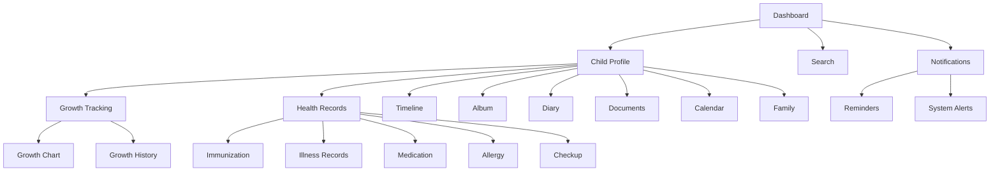
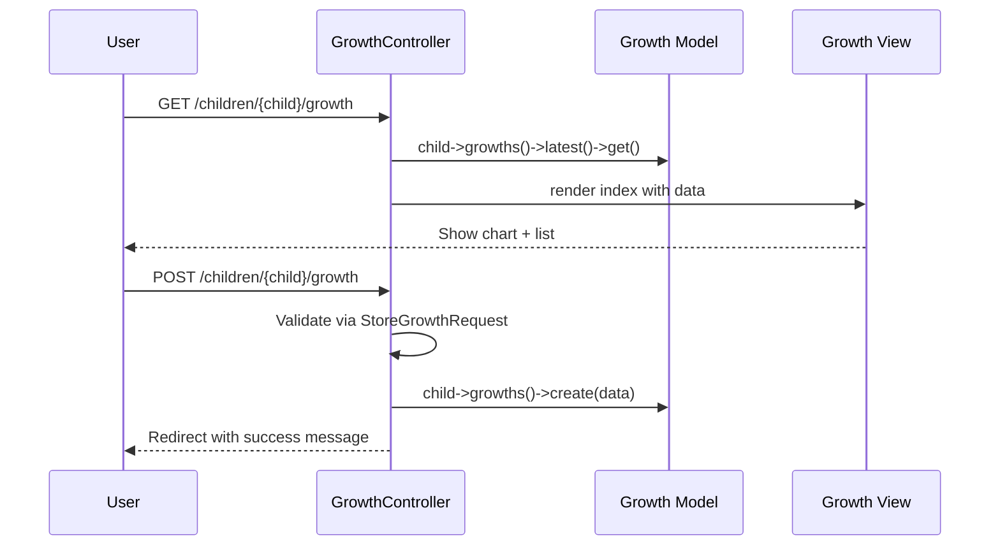
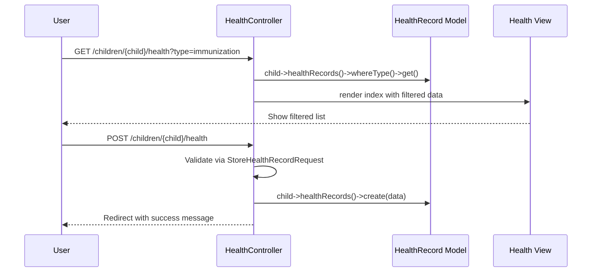

# ForMysha — Rencana Implementasi Phase 2: Parenting

## Gambaran Besar

Phase 2 menambahkan modul **Parenting** yang membantu orang tua memantau pertumbuhan, kesehatan, dan mendapatkan pengingat penting terkait anak.

### Modul yang Dikembangkan

| # | Modul | Deskripsi | Prioritas |
|---|-------|-----------|-----------|
| 1 | Pertumbuhan (Growth) | Tracking tinggi badan, berat badan, lingkar kepala + grafik | Tinggi |
| 2 | Kesehatan (Health Records) | Imunisasi, riwayat penyakit, obat, alergi, checkup | Tinggi |
| 3 | Pencarian (Search) | Pencarian lintas modul (timeline, foto, dokumen, diary) | Sedang |
| 4 | Notifikasi (Notifications) | Pusat notifikasi & pengingat sistem | Sedang |

---

## Arsitektur Database

### 1. Table: `growths`

```
growths
├── id (bigint, pk)
├── child_id (foreign → children)
├── user_id (foreign → users)
├── measured_at (date) — tanggal pengukuran
├── weight_kg (decimal 5,2) — berat badan dalam kg
├── height_cm (decimal 5,1) — tinggi badan dalam cm
├── head_circumference_cm (decimal 4,1) — lingkar kepala dalam cm (opsional)
├── notes (text, nullable) — catatan tambahan
├── created_at (timestamp)
└── updated_at (timestamp)
```

**Indeks:** `child_id`, `user_id`, `measured_at`

**Relasi:**
- `growth->child()` → BelongsTo Child
- `growth->user()` → BelongsTo User
- `Child->growths()` → HasMany Growth

**Accessors:**
- `getWeightLabelAttribute()` → "12.5 kg"
- `getHeightLabelAttribute()` → "85.0 cm"
- `getWeightForAgeStatusAttribute()` → berdasarkan standar WHO (underweight/normal/overweight)
- `getHeightForAgeStatusAttribute()` → berdasarkan standar WHO (stunted/normal/tall)

### 2. Table: `health_records`

```
health_records
├── id (bigint, pk)
├── child_id (foreign → children)
├── user_id (foreign → users)
├── type (enum: immunization, illness, medication, allergy, checkup, other)
├── name (string) — nama vaksin / penyakit / obat / alergi
├── description (text, nullable)
├── date (date) — tanggal kejadian/pemeriksaan
├── doctor (string, nullable) — nama dokter
├── hospital (string, nullable) — nama rumah sakit/klinik
├── notes (text, nullable)
├── next_date (date, nullable) — tanggal berikutnya (untuk imunisasi/ checkup)
├── created_at (timestamp)
└── updated_at (timestamp)
```

**Indeks:** `child_id`, `user_id`, `type`, `date`

**Relasi:**
- `healthRecord->child()` → BelongsTo Child
- `healthRecord->user()` → BelongsTo User
- `Child->healthRecords()` → HasMany HealthRecord

**Accessor:**
- `getTypeLabelAttribute()` → label dalam Bahasa Indonesia
- `getTypeIconAttribute()` → emoji berdasarkan type

**Factory States:**
- `ofType(string $type)` — set type tertentu
- `immunization()` — type = immunization
- `withNextDate()` — tambahkan next_date

### 3. Table: `notifications` (sistem notifikasi)

```
notifications
├── id (bigint, pk)
├── user_id (foreign → users)
├── child_id (foreign → children, nullable)
├── title (string)
├── message (text)
├── type (enum: reminder, info, warning, success)
├── icon (string, nullable) — emoji icon
├── action_url (string, nullable) — URL tujuan saat diklik
├── is_read (boolean, default: false)
├── read_at (timestamp, nullable)
├── created_at (timestamp)
└── updated_at (timestamp)
```

**Indeks:** `user_id`, `is_read`, `created_at`

**Relasi:**
- `notification->user()` → BelongsTo User
- `notification->child()` → BelongsTo Child (nullable)
- `User->notifications()` → HasMany Notification

---

## Arsitektur Aplikasi

### Controllers

| Controller | Route Prefix | Nested Under | Methods |
|-----------|-------------|-------------|---------|
| `GrowthController` | `/children/{child}/growth` | Child | index, create, store, edit, update, destroy |
| `HealthController` | `/children/{child}/health` | Child | index, create, store, show, edit, update, destroy |
| `SearchController` | `/search` | — | index |
| `NotificationController` | `/notifications` | — | index, markAsRead, markAllAsRead, destroy |

### Form Requests

| Request | Module |
|---------|--------|
| `StoreGrowthRequest` | Pertumbuhan |
| `UpdateGrowthRequest` | Pertumbuhan |
| `StoreHealthRecordRequest` | Kesehatan |
| `UpdateHealthRecordRequest` | Kesehatan |

### Views

#### Pertumbuhan (`resources/views/growth/`)

| View | Deskripsi |
|------|-----------|
| `index.blade.php` | Daftar pengukuran + grafik pertumbuhan (chart) |
| `create.blade.php` | Form tambah pengukuran baru |
| `edit.blade.php` | Form edit pengukuran |

**Fitur Khusus:**
- **Grafik Pertumbuhan:** Menggunakan Alpine.js + SVG chart sederhana untuk menampilkan tren berat badan dan tinggi badan dari waktu ke waktu
- **Ringkasan Statistik:** Berat terakhir, tinggi terakhir, pertumbuhan bulan ini
- **Standar WHO:** Indikator visual apakah pertumbuhan normal (opsional, bisa ditambahkan di fase berikutnya)

#### Kesehatan (`resources/views/health/`)

| View | Deskripsi |
|------|-----------|
| `index.blade.php` | Daftar catatan kesehatan dengan filter berdasarkan type |
| `create.blade.php` | Form tambah catatan kesehatan |
| `show.blade.php` | Detail catatan kesehatan |
| `edit.blade.php` | Form edit catatan kesehatan |

**Fitur Khusus:**
- **Filter by Type:** Tab/button untuk filter imunisasi, penyakit, obat, alergi, checkup
- **Badge Warna:** Setiap type memiliki warna badge tersendiri
- **Indikator Imunisasi:** Menampilkan imunisasi yang sudah dan belum dilakukan

#### Pencarian (`resources/views/search/`)

| View | Deskripsi |
|------|-----------|
| `index.blade.php` | Form pencarian + hasil pencarian lintas modul |

**Fitur Khusus:**
- **Search across:** Timeline, Diary, Documents, Health Records
- **Filter by module:** Tab untuk memfilter hasil berdasarkan modul
- **Highlight keyword** dalam hasil pencarian
- **Empty state** jika tidak ada hasil

#### Notifikasi (`resources/views/notifications/`)

| View | Deskripsi |
|------|-----------|
| `index.blade.php` | Daftar notifikasi dengan status read/unread |
| `partials/notification-item.blade.php` | Komponen item notifikasi |

**Fitur Khusus:**
- **Badge counter** di navigation untuk notifikasi belum dibaca
- **Mark as read** saat diklik
- **Mark all as read** tombol
- **Hapus notifikasi**

### Routes

```php
// Pertumbuhan routes (nested under children)
Route::get('/children/{child}/growth', [GrowthController::class, 'index'])->name('growth.index');
Route::get('/children/{child}/growth/create', [GrowthController::class, 'create'])->name('growth.create');
Route::post('/children/{child}/growth', [GrowthController::class, 'store'])->name('growth.store');
Route::get('/children/{child}/growth/{growth}/edit', [GrowthController::class, 'edit'])->name('growth.edit');
Route::put('/children/{child}/growth/{growth}', [GrowthController::class, 'update'])->name('growth.update');
Route::delete('/children/{child}/growth/{growth}', [GrowthController::class, 'destroy'])->name('growth.destroy');

// Kesehatan routes (nested under children)
Route::get('/children/{child}/health', [HealthController::class, 'index'])->name('health.index');
Route::get('/children/{child}/health/create', [HealthController::class, 'create'])->name('health.create');
Route::post('/children/{child}/health', [HealthController::class, 'store'])->name('health.store');
Route::get('/children/{child}/health/{healthRecord}', [HealthController::class, 'show'])->name('health.show');
Route::get('/children/{child}/health/{healthRecord}/edit', [HealthController::class, 'edit'])->name('health.edit');
Route::put('/children/{child}/health/{healthRecord}', [HealthController::class, 'update'])->name('health.update');
Route::delete('/children/{child}/health/{healthRecord}', [HealthController::class, 'destroy'])->name('health.destroy');

// Pencarian routes
Route::get('/search', [SearchController::class, 'index'])->name('search.index');

// Notifikasi routes
Route::get('/notifications', [NotificationController::class, 'index'])->name('notifications.index');
Route::post('/notifications/{notification}/read', [NotificationController::class, 'markAsRead'])->name('notifications.markAsRead');
Route::post('/notifications/read-all', [NotificationController::class, 'markAllAsRead'])->name('notifications.markAllRead');
Route::delete('/notifications/{notification}', [NotificationController::class, 'destroy'])->name('notifications.destroy');
```

---

## Batch Implementasi

### Batch 0: Growth Tracking (Pertumbuhan)

**Database:**
- Migration: `create_growths_table`
- Model: `Growth.php`
- Factory: `GrowthFactory.php`

**Backend:**
- Controller: `GrowthController.php`
- Form Requests: `StoreGrowthRequest.php`, `UpdateGrowthRequest.php`
- Relations: Tambah `growths()` ke `Child` model

**Frontend:**
- Views: `growth/index.blade.php`, `growth/create.blade.php`, `growth/edit.blade.php`
- Component: `growth-chart.blade.php` (SVG chart dengan Alpine.js)
- Update: `child-nav.blade.php` — tambah menu "Pertumbuhan" 📏

**Routes:**
- Tambah routes pertumbuhan ke `routes/web.php`

**Tests:**
- Feature Test: `tests/Feature/GrowthTest.php`
- Unit Test: `tests/Unit/GrowthControllerTest.php`

---

### Batch 1: Health Records (Kesehatan)

**Database:**
- Migration: `create_health_records_table`
- Model: `HealthRecord.php`
- Factory: `HealthRecordFactory.php`

**Backend:**
- Controller: `HealthController.php`
- Form Requests: `StoreHealthRecordRequest.php`, `UpdateHealthRecordRequest.php`
- Relations: Tambah `healthRecords()` ke `Child` model

**Frontend:**
- Views: `health/index.blade.php`, `health/create.blade.php`, `health/show.blade.php`, `health/edit.blade.php`
- Update: `child-nav.blade.php` — tambah menu "Kesehatan" 🏥

**Routes:**
- Tambah routes kesehatan ke `routes/web.php`

**Tests:**
- Feature Test: `tests/Feature/HealthRecordTest.php`
- Unit Test: `tests/Unit/HealthControllerTest.php`

---

### Batch 2: Search (Pencarian)

**Backend:**
- Controller: `SearchController.php`
- Service: `SearchService.php` (optional, untuk encapsulation logic pencarian)

**Frontend:**
- Views: `search/index.blade.php`
- Update: `layouts/navigation.blade.php` — tambah search bar/icon

**Routes:**
- Tambah route pencarian ke `routes/web.php`

**Tests:**
- Feature Test: `tests/Feature/SearchTest.php`

---

### Batch 3: Notifications (Notifikasi)

**Database:**
- Migration: `create_notifications_table`
- Model: `Notification.php`
- Factory: `NotificationFactory.php`

**Backend:**
- Controller: `NotificationController.php`
- Relations: Tambah `notifications()` ke `User` model
- Service: `NotificationService.php` (optional, untuk create notifikasi otomatis)

**Frontend:**
- Views: `notifications/index.blade.php`, `notifications/partials/notification-item.blade.php`
- Component: `notification-badge.blade.php` (counter di navigation)
- Update: `layouts/navigation.blade.php` — tambah icon notifikasi dengan badge

**Routes:**
- Tambah routes notifikasi ke `routes/web.php`

**Tests:**
- Feature Test: `tests/Feature/NotificationTest.php`
- Unit Test: `tests/Unit/NotificationControllerTest.php`

---

### Batch 4: Dashboard Update & Integration

**Dashboard:**
- Update `dashboard.blade.php` — tambah widget pertumbuhan terbaru
- Update `dashboard.blade.php` — tambah ringkasan kesehatan
- Update route dashboard — load data pertumbuhan & kesehatan

**Child Nav:**
- Update `child-nav.blade.php` — pastikan semua menu baru muncul

**Tests:**
- Update existing tests jika ada perubahan
- Jalankan full test suite: `php artisan test --compact`
- Run Pint: `.\vendor\bin\pint --dirty --format agent`

---

### Batch 5: Documentation Sync

- Update `plans/PHASE-2-PLAN.md` — tandai semua batch selesai
- Update `plans/IMPLEMENTATION-PLAN.md` — tambah Phase 2 status
- Update `AGENTS.md` — tambah rules baru jika ada

---

## Diagram Arsitektur



## Diagram Flow Pertumbuhan



## Diagram Flow Kesehatan



## Catatan Penting

1. **Follow Phase 1 patterns** — Semua code harus mengikuti pola yang sama dengan Phase 1 (authorization check, factory states, Pest tests, Bahasa Indonesia UI)
2. **No new dependencies** — Tidak menambah package baru. Chart dibuat dengan Alpine.js + SVG murni
3. **Mobile-first** — Semua views harus responsif
4. **Existing components** — Gunakan `x-empty-state`, `x-page-header`, `x-breadcrumb`, `x-loading`, `x-child-nav`
5. **Color coding:**
   - Pertumbuhan: `mintGreen` (pertumbuhan/sehat)
   - Kesehatan: `softPink` (perawatan)
   - Pencarian: `skyBlue` (informasi)
   - Notifikasi: `warmYellow` (peringatan)
