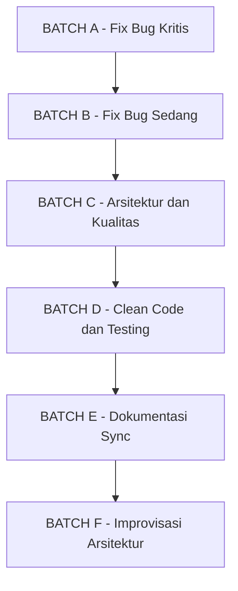
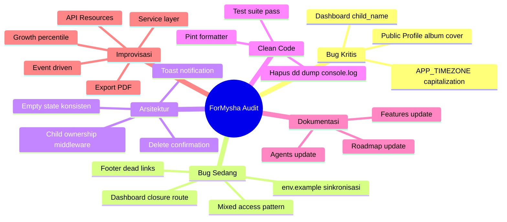

# ForMysha — Phase 3 Quality Improvement Plan

**Tanggal:** 2026-08-07
**Status:** Draf — Menunggu Persetujuan

---

## Ringkasan Temuan

Setelah audit menyeluruh terhadap seluruh codebase, ditemukan **3 bug kritis**, **4 bug sedang**, dan **8+ item perbaikan kualitas** yang perlu ditangani secara berurutan.

---

## BATCH A — Fix Bug Kritis

### A1. Dashboard: `child_name` AttributeError

**File:** `resources/views/dashboard.blade.php`
**Severity:** CRITIS — Menyebabkan error/blank pada bagian Timeline, Events, dan Diary di dashboard

**Masalah:**
Blade template mengakses `$timeline['child_name']`, `$event['child_name']`, `$diary['child_name']` — tetapi atribut `child_name` TIDAK ADA di model Timeline, Event, maupun Diary. Eloquent memang mengimplementasikan ArrayAccess, tetapi hanya untuk kolom/atribut yang benar-benar ada.

**Line yang terpengaruh:**
- Line 92: `$timeline['child_name']` → harusnya `$timeline->child->name`
- Line 123: `$event['child_name']` → harusnya `$event->child->name`
- Line 154: `$diary['child_name']` → harusnya `$diary->child->name`

**Fix:**
Ganti semua referensi `child_name` dengan akses relasi `->child->name`. Sekaligus standarisasi ke object access (`$timeline->title` bukan `$timeline['title']`) untuk konsistensi.

**Catatan:** `$diary['mood_label']` AMAN karena Diary model punya accessor `getMoodLabelAttribute()`.

---

### A2. Public Profile: `$album->cover` AttributeError

**File:** `resources/views/public/profile.blade.php:134`
**Severity:** CRITIS — Galeri publik tidak menampilkan gambar album

**Masalah:**
View menggunakan `$album->cover` tetapi field di Album model adalah `cover_photo`.

**Fix:**
- Line 134: `$album->cover` → `$album->cover_photo`
- Line 135: `$album->cover` → `$album->cover_photo`

---

### A3. `.env` APP_TIMEZONE Capitalization

**File:** `.env:6`
**Severity:** CRITIS — PHP DateTimeZone akan error dengan `Asia/jakarta`

**Masalah:**
`APP_TIMEZONE=Asia/jakarta` — huruf 'j' harusnya kapital `Asia/Jakarta`

**Fix:**
```
APP_TIMEZONE=Asia/Jakarta
```

---

## BATCH B — Fix Bug Sedang

### B1. `.env.example` Sinkronisasi

**File:** `.env.example`

**Masalah:**
- Missing `APP_TIMEZONE` line
- Default berbeda dari `.env` aktual: `SESSION_DRIVER=database` vs `redis`, `QUEUE_CONNECTION=database` vs `redis`, `CACHE_STORE=database` vs `redis`

**Fix:**
- Tambahkan `APP_TIMEZONE=Asia/Jakarta` setelah `APP_FAKER_LOCALE`
- Sinkronkan defaults agar lebih dekat dengan produksi: `SESSION_DRIVER=redis`, `QUEUE_CONNECTION=redis`, `CACHE_STORE=redis`
- Tambahkan REDIS_PREFIX jika diperlukan

---

### B2. Welcome Page Footer Dead Links

**File:** `resources/views/welcome.blade.php:225-227`

**Masalah:**
3 tautan placeholder `href="#"`:
- Tentang Kami
- Kebijakan Privasi
- Syarat & Ketentuan

**Fix:**
Ganti href ke route yang sesuai. Buat halaman sederhana untuk masing-masing:
- `/tentang-kami` → route `pages.about`
- `/kebijakan-privasi` → route `pages.privacy`
- `/syarat-ketentuan` → route `pages.terms`

Buat controller `PageController` dengan 3 invokable methods atau 3 closure routes sederhana dengan view placeholder.

---

### B3. Dashboard Route: Closure → Controller

**File:** `routes/web.php:27-70`

**Masalah:**
Dashboard menggunakan closure route (~40 baris logika) alih-alih controller. Ini melanggar konvensi MVC dan sulit di-test.

**Fix:**
1. Buat `app/Http/Controllers/DashboardController.php`
2. Pindahkan logika dari closure ke `index()` method
3. Update `routes/web.php` line 27: `Route::get('/dashboard', [DashboardController::class, 'index'])`
4. Hapus import model yang tidak perlu di routes/web.php (`Diary`, `Event`, `Growth`, `HealthRecord`, `Timeline`)

---

### B4. Dashboard: Standarisasi Akses Object

**File:** `resources/views/dashboard.blade.php`

**Masalah:**
Mixed access pattern — bagian Timeline/Events/Diaries pakai array access, bagian Growth/Health pakai object access.

**Fix:**
Standarisasi ke object access di seluruh bagian:
- `$timeline['child_id']` → `$timeline->child_id`
- `$timeline['title']` → `$timeline->title`
- `$timeline['event_date']` → `$timeline->event_date`
- `$event['child_id']` → `$event->child_id`
- `$event['id']` → `$event->id`
- `$event['title']` → `$event->title`
- `$event['event_date']` → `$event->event_date`
- `$diary['child_id']` → `$diary->child_id`
- `$diary['id']` → `$diary->id`
- `$diary['title']` → `$diary->title`
- `$diary['mood_label']` → `$diary->mood_label`
- `$diary['diary_date']` → `$diary->diary_date`

---

## BATCH C — Arsitektur & Kualitas Kode

### C1. Child Ownership Middleware

**File baru:** `app/Http/Middleware/EnsureChildOwnership.php`
**File:** `bootstrap/app.php`, semua Controller yang akses Child

**Masalah:**
Setiap controller method melakukan inline check:
```php
abort_if($child->user_id !== $request->user()->id, 403);
```
Ini berulang di ~20+ method dan rentan terlewat.

**Fix:**
1. Buat middleware `EnsureChildOwnership` yang mengecek `$child->user_id === auth()->id()`
2. Daftarkan di `bootstrap/app.php` sebagai alias `child.ownership`
3. Terapkan di route level: `Route::middleware('child.ownership')`
4. Hapus inline abort_if dari semua controller

**Alternatif (simpler):** Gunakan Route Model Binding dengan custom resolver di `AppServiceProvider` yang auto-checks ownership.

---

### C2. Toast Notification System

**File baru:** `resources/views/components/toast.blade.php`
**File:** `resources/views/layouts/app.blade.php`
**File:** `resources/js/app.js`

**Masalah:**
Tidak ada feedback setelah operasi CRUD (create/update/delete). User tidak tahu operasi berhasil.

**Fix:**
1. Buat component `x-toast` dengan Alpine.js
2. Flash session key: `success`, `error`, `warning`
3. Tambahkan di layout `app.blade.php`
4. Gunakan `->with('success', '...')` di redirect semua controller

---

### C3. Delete Confirmation Modal Konsisten

**File:** Semua view yang punya tombol hapus

**Masalah:**
Beberapa modul pakai modal konfirmasi, beberapa langsung hapus.

**Fix:**
1. Buat component `x-confirm-delete` dengan Alpine.js modal
2. Terapkan di semua halaman yang punya tombol hapus
3. Pastikan semua form delete pakai method spoofing `@method('DELETE')`

---

### C4. Empty State Konsisten

**File:** Semua index views

**Masalah:**
Beberapa halaman sudah pakai `x-empty-state`, beberapa belum.

**Fix:**
Pastikan semua index views (timeline, album, diary, document, calendar, growth, health, family) menggunakan component `x-empty-state` dengan emoji, pesan, dan tombol "Tambah Pertama" yang konsisten.

---

## BATCH D — Clean Code & Testing

### D1. Audit Kode Bersih

- Cari dan hapus semua `dd()`, `dump()`, `var_dump()` di production code
- Cari dan hapus semua `console.log()` di JS
- Cari dan hapus unused imports di PHP
- Cek tidak ada `TODO` atau `FIXME` yang terlupakan

### D2. Jalankan Pint Formatter

```bash
.\vendor\bin\pint --dirty --format agent
```

### D3. Jalankan Test Suite

```bash
php artisan test --compact
```

Pastikan semua 299+ tests PASS. Jika ada yang fail, fix segera.

---

## BATCH E — Dokumentasi Sync

### E1. Update FEATURES.md
- Tandai bug fixes yang sudah diperbaiki
- Update status modul jika ada perubahan

### E2. Update ROADMAP.md
- Tambahkan Phase 3 Quality Improvement
- Update jumlah test jika berubah

### E3. Update AGENTS.md
- Tambahkan rule baru: "Dashboard data access pattern"
- Tambahkan rule: "Middleware for child ownership"
- Update testing conventions jika perlu

---

## BATCH F — Saran Arsitektur & Improvisasi

### F1. Saran Arsitektur

1. **Service Layer Pattern** — Pindahkan logika bisnis dari controller ke service classes (e.g., `DashboardService`, `TimelineService`). Controller jadi thin, testable, dan reusable.

2. **API Resources** — Untuk phase API integration, siapkan Eloquent API Resources sekarang untuk setiap model. Ini memudahkan migrasi ke API-first architecture.

3. **Event-Driven Architecture** — Gunakan Laravel Events untuk notifikasi, audit trail, dan activity logging. Contoh: `ChildCreated`, `TimelinePosted`, `HealthRecordAdded`.

4. **Repository Pattern** — Untuk query kompleks (search, dashboard aggregation), gunakan repository classes agar query logic terpusat.

5. **Blade Component Library** — Standarisasi semua UI components. Buat `x-data-table`, `x-stat-card`, `x-timeline-card` dsb. untuk konsistensi visual.

### F2. Ide Fitur Tingkat Lanjut

1. **Activity Feed** — Timeline aktivitas yang menunjukkan semua perubahan terakhir (siapa yang menambah apa, kapan).

2. **Export PDF** — Export profil anak, timeline, atau seluruh data ke PDF yang indah.

3. **Print-Friendly View** — View khusus untuk cetak (akta, rapor, kartu keluarga digital).

4. **Data Import** — Import dari Google Photos, iCloud, atau format CSV/JSON.

5. **Milestone Tracker** — Tracking milestone perkembangan anak (gigi pertama, langkah pertama, kata pertama).

6. **Birthday Countdown Widget** — Widget hitung mundur ulang tahun di dashboard.

7. **Growth Percentile Chart** — Grafik pertumbuhan dibandingkan standar WHO.

8. **Family Tree Visual** — Visualisasi pohon keluarga secara interaktif.

---

## Urutan Eksekusi



**Prioritas Mutlak:** BATCH A harus selesai SEBELUM batch lainnya karena ini bug yang menyebabkan error di production.

---

## Diagram Temuan



---

## Catatan Penting

- Semua perubahan harus di-test menggunakan `php artisan test --compact` setelah setiap batch
- Run `vendor/bin/pint --dirty --format agent` setelah setiap perubahan PHP
- Semua UI text tetap dalam Bahasa Indonesia
- Ikuti konvensi yang sudah ada: `x-app-layout`, `x-empty-state`, `x-modal`, dll
- Route safety: auth routes SEBELUM catch-all route
- Child authorization: setiap akses child HARUS verifikasi ownership
