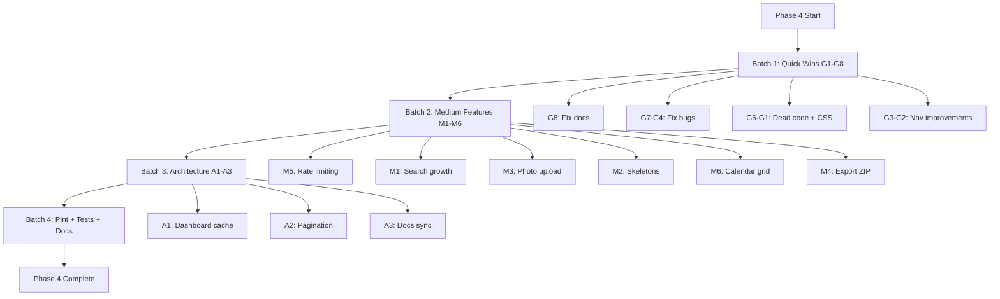

# Phase 4 — Comprehensive Improvement Plan

**Tanggal:** 2026-08-07
**Status:** Draft — Menunggu Persetujuan

---

## Hasil Audit

Setelah audit menyeluruh terhadap seluruh kode, views, routes, controllers, models, dan dokumentasi proyek ForMysha, berikut temuan-temuan yang dikategorikan berdasarkan prioritas.

---

## 🔴 Quick Wins — Bug & Dead Code (G1–G8)

### G1: Welcome Page CSS Fallback Rusak

**Masalah:** `welcome.blade.php` menggunakan CSS classes kustom (`btn-primary`, `btn-secondary`, `card-hover`, `text-gradient-brand`, `animate-fade-in`, `animate-slide-up`, `shadow-soft-md`, `shadow-soft-lg`) yang didefinisikan di `resources/css/app.css` via Tailwind `@apply`. Ketika Vite build tidak tersedia, fallback `<style>` hanya punya reset dasar — semua CTA buttons dan card styling hilang.

**Solusi:** Tambahkan CSS fallback yang memuat semua custom classes yang digunakan welcome page ke blok `<style>` di fallback section.

**File:** `resources/views/welcome.blade.php` (baris 21-26)

---

### G2: Mobile Bottom Nav Hanya Tampilkan 5 dari 9 Modul

**Masalah:** `child-nav.blade.php` line 39 menggunakan `array_slice($modules, 0, 5)` — modul Dokumen, Kalender, Keluarga, dan 1 lainnya tersembunyi di mobile tanpa akses.

**Solusi:** Tambahkan tombol "Lainnya" (⋯) dengan dropdown/x-menu untuk modul yang tersembunyi, atau gunakan horizontal scroll.

**File:** `resources/views/components/child-nav.blade.php`

---

### G3: Bottom Nav Overlap Konten

**Masalah:** `child-nav.blade.php` mobile bottom nav (fixed, z-50) menutupi konten di bagian bawah halaman. CSS class `.has-bottom-nav` sudah ada di `resources/css/app.css` line 70-72 tapi tidak pernah dipakai.

**Solusi:** Tambahkan class `has-bottom-nav` ke layout wrapper di semua child-related pages, atau tambahkan padding-bottom ke body/content area saat child-nav aktif.

**File:** Semua views yang menggunakan `<x-child-nav>` (growth, health, timeline, diaries, albums, documents, calendar, family index views)

---

### G4: Dashboard Growth Items Tidak Bisa Diklik

**Masalah:** Di `dashboard.blade.php` line 181, growth items menggunakan `<div>` bukan `<a>` — tidak bisa diklik seperti section timeline, events, diaries, dan health yang semuanya pakai `<a>`.

**Solusi:** Bungkus growth items dengan `<a href="{{ route('growth.index', $growth->child_id) }}">` untuk konsistensi.

**File:** `resources/views/dashboard.blade.php` (baris 180-196)

---

### G5: Child Show Page Tidak Pakai child-nav

**Masalah:** `children/show.blade.php` tidak menggunakan komponen `<x-child-nav>` — membuat navigasi inkonsisten dibanding semua modul lain (growth, health, timeline, dll) yang pakai sidebar/bottom-nav.

**Solusi:** Tambahkan `<x-child-nav :child="$child" />` ke children/show layout dan buat layout 2-column dengan sidebar.

**File:** `resources/views/children/show.blade.php`

---

### G6: Dead Code clearCache() No-Op Calls

**Masalah:** 9 controllers memanggil `$this->dashboardService->clearCache($user)` setelah store/update/destroy, tapi method-nya no-op. Ini dead code yang menambah overhead (service instantiation + method call tanpa efek).

**Solusi:** Hapus semua `clearCache()` calls dari controllers, atau implement proper caching di DashboardService.

**Files:** `ChildController`, `GrowthController`, `HealthController`, `TimelineController`, `DiaryController`, `AlbumController`, `DocumentController`, `CalendarController`, `FamilyMemberController`

---

### G7: Health Index Filter Link Konsistensi

**Masalah:** Di `health/index.blade.php` line 45, filter link menggunakan `$child->slug` sebagai route parameter: `route('health.index', array_merge(['child' => $child->slug], ...))`. View lain menggunakan `$child` model langsung. Meskipun route model binding bisa resolve slug, ini tidak konsisten.

**Solusi:** Ganti `$child->slug` dengan `$child` model untuk konsistensi.

**File:** `resources/views/health/index.blade.php` (baris 45)

---

### G8: ROADMAP.md Assertion Count Salah

**Masalah:** `ROADMAP.md` line 516 menulis "Total: 299 tests, 634 assertions" tapi aktualnya 633 assertions.

**Solusi:** Update ke "299 tests, 633 assertions".

**File:** `ROADMAP.md` (baris 516)

---

## 🟡 Medium Priority — UX Improvements (M1–M6)

### M1: Search Tidak Mencakup Growth Records

**Masalah:** Pencarian hanya mencakup Timeline, Diary, Documents, Health — tidak termasuk Growth records (tinggi badan, berat badan).

**Solusi:**
1. Tambahkan query Growth di `SearchController::index()`
2. Tambahkan filter tab "Pertumbuhan" di `search/index.blade.php`
3. Tambahkan badge warna untuk modul Growth

**Files:** `app/Http/Controllers/SearchController.php`, `resources/views/search/index.blade.php`

---

### M2: Loading Skeleton States

**Masalah:** Tidak ada loading indicator saat data dimuat — user melihat konten kosong sebelum data muncul.

**Solusi:** Buat komponen `<x-loading-skeleton>` dan terapkan di dashboard cards, index pages, dan show pages.

**Files:** `resources/views/components/loading-skeleton.blade.php` (baru), `resources/views/dashboard.blade.php`, index views

---

### M3: Photo Upload di Child Create

**Masalah:** Form create child hanya bisa input teks. Upload foto hanya tersedia di form edit — padahal ini UX gap yang membuat flow tidak natural.

**Solusi:**
1. Tambah field `photo` ke `StoreChildRequest` dengan rules `nullable|image|max:2048`
2. Handle file upload di `ChildController::store()` dengan Storage
3. Tambah upload field di `children/create.blade.php`

**Files:** `app/Http/Requests/StoreChildRequest.php`, `app/Http/Controllers/ChildController.php`, `resources/views/children/create.blade.php`

---

### M4: Export ZIP (Bulk Download)

**Masalah:** Fitur "Export ZIP" disebutkan di FEATURES.md tapi belum diimplementasi.

**Solusi:**
1. Buat `ExportService::exportChildZip()` yang menggabungkan profil, kesehatan, pertumbuhan PDF + foto/gambar ke dalam ZIP
2. Tambah route `export.zip` di `routes/web.php`
3. Tambah tombol "Export Semua" di child show page
4. Rate limit karena operasi berat

**Files:** `app/Services/ExportService.php`, `app/Http/Controllers/ExportController.php`, `routes/web.php`

---

### M5: Rate Limiting Export PDF

**Masalah:** Export PDF routes tidak memiliki rate limiting — bisa disalahgunakan untuk DoS.

**Solusi:** Tambahkan `throttle:5,1` middleware ke export routes (maks 5 request per menit).

**File:** `routes/web.php` (baris 120-122)

---

### M6: Calendar Monthly Grid View

**Masalah:** Calendar hanya memiliki list view — tidak ada visual monthly calendar grid.

**Solusi:**
1. Buat komponen calendar grid Alpine.js yang menampilkan hari-hari dalam bulan
2. Tambahkan toggle view (list/grid) di calendar index
3. Tampilkan event dots di tanggal yang ada event

**Files:** `resources/views/calendar/index.blade.php`, `resources/views/components/calendar-grid.blade.php` (baru)

---

## 🔵 Architecture — Long-term Improvements (A1–A3)

### A1: Dashboard Caching (Proper Implementation)

**Masalah:** Caching dihapus karena Eloquent Collection serialization error. DashboardService `clearCache()` no-op.

**Solusi:**
1. Simpan data sebagai array (bukan Eloquent objects) di cache
2. Query ulang dan serialize ke plain array sebelum caching
3. Kembalikan `clearCache()` ke fungsi aktif

**File:** `app/Services/DashboardService.php`

---

### A2: Pagination Konsisten

**Masalah:** Beberapa index views mungkin tidak memiliki pagination yang konsisten.

**Solusi:** Audit semua index views dan pastikan menggunakan `->paginate()` dengan `{{ $items->links() }}`.

**Files:** Semua `*Controller::index()` dan `*/index.blade.php`

---

### A3: Update Dokumentasi

**Solusi:** Update `FEATURES.md`, `ROADMAP.md`, dan `AGENTS.md` dengan semua perubahan baru termasuk child-selector, search growth, export ZIP, dll.

**Files:** `FEATURES.md`, `ROADMAP.md`, `AGENTS.md`

---

## Urutan Eksekusi

```
Phase 4 Execution Order
═══════════════════════

Batch 1: Quick Wins (Ringan)
├── G8: Fix ROADMAP.md assertion count
├── G7: Fix health/index filter link
├── G4: Dashboard growth items clickable
├── G6: Remove dead clearCache() calls
├── G1: Welcome page CSS fallback
├── G3: Bottom nav padding
├── G5: Add child-nav to child show
└── G2: Mobile bottom nav overflow menu

Batch 2: Medium Features
├── M5: Rate limiting export routes
├── M1: Search + Growth module
├── M3: Photo upload on child create
├── M2: Loading skeleton component
├── M6: Calendar grid view
└── M4: Export ZIP

Batch 3: Architecture
├── A1: Dashboard caching
├── A2: Pagination audit
└── A3: Documentation sync

Batch 4: Final
├── Run Pint
├── Run full test suite
└── Update todos
```

---

## Diagram Alur



---

## Risiko & Mitigasi

| Risiko | Dampak | Mitigasi |
|--------|--------|----------|
| Welcome page CSS fallback kurang lengkap | Landing page rusak | Test tanpa Vite build |
| Bottom nav overlap konten | UX jelek di mobile | Test di Chrome DevTools mobile |
| Search growth query lambat | Slow search | Gunakan index + select limit |
| Export ZIP timeout | User frustrated | Set max execution time + progress |
| Dashboard cache serialization | Error seperti sebelumnya | Simpan sebagai array, bukan objects |

---

## Estimasi

- **Batch 1 (Quick Wins):** 8 items — Ringan, mayoritas UI fixes
- **Batch 2 (Medium):** 6 items — Sedang, ada backend + frontend
- **Batch 3 (Architecture):** 3 items — Kompleks, perlu hati-hati
- **Total:** 17 items improvement

---

## Catatan Penting

1. **JANGAN** mengubah migrasi yang sudah running di production
2. Semua perubahan harus passing tests (299 tests, 633 assertions)
3. Jalankan `.\vendor\bin\pint --dirty --format agent` setelah setiap batch
4. Update `FEATURES.md` dan `ROADMAP.md` secara real-time
5. Pastikan responsive design di Mobile 320px+, Tablet 768px+, Desktop 1024px+
