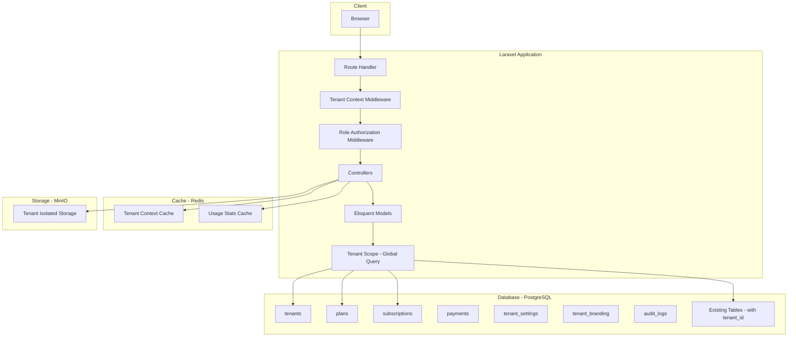
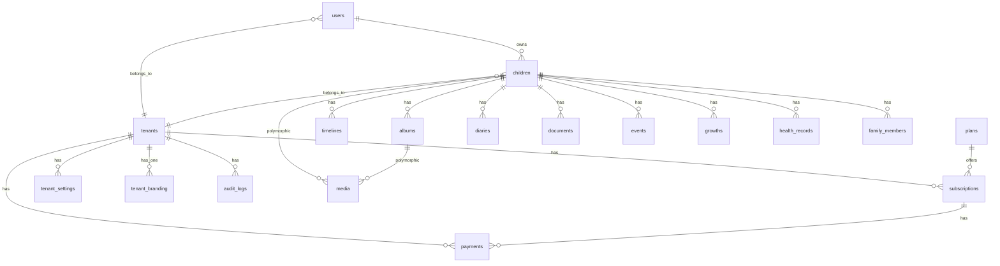
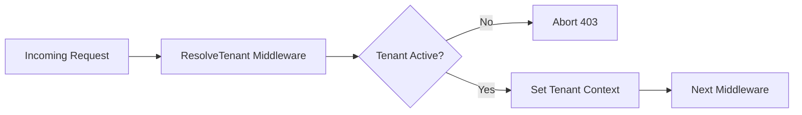
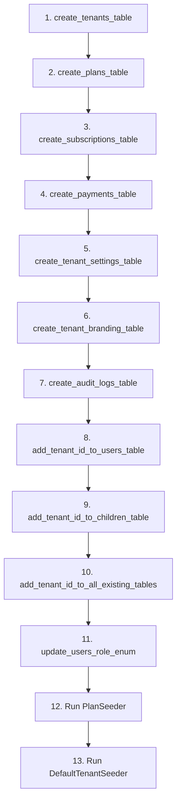
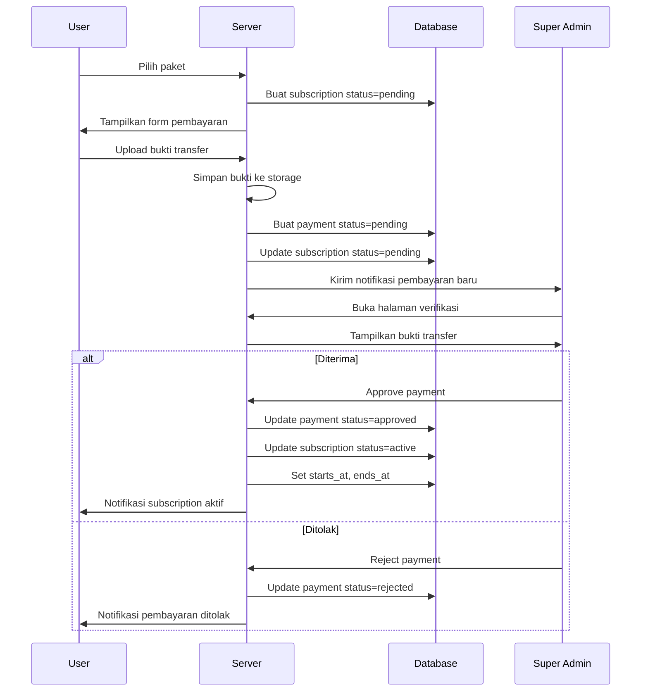

# Phase 4 — SaaS Architecture for ForMysha

**Tanggal:** 2026-08-07
**Status:** Draft — Menunggu Persetujuan
**Tech Stack:** Laravel 12, Blade, Livewire, Alpine.js, Tailwind CSS, PostgreSQL, Redis, MinIO

---

## Ringkasan Eksekutif

Phase 4 mengubah ForMysha dari aplikasi single-tenant menjadi platform **SaaS** multi-tenant. Pendekatan yang digunakan adalah **shared database, shared schema** (column-based tenancy) tanpa package eksternal — custom implementation yang ringan dan sesuai skala MVP.

**Prinsip Desain:**
- Tanpa package eksternal (no stancl/tenancy)
- Tenant context via middleware + request singleton
- `tenant_id` nullable di semua tabel existing untuk backward compatibility
- Soft deletes untuk tenants, plans, subscriptions
- Manual transfer billing (BRI, JAGO, BTN, BSI)
- Role-based access: super_admin, tenant_admin, member

---

## Arsitektur Tingkat Tinggi



---

## 1. Database Schema

### 1.1 Tabel Baru

#### `tenants`
```sql
CREATE TABLE tenants (
    id UUID PRIMARY KEY DEFAULT gen_random_uuid(),
    name VARCHAR(255) NOT NULL,
    slug VARCHAR(255) UNIQUE NOT NULL,
    domain VARCHAR(255) NULL,
    logo VARCHAR(255) NULL,
    is_active BOOLEAN DEFAULT true,
    settings JSONB NULL,
    created_at TIMESTAMP NULL,
    updated_at TIMESTAMP NULL,
    deleted_at TIMESTAMP NULL
);

CREATE INDEX idx_tenants_slug ON tenants(slug);
CREATE INDEX idx_tenants_domain ON tenants(domain);
CREATE INDEX idx_tenants_is_active ON tenants(is_active);
```

**Kolom:**
| Kolom | Tipe | Nullable | Default | Keterangan |
|-------|------|----------|---------|------------|
| id | UUID | NO | gen_random_uuid() | Primary key |
| name | VARCHAR(255) | NO | - | Nama organisasi/tenant |
| slug | VARCHAR(255) | NO | - | URL slug unik |
| domain | VARCHAR(255) | YES | NULL | Custom domain (opsional) |
| logo | VARCHAR(255) | YES | NULL | Path logo tenant |
| is_active | BOOLEAN | NO | true | Status aktif/nonaktif |
| settings | JSONB | YES | NULL | Pengaturan fleksibel |
| created_at | TIMESTAMP | YES | - | Created timestamp |
| updated_at | TIMESTAMP | YES | - | Updated timestamp |
| deleted_at | TIMESTAMP | YES | NULL | Soft delete timestamp |

---

#### `plans`
```sql
CREATE TABLE plans (
    id SERIAL PRIMARY KEY,
    name VARCHAR(255) NOT NULL,
    slug VARCHAR(255) UNIQUE NOT NULL,
    description TEXT NULL,
    price_monthly INTEGER NOT NULL DEFAULT 0,
    price_yearly INTEGER NULL,
    max_children INTEGER NOT NULL DEFAULT 1,
    max_photos INTEGER NOT NULL DEFAULT 50,
    max_videos INTEGER NOT NULL DEFAULT 10,
    max_storage_mb INTEGER NOT NULL DEFAULT 500,
    max_family_members INTEGER NULL DEFAULT 5,
    max_export_per_day INTEGER NOT NULL DEFAULT 3,
    features JSONB NULL,
    is_active BOOLEAN DEFAULT true,
    sort_order INTEGER DEFAULT 0,
    created_at TIMESTAMP NULL,
    updated_at TIMESTAMP NULL,
    deleted_at TIMESTAMP NULL
);

CREATE INDEX idx_plans_slug ON plans(slug);
CREATE INDEX idx_plans_is_active ON plans(is_active);
```

**Kolom:**
| Kolom | Tipe | Nullable | Default | Keterangan |
|-------|------|----------|---------|------------|
| id | SERIAL | NO | auto | Primary key |
| name | VARCHAR(255) | NO | - | Nama paket |
| slug | VARCHAR(255) | NO | - | URL slug unik |
| description | TEXT | YES | NULL | Deskripsi paket |
| price_monthly | INTEGER | NO | 0 | Harga per bulan (dalam Rupiah) |
| price_yearly | INTEGER | YES | NULL | Harga per tahun (dalam Rupiah) |
| max_children | INTEGER | NO | 1 | Batas jumlah anak |
| max_photos | INTEGER | NO | 50 | Batas jumlah foto |
| max_videos | INTEGER | NO | 10 | Batas jumlah video |
| max_storage_mb | INTEGER | NO | 500 | Batas storage (MB) |
| max_family_members | INTEGER | YES | 5 | Batas anggota keluarga per anak |
| max_export_per_day | INTEGER | NO | 3 | Batas export per hari |
| features | JSONB | YES | NULL | Daftar fitur JSON |
| is_active | BOOLEAN | NO | true | Apakah paket tersedia |
| sort_order | INTEGER | NO | 0 | Urutan tampilan |
| created_at | TIMESTAMP | YES | - | Created timestamp |
| updated_at | TIMESTAMP | YES | - | Updated timestamp |
| deleted_at | TIMESTAMP | YES | NULL | Soft delete timestamp |

---

#### `subscriptions`
```sql
CREATE TABLE subscriptions (
    id SERIAL PRIMARY KEY,
    tenant_id UUID NOT NULL REFERENCES tenants(id) ON DELETE CASCADE,
    plan_id INTEGER NOT NULL REFERENCES plans(id) ON DELETE RESTRICT,
    status VARCHAR(20) NOT NULL DEFAULT 'inactive',
    starts_at TIMESTAMP NULL,
    ends_at TIMESTAMP NULL,
    trial_ends_at TIMESTAMP NULL,
    cancelled_at TIMESTAMP NULL,
    created_at TIMESTAMP NULL,
    updated_at TIMESTAMP NULL,
    deleted_at TIMESTAMP NULL
);

CREATE INDEX idx_subscriptions_tenant_id ON subscriptions(tenant_id);
CREATE INDEX idx_subscriptions_plan_id ON subscriptions(plan_id);
CREATE INDEX idx_subscriptions_status ON subscriptions(status);
CREATE INDEX idx_subscriptions_ends_at ON subscriptions(ends_at);
```

**Kolom:**
| Kolom | Tipe | Nullable | Default | Keterangan |
|-------|------|----------|---------|------------|
| id | SERIAL | NO | auto | Primary key |
| tenant_id | UUID | NO | - | FK ke tenants |
| plan_id | INTEGER | NO | - | FK ke plans |
| status | VARCHAR(20) | NO | inactive | Status: inactive, pending, active, past_due, cancelled |
| starts_at | TIMESTAMP | YES | NULL | Tanggal mulai aktif |
| ends_at | TIMESTAMP | YES | NULL | Tanggal berakhir |
| trial_ends_at | TIMESTAMP | YES | NULL | Tanggal berakhir masa trial |
| cancelled_at | TIMESTAMP | YES | NULL | Tanggal pembatalan |
| created_at | TIMESTAMP | YES | - | Created timestamp |
| updated_at | TIMESTAMP | YES | - | Updated timestamp |
| deleted_at | TIMESTAMP | YES | NULL | Soft delete timestamp |

**Status Enum:**
- `inactive` — Belum pernah aktif
- `pending` — Menunggu verifikasi pembayaran
- `active` — Aktif dan berlaku
- `past_due` — Pembayaran terlambat
- `cancelled` — Dibatalkan

---

#### `payments`
```sql
CREATE TABLE payments (
    id SERIAL PRIMARY KEY,
    subscription_id INTEGER NOT NULL REFERENCES subscriptions(id) ON DELETE CASCADE,
    tenant_id UUID NOT NULL REFERENCES tenants(id) ON DELETE CASCADE,
    amount INTEGER NOT NULL,
    currency VARCHAR(3) NOT NULL DEFAULT 'IDR',
    payment_method VARCHAR(20) NOT NULL,
    bank_name VARCHAR(50) NULL,
    bank_account VARCHAR(50) NULL,
    account_holder VARCHAR(255) NULL,
    proof_path VARCHAR(255) NULL,
    status VARCHAR(20) NOT NULL DEFAULT 'pending',
    notes TEXT NULL,
    verified_by BIGINT NULL,
    verified_at TIMESTAMP NULL,
    paid_at TIMESTAMP NULL,
    created_at TIMESTAMP NULL,
    updated_at TIMESTAMP NULL
);

CREATE INDEX idx_payments_subscription_id ON payments(subscription_id);
CREATE INDEX idx_payments_tenant_id ON payments(tenant_id);
CREATE INDEX idx_payments_status ON payments(status);
```

**Kolom:**
| Kolom | Tipe | Nullable | Default | Keterangan |
|-------|------|----------|---------|------------|
| id | SERIAL | NO | auto | Primary key |
| subscription_id | INTEGER | NO | - | FK ke subscriptions |
| tenant_id | UUID | NO | - | FK ke tenants |
| amount | INTEGER | NO | - | Jumlah pembayaran (Rupiah) |
| currency | VARCHAR(3) | NO | IDR | Mata uang |
| payment_method | VARCHAR(20) | NO | - | Metode: bank_transfer |
| bank_name | VARCHAR(50) | YES | - | Nama bank: BRI, JAGO, BTN, BSI |
| bank_account | VARCHAR(50) | YES | - | Nomor rekening tujuan |
| account_holder | VARCHAR(255) | YES | - | Nama pemegang rekening |
| proof_path | VARCHAR(255) | YES | - | Path bukti transfer |
| status | VARCHAR(20) | NO | pending | Status: pending, approved, rejected |
| notes | TEXT | YES | - | Catatan admin/pengguna |
| verified_by | BIGINT | YES | - | FK ke users (admin) |
| verified_at | TIMESTAMP | YES | - | Waktu verifikasi |
| paid_at | TIMESTAMP | YES | - | Waktu pembayaran |
| created_at | TIMESTAMP | YES | - | Created timestamp |
| updated_at | TIMESTAMP | YES | - | Updated timestamp |

**Payment Status:**
- `pending` — Menunggu verifikasi
- `approved` — Diverifikasi dan diterima
- `rejected` — Ditolak oleh admin

**Bank Accounts:**
| Bank | Nomor Rekening | Atas Nama |
|------|----------------|-----------|
| BRI | 2118 0100 8728 508 | WAHYU DEDIK DWI ASTONO |
| JAGO | 106818913479 | WAHYU DEDIK DWI ASTONO |
| BTN | 5901500292405 | WAHYU DEDIK DWI ASTONO |
| BSI | 7243220925 | WAHYU DEDIK DWI ASTONO |

---

#### `tenant_settings`
```sql
CREATE TABLE tenant_settings (
    id SERIAL PRIMARY KEY,
    tenant_id UUID NOT NULL REFERENCES tenants(id) ON DELETE CASCADE,
    key VARCHAR(255) NOT NULL,
    value TEXT NULL,
    type VARCHAR(20) NOT NULL DEFAULT 'string',
    created_at TIMESTAMP NULL,
    updated_at TIMESTAMP NULL,

    UNIQUE(tenant_id, key)
);

CREATE INDEX idx_tenant_settings_tenant_id ON tenant_settings(tenant_id);
```

**Kolom:**
| Kolom | Tipe | Nullable | Default | Keterangan |
|-------|------|----------|---------|------------|
| id | SERIAL | NO | auto | Primary key |
| tenant_id | UUID | NO | - | FK ke tenants |
| key | VARCHAR(255) | NO | - | Nama setting |
| value | TEXT | YES | NULL | Nilai setting |
| type | VARCHAR(20) | NO | string | Tipe: string, integer, boolean, json |

---

#### `tenant_branding`
```sql
CREATE TABLE tenant_branding (
    id SERIAL PRIMARY KEY,
    tenant_id UUID UNIQUE NOT NULL REFERENCES tenants(id) ON DELETE CASCADE,
    organization_name VARCHAR(255) NULL,
    primary_color VARCHAR(7) NULL,
    secondary_color VARCHAR(7) NULL,
    accent_color VARCHAR(7) NULL,
    custom_css TEXT NULL,
    custom_domain VARCHAR(255) NULL,
    is_domain_verified BOOLEAN DEFAULT false,
    created_at TIMESTAMP NULL,
    updated_at TIMESTAMP NULL
);

CREATE INDEX idx_tenant_branding_tenant_id ON tenant_branding(tenant_id);
```

**Kolom:**
| Kolom | Tipe | Nullable | Default | Keterangan |
|-------|------|----------|---------|------------|
| id | SERIAL | NO | auto | Primary key |
| tenant_id | UUID | NO | - | FK ke tenants (unique) |
| organization_name | VARCHAR(255) | YES | - | Nama organisasi |
| primary_color | VARCHAR(7) | YES | - | Warna utama (#hex) |
| secondary_color | VARCHAR(7) | YES | - | Warna sekunder (#hex) |
| accent_color | VARCHAR(7) | YES | - | Warna aksen (#hex) |
| custom_css | TEXT | YES | NULL | CSS kustom (opsional) |
| custom_domain | VARCHAR(255) | YES | NULL | Custom domain |
| is_domain_verified | BOOLEAN | NO | false | Status verifikasi domain |
| created_at | TIMESTAMP | YES | - | Created timestamp |
| updated_at | TIMESTAMP | YES | - | Updated timestamp |

---

#### `audit_logs`
```sql
CREATE TABLE audit_logs (
    id BIGSERIAL PRIMARY KEY,
    tenant_id UUID NULL REFERENCES tenants(id) ON DELETE SET NULL,
    user_id BIGINT NULL REFERENCES users(id) ON DELETE SET NULL,
    event VARCHAR(255) NOT NULL,
    auditable_type VARCHAR(255) NULL,
    auditable_id BIGINT NULL,
    old_values JSONB NULL,
    new_values JSONB NULL,
    ip_address VARCHAR(45) NULL,
    user_agent TEXT NULL,
    created_at TIMESTAMP NULL
);

CREATE INDEX idx_audit_logs_tenant_id ON audit_logs(tenant_id);
CREATE INDEX idx_audit_logs_user_id ON audit_logs(user_id);
CREATE INDEX idx_audit_logs_event ON audit_logs(event);
CREATE INDEX idx_audit_logs_auditable ON audit_logs(auditable_type, auditable_id);
CREATE INDEX idx_audit_logs_created_at ON audit_logs(created_at);
```

---

### 1.2 Modifikasi Tabel Existing

Semua tabel existing mendapatkan kolom `tenant_id` yang **nullable** untuk backward compatibility. Data existing tanpa `tenant_id` tetap bisa diakses.

#### Migration: `add_tenant_id_to_children_table`
```sql
ALTER TABLE children ADD COLUMN tenant_id UUID NULL REFERENCES tenants(id) ON DELETE SET NULL;
CREATE INDEX idx_children_tenant_id ON children(tenant_id);
```

#### Migration: `add_tenant_id_to_timelines_table`
```sql
ALTER TABLE timelines ADD COLUMN tenant_id UUID NULL REFERENCES tenants(id) ON DELETE SET NULL;
CREATE INDEX idx_timelines_tenant_id ON timelines(tenant_id);
```

#### Migration: `add_tenant_id_to_media_table`
```sql
ALTER TABLE media ADD COLUMN tenant_id UUID NULL REFERENCES tenants(id) ON DELETE SET NULL;
CREATE INDEX idx_media_tenant_id ON media(tenant_id);
```

#### Migration: `add_tenant_id_to_albums_table`
```sql
ALTER TABLE albums ADD COLUMN tenant_id UUID NULL REFERENCES tenants(id) ON DELETE SET NULL;
CREATE INDEX idx_albums_tenant_id ON albums(tenant_id);
```

#### Migration: `add_tenant_id_to_diaries_table`
```sql
ALTER TABLE diaries ADD COLUMN tenant_id UUID NULL REFERENCES tenants(id) ON DELETE SET NULL;
CREATE INDEX idx_diaries_tenant_id ON diaries(tenant_id);
```

#### Migration: `add_tenant_id_to_documents_table`
```sql
ALTER TABLE documents ADD COLUMN tenant_id UUID NULL REFERENCES tenants(id) ON DELETE SET NULL;
CREATE INDEX idx_documents_tenant_id ON documents(tenant_id);
```

#### Migration: `add_tenant_id_to_events_table`
```sql
ALTER TABLE events ADD COLUMN tenant_id UUID NULL REFERENCES tenants(id) ON DELETE SET NULL;
CREATE INDEX idx_events_tenant_id ON events(tenant_id);
```

#### Migration: `add_tenant_id_to_growths_table`
```sql
ALTER TABLE growths ADD COLUMN tenant_id UUID NULL REFERENCES tenants(id) ON DELETE SET NULL;
CREATE INDEX idx_growths_tenant_id ON growths(tenant_id);
```

#### Migration: `add_tenant_id_to_health_records_table`
```sql
ALTER TABLE health_records ADD COLUMN tenant_id UUID NULL REFERENCES tenants(id) ON DELETE SET NULL;
CREATE INDEX idx_health_records_tenant_id ON health_records(tenant_id);
```

#### Migration: `add_tenant_id_to_family_members_table`
```sql
ALTER TABLE family_members ADD COLUMN tenant_id UUID NULL REFERENCES tenants(id) ON DELETE SET NULL;
CREATE INDEX idx_family_members_tenant_id ON family_members(tenant_id);
```

#### Migration: `add_tenant_id_to_notifications_table`
```sql
ALTER TABLE notifications ADD COLUMN tenant_id UUID NULL REFERENCES tenants(id) ON DELETE SET NULL;
CREATE INDEX idx_notifications_tenant_id ON notifications(tenant_id);
```

#### Migration: `add_tenant_id_to_users_table`
```sql
ALTER TABLE users ADD COLUMN tenant_id UUID NULL REFERENCES tenants(id) ON DELETE SET NULL;
CREATE INDEX idx_users_tenant_id ON users(tenant_id);
```

#### Migration: `update_users_role_enum_for_saaS`
```sql
-- PostgreSQL: tambah nilai enum baru
ALTER TABLE users ADD COLUMN role_new VARCHAR(20) DEFAULT 'parent';
UPDATE users SET role_new = role;
ALTER TABLE users DROP COLUMN role;
ALTER TABLE users RENAME COLUMN role_new TO role;
ALTER TABLE users ALTER COLUMN role SET DEFAULT 'parent';
-- Sekarang role bisa berisi: parent, guardian, admin, super_admin, tenant_admin
```

**Catatan:** Karena PostgreSQL enum tidak bisa ditambah langsung, kita konversi ke VARCHAR(20) yang lebih fleksibel untuk SaaS.

---

### 1.3 Ringkasan Semua Tabel Phase 4



---

## 2. Model Relationships

### 2.1 Model Baru

#### `App\Models\Tenant`
```php
namespace App\Models;

use Illuminate\Database\Eloquent\Model;
use Illuminate\Database\Eloquent\SoftDeletes;
use Illuminate\Database\Eloquent\Relations\HasMany;
use Illuminate\Database\Eloquent\Relations\HasOne;
use Illuminate\Database\Eloquent\Relations\HasManyThrough;

class Tenant extends Model
{
    use SoftDeletes;

    protected $fillable = [
        'name', 'slug', 'domain', 'logo',
        'is_active', 'settings',
    ];

    protected function casts(): array
    {
        return [
            'is_active' => 'boolean',
            'settings' => 'array',
        ];
    }

    // Relasi
    public function users(): HasMany { return $this->hasMany(User::class); }
    public function children(): HasMany { return $this->hasMany(Child::class); }
    public function subscriptions(): HasMany { return $this->hasMany(Subscription::class); }
    public function activeSubscription(): HasOne { ... } // status = active
    public function currentPlan(): HasManyThrough { ... }
    public function payments(): HasMany { return $this->hasMany(Payment::class); }
    public function settings(): HasMany { return $this->hasMany(TenantSetting::class); }
    public function branding(): HasOne { return $this->hasOne(TenantBranding::class); }
    public function auditLogs(): HasMany { return $this->hasMany(AuditLog::class); }

    // Methods
    public function isActive(): bool;
    public function hasActiveSubscription(): bool;
    public function canAddChild(): bool;
    public function canUploadPhoto(): bool;
    public function canUploadVideo(): bool;
    public function getStorageUsed(): int; // bytes
    public function getStorageLimit(): int; // bytes
    public function getChildCount(): int;
    public function getPhotoCount(): int;
    public function getVideoCount(): int;
}
```

#### `App\Models\Plan`
```php
namespace App\Models;

use Illuminate\Database\Eloquent\Model;
use Illuminate\Database\Eloquent\SoftDeletes;
use Illuminate\Database\Eloquent\Relations\HasMany;

class Plan extends Model
{
    use SoftDeletes;

    protected $fillable = [
        'name', 'slug', 'description',
        'price_monthly', 'price_yearly',
        'max_children', 'max_photos', 'max_videos', 'max_storage_mb',
        'max_family_members', 'max_export_per_day',
        'features', 'is_active', 'sort_order',
    ];

    protected function casts(): array
    {
        return [
            'price_monthly' => 'integer',
            'price_yearly' => 'integer',
            'max_children' => 'integer',
            'max_photos' => 'integer',
            'max_videos' => 'integer',
            'max_storage_mb' => 'integer',
            'max_family_members' => 'integer',
            'max_export_per_day' => 'integer',
            'features' => 'array',
            'is_active' => 'boolean',
            'sort_order' => 'integer',
        ];
    }

    public function subscriptions(): HasMany { ... }
    
    public function getPriceMonthlyFormatted(): string;
    public function getPriceYearlyFormatted(): string;
    public function getStorageFormatted(): string;
}
```

#### `App\Models\Subscription`
```php
namespace App\Models;

use Illuminate\Database\Eloquent\Model;
use Illuminate\Database\Eloquent\SoftDeletes;
use Illuminate\Database\Eloquent\Relations\BelongsTo;

class Subscription extends Model
{
    use SoftDeletes;

    const STATUS_INACTIVE = 'inactive';
    const STATUS_PENDING = 'pending';
    const STATUS_ACTIVE = 'active';
    const STATUS_PAST_DUE = 'past_due';
    const STATUS_CANCELLED = 'cancelled';

    protected $fillable = [
        'tenant_id', 'plan_id', 'status',
        'starts_at', 'ends_at', 'trial_ends_at', 'cancelled_at',
    ];

    protected function casts(): array
    {
        return [
            'starts_at' => 'datetime',
            'ends_at' => 'datetime',
            'trial_ends_at' => 'datetime',
            'cancelled_at' => 'datetime',
        ];
    }

    public function tenant(): BelongsTo { ... }
    public function plan(): BelongsTo { ... }
    public function payments(): HasMany { ... }

    public function isActive(): bool;
    public function isPending(): bool;
    public function isExpired(): bool;
    public function daysRemaining(): int;
    public function scopeActive($query);
    public function scopePending($query);
}
```

#### `App\Models\Payment`
```php
namespace App\Models;

use Illuminate\Database\Eloquent\Model;
use Illuminate\Database\Eloquent\Relations\BelongsTo;

class Payment extends Model
{
    const METHOD_BANK_TRANSFER = 'bank_transfer';
    const STATUS_PENDING = 'pending';
    const STATUS_APPROVED = 'approved';
    const STATUS_REJECTED = 'rejected';

    const BANKS = [
        'BRI' => ['account' => '2118 0100 8728 508', 'holder' => 'WAHYU DEDIK DWI ASTONO'],
        'JAGO' => ['account' => '106818913479', 'holder' => 'WAHYU DEDIK DWI ASTONO'],
        'BTN' => ['account' => '5901500292405', 'holder' => 'WAHYU DEDIK DWI ASTONO'],
        'BSI' => ['account' => '7243220925', 'holder' => 'WAHYU DEDIK DWI ASTONO'],
    ];

    protected $fillable = [
        'subscription_id', 'tenant_id', 'amount', 'currency',
        'payment_method', 'bank_name', 'bank_account', 'account_holder',
        'proof_path', 'status', 'notes',
        'verified_by', 'verified_at', 'paid_at',
    ];

    protected function casts(): array
    {
        return [
            'amount' => 'integer',
            'verified_at' => 'datetime',
            'paid_at' => 'datetime',
        ];
    }

    public function subscription(): BelongsTo { ... }
    public function tenant(): BelongsTo { ... }
    public function verifier(): BelongsTo { return $this->belongsTo(User::class, 'verified_by'); }

    public function getAmountFormatted(): string;
}
```

#### `App\Models\TenantSetting`
```php
namespace App\Models;

use Illuminate\Database\Eloquent\Model;

class TenantSetting extends Model
{
    protected $fillable = ['tenant_id', 'key', 'value', 'type'];
    
    public function tenant(): BelongsTo { ... }
}
```

#### `App\Models\TenantBranding`
```php
namespace App\Models;

use Illuminate\Database\Eloquent\Model;

class TenantBranding extends Model
{
    protected $fillable = [
        'tenant_id', 'organization_name',
        'primary_color', 'secondary_color', 'accent_color',
        'custom_css', 'custom_domain', 'is_domain_verified',
    ];

    protected function casts(): array
    {
        return ['is_domain_verified' => 'boolean'];
    }

    public function tenant(): BelongsTo { ... }
}
```

#### `App\Models\AuditLog`
```php
namespace App\Models;

use Illuminate\Database\Eloquent\Model;

class AuditLog extends Model
{
    const UPDATED_AT = null; // Audit logs tidak di-update

    protected $fillable = [
        'tenant_id', 'user_id', 'event',
        'auditable_type', 'auditable_id',
        'old_values', 'new_values',
        'ip_address', 'user_agent',
    ];

    protected function casts(): array
    {
        return [
            'old_values' => 'array',
            'new_values' => 'array',
        ];
    }

    public function tenant(): BelongsTo { ... }
    public function user(): BelongsTo { ... }
    public function auditable(): MorphTo { ... }
}
```

### 2.2 Modifikasi Model Existing

Semua model existing mendapatkan relasi ke `Tenant`:

```php
// Contoh untuk Child — pola yang sama untuk semua model
public function tenant(): BelongsTo
{
    return $this->belongsTo(Tenant::class);
}

// Tambahkan ke $fillable:
// 'tenant_id'

// Tambahkan ke casts:
// (tidak perlu — UUID string sudah default)
```

**Model yang perlu dimodifikasi:**

| Model | Relasi Baru | Kolom Baru di fillable |
|-------|-------------|----------------------|
| [`User`](app/Models/User.php) | `tenant()`, `currentSubscription()` | `tenant_id` |
| [`Child`](app/Models/Child.php) | `tenant()` | `tenant_id` |
| [`Timeline`](app/Models/Timeline.php) | `tenant()` | `tenant_id` |
| [`Media`](app/Models/Media.php) | `tenant()` | `tenant_id` |
| [`Album`](app/Models/Album.php) | `tenant()` | `tenant_id` |
| [`Diary`](app/Models/Diary.php) | `tenant()` | `tenant_id` |
| [`Document`](app/Models/Document.php) | `tenant()` | `tenant_id` |
| [`Event`](app/Models/Event.php) | `tenant()` | `tenant_id` |
| [`Growth`](app/Models/Growth.php) | `tenant()` | `tenant_id` |
| [`HealthRecord`](app/Models/HealthRecord.php) | `tenant()` | `tenant_id` |
| [`FamilyMember`](app/Models/FamilyMember.php) | `tenant()` | `tenant_id` |
| [`Notification`](app/Models/Notification.php) | `tenant()` | `tenant_id` |

---

## 3. Middleware Architecture

### 3.1 Tenant Context Middleware



```php
namespace App\Http\Middleware;

use App\Models\Tenant;
use App\Services\TenantContext;
use Closure;
use Illuminate\Http\Request;
use Symfony\Component\HttpFoundation\Response;

class ResolveTenant
{
    public function __construct(
        private TenantContext $tenantContext,
    ) {}

    public function handle(Request $request, Closure $next): Response
    {
        $tenant = $this->resolveTenant($request);

        if ($tenant && !$tenant->is_active) {
            abort(403, 'Akun tenant tidak aktif.');
        }

        $this->tenantContext->set($tenant);

        return $next($request);
    }

    private function resolveTenant(Request $request): ?Tenant
    {
        // 1. Cek route parameter
        if ($tenantId = $request->route('tenant')) {
            return Tenant::find($tenantId);
        }

        // 2. Cek subdomain
        $host = $request->getHost();
        return Tenant::where('domain', $host)->first();

        // 3. Cek session/header (untuk admin panel)
        // return $request->user()?->tenant;
    }
}
```

### 3.2 Tenant Context Service

```php
namespace App\Services;

use App\Models\Tenant;

class TenantContext
{
    private ?Tenant $tenant = null;

    public function set(?Tenant $tenant): void
    {
        $this->tenant = $tenant;
    }

    public function get(): ?Tenant
    {
        return $this->tenant;
    }

    public function getId(): ?string
    {
        return $this->tenant?->id;
    }

    public function isActive(): bool
    {
        return $this->tenant?->is_active ?? false;
    }
}
```

### 3.3 Tenant Scope (Global Query Builder)

```php
namespace App\Database\Scopes;

use Illuminate\Database\Eloquent\Builder;
use Illuminate\Database\Eloquent\Model;
use Illuminate\Database\Eloquent\Scope;
use App\Services\TenantContext;

class TenantScope implements Scope
{
    public function apply(Builder $builder, Model $model): void
    {
        $tenantId = app(TenantContext::class)->getId();

        if ($tenantId) {
            $builder->where('tenant_id', $tenantId);
        }
    }
}
```

**Implementasi di Model:**
```php
// Di setiap model yang memiliki tenant_id:
use App\Database\Scopes\TenantScope;

protected static function booted(): void
{
    static::addGlobalScope(new TenantScope);
}

// Untuk query tanpa scope (misal super admin):
$children = Child::withoutGlobalScope(TenantScope::class)->get();
```

### 3.4 Role & Permission Middleware

```php
namespace App\Http\Middleware;

use Closure;
use Illuminate\Http\Request;
use Symfony\Component\HttpFoundation\Response;

class EnsureRole
{
    public function handle(Request $request, Closure $next, string ...$roles): Response
    {
        $user = $request->user();

        if (!$user) {
            abort(401);
        }

        if (!in_array($user->role, $roles)) {
            abort(403, 'Anda tidak memiliki akses ke halaman ini.');
        }

        return $next($request);
    }
}
```

### 3.5 EnsureSuperAdmin Middleware

```php
class EnsureSuperAdmin
{
    public function handle(Request $request, Closure $next): Response
    {
        $user = $request->user();

        if (!$user || $user->role !== 'super_admin') {
            abort(403, 'Hanya super admin yang dapat mengakses halaman ini.');
        }

        return $next($request);
    }
}
```

### 3.6 EnsureTenantAdmin Middleware

```php
class EnsureTenantAdmin
{
    public function handle(Request $request, Closure $next): Response
    {
        $user = $request->user();

        if (!$user || !in_array($user->role, ['super_admin', 'tenant_admin'])) {
            abort(403, 'Hanya admin tenant yang dapat mengakses halaman ini.');
        }

        return $next($request);
    }
}
```

### 3.7 Subscription Check Middleware

```php
class EnsureActiveSubscription
{
    public function handle(Request $request, Closure $next): Response
    {
        $tenant = app(TenantContext::class)->get();

        if ($tenant && !$tenant->hasActiveSubscription()) {
            return redirect()->route('subscription.plans')
                ->with('warning', 'Anda perlu mengaktifkan paket berlangganan.');
        }

        return $next($request);
    }
}
```

### 3.8 Feature Limit Middleware

```php
class EnsureFeatureLimit
{
    public function handle(Request $request, Closure $next, string $feature): Response
    {
        $tenant = app(TenantContext::class)->get();

        if (!$tenant) {
            return $next($request);
        }

        $allowed = match ($feature) {
            'add_child' => $tenant->canAddChild(),
            'upload_photo' => $tenant->canUploadPhoto(),
            'upload_video' => $tenant->canUploadVideo(),
            default => true,
        };

        if (!$allowed) {
            return back()->with('error', "Batas fitur {$feature} telah tercapai. Silakan upgrade paket.");
        }

        return $next($request);
    }
}
```

### 3.9 Registrasi Middleware

Di [`bootstrap/app.php`](bootstrap/app.php):

```php
->withMiddleware(function (Middleware $middleware): void
{
    $middleware->alias([
        'child.ownership' => EnsureChildOwnership::class,
        'tenant' => ResolveTenant::class,
        'role' => EnsureRole::class,
        'super_admin' => EnsureSuperAdmin::class,
        'tenant_admin' => EnsureTenantAdmin::class,
        'active_subscription' => EnsureActiveSubscription::class,
        'feature_limit' => EnsureFeatureLimit::class,
    ]);
})
```

---

## 4. Route Structure

### 4.1 Super Admin Routes (`/super-admin`)

```php
Route::middleware(['auth', 'verified', 'super_admin'])->prefix('super-admin')->name('super_admin.')->group(function () {
    // Dashboard
    Route::get('/', [SuperAdminDashboardController::class, 'index'])->name('dashboard');

    // Tenant Management
    Route::resource('tenants', SuperAdminTenantController::class)->except(['show']);
    Route::get('/tenants/{tenant}', [SuperAdminTenantController::class, 'show'])->name('tenants.show');
    Route::patch('/tenants/{tenant}/toggle-status', [SuperAdminTenantController::class, 'toggleStatus'])->name('tenants.toggle-status');

    // Subscription Management
    Route::get('/subscriptions', [SuperAdminSubscriptionController::class, 'index'])->name('subscriptions.index');
    Route::get('/subscriptions/{subscription}', [SuperAdminSubscriptionController::class, 'show'])->name('subscriptions.show');

    // Payment Verification
    Route::get('/payments', [SuperAdminPaymentController::class, 'index'])->name('payments.index');
    Route::get('/payments/{payment}', [SuperAdminPaymentController::class, 'show'])->name('payments.show');
    Route::patch('/payments/{payment}/approve', [SuperAdminPaymentController::class, 'approve'])->name('payments.approve');
    Route::patch('/payments/{payment}/reject', [SuperAdminPaymentController::class, 'reject'])->name('payments.reject');

    // Plans Management
    Route::resource('plans', SuperAdminPlanController::class)->except(['show']);

    // Analytics
    Route::get('/analytics', [SuperAdminAnalyticsController::class, 'index'])->name('analytics.index');

    // Audit Logs
    Route::get('/audit-logs', [SuperAdminAuditLogController::class, 'index'])->name('audit-logs.index');
});
```

### 4.2 Tenant Admin Routes (`/admin`)

```php
Route::middleware(['auth', 'verified', 'tenant_admin', 'tenant'])->prefix('admin')->name('admin.')->group(function () {
    // Dashboard
    Route::get('/', [TenantAdminDashboardController::class, 'index'])->name('dashboard');

    // Branding
    Route::get('/branding', [TenantBrandingController::class, 'edit'])->name('branding.edit');
    Route::patch('/branding', [TenantBrandingController::class, 'update'])->name('branding.update');
    Route::post('/branding/logo', [TenantBrandingController::class, 'updateLogo'])->name('branding.logo');
    Route::delete('/branding/logo', [TenantBrandingController::class, 'removeLogo'])->name('branding.logo.remove');

    // User Management
    Route::resource('users', TenantAdminUserController::class)->except(['show']);
    Route::patch('/users/{user}/role', [TenantAdminUserController::class, 'updateRole'])->name('users.role');
    Route::patch('/users/{user}/toggle-status', [TenantAdminUserController::class, 'toggleStatus'])->name('users.toggle-status');

    // Settings
    Route::get('/settings', [TenantSettingsController::class, 'edit'])->name('settings.edit');
    Route::patch('/settings', [TenantSettingsController::class, 'update'])->name('settings.update');

    // Usage & Monitoring
    Route::get('/usage', [TenantUsageController::class, 'index'])->name('usage.index');
    Route::get('/activity-log', [TenantActivityLogController::class, 'index'])->name('activity-log.index');
});
```

### 4.3 Subscription Routes (`/subscription`)

```php
Route::middleware(['auth', 'verified'])->prefix('subscription')->name('subscription.')->group(function () {
    Route::get('/plans', [SubscriptionPlanController::class, 'index'])->name('plans');
    Route::get('/plans/{plan}', [SubscriptionPlanController::class, 'show'])->name('plans.show');

    Route::post('/subscribe/{plan}', [SubscriptionController::class, 'subscribe'])->name('subscribe');
    Route::get('/current', [SubscriptionController::class, 'current'])->name('current');
    Route::post('/cancel', [SubscriptionController::class, 'cancel'])->name('cancel');

    // Payment
    Route::get('/payment/{subscription}', [PaymentController::class, 'show'])->name('payment.show');
    Route::post('/payment/{subscription}', [PaymentController::class, 'submit'])->name('payment.submit');
    Route::get('/payment/{payment}/receipt', [PaymentController::class, 'receipt'])->name('payment.receipt');
    Route::get('/payment-history', [PaymentController::class, 'history'])->name('payment.history');
});
```

### 4.4 Route Registration Order

Di [`routes/web.php`](routes/web.php):

```php
// 1. Public routes (no auth)
Route::get('/', fn () => view('welcome'));
Route::get('/tentang-kami', ...);
Route::get('/kebijakan-privasi', ...);
Route::get('/syarat-ketentuan', ...);

// 2. Auth routes
require __DIR__.'/auth.php';

// 3. Super Admin routes
require __DIR__.'/super-admin.php';

// 4. Subscription routes (authenticated)
require __DIR__.'/subscription.php';

// 5. Tenant Admin routes
require __DIR__.'/tenant-admin.php';

// 6. Existing authenticated routes (with tenant context)
Route::middleware(['auth', 'verified', 'tenant'])->group(function () {
    Route::get('/dashboard', ...)->name('dashboard');
    // ... existing routes ...
});

// 7. Public profile (catch-all — HARUS TERAKHIR)
Route::get('/{slug}', PublicProfileController::class)->name('public.profile');
```

---

## 5. Controller Architecture

### 5.1 Super Admin Controllers

#### `App\Http\Controllers\SuperAdmin\DashboardController`
```php
class DashboardController extends Controller
{
    public function index(): View
    {
        $stats = [
            'total_tenants' => Tenant::withoutGlobalScope(TenantScope::class)->count(),
            'active_tenants' => Tenant::withoutGlobalScope(TenantScope::class)->where('is_active', true)->count(),
            'total_revenue' => Payment::where('status', 'approved')->sum('amount'),
            'pending_payments' => Payment::where('status', 'pending')->count(),
            'active_subscriptions' => Subscription::where('status', 'active')->count(),
            'total_users' => User::count(),
            'recent_payments' => Payment::latest()->take(10)->get(),
            'recent_tenants' => Tenant::latest()->take(10)->get(),
            'revenue_by_month' => $this->getMonthlyRevenue(),
        ];

        return view('super-admin.dashboard', compact('stats'));
    }
}
```

#### `App\Http\Controllers\SuperAdmin\TenantController`
```php
class TenantController extends Controller
{
    public function index(): View {
        // List semua tenants dengan subscription status
    }
    public function show(Tenant $tenant): View {
        // Detail tenant: users, children, subscription, usage
    }
    public function store(StoreTenantRequest $request): RedirectResponse {
        // Buat tenant baru + default subscription
    }
    public function update(UpdateTenantRequest $request, Tenant $tenant): RedirectResponse {
        // Update tenant
    }
    public function toggleStatus(Tenant $tenant): RedirectResponse {
        // Aktifkan/nonaktifkan tenant
    }
    public function destroy(Tenant $tenant): RedirectResponse {
        // Soft delete tenant
    }
}
```

#### `App\Http\Controllers\SuperAdmin\PaymentController`
```php
class PaymentController extends Controller
{
    public function index(): View {
        // List semua pembayaran dengan filter status
    }
    public function show(Payment $payment): View {
        // Detail pembayaran + bukti transfer
    }
    public function approve(Payment $payment): RedirectResponse {
        // 1. Set payment status = approved
        // 2. Set subscription status = active
        // 3. Set starts_at, ends_at
        // 4. Send notification ke tenant admin
        // 5. Create audit log
    }
    public function reject(Payment $payment): RedirectResponse {
        // 1. Set payment status = rejected
        // 2. Set notes
        // 3. Send notification ke tenant admin
        // 4. Create audit log
    }
}
```

### 5.2 Tenant Admin Controllers

#### `App\Http\Controllers\TenantAdmin\DashboardController`
```php
class DashboardController extends Controller
{
    public function index(): View
    {
        $tenant = app(TenantContext::class)->get();
        $stats = [
            'total_children' => $tenant->getChildCount(),
            'total_users' => $tenant->users()->count(),
            'storage_used' => $tenant->getStorageUsed(),
            'storage_limit' => $tenant->getStorageLimit(),
            'subscription' => $tenant->activeSubscription,
            'plan' => $tenant->activeSubscription?->plan,
            'recent_activity' => $tenant->auditLogs()->latest()->take(10)->get(),
        ];

        return view('admin.dashboard', compact('stats', 'tenant'));
    }
}
```

#### `App\Http\Controllers\TenantAdmin\BrandingController`
```php
class BrandingController extends Controller
{
    public function edit(): View {
        $tenant = app(TenantContext::class)->get();
        $branding = $tenant->branding ?? new TenantBranding();
        return view('admin.branding.edit', compact('tenant', 'branding'));
    }
    public function update(UpdateBrandingRequest $request): RedirectResponse {
        // Update atau create TenantBranding
    }
    public function updateLogo(Request $request): RedirectResponse {
        // Upload logo ke MinIO
    }
    public function removeLogo(): RedirectResponse {
        // Hapus logo
    }
}
```

### 5.3 Subscription Controllers

#### `App\Http\Controllers\Subscription\PlanController`
```php
class PlanController extends Controller
{
    public function index(): View {
        $plans = Plan::where('is_active', true)->orderBy('sort_order')->get();
        return view('subscription.plans', compact('plans'));
    }
    public function show(Plan $plan): View {
        return view('subscription.plan-detail', compact('plan'));
    }
}
```

#### `App\Http\Controllers\Subscription\SubscriptionController`
```php
class SubscriptionController extends Controller
{
    public function subscribe(Plan $plan): RedirectResponse {
        // 1. Cek tenant belum punya active subscription
        // 2. Buat subscription baru dengan status = pending
        // 3. Redirect ke payment page
    }
    public function current(): View {
        // Tampilkan subscription saat ini
    }
    public function cancel(): RedirectResponse {
        // Batalkan subscription (set cancelled_at)
    }
}
```

#### `App\Http\Controllers\Subscription\PaymentController`
```php
class PaymentController extends Controller
{
    public function show(Subscription $subscription): View {
        // Tampilkan form upload bukti transfer
        // Tampilkan daftar rekening bank
    }
    public function submit(Subscription $subscription, SubmitPaymentRequest $request): RedirectResponse {
        // 1. Validasi file upload (image|max:5120)
        // 2. Simpan bukti ke storage
        // 3. Buat payment record
        // 4. Set subscription status = pending
        // 5. Send notification ke super admin
    }
    public function receipt(Payment $payment): Response {
        // Download bukti transfer
    }
    public function history(): View {
        // Riwayat pembayaran tenant
    }
}
```

### 5.4 Service: TenantService

```php
namespace App\Services;

class TenantService
{
    public function createTenant(array $data): Tenant;
    public function activateTenant(Tenant $tenant): void;
    public function deactivateTenant(Tenant $tenant): void;
    public function getUsageStats(Tenant $tenant): array;
    public function getStorageUsed(Tenant $tenant): int;
    public function getChildCount(Tenant $tenant): int;
    public function getPhotoCount(Tenant $tenant): int;
    public function getVideoCount(Tenant $tenant): int;
}
```

### 5.5 Service: SubscriptionService

```php
namespace App\Services;

class SubscriptionService
{
    public function createPendingSubscription(Tenant $tenant, Plan $plan): Subscription;
    public function activateSubscription(Payment $payment): void;
    public function cancelSubscription(Subscription $subscription): void;
    public function checkExpiredSubscriptions(): void; // Via scheduled command
    public function getTenantPlan(Tenant $tenant): ?Plan;
}
```

### 5.6 Service: AuditService

```php
namespace App\Services;

class AuditService
{
    public function log(
        string $event,
        ?Model $model = null,
        ?array $oldValues = null,
        ?array $newValues = null,
    ): AuditLog;
    
    // Convenience methods
    public function tenantCreated(Tenant $tenant): AuditLog;
    public function subscriptionActivated(Subscription $subscription): AuditLog;
    public function paymentApproved(Payment $payment): AuditLog;
    public function userInvited(User $user): AuditLog;
}
```

---

## 6. Migration Strategy

### 6.1 Prinsip

1. **JANGAN** mengubah file migrasi yang sudah ada
2. Semua `tenant_id` harus **nullable** untuk backward compatibility
3. Data existing tetap bisa diakses tanpa tenant (single-tenant mode)
4. Gunakan PostgreSQL-compatible syntax
5. Soft deletes untuk tenants, plans, subscriptions

### 6.2 Urutan Migrasi



### 6.3 File Migration Baru

```
database/migrations/
├── 2026_08_08_000001_create_tenants_table.php
├── 2026_08_08_000002_create_plans_table.php
├── 2026_08_08_000003_create_subscriptions_table.php
├── 2026_08_08_000004_create_payments_table.php
├── 2026_08_08_000005_create_tenant_settings_table.php
├── 2026_08_08_000006_create_tenant_branding_table.php
├── 2026_08_08_000007_create_audit_logs_table.php
├── 2026_08_08_000008_add_tenant_id_to_users_table.php
├── 2026_08_08_000009_add_tenant_id_to_children_table.php
├── 2026_08_08_000010_add_tenant_id_to_timelines_table.php
├── 2026_08_08_000011_add_tenant_id_to_media_table.php
├── 2026_08_08_000012_add_tenant_id_to_albums_table.php
├── 2026_08_08_000013_add_tenant_id_to_diaries_table.php
├── 2026_08_08_000014_add_tenant_id_to_documents_table.php
├── 2026_08_08_000015_add_tenant_id_to_events_table.php
├── 2026_08_08_000016_add_tenant_id_to_growths_table.php
├── 2026_08_08_000017_add_tenant_id_to_health_records_table.php
├── 2026_08_08_000018_add_tenant_id_to_family_members_table.php
├── 2026_08_08_000019_add_tenant_id_to_notifications_table.php
└── 2026_08_08_000020_update_users_role_for_saaS.php
```

---

## 7. Seeder Strategy

### 7.1 PlanSeeder

```php
namespace Database\Seeders;

class PlanSeeder extends Seeder
{
    public function run(): void
    {
        // Free Plan
        Plan::create([
            'name' => 'Gratis',
            'slug' => 'free',
            'description' => 'Coba ForMysha secara gratis',
            'price_monthly' => 0,
            'price_yearly' => 0,
            'max_children' => 1,
            'max_photos' => 50,
            'max_videos' => 10,
            'max_storage_mb' => 500,
            'max_family_members' => 5,
            'max_export_per_day' => 3,
            'features' => ['timeline', 'diary', 'documents', 'growth', 'health'],
            'is_active' => true,
            'sort_order' => 1,
        ]);

        // Basic Plan — Rp 29.000/bulan
        Plan::create([
            'name' => 'Basic',
            'slug' => 'basic',
            'description' => 'Paket dasar untuk keluarga kecil',
            'price_monthly' => 29000,
            'price_yearly' => 290000,
            'max_children' => 3,
            'max_photos' => 200,
            'max_videos' => 50,
            'max_storage_mb' => 2048,
            'max_family_members' => 10,
            'max_export_per_day' => 10,
            'features' => ['timeline', 'diary', 'documents', 'growth', 'health', 'albums', 'calendar'],
            'is_active' => true,
            'sort_order' => 2,
        ]);

        // Premium Plan — Rp 59.000/bulan
        Plan::create([
            'name' => 'Premium',
            'slug' => 'premium',
            'description' => 'Paket premium untuk keluarga besar',
            'price_monthly' => 59000,
            'price_yearly' => 590000,
            'max_children' => 10,
            'max_photos' => 1000,
            'max_videos' => 200,
            'max_storage_mb' => 10240,
            'max_family_members' => 20,
            'max_export_per_day' => 50,
            'features' => ['timeline', 'diary', 'documents', 'growth', 'health', 'albums', 'calendar', 'export', 'public_profile'],
            'is_active' => true,
            'sort_order' => 3,
        ]);

        // Enterprise Plan — Rp 199.000/bulan
        Plan::create([
            'name' => 'Enterprise',
            'slug' => 'enterprise',
            'description' => 'Paket enterprise untuk organisasi',
            'price_monthly' => 199000,
            'price_yearly' => 1990000,
            'max_children' => -1, // unlimited
            'max_photos' => -1,
            'max_videos' => -1,
            'max_storage_mb' => 102400, // 100GB
            'max_family_members' => -1,
            'max_export_per_day' => -1,
            'features' => ['all'],
            'is_active' => true,
            'sort_order' => 4,
        ]);
    }
}
```

### 7.2 DefaultTenantSeeder

```php
namespace Database\Seeders;

class DefaultTenantSeeder extends Seeder
{
    public function run(): void
    {
        // Buat default tenant untuk data existing
        $tenant = Tenant::create([
            'name' => 'ForMysha',
            'slug' => 'default',
            'is_active' => true,
        ]);

        // Buat default admin user
        $admin = User::create([
            'name' => 'Admin ForMysha',
            'email' => 'admin@formysha.my.id',
            'password' => Hash::make('password'),
            'role' => 'super_admin',
        ]);

        // Assign Free plan ke default tenant
        $freePlan = Plan::where('slug', 'free')->first();
        Subscription::create([
            'tenant_id' => $tenant->id,
            'plan_id' => $freePlan->id,
            'status' => 'active',
            'starts_at' => now(),
            'ends_at' => now()->addCentury(),
        ]);

        // Assign semua user existing ke default tenant
        User::whereNull('tenant_id')->update(['tenant_id' => $tenant->id]);
        Child::whereNull('tenant_id')->update(['tenant_id' => $tenant->id]);
        // ... dst untuk semua tabel
    }
}
```

### 7.3 DatabaseSeeder Update

```php
public function run(): void
{
    $this->call([
        PlanSeeder::class,
        DefaultTenantSeeder::class,
        // ... existing seeder calls ...
    ]);
}
```

---

## 8. Storage & File Management

### 8.1 Tenant-Isolated Storage

```php
namespace App\Services;

class TenantStorageService
{
    public function getDisk(): string
    {
        return 'minio';
    }

    public function getTenantPath(Tenant $tenant): string
    {
        return "tenants/{$tenant->id}";
    }

    public function uploadFile(Tenant $tenant, UploadedFile $file, string $directory): string
    {
        $path = $this->getTenantPath($tenant) . '/' . $directory;
        return $file->store($path, $this->getDisk());
    }

    public function getStorageUsed(Tenant $tenant): int
    {
        $disk = Storage::disk($this->getDisk());
        $baseDir = $this->getTenantPath($tenant);

        $totalSize = 0;
        $files = $disk->allFiles($baseDir);
        foreach ($files as $file) {
            $totalSize += $disk->size($file);
        }

        return $totalSize;
    }
}
```

### 8.2 Storage Path Structure

```
minio://
└── formysha-storage/
    ├── tenants/
    │   ├── {uuid-tenant-1}/
    │   │   ├── avatars/
    │   │   ├── children/
    │   │   │   └── {child-id}/
    │   │   │       ├── photos/
    │   │   │       ├── videos/
    │   │   │       └── documents/
    │   │   └── payments/
    │   │       └── proofs/
    │   └── {uuid-tenant-2}/
    │       └── ...
    └── public/
        └── logos/
```

---

## 9. Billing Flow



---

## 10. Testing Strategy

### 10.1 Test Files Baru

```
tests/
├── Feature/
│   ├── SaaS/
│   │   ├── TenantTest.php
│   │   ├── PlanTest.php
│   │   ├── SubscriptionTest.php
│   │   ├── PaymentTest.php
│   │   ├── SuperAdminDashboardTest.php
│   │   ├── SuperAdminTenantTest.php
│   │   ├── SuperAdminPaymentTest.php
│   │   ├── TenantAdminDashboardTest.php
│   │   ├── TenantAdminBrandingTest.php
│   │   ├── TenantAdminUserTest.php
│   │   └── FeatureLimitTest.php
│   └── Auth/
│       └── (existing tests)
├── Unit/
│   ├── SaaS/
│   │   ├── TenantTest.php
│   │   ├── PlanTest.php
│   │   ├── SubscriptionTest.php
│   │   ├── PaymentTest.php
│   │   ├── TenantContextTest.php
│   │   ├── TenantScopeTest.php
│   │   └── TenantStorageServiceTest.php
│   └── (existing tests)
```

### 10.2 Factory Baru

```php
// database/factories/TenantFactory.php
class TenantFactory extends Factory
{
    protected $model = Tenant::class;

    public function definition(): array
    {
        return [
            'name' => fake()->company(),
            'slug' => fake()->unique()->slug(),
            'is_active' => true,
        ];
    }

    public function active(): static
    {
        return $this->state(fn (array $attrs) => ['is_active' => true]);
    }

    public function inactive(): static
    {
        return $this->state(fn (array $attrs) => ['is_active' => false]);
    }
}

// database/factories/PlanFactory.php
class PlanFactory extends Factory
{
    protected $model = Plan::class;

    public function definition(): array
    {
        return [
            'name' => fake()->randomElement(['Gratis', 'Basic', 'Premium', 'Enterprise']),
            'slug' => fake()->unique()->slug(),
            'price_monthly' => fake()->randomElement([0, 29000, 59000, 199000]),
            'max_children' => fake()->randomElement([1, 3, 10, -1]),
            'max_photos' => fake()->randomElement([50, 200, 1000, -1]),
            'max_videos' => fake()->randomElement([10, 50, 200, -1]),
            'max_storage_mb' => fake()->randomElement([500, 2048, 10240, 102400]),
            'is_active' => true,
            'sort_order' => fake()->numberBetween(1, 10),
        ];
    }

    public function free(): static
    {
        return $this->state(fn (array $attrs) => [
            'name' => 'Gratis', 'slug' => 'free',
            'price_monthly' => 0, 'max_children' => 1,
        ]);
    }
}

// database/factories/SubscriptionFactory.php
class SubscriptionFactory extends Factory
{
    protected $model = Subscription::class;

    public function definition(): array
    {
        return [
            'tenant_id' => Tenant::factory(),
            'plan_id' => Plan::factory(),
            'status' => 'active',
            'starts_at' => now(),
            'ends_at' => now()->addMonth(),
        ];
    }

    public function pending(): static
    {
        return $this->state(fn (array $attrs) => ['status' => 'pending']);
    }

    public function active(): static
    {
        return $this->state(fn (array $attrs) => ['status' => 'active']);
    }

    public function expired(): static
    {
        return $this->state(fn (array $attrs) => [
            'status' => 'active',
            'ends_at' => now()->subDay(),
        ]);
    }
}

// database/factories/PaymentFactory.php
class PaymentFactory extends Factory
{
    protected $model = Payment::class;

    public function definition(): array
    {
        return [
            'subscription_id' => Subscription::factory(),
            'tenant_id' => Tenant::factory(),
            'amount' => fake()->randomElement([0, 29000, 59000, 199000]),
            'currency' => 'IDR',
            'payment_method' => 'bank_transfer',
            'bank_name' => fake()->randomElement(['BRI', 'JAGO', 'BTN', 'BSI']),
            'status' => 'pending',
        ];
    }

    public function pending(): static
    {
        return $this->state(fn (array $attrs) => ['status' => 'pending']);
    }

    public function approved(): static
    {
        return $this->state(fn (array $attrs) => [
            'status' => 'approved',
            'verified_at' => now(),
        ]);
    }
}
```

### 10.3 Contoh Test Cases

```php
// tests/Feature/SaaS/SubscriptionTest.php
it('can display available plans', function () {
    Plan::factory()->count(3)->create();
    $this->get(route('subscription.plans'))->assertOk();
});

it('can subscribe to a plan', function () {
    $tenant = Tenant::factory()->create();
    $plan = Plan::factory()->free()->create();
    $user = User::factory()->create(['tenant_id' => $tenant->id, 'role' => 'tenant_admin']);

    $this->actingAs($user)
        ->post(route('subscription.subscribe', $plan))
        ->assertRedirect();

    $this->assertDatabaseHas('subscriptions', [
        'tenant_id' => $tenant->id,
        'plan_id' => $plan->id,
        'status' => 'pending',
    ]);
});

it('can submit payment proof', function () {
    // ...
});

it('super admin can approve payment', function () {
    // ...
});

it('super admin can reject payment', function () {
    // ...
});

it('prevents adding children beyond plan limit', function () {
    $tenant = Tenant::factory()->create();
    $plan = Plan::factory()->free()->create(['max_children' => 1]);
    Subscription::factory()->active()->create(['tenant_id' => $tenant->id, 'plan_id' => $plan->id]);
    Child::factory()->create(['tenant_id' => $tenant->id]);
    $user = User::factory()->create(['tenant_id' => $tenant->id]);

    $this->actingAs($user)
        ->post(route('children.store'), Child::factory()->raw())
        ->assertRedirect()
        ->assertSessionHas('error');
});

// tests/Unit/SaaS/TenantScopeTest.php
it('automatically scopes queries to current tenant', function () {
    $tenant1 = Tenant::factory()->create();
    $tenant2 = Tenant::factory()->create();

    Child::factory()->count(3)->create(['tenant_id' => $tenant1->id]);
    Child::factory()->count(2)->create(['tenant_id' => $tenant2->id]);

    app(TenantContext::class)->set($tenant1);
    $this->assertEquals(3, Child::count());

    app(TenantContext::class)->set($tenant2);
    $this->assertEquals(2, Child::count());
});
```

### 10.4 Testing Pattern

| Area | Test Type | Jumlah Estimasi |
|------|-----------|-----------------|
| Tenant CRUD | Feature | 8-10 |
| Plan Management | Feature | 6-8 |
| Subscription Flow | Feature | 10-12 |
| Payment Flow | Feature | 12-15 |
| Super Admin Dashboard | Feature | 3-5 |
| Tenant Admin Dashboard | Feature | 3-5 |
| Branding | Feature | 5-7 |
| User Management | Feature | 6-8 |
| Feature Limits | Feature | 8-10 |
| Tenant Scope | Unit | 5-7 |
| Tenant Context | Unit | 4-6 |
| Tenant Service | Unit | 6-8 |
| **Total Estimasi** | | **76-101** |

---

## 11. Konfigurasi Environment

### 11.1 Variabel Baru di `.env`

```env
# SaaS Configuration
SAAS_MODE=true
SAAS_DEFAULT_TENANT_ID=

# Billing - Bank Accounts
BILLING_BRI_ACCOUNT=211801008728508
BILLING_BRI_HOLDER=WAHYU DEDIK DWI ASTONO
BILLING_JAGO_ACCOUNT=106818913479
BILLING_JAGO_HOLDER=WAHYU DEDIK DWI ASTONO
BILLING_BTN_ACCOUNT=5901500292405
BILLING_BTN_HOLDER=WAHYU DEDIK DWI ASTONO
BILLING_BSI_ACCOUNT=7243220925
BILLING_BSI_HOLDER=WAHYU DEDIK DWI ASTONO

# Storage
FILESYSTEM_DISK=minio
```

### 11.2 Config: `config/saas.php`

```php
return [
    'mode' => env('SAAS_MODE', false),
    'default_tenant_id' => env('SAAS_DEFAULT_TENANT_ID'),
    'banks' => [
        'BRI' => [
            'account' => env('BILLING_BRI_ACCOUNT', '211801008728508'),
            'holder' => env('BILLING_BRI_HOLDER', 'WAHYU DEDIK DWI ASTONO'),
        ],
        'JAGO' => [
            'account' => env('BILLING_JAGO_ACCOUNT', '106818913479'),
            'holder' => env('BILLING_JAGO_HOLDER', 'WAHYU DEDIK DWI ASTONO'),
        ],
        'BTN' => [
            'account' => env('BILLING_BTN_ACCOUNT', '5901500292405'),
            'holder' => env('BILLING_BTN_HOLDER', 'WAHYU DEDIK DWI ASTONO'),
        ],
        'BSI' => [
            'account' => env('BILLING_BSI_ACCOUNT', '7243220925'),
            'holder' => env('BILLING_BSI_HOLDER', 'WAHYU DEDIK DWI ASTONO'),
        ],
    ],
    'subscription' => [
        'trial_days' => 14,
        'grace_period_days' => 3,
    ],
];
```

---

## 12. Scheduled Tasks

```php
// routes/console.php
use App\Models\Subscription;

Schedule::command('subscriptions:check-expired')->daily();
Schedule::command('subscriptions:send-reminders')->daily();
```

### Artisan Commands Baru

| Command | Fungsi |
|---------|--------|
| `subscriptions:check-expired` | Cek subscription yang sudah berakhir, update status |
| `subscriptions:send-reminders` | Kirim reminder 3 hari sebelum berakhir |
| `tenants:cleanup` | Bersihkan tenant yang sudah di-soft-delete > 30 hari |

---

## 13. File Structure Baru

```
app/
├── Http/
│   ├── Controllers/
│   │   ├── SuperAdmin/
│   │   │   ├── DashboardController.php
│   │   │   ├── TenantController.php
│   │   │   ├── PlanController.php
│   │   │   ├── PaymentController.php
│   │   │   ├── SubscriptionController.php
│   │   │   ├── AnalyticsController.php
│   │   │   └── AuditLogController.php
│   │   ├── TenantAdmin/
│   │   │   ├── DashboardController.php
│   │   │   ├── BrandingController.php
│   │   │   ├── UserController.php
│   │   │   ├── SettingsController.php
│   │   │   ├── UsageController.php
│   │   │   └── ActivityLogController.php
│   │   └── Subscription/
│   │       ├── PlanController.php
│   │       ├── SubscriptionController.php
│   │       └── PaymentController.php
│   ├── Middleware/
│   │   ├── EnsureChildOwnership.php (existing)
│   │   ├── ResolveTenant.php (baru)
│   │   ├── EnsureRole.php (baru)
│   │   ├── EnsureSuperAdmin.php (baru)
│   │   ├── EnsureTenantAdmin.php (baru)
│   │   ├── EnsureActiveSubscription.php (baru)
│   │   └── EnsureFeatureLimit.php (baru)
│   └── Requests/
│       ├── SuperAdmin/
│       │   ├── StoreTenantRequest.php
│       │   └── UpdateTenantRequest.php
│       ├── TenantAdmin/
│       │   └── UpdateBrandingRequest.php
│       └── Subscription/
│           └── SubmitPaymentRequest.php
├── Models/
│   ├── Tenant.php (baru)
│   ├── Plan.php (baru)
│   ├── Subscription.php (baru)
│   ├── Payment.php (baru)
│   ├── TenantSetting.php (baru)
│   ├── TenantBranding.php (baru)
│   └── AuditLog.php (baru)
├── Database/
│   └── Scopes/
│       └── TenantScope.php (baru)
├── Services/
│   ├── TenantContext.php (baru)
│   ├── TenantService.php (baru)
│   ├── TenantStorageService.php (baru)
│   ├── SubscriptionService.php (baru)
│   └── AuditService.php (baru)
├── Console/
│   └── Commands/
│       ├── CheckExpiredSubscriptions.php (baru)
│       ├── SendSubscriptionReminders.php (baru)
│       └── CleanupSoftDeletedTenants.php (baru)
└── Config/
    └── saas.php (baru)

database/
├── migrations/
│   └── 2026_08_08_*.php (20 file baru)
├── factories/
│   ├── TenantFactory.php (baru)
│   ├── PlanFactory.php (baru)
│   ├── SubscriptionFactory.php (baru)
│   ├── PaymentFactory.php (baru)
│   └── AuditLogFactory.php (baru)
└── seeders/
    ├── PlanSeeder.php (baru)
    └── DefaultTenantSeeder.php (baru)

resources/views/
├── super-admin/
│   ├── layouts/
│   │   └── app.blade.php
│   ├── dashboard.blade.php
│   ├── tenants/
│   │   ├── index.blade.php
│   │   ├── show.blade.php
│   │   ├── create.blade.php
│   │   └── edit.blade.php
│   ├── payments/
│   │   ├── index.blade.php
│   │   └── show.blade.php
│   ├── plans/
│   │   ├── index.blade.php
│   │   └── create.blade.php
│   └── audit-logs/
│       └── index.blade.php
├── admin/
│   ├── layouts/
│   │   └── app.blade.php
│   ├── dashboard.blade.php
│   ├── branding/
│   │   └── edit.blade.php
│   ├── users/
│   │   ├── index.blade.php
│   │   └── edit.blade.php
│   ├── settings/
│   │   └── edit.blade.php
│   └── usage/
│       └── index.blade.php
├── subscription/
│   ├── plans.blade.php
│   ├── plan-detail.blade.php
│   ├── current.blade.php
│   ├── payment.blade.php
│   └── history.blade.php
└── components/
    ├── tenant-nav.blade.php (baru)
    ├── super-admin-nav.blade.php (baru)
    └── plan-card.blade.php (baru)

routes/
├── web.php (modified — tambah require)
├── auth.php (existing)
├── super-admin.php (baru)
├── tenant-admin.php (baru)
└── subscription.php (baru)

tests/
├── Feature/
│   └── SaaS/
│       ├── TenantTest.php
│       ├── PlanTest.php
│       ├── SubscriptionTest.php
│       ├── PaymentTest.php
│       ├── SuperAdminDashboardTest.php
│       ├── SuperAdminTenantTest.php
│       ├── SuperAdminPaymentTest.php
│       ├── TenantAdminDashboardTest.php
│       ├── TenantAdminBrandingTest.php
│       ├── TenantAdminUserTest.php
│       └── FeatureLimitTest.php
└── Unit/
    └── SaaS/
        ├── TenantTest.php
        ├── PlanTest.php
        ├── SubscriptionTest.php
        ├── PaymentTest.php
        ├── TenantContextTest.php
        ├── TenantScopeTest.php
        └── TenantStorageServiceTest.php
```

---

## 14. Checklist Implementasi

### Prioritas 1 — Fondasi
- [ ] Buat 7 tabel baru (tenants, plans, subscriptions, payments, tenant_settings, tenant_branding, audit_logs)
- [ ] Buat 13 migration tambah tenant_id ke tabel existing
- [ ] Buat migration update role enum
- [ ] Buat 7 model baru
- [ ] Update 12 model existing (tambah tenant_id + TenantScope)
- [ ] Buat TenantScope
- [ ] Buat TenantContext service
- [ ] Buat ResolveTenant middleware
- [ ] Buat Role middleware (EnsureRole, EnsureSuperAdmin, EnsureTenantAdmin)
- [ ] Registrasi middleware di bootstrap/app.php
- [ ] Buat config/saas.php
- [ ] Buat factories baru
- [ ] Buat seeders (PlanSeeder, DefaultTenantSeeder)
- [ ] Jalankan migrate + seed

### Prioritas 2 — Super Admin
- [ ] Buat Super Admin routes
- [ ] Buat DashboardController (stats, charts)
- [ ] Buat TenantController (CRUD + toggle status)
- [ ] Buat PlanController (CRUD)
- [ ] Buat PaymentController (list, show, approve, reject)
- [ ] Buat AnalyticsController
- [ ] Buat AuditLogController
- [ ] Buat views Super Admin

### Prioritas 3 — Subscription & Billing
- [ ] Buat Subscription routes
- [ ] Buat PlanController (public plans page)
- [ ] Buat SubscriptionController (subscribe, cancel)
- [ ] Buat PaymentController (submit proof, history)
- [ ] Buat SubscriptionService
- [ ] Buat views Subscription

### Prioritas 4 — Tenant Admin
- [ ] Buat Tenant Admin routes
- [ ] Buat DashboardController
- [ ] Buat BrandingController
- [ ] Buat UserController
- [ ] Buat SettingsController
- [ ] Buat UsageController
- [ ] Buat views Tenant Admin

### Prioritas 5 — Enforcement
- [ ] Buat EnsureActiveSubscription middleware
- [ ] Buat EnsureFeatureLimit middleware
- [ ] Integrasi ke semua controller existing (cek limits)
- [ ] Buat scheduled tasks (check expired, reminders)
- [ ] Buat Notification classes

### Prioritas 6 — Testing
- [ ] Tulis Feature tests SaaS
- [ ] Tulis Unit tests SaaS
- [ ] Update existing tests untuk compatibility
- [ ] Pastikan semua tests pass

### Prioritas 7 — Cleanup
- [ ] Update AGENTS.md
- [ ] Update FEATURES.md
- [ ] Update ROADMAP.md
- [ ] Run Pint: `vendor/bin/pint --dirty --format agent`

---

## 15. Catatan Penting

### Backward Compatibility
- Semua data existing tetap berfungsi tanpa tenant_id
- User existing mendapatkan default tenant saat migrasi
- Mode single-tenant tetap bisa dijalankan dengan `SAAS_MODE=false`

### Security
- Tenant scope diterapkan di level query builder
- Super admin bisa bypass scope untuk operasi lintas tenant
- Semua upload file di-isolasikan per tenant di storage
- Audit log mencatat semua aksi penting

### Performance
- Index di semua kolom tenant_id
- Redis cache untuk tenant context
- Pagination di semua list view
- Lazy loading untuk relasi yang berat

### Scalability Path
- Phase 4: Shared database, shared schema (MVP)
- Phase 5+: Bisa migrasi ke database-per-tenant jika diperlukan
- Custom domain support via TenantBranding
- White label support via branding + custom domain
