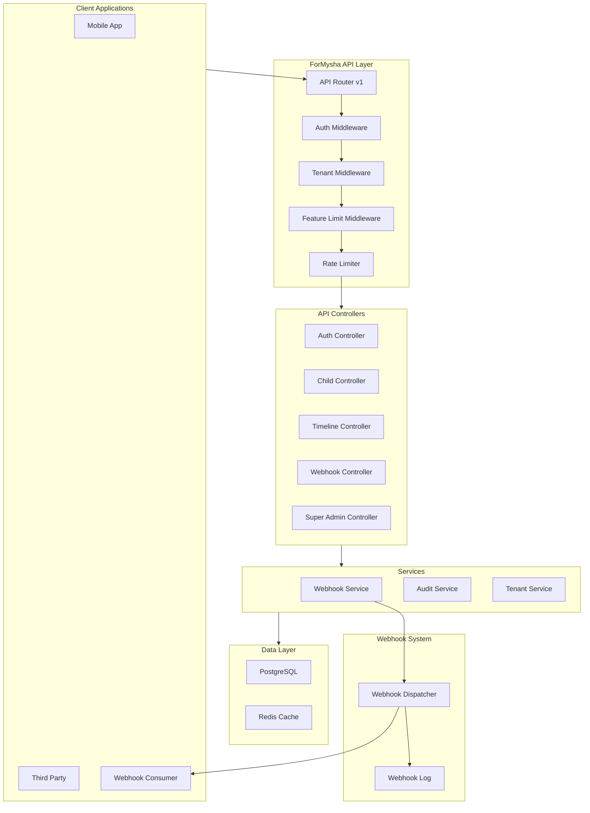
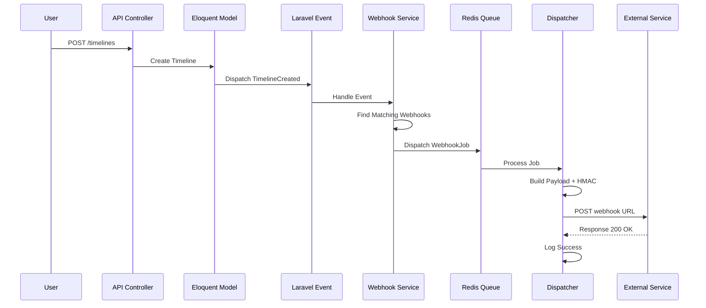
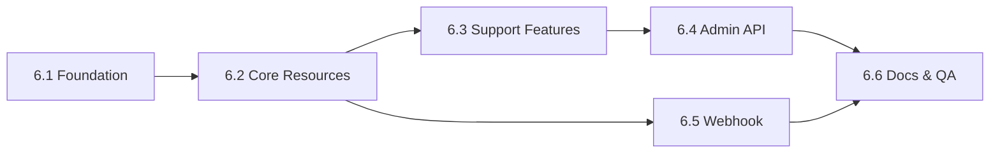

# Phase 6 — Integration Architecture

**ForMysha — Digital Life Book SaaS**
**Versi:** 1.0
**Status:** Perencanaan
**Framework:** Laravel 13 + PHP 8.4

---

## Daftar Isi

1. [Overview & Goals](#1-overview--goals)
2. [Package Requirements](#2-package-requirements)
3. [Database Schema](#3-database-schema)
4. [API Endpoints Reference](#4-api-endpoints-reference)
5. [API Resources](#5-api-resources)
6. [Webhook Architecture](#6-webhook-architecture)
7. [Rate Limiting Strategy](#7-rate-limiting-strategy)
8. [Security Considerations](#8-security-considerations)
9. [Implementation Phases](#9-implementation-phases)
10. [Testing Strategy](#10-testing-strategy)

---

## 1. Overview & Goals

### Tujuan Phase 6

Phase 6 bertujuan membangun infrastruktur **REST API** dan **Webhook System** untuk ForMysha, sehingga platform dapat diintegrasikan dengan layanan pihak ketiga, aplikasi mobile, dan sistem eksternal lainnya.

### Goals

- Menyediakan REST API lengkap untuk semua modul yang ada
- Mengimplementasikan autentikasi token-based melalui Laravel Sanctum
- Mendukung multi-tenancy melalui API token scope
- Membangun Webhook System untuk notifikasi real-time ke layanan eksternal
- Menyediakan API documentation yang lengkap
- Memastikan keamanan, rate limiting, dan audit logging untuk semua endpoint

### Arsitektur High-Level



---

## 2. Package Requirements

### Packages Baru

| Package | Versi | Alasan |
|---------|-------|--------|
| `laravel/sanctum` | ^4.0 | Token-based API authentication, sudah built-in Laravel |
| `darkaonline/l5-swagger` | ^8.0 | OpenAPI/Swagger documentation (opsional, bisa pakai markdown) |

### Tidak Diperlukan

- **Passport**: Terlalu berat untuk use case ini. Sanctum sudah cukup untuk token-based auth.
- **JSON:API spec**: Terlalu rigid, REST biasa lebih fleksibel.
- **GraphQL**: Belum diperlukan di Phase 6.

### Instalasi

```bash
composer require laravel/sanctum

php artisan vendor:publish --provider="Laravel\Sanctum\SanctumServiceProvider"
php artisan migrate
```

### Konfigurasi Sanctum

```php
// config/sanctum.php (publish from vendor)
'stateful' => explode(',', env('SANCTUM_STATEFUL_DOMAINS', sprintf(
    '%s%s',
    'localhost,localhost:3000,localhost:8080,127.0.0.1,127.0.0.1:8000,::1',
    env('APP_URL') ? ','.parse_url(env('APP_URL'), PHP_URL_HOST) : ''
))),

'guard' => ['web'],

'expiration' => null, // Token tidak expire kecuali di-revoke

'middleware' => [
    'authenticate_session' => Laravel\Sanctum\Http\Middleware\AuthenticateSession::class,
    'encrypt_cookies' => Illuminate\Cookie\Middleware\EncryptCookies::class,
    'validate_csrf_token' => Illuminate\Foundation\Http\Middleware\ValidateCsrfToken::class,
],
```

### Konfigurasi di .env

```env
SANCTUM_STATEFUL_DOMAINS=formysha.my.id,localhost,localhost:3000
API_TOKEN_EXPIRY_DAYS=90
WEBHOOK_SECRET_KEY=base64:your-secret-key-here
```

---

## 3. Database Schema

### 3.1 Sanctum Tables

Sanctum menyediakan migration bawaan:

```
personal_access_tokens
- id (bigint, pk)
- tokenable_type (string)
- tokenable_id (uuid/bigint)
- name (string)
- token (string, hashed)
- abilities (json, nullable)
- last_used_at (timestamp, nullable)
- expires_at (timestamp, nullable)
- created_at (timestamp)
- updated_at (timestamp)
```

### 3.2 Webhook Tables

#### Table: `webhooks`

```sql
CREATE TABLE webhooks (
    id UUID PRIMARY KEY DEFAULT gen_random_uuid(),
    tenant_id UUID NOT NULL REFERENCES tenants(id) ON DELETE CASCADE,
    user_id BIGINT NOT NULL REFERENCES users(id) ON DELETE CASCADE,
    name VARCHAR(255) NOT NULL,
    url TEXT NOT NULL,
    secret VARCHAR(255) NOT NULL,
    events JSON NOT NULL DEFAULT '[]',
    is_active BOOLEAN NOT NULL DEFAULT true,
    created_at TIMESTAMP NULL,
    updated_at TIMESTAMP NULL
);

CREATE INDEX idx_webhooks_tenant_id ON webhooks(tenant_id);
CREATE INDEX idx_webhooks_user_id ON webhooks(user_id);
CREATE INDEX idx_webhooks_is_active ON webhooks(is_active);
```

#### Table: `webhook_logs`

```sql
CREATE TABLE webhook_logs (
    id UUID PRIMARY KEY DEFAULT gen_random_uuid(),
    webhook_id UUID NOT NULL REFERENCES webhooks(id) ON DELETE CASCADE,
    event VARCHAR(255) NOT NULL,
    payload JSON NOT NULL,
    response_status INT NULL,
    response_body TEXT NULL,
    delivered_at TIMESTAMP NULL,
    failed_at TIMESTAMP NULL,
    retry_count INT NOT NULL DEFAULT 0,
    max_retries INT NOT NULL DEFAULT 3,
    created_at TIMESTAMP NULL
);

CREATE INDEX idx_webhook_logs_webhook_id ON webhook_logs(webhook_id);
CREATE INDEX idx_webhook_logs_event ON webhook_logs(event);
CREATE INDEX idx_webhook_logs_delivered_at ON webhook_logs(delivered_at);
CREATE INDEX idx_webhook_logs_created_at ON webhook_logs(created_at);
```

### 3.3 Migration Files

| File | Deskripsi |
|------|-----------|
| `2026_08_08_000001_create_personal_access_tokens_table.php` | Sanctum tokens (bawaan package) |
| `2026_08_08_000002_create_webhooks_table.php` | Webhook endpoints |
| `2026_08_08_000003_create_webhook_logs_table.php` | Webhook delivery logs |

---

## 4. API Endpoints Reference

### Konvensi URL

- Base URL: `https://formysha.my.id/api/v1`
- Semua response dalam format JSON
- Resource naming: **plural nouns** (children, timelines, albums)
- Nested resources: `/children/{child}/timelines/{timeline}`
- Filtering: query parameters (`?sort=-created_at&page=1&per_page=15`)
- Multi-tenancy: via Sanctum token scope (`X-Tenant-ID` header atau token binding)

### Standard Response Format

```json
// Success (single resource)
{
    "success": true,
    "data": { ... },
    "meta": {}
}

// Success (collection)
{
    "success": true,
    "data": [ ... ],
    "meta": {
        "current_page": 1,
        "last_page": 5,
        "per_page": 15,
        "total": 72
    }
}

// Error
{
    "success": false,
    "message": "Validation failed",
    "errors": {
        "name": ["Nama wajib diisi."]
    }
}
```

### 4.1 Authentication

| Method | Endpoint | Deskripsi | Auth |
|--------|----------|-----------|------|
| `POST` | `/auth/register` | Daftar akun baru + buat tenant | ❌ |
| `POST` | `/auth/login` | Login dan dapatkan token | ❌ |
| `POST` | `/auth/logout` | Logout dan revoke token | ✅ |
| `POST` | `/auth/forgot-password` | Kirim email reset password | ❌ |
| `POST` | `/auth/reset-password` | Reset password dengan token | ❌ |
| `GET` | `/auth/me` | Dapatkan data user saat ini | ✅ |

#### Register

```
POST /api/v1/auth/register

Request:
{
    "name": "Budi Santoso",
    "email": "budi@example.com",
    "password": "secret123",
    "password_confirmation": "secret123",
    "tenant_name": "Keluarga Santoso"
}

Response: 201
{
    "success": true,
    "data": {
        "user": { ... },
        "tenant": { ... },
        "token": "1|abc..."
    }
}
```

#### Login

```
POST /api/v1/auth/login

Request:
{
    "email": "budi@example.com",
    "password": "secret123"
}

Response: 200
{
    "success": true,
    "data": {
        "user": { ... },
        "token": "1|abc..."
    }
}
```

### 4.2 Profile

| Method | Endpoint | Deskripsi | Auth |
|--------|----------|-----------|------|
| `GET` | `/profile` | Dapatkan profil user | ✅ |
| `PUT` | `/profile` | Update profil user | ✅ |

### 4.3 Children

| Method | Endpoint | Deskripsi | Auth |
|--------|----------|-----------|------|
| `GET` | `/children` | List semua anak | ✅ |
| `POST` | `/children` | Tambah anak baru | ✅ + feature.limit:children |
| `GET` | `/children/{child}` | Detail anak | ✅ |
| `PUT` | `/children/{child}` | Update anak | ✅ |
| `DELETE` | `/children/{child}` | Hapus anak | ✅ |

### 4.4 Timeline

| Method | Endpoint | Deskripsi | Auth |
|--------|----------|-----------|------|
| `GET` | `/children/{child}/timelines` | List timeline anak | ✅ |
| `POST` | `/children/{child}/timelines` | Tambah timeline baru | ✅ |
| `GET` | `/children/{child}/timelines/{timeline}` | Detail timeline | ✅ |
| `PUT` | `/children/{child}/timelines/{timeline}` | Update timeline | ✅ |
| `DELETE` | `/children/{child}/timelines/{timeline}` | Hapus timeline | ✅ |

### 4.5 Albums

| Method | Endpoint | Deskripsi | Auth |
|--------|----------|-----------|------|
| `GET` | `/children/{child}/albums` | List album anak | ✅ |
| `POST` | `/children/{child}/albums` | Tambah album baru | ✅ + feature.limit:photos |
| `GET` | `/children/{child}/albums/{album}` | Detail album | ✅ |
| `PUT` | `/children/{child}/albums/{album}` | Update album | ✅ |
| `DELETE` | `/children/{child}/albums/{album}` | Hapus album | ✅ |

### 4.6 Media

| Method | Endpoint | Deskripsi | Auth |
|--------|----------|-----------|------|
| `GET` | `/children/{child}/media` | List semua media anak | ✅ |
| `POST` | `/children/{child}/media` | Upload media baru | ✅ + feature.limit:photos |
| `DELETE` | `/children/{child}/media/{media}` | Hapus media | ✅ |

### 4.7 Diaries

| Method | Endpoint | Deskripsi | Auth |
|--------|----------|-----------|------|
| `GET` | `/children/{child}/diaries` | List diary anak | ✅ |
| `POST` | `/children/{child}/diaries` | Tambah diary baru | ✅ |
| `GET` | `/children/{child}/diaries/{diary}` | Detail diary | ✅ |
| `PUT` | `/children/{child}/diaries/{diary}` | Update diary | ✅ |
| `DELETE` | `/children/{child}/diaries/{diary}` | Hapus diary | ✅ |

### 4.8 Documents

| Method | Endpoint | Deskripsi | Auth |
|--------|----------|-----------|------|
| `GET` | `/children/{child}/documents` | List dokumen anak | ✅ |
| `POST` | `/children/{child}/documents` | Upload dokumen baru | ✅ |
| `GET` | `/children/{child}/documents/{document}` | Detail dokumen | ✅ |
| `PUT` | `/children/{child}/documents/{document}` | Update dokumen | ✅ |
| `DELETE` | `/children/{child}/documents/{document}` | Hapus dokumen | ✅ |

### 4.9 Calendar / Events

| Method | Endpoint | Deskripsi | Auth |
|--------|----------|-----------|------|
| `GET` | `/children/{child}/events` | List events anak | ✅ |
| `POST` | `/children/{child}/events` | Tambah event baru | ✅ |
| `GET` | `/children/{child}/events/{event}` | Detail event | ✅ |
| `PUT` | `/children/{child}/events/{event}` | Update event | ✅ |
| `DELETE` | `/children/{child}/events/{event}` | Hapus event | ✅ |

### 4.10 Growth

| Method | Endpoint | Deskripsi | Auth |
|--------|----------|-----------|------|
| `GET` | `/children/{child}/growths` | List data pertumbuhan | ✅ |
| `POST` | `/children/{child}/growths` | Tambah data pertumbuhan | ✅ |
| `GET` | `/children/{child}/growths/{growth}` | Detail pertumbuhan | ✅ |
| `PUT` | `/children/{child}/growths/{growth}` | Update pertumbuhan | ✅ |
| `DELETE` | `/children/{child}/growths/{growth}` | Hapus pertumbuhan | ✅ |
| `GET` | `/children/{child}/growths/chart` | Data grafik pertumbuhan | ✅ |

### 4.11 Health Records

| Method | Endpoint | Deskripsi | Auth |
|--------|----------|-----------|------|
| `GET` | `/children/{child}/health-records` | List rekam medis | ✅ |
| `POST` | `/children/{child}/health-records` | Tambah rekam medis | ✅ |
| `GET` | `/children/{child}/health-records/{healthRecord}` | Detail rekam medis | ✅ |
| `PUT` | `/children/{child}/health-records/{healthRecord}` | Update rekam medis | ✅ |
| `DELETE` | `/children/{child}/health-records/{healthRecord}` | Hapus rekam medis | ✅ |

### 4.12 Family Members

| Method | Endpoint | Deskripsi | Auth |
|--------|----------|-----------|------|
| `GET` | `/children/{child}/family-members` | List anggota keluarga | ✅ |
| `POST` | `/children/{child}/family-members` | Tambah anggota keluarga | ✅ |
| `GET` | `/children/{child}/family-members/{familyMember}` | Detail anggota keluarga | ✅ |
| `PUT` | `/children/{child}/family-members/{familyMember}` | Update anggota keluarga | ✅ |
| `DELETE` | `/children/{child}/family-members/{familyMember}` | Hapus anggota keluarga | ✅ |

### 4.13 Search

| Method | Endpoint | Deskripsi | Auth |
|--------|----------|-----------|------|
| `GET` | `/search` | Pencarian global | ✅ |

```
GET /api/v1/search?q=kata+kunci&type=timeline,album

Query Parameters:
- q: kata kunci pencarian (required)
- type: filter tipe (optional) - timeline, album, diary, document, growth, health, event

Response:
{
    "success": true,
    "data": {
        "timelines": [...],
        "albums": [...],
        "diaries": [...]
    }
}
```

### 4.14 Notifications

| Method | Endpoint | Deskripsi | Auth |
|--------|----------|-----------|------|
| `GET` | `/notifications` | List notifikasi | ✅ |
| `POST` | `/notifications/{notification}/read` | Tandai sudah dibaca | ✅ |
| `POST` | `/notifications/read-all` | Tandai semua sudah dibaca | ✅ |
| `DELETE` | `/notifications/{notification}` | Hapus notifikasi | ✅ |

### 4.15 Plans (Public)

| Method | Endpoint | Deskripsi | Auth |
|--------|----------|-----------|------|
| `GET` | `/plans` | List semua paket langganan | ❌ |
| `GET` | `/plans/{plan}` | Detail paket langganan | ❌ |

### 4.16 Subscription

| Method | Endpoint | Deskripsi | Auth |
|--------|----------|-----------|------|
| `GET` | `/subscription/current` | Langganan saat ini | ✅ |
| `GET` | `/subscription/history` | Riwayat langganan | ✅ |
| `POST` | `/subscription/subscribe/{plan}` | Berlangganan paket | ✅ |
| `POST` | `/subscription/payment` | Upload bukti pembayaran | ✅ |

### 4.17 Dashboard

| Method | Endpoint | Deskripsi | Auth |
|--------|----------|-----------|------|
| `GET` | `/dashboard` | Ringkasan dashboard | ✅ |

### 4.18 Super Admin API

| Method | Endpoint | Deskripsi | Auth |
|--------|----------|-----------|------|
| `GET` | `/admin/tenants` | List semua tenant | ✅ (super_admin) |
| `POST` | `/admin/tenants` | Buat tenant baru | ✅ (super_admin) |
| `GET` | `/admin/tenants/{tenant}` | Detail tenant | ✅ (super_admin) |
| `PUT` | `/admin/tenants/{tenant}` | Update tenant | ✅ (super_admin) |
| `DELETE` | `/admin/tenants/{tenant}` | Hapus tenant | ✅ (super_admin) |
| `POST` | `/admin/tenants/{tenant}/toggle-status` | Toggle status tenant | ✅ (super_admin) |
| `GET` | `/admin/payments` | List semua pembayaran | ✅ (super_admin) |
| `GET` | `/admin/payments/{payment}` | Detail pembayaran | ✅ (super_admin) |
| `POST` | `/admin/payments/{payment}/approve` | Setujui pembayaran | ✅ (super_admin) |
| `POST` | `/admin/payments/{payment}/reject` | Tolak pembayaran | ✅ (super_admin) |
| `GET` | `/admin/plans` | List semua paket | ✅ (super_admin) |
| `POST` | `/admin/plans` | Buat paket baru | ✅ (super_admin) |
| `PUT` | `/admin/plans/{plan}` | Update paket | ✅ (super_admin) |
| `DELETE` | `/admin/plans/{plan}` | Hapus paket | ✅ (super_admin) |
| `GET` | `/admin/analytics` | Data analytics | ✅ (super_admin) |
| `GET` | `/admin/monitoring` | Data monitoring | ✅ (super_admin) |
| `GET` | `/admin/audit-logs` | Log audit | ✅ (super_admin) |

### 4.19 Tenant Admin API

| Method | Endpoint | Deskripsi | Auth |
|--------|----------|-----------|------|
| `GET` | `/tenant-admin/dashboard` | Dashboard tenant | ✅ (tenant_admin) |
| `GET` | `/tenant-admin/branding` | Branding saat ini | ✅ (tenant_admin) |
| `PUT` | `/tenant-admin/branding` | Update branding | ✅ (tenant_admin) |
| `GET` | `/tenant-admin/settings` | Pengaturan tenant | ✅ (tenant_admin) |
| `PUT` | `/tenant-admin/settings` | Update pengaturan | ✅ (tenant_admin) |
| `GET` | `/tenant-admin/usage` | Statistik penggunaan | ✅ (tenant_admin) |

### 4.20 Webhooks (Tenant Admin)

| Method | Endpoint | Deskripsi | Auth |
|--------|----------|-----------|------|
| `GET` | `/tenant-admin/webhooks` | List webhooks | ✅ (tenant_admin) |
| `POST` | `/tenant-admin/webhooks` | Buat webhook baru | ✅ (tenant_admin) |
| `GET` | `/tenant-admin/webhooks/{webhook}` | Detail webhook | ✅ (tenant_admin) |
| `PUT` | `/tenant-admin/webhooks/{webhook}` | Update webhook | ✅ (tenant_admin) |
| `DELETE` | `/tenant-admin/webhooks/{webhook}` | Hapus webhook | ✅ (tenant_admin) |
| `POST` | `/tenant-admin/webhooks/{webhook}/test` | Test webhook | ✅ (tenant_admin) |
| `GET` | `/tenant-admin/webhooks/{webhook}/logs` | Log delivery webhook | ✅ (tenant_admin) |

### 4.21 API Token Management

| Method | Endpoint | Deskripsi | Auth |
|--------|----------|-----------|------|
| `GET` | `/tokens` | List semua token API | ✅ |
| `POST` | `/tokens` | Buat token baru | ✅ |
| `DELETE` | `/tokens/{token}` | Revoke token | ✅ |

### Ringkasan Total Endpoints

| Kategori | Jumlah Endpoint |
|----------|----------------|
| Authentication | 6 |
| Profile | 2 |
| Children | 5 |
| Timeline | 5 |
| Albums | 5 |
| Media | 3 |
| Diaries | 5 |
| Documents | 5 |
| Events | 5 |
| Growth | 6 |
| Health Records | 5 |
| Family Members | 5 |
| Search | 1 |
| Notifications | 4 |
| Plans | 2 |
| Subscription | 4 |
| Dashboard | 1 |
| Super Admin | 17 |
| Tenant Admin | 6 |
| Webhooks | 7 |
| Token Management | 3 |
| **Total** | **~102 endpoints** |

---

## 5. API Resources

### Struktur Resources

```
app/Http/Resources/
├── UserResource.php
├── ChildResource.php
├── ChildCollection.php
├── TimelineResource.php
├── AlbumResource.php
├── MediaResource.php
├── DiaryResource.php
├── DocumentResource.php
├── EventResource.php
├── GrowthResource.php
├── HealthRecordResource.php
├── FamilyMemberResource.php
├── NotificationResource.php
├── PlanResource.php
├── SubscriptionResource.php
├── PaymentResource.php
├── TenantResource.php
├── WebhookResource.php
├── WebhookLogResource.php
├── AuditLogResource.php
└── SearchResource.php
```

### Field Mapping per Resource

#### UserResource

```json
{
    "id": 1,
    "name": "Budi Santoso",
    "email": "budi@example.com",
    "avatar": "https://...",
    "phone": "+628123456789",
    "role": "parent",
    "role_label": "Orang Tua",
    "created_at": "2026-01-15T10:00:00.000000Z"
}
```

#### ChildResource

```json
{
    "id": 1,
    "user_id": 1,
    "name": "Mysha",
    "slug": "mysha",
    "nickname": "Sha",
    "gender": "female",
    "date_of_birth": "2025-01-15",
    "place_of_birth": "Jakarta",
    "blood_type": "O",
    "photo": "https://...",
    "bio": "Anak pertama yang ceria",
    "age": "1 tahun 7 bulan",
    "is_public": false,
    "public_profile_data": ["timeline", "gallery"],
    "media_count": 45,
    "created_at": "2025-01-15T10:00:00.000000Z",
    "updated_at": "2026-08-01T10:00:00.000000Z"
}
```

#### TimelineResource

```json
{
    "id": 1,
    "child_id": 1,
    "user_id": 1,
    "title": "Pertama Kali Jalan",
    "description": "Mysha akhirnya bisa jalan sendiri!",
    "event_date": "2025-09-15",
    "event_time": "14:30:00",
    "location": "Ruang Tamu",
    "latitude": -6.2088,
    "longitude": 106.8456,
    "mood": "excited",
    "tags": ["milestone", "pertama"],
    "is_featured": true,
    "media": [ ... ],
    "created_at": "2025-09-15T14:30:00.000000Z"
}
```

#### AlbumResource

```json
{
    "id": 1,
    "child_id": 1,
    "name": "Foto Bulan Pertama",
    "description": "Kumpulan foto bulan pertama Mysha",
    "cover_photo": "https://...",
    "is_private": true,
    "media_count": 12,
    "created_at": "2025-02-01T10:00:00.000000Z"
}
```

#### MediaResource

```json
{
    "id": 1,
    "mediable_type": "child",
    "mediable_id": 1,
    "file_path": "media/children/1/photo.jpg",
    "file_name": "photo.jpg",
    "file_type": "photo",
    "file_size": 2048576,
    "file_size_formatted": "2 MB",
    "alt_text": "Foto Mysha",
    "sort_order": 1,
    "url": "https://...",
    "created_at": "2025-02-01T10:00:00.000000Z"
}
```

#### DiaryResource

```json
{
    "id": 1,
    "child_id": 1,
    "user_id": 1,
    "title": "Hari yang Menyenangkan",
    "content": "Hari ini Mysha bermain di taman...",
    "mood": "happy",
    "mood_label": "Bahagia",
    "diary_date": "2026-08-01",
    "weather": "sunny",
    "is_private": true,
    "created_at": "2026-08-01T20:00:00.000000Z"
}
```

#### DocumentResource

```json
{
    "id": 1,
    "child_id": 1,
    "user_id": 1,
    "name": "Akta Kelahiran",
    "type": "birth_certificate",
    "type_label": "Akta Lahir",
    "description": "Akta kelahiran Mysha",
    "file_path": "documents/children/1/akta.pdf",
    "file_name": "akta.pdf",
    "file_size": 1048576,
    "file_size_formatted": "1 MB",
    "issued_date": "2025-01-20",
    "expiry_date": null,
    "is_private": true,
    "created_at": "2025-02-01T10:00:00.000000Z"
}
```

#### EventResource

```json
{
    "id": 1,
    "child_id": 1,
    "user_id": 1,
    "title": "Imunisasi DPT",
    "description": "Imunisasi DPT ke-2",
    "event_date": "2025-07-15",
    "event_time": "09:00:00",
    "event_type": "immunization",
    "event_type_label": "Imunisasi",
    "is_recurring": false,
    "recurrence_pattern": null,
    "reminder_at": "2025-07-14T09:00:00.000000Z",
    "created_at": "2025-06-01T10:00:00.000000Z"
}
```

#### GrowthResource

```json
{
    "id": 1,
    "child_id": 1,
    "user_id": 1,
    "measured_at": "2026-08-01",
    "weight_kg": 9.5,
    "height_cm": 75.0,
    "head_circumference_cm": 45.0,
    "weight_label": "9,5 kg",
    "height_label": "75,0 cm",
    "notes": "Pertumbuhan normal",
    "created_at": "2026-08-01T10:00:00.000000Z"
}
```

#### HealthRecordResource

```json
{
    "id": 1,
    "child_id": 1,
    "user_id": 1,
    "type": "immunization",
    "type_label": "Imunisasi",
    "name": "Imunisasi DPT",
    "description": "Imunisasi DPT ke-2",
    "date": "2025-07-15",
    "doctor": "dr. Sari",
    "hospital": "RS Anak Sehat",
    "notes": "Tidak ada efek samping",
    "next_date": "2025-10-15",
    "created_at": "2025-07-15T10:00:00.000000Z"
}
```

#### FamilyMemberResource

```json
{
    "id": 1,
    "child_id": 1,
    "user_id": 1,
    "name": "Budi Santoso",
    "relationship": "father",
    "relationship_label": "Ayah",
    "phone": "+628123456789",
    "email": "budi@example.com",
    "photo": "https://...",
    "is_primary": true,
    "created_at": "2025-01-15T10:00:00.000000Z"
}
```

#### NotificationResource

```json
{
    "id": 1,
    "user_id": 1,
    "child_id": 1,
    "title": "Pengingat Imunisasi",
    "message": "Imunisasi DPT Mysha 3 hari lagi",
    "type": "reminder",
    "type_label": "Pengingat",
    "icon": "💉",
    "action_url": "/children/1/calendar",
    "is_read": false,
    "read_at": null,
    "created_at": "2026-08-01T10:00:00.000000Z"
}
```

#### PlanResource

```json
{
    "id": "uuid",
    "name": "Premium",
    "slug": "premium",
    "description": "Paket premium untuk keluarga besar",
    "price_monthly": 59000,
    "price_yearly": 560000,
    "price_monthly_formatted": "Rp 59.000",
    "price_yearly_formatted": "Rp 560.000",
    "max_children": 10,
    "max_photos": 1000,
    "max_videos": 200,
    "max_storage_mb": 10240,
    "max_family_members": 20,
    "max_export_per_day": 50,
    "is_active": true,
    "is_free": false,
    "features": [ ... ]
}
```

#### TenantResource

```json
{
    "id": "uuid",
    "name": "Keluarga Santoso",
    "slug": "keluarga-santoso",
    "domain": null,
    "logo": "https://...",
    "is_active": true,
    "children_count": 3,
    "users_count": 2,
    "subscription": { ... },
    "created_at": "2025-01-15T10:00:00.000000Z"
}
```

#### WebhookResource

```json
{
    "id": "uuid",
    "name": "WhatsApp Notifier",
    "url": "https://hooks.example.com/formysha",
    "events": ["timeline.created", "diary.created"],
    "is_active": true,
    "last_delivery_at": "2026-08-01T10:00:00.000000Z",
    "created_at": "2026-07-01T10:00:00.000000Z"
}
```

#### WebhookLogResource

```json
{
    "id": "uuid",
    "webhook_id": "uuid",
    "event": "timeline.created",
    "payload": { ... },
    "response_status": 200,
    "response_body": "OK",
    "delivered_at": "2026-08-01T10:00:01.000000Z",
    "failed_at": null,
    "retry_count": 0,
    "created_at": "2026-08-01T10:00:00.000000Z"
}
```

---

## 6. Webhook Architecture

### 6.1 Overview

Webhook System memungkinkan tenant mengirim notifikasi otomatis ke layanan eksternal ketika peristiwa tertentu terjadi di ForMysha. Contoh: mengirim notifikasi ke WhatsApp ketika timeline baru ditambahkan.



### 6.2 Webhook Events

| Event | Deskripsi | Payload |
|-------|-----------|---------|
| `child.created` | Anak baru ditambahkan | Child data |
| `child.updated` | Data anak diupdate | Child data |
| `child.deleted` | Anak dihapus | Child ID |
| `timeline.created` | Timeline baru | Timeline data |
| `timeline.updated` | Timeline diupdate | Timeline data |
| `timeline.deleted` | Timeline dihapus | Timeline ID |
| `album.created` | Album baru | Album data |
| `album.updated` | Album diupdate | Album data |
| `diary.created` | Diary baru | Diary data |
| `diary.updated` | Diary diupdate | Diary data |
| `document.created` | Dokumen baru | Document data |
| `event.created` | Event baru | Event data |
| `event.upcoming` | Event akan datang (reminder) | Event data |
| `growth.recorded` | Data pertumbuhan baru | Growth data |
| `health.recorded` | Rekam medis baru | Health data |
| `subscription.activated` | Langganan aktif | Subscription data |
| `subscription.expired` | Langganan kedaluwarsa | Subscription data |
| `payment.approved` | Pembayaran disetujui | Payment data |

### 6.3 Models

#### Webhook Model

```php
// app/Models/Webhook.php

namespace App\Models;

use Illuminate\Database\Eloquent\Model;
use Illuminate\Database\Eloquent\Relations\BelongsTo;
use Illuminate\Database\Eloquent\Relations\HasMany;
use Illuminate\Database\Eloquent\SoftDeletes;
use Illuminate\Support\Str;

class Webhook extends Model
{
    use SoftDeletes;

    protected $keyType = 'string';
    public $incrementing = false;

    protected $fillable = [
        'tenant_id',
        'user_id',
        'name',
        'url',
        'secret',
        'events',
        'is_active',
    ];

    protected function casts(): array
    {
        return [
            'events' => 'array',
            'is_active' => 'boolean',
        ];
    }

    protected static function booted(): void
    {
        static::creating(function (Webhook $webhook): void {
            if (empty($webhook->id)) {
                $webhook->id = (string) Str::uuid();
            }
            if (empty($webhook->secret)) {
                $webhook->secret = Str::random(40);
            }
        });
    }

    public function tenant(): BelongsTo
    {
        return $this->belongsTo(Tenant::class);
    }

    public function user(): BelongsTo
    {
        return $this->belongsTo(User::class);
    }

    public function logs(): HasMany
    {
        return $this->hasMany(WebhookLog::class);
    }

    public function supportsEvent(string $event): bool
    {
        return in_array('*', $this->events) || in_array($event, $this->events);
    }
}
```

#### WebhookLog Model

```php
// app/Models/WebhookLog.php

namespace App\Models;

use Illuminate\Database\Eloquent\Model;
use Illuminate\Database\Eloquent\Relations\BelongsTo;
use Illuminate\Support\Str;

class WebhookLog extends Model
{
    public const UPDATED_AT = null;

    protected $keyType = 'string';
    public $incrementing = false;

    protected $fillable = [
        'webhook_id',
        'event',
        'payload',
        'response_status',
        'response_body',
        'delivered_at',
        'failed_at',
        'retry_count',
        'max_retries',
    ];

    protected function casts(): array
    {
        return [
            'payload' => 'array',
            'delivered_at' => 'datetime',
            'failed_at' => 'datetime',
        ];
    }

    protected static function booted(): void
    {
        static::creating(function (WebhookLog $log): void {
            if (empty($log->id)) {
                $log->id = (string) Str::uuid();
            }
        });
    }

    public function webhook(): BelongsTo
    {
        return $this->belongsTo(Webhook::class);
    }

    public function isDelivered(): bool
    {
        return $this->delivered_at !== null;
    }

    public function isFailed(): bool
    {
        return $this->failed_at !== null;
    }

    public function canRetry(): bool
    {
        return $this->retry_count < $this->max_retries && $this->isFailed();
    }
}
```

### 6.4 WebhookService

```php
// app/Services/WebhookService.php

namespace App\Services;

use App\Models\Tenant;
use App\Models\Webhook;
use App\Models\WebhookLog;
use Illuminate\Support\Facades\Http;
use Illuminate\Support\Facades\Log;

class WebhookService
{
    /**
     * Dispatch webhooks for a given event.
     */
    public function dispatch(string $event, array $payload, ?Tenant $tenant = null): void
    {
        $tenant = $tenant ?? tenant();

        if (! $tenant) {
            return;
        }

        $webhooks = Webhook::where('tenant_id', $tenant->id)
            ->where('is_active', true)
            ->get()
            ->filter(fn (Webhook $webhook) => $webhook->supportsEvent($event));

        foreach ($webhooks as $webhook) {
            $this->deliver($webhook, $event, $payload);
        }
    }

    /**
     * Deliver a single webhook.
     */
    public function deliver(Webhook $webhook, string $event, array $payload): WebhookLog
    {
        $body = [
            'event' => $event,
            'timestamp' => now()->toIso8601String(),
            'tenant_id' => $webhook->tenant_id,
            'data' => $payload,
        ];

        $signature = $this->generateSignature($webhook->secret, $body);

        $log = WebhookLog::create([
            'webhook_id' => $webhook->id,
            'event' => $event,
            'payload' => $body,
            'max_retries' => 3,
        ]);

        try {
            $response = Http::withHeaders([
                'Content-Type' => 'application/json',
                'X-Webhook-Signature' => $signature,
                'X-Webhook-Event' => $event,
                'X-Webhook-Timestamp' => $body['timestamp'],
            ])->timeout(10)->post($webhook->url, $body);

            $log->update([
                'response_status' => $response->status(),
                'response_body' => $response->body(),
                'delivered_at' => now(),
            ]);
        } catch (\Exception $e) {
            $log->update([
                'failed_at' => now(),
                'response_body' => $e->getMessage(),
            ]);

            Log::warning("Webhook delivery failed: {$webhook->url}", [
                'webhook_id' => $webhook->id,
                'event' => $event,
                'error' => $e->getMessage(),
            ]);
        }

        return $log;
    }

    /**
     * Generate HMAC-SHA256 signature.
     */
    public function generateSignature(string $secret, array $payload): string
    {
        return hash_hmac('sha256', json_encode($payload), $secret);
    }

    /**
     * Verify HMAC signature.
     */
    public function verifySignature(string $secret, array $payload, string $signature): bool
    {
        $expected = $this->generateSignature($secret, $payload);

        return hash_equals($expected, $signature);
    }
}
```

### 6.5 Webhook Job

```php
// app/Jobs/DeliverWebhookJob.php

namespace App\Jobs;

use App\Models\Webhook;
use App\Services\WebhookService;
use Illuminate\Bus\Queueable;
use Illuminate\Contracts\Queue\ShouldQueue;
use Illuminate\Foundation\Bus\Dispatchable;
use Illuminate\Queue\InteractsWithQueue;
use Illuminate\Queue\SerializesModels;

class DeliverWebhookJob implements ShouldQueue
{
    use Dispatchable, InteractsWithQueue, Queueable, SerializesModels;

    public int $tries = 3;

    public int $backoff = 30;

    public function __construct(
        public Webhook $webhook,
        public string $event,
        public array $payload,
    ) {}

    public function handle(WebhookService $webhookService): void
    {
        $webhookService->deliver($this->webhook, $this->event, $this->payload);
    }
}
```

### 6.6 Laravel Events untuk Webhook Trigger

```php
// app/Events/WebhookTriggered.php

namespace App\Events;

use App\Models\Tenant;
use Illuminate\Foundation\Events\Dispatchable;
use Illuminate\Queue\SerializesModels;

class WebhookTriggered
{
    use Dispatchable, SerializesModels;

    public function __construct(
        public string $event,
        public array $payload,
        public ?Tenant $tenant = null,
    ) {}
}
```

```php
// app/Listeners/DispatchWebhooks.php

namespace App\Listeners;

use App\Events\WebhookTriggered;
use App\Services\WebhookService;

class DispatchWebhooks
{
    public function __construct(
        private WebhookService $webhookService,
    ) {}

    public function handle(WebhookTriggered $event): void
    {
        $this->webhookService->dispatch(
            $event->event,
            $event->payload,
            $event->tenant,
        );
    }
}
```

### 6.7 EventServiceProvider Registration

```php
// app/Providers/EventServiceProvider.php

protected $listen = [
    WebhookTriggered::class => [
        DispatchWebhooks::class,
    ],
];
```

### 6.8 Trigger dari Model

```php
// Contoh di Timeline Controller store method:
use App\Events\WebhookTriggered;

// Setelah timeline berhasil dibuat:
event(new WebhookTriggered(
    event: 'timeline.created',
    payload: new TimelineResource($timeline),
    tenant: $child->tenant,
));
```

### 6.9 Webhook Dashboard UI

Webhook management UI akan ditambahkan di halaman Tenant Admin:

```
/admin/webhooks
```

Fitur:
- List webhooks dengan status aktif/inaktif
- Form tambah/edit webhook (nama, URL, events yang dipilih)
- Toggle aktif/inaktif
- Tombol test webhook
- Log delivery (success/failed, response, retry)
- Secret key management (view/regenerate)

---

## 7. Rate Limiting Strategy

### 7.1 Konfigurasi Rate Limiting

```php
// app/Providers/AppServiceProvider.php

use Illuminate\Cache\RateLimiting\Limit;
use Illuminate\Http\Request;
use Illuminate\Support\Facades\RateLimiter;

public function boot(): void
{
    RateLimiter::for('api', function (Request $request) {
        return Limit::perMinute(60)->by(
            $request->user()?->id ?: $request->ip()
        );
    });

    // Stricter limit for auth endpoints
    RateLimiter::for('auth', function (Request $request) {
        return Limit::perMinute(10)->by($request->ip());
    });

    // Stricter limit for file uploads
    RateLimiter::for('upload', function (Request $request) {
        return Limit::perMinute(20)->by($request->user()?->id ?: $request->ip());
    });

    // Export limit
    RateLimiter::for('export', function (Request $request) {
        return Limit::perMinute(5)->by($request->user()?->id ?: $request->ip());
    });

    // Webhook test limit
    RateLimiter::for('webhook-test', function (Request $request) {
        return Limit::perMinute(5)->by($request->user()?->id ?: $request->ip());
    });

    // Super admin - higher limits
    RateLimiter::for('admin', function (Request $request) {
        return Limit::perMinute(120)->by($request->user()?->id ?: $request->ip());
    });
}
```

### 7.2 Rate Limit Summary

| Endpoint Group | Limit | By | Alasan |
|----------------|-------|----|----|
| General API | 60/menit | user ID atau IP | Standar untuk semua endpoint |
| Auth (login, register) | 10/menit | IP | Prevent brute force |
| File Upload | 20/menit | user ID | Kontrol bandwidth |
| Export | 5/menit | user ID | Resource-intensive |
| Webhook Test | 5/menit | user ID | Prevent abuse |
| Super Admin | 120/menit | user ID | Higher throughput |

### 7.3 Rate Limit Response

```json
// HTTP 429 Too Many Requests
{
    "success": false,
    "message": "Terlalu banyak permintaan. Silakan coba lagi dalam beberapa saat.",
    "retry_after": 45
}
```

### 7.4 Headers

```
X-RateLimit-Limit: 60
X-RateLimit-Remaining: 45
X-RateLimit-Reset: 1691234567
```

### 7.5 Rate Limit di Routes

```php
// routes/api.php
Route::middleware(['throttle:api'])->group(function () {
    // Semua API routes
});

Route::middleware(['throttle:auth'])->group(function () {
    Route::post('/auth/login', ...);
    Route::post('/auth/register', ...);
});
```

---

## 8. Security Considerations

### 8.1 Authentication & Authorization

| Aspek | Implementasi |
|-------|-------------|
| Token-based auth | Laravel Sanctum personal access tokens |
| Token scope | Bind token ke tenant via `tokenable_id` |
| Role verification | Middleware `EnsureRole` untuk super_admin, tenant_admin |
| Child ownership | Middleware `EnsureChildOwnership` untuk akses data anak |
| Subscription check | Middleware `EnsureActiveSubscription` |
| Feature limits | Middleware `EnsureFeatureLimit` |

### 8.2 Tenant Isolation

```php
// Setiap API request harus resolve tenant
// Token user memiliki tenant_id, digunakan untuk filter data

// Contoh di API Controller:
public function index(Request $request): JsonResponse
{
    $tenant = $request->user()->tenant;

    abort_unless($tenant, 403, 'Tenant tidak ditemukan.');

    $children = Child::where('tenant_id', $tenant->id)->get();

    return ChildResource::collection($children);
}
```

### 8.3 Input Validation

Semua input harus divalidasi menggunakan Form Request:

```php
// app/Http/Requests/Api/StoreTimelineRequest.php

namespace App\Http\Requests\Api;

use Illuminate\Foundation\Http\FormRequest;

class StoreTimelineRequest extends FormRequest
{
    public function authorize(): bool
    {
        return true;
    }

    public function rules(): array
    {
        return [
            'title' => ['required', 'string', 'max:255'],
            'description' => ['nullable', 'string'],
            'event_date' => ['required', 'date'],
            'event_time' => ['nullable', 'date_format:H:i'],
            'location' => ['nullable', 'string', 'max:255'],
            'latitude' => ['nullable', 'numeric'],
            'longitude' => ['nullable', 'numeric'],
            'mood' => ['nullable', 'in:happy,excited,calm,sad,surprised,loved'],
            'tags' => ['nullable', 'array'],
            'tags.*' => ['string', 'max:50'],
            'is_featured' => ['boolean'],
        ];
    }
}
```

### 8.4 CSRF Protection

- Sanctum `stateful` domains menggunakan session-based auth (cookie)
- API tokens tidak memerlukan CSRF token
- Public API endpoints (register, login) tidak memerlukan CSRF

### 8.5 Rate Limiting

- Dijelaskan di Section 7
- Prevent brute force attack
- Prevent API abuse

### 8.6 Input Sanitization

- HTML tags dihapus dari text fields
- File upload hanya menerima tipe yang diizinkan
- File size limit sesuai plan
- Malware scanning untuk file upload (future)

### 8.7 CORS Configuration

```php
// config/cors.php
'paths' => ['api/*', 'sanctum/csrf-cookie'],
'allowed_methods' => ['*'],
'allowed_origins' => [
    env('FRONTEND_URL', 'https://formysha.my.id'),
    'http://localhost:3000', // development
],
'allowed_origins_patterns' => [],
'allowed_headers' => ['*'],
'exposed_headers' => [
    'X-RateLimit-Limit',
    'X-RateLimit-Remaining',
    'X-RateLimit-Reset',
],
'max_age' => 0,
'supports_credentials' => true,
```

### 8.8 Webhook Security

| Aspek | Implementasi |
|-------|-------------|
| Secret key | Generated per webhook, stored hashed |
| HMAC signature | SHA-256 signature di header `X-Webhook-Signature` |
| Timestamp validation | Header `X-Webhook-Timestamp` untuk prevent replay |
| URL validation | HTTPS only untuk production |
| Retry logic | Max 3 retries dengan exponential backoff |

### 8.9 Error Handling

```php
// app/Exceptions/Handler.php atau bootstrap/app.php

// API errors selalu return JSON
$exceptions->shouldRenderJsonWhen(
    fn (Request $request) => $request->is('api/*'),
);

// Custom API exception responses
$exceptions->renderable(function (NotFoundHttpException $e, Request $request) {
    if ($request->is('api/*')) {
        return response()->json([
            'success' => false,
            'message' => 'Resource tidak ditemukan.',
        ], 404);
    }
});
```

### 8.10 Audit Logging

Semua operasi API penting akan dicatat ke audit log:

```php
// Contoh di controller:
$this->auditService->log(
    action: 'timeline.created',
    subject: $timeline,
    user: $request->user(),
    newValues: $timeline->toArray(),
);
```

---

## 9. Implementation Phases

### Sub-Phase 6.1: Foundation & Authentication

**Tujuan:** Setup dasar API infrastructure dan autentikasi.

| # | Task | File/Directory |
|---|------|---------------|
| 1 | Install & konfigurasi Laravel Sanctum | `composer require laravel/sanctum` |
| 2 | Publish Sanctum migration & config | `config/sanctum.php` |
| 3 | Buat `routes/api.php` dan registrasi di `bootstrap/app.php` | `routes/api.php` |
| 4 | Buat API Controller base class | `app/Http/Controllers/Api/Controller.php` |
| 5 | Buat Auth API Controllers | `app/Http/Controllers/Api/Auth/` |
| 6 | Buat Form Requests untuk Auth | `app/Http/Requests/Api/Auth/` |
| 7 | Buat UserResource | `app/Http/Resources/UserResource.php` |
| 8 | Konfigurasi CORS | `config/cors.php` |
| 9 | Konfigurasi rate limiting | `app/Providers/AppServiceProvider.php` |
| 10 | Tambah Sanctum trait ke User model | `app/Models/User.php` |
| 11 | Buat API tests untuk auth | `tests/Feature/Api/AuthTest.php` |

### Sub-Phase 6.2: Core Resources API

**Tujuan:** API CRUD untuk semua resource utama.

| # | Task | File/Directory |
|---|------|---------------|
| 1 | Buat API Resources untuk semua model | `app/Http/Resources/` |
| 2 | Buat Children API Controller | `app/Http/Controllers/Api/ChildController.php` |
| 3 | Buat Timeline API Controller | `app/Http/Controllers/Api/TimelineController.php` |
| 4 | Buat Album API Controller | `app/Http/Controllers/Api/AlbumController.php` |
| 5 | Buat Media API Controller | `app/Http/Controllers/Api/MediaController.php` |
| 6 | Buat Diary API Controller | `app/Http/Controllers/Api/DiaryController.php` |
| 7 | Buat Document API Controller | `app/Http/Controllers/Api/DocumentController.php` |
| 8 | Buat Event API Controller | `app/Http/Controllers/Api/EventController.php` |
| 9 | Buat Growth API Controller | `app/Http/Controllers/Api/GrowthController.php` |
| 10 | Buat HealthRecord API Controller | `app/Http/Controllers/Api/HealthRecordController.php` |
| 11 | Buat FamilyMember API Controller | `app/Http/Controllers/Api/FamilyMemberController.php` |
| 12 | Buat Form Requests untuk semua resource | `app/Http/Requests/Api/` |
| 13 | Buat Feature Tests untuk semua resource | `tests/Feature/Api/` |

### Sub-Phase 6.3: Support Features API

**Tujuan:** API untuk search, notifications, dashboard, profile.

| # | Task | File/Directory |
|---|------|---------------|
| 1 | Buat Search API Controller | `app/Http/Controllers/Api/SearchController.php` |
| 2 | Buat Notification API Controller | `app/Http/Controllers/Api/NotificationController.php` |
| 3 | Buat Dashboard API Controller | `app/Http/Controllers/Api/DashboardController.php` |
| 4 | Buat Profile API Controller | `app/Http/Controllers/Api/ProfileController.php` |
| 5 | Buat Plan API Controller (public) | `app/Http/Controllers/Api/PlanController.php` |
| 6 | Buat Subscription API Controller | `app/Http/Controllers/Api/SubscriptionController.php` |
| 7 | Buat Feature Tests untuk semua support features | `tests/Feature/Api/` |

### Sub-Phase 6.4: Super Admin & Tenant Admin API

**Tujuan:** API untuk manajemen tenant dan admin panel.

| # | Task | File/Directory |
|---|------|---------------|
| 1 | Buat Super Admin Tenant API Controller | `app/Http/Controllers/Api/SuperAdmin/TenantController.php` |
| 2 | Buat Super Admin Payment API Controller | `app/Http/Controllers/Api/SuperAdmin/PaymentController.php` |
| 3 | Buat Super Admin Plan API Controller | `app/Http/Controllers/Api/SuperAdmin/PlanController.php` |
| 4 | Buat Super Admin Analytics API Controller | `app/Http/Controllers/Api/SuperAdmin/AnalyticsController.php` |
| 5 | Buat Super Admin Monitoring API Controller | `app/Http/Controllers/Api/SuperAdmin/MonitoringController.php` |
| 6 | Buat Super Admin AuditLog API Controller | `app/Http/Controllers/Api/SuperAdmin/AuditLogController.php` |
| 7 | Buat Tenant Admin API Controllers | `app/Http/Controllers/Api/TenantAdmin/` |
| 8 | Buat Feature Tests untuk admin API | `tests/Feature/Api/SuperAdminTest.php` |
| 9 | Buat Feature Tests untuk tenant admin API | `tests/Feature/Api/TenantAdminTest.php` |

### Sub-Phase 6.5: Webhook System

**Tujuan:** Implementasi lengkap webhook system.

| # | Task | File/Directory |
|---|------|---------------|
| 1 | Buat migration untuk webhooks table | `database/migrations/...create_webhooks_table.php` |
| 2 | Buat migration untuk webhook_logs table | `database/migrations/...create_webhook_logs_table.php` |
| 3 | Buat Webhook Model | `app/Models/Webhook.php` |
| 4 | Buat WebhookLog Model | `app/Models/WebhookLog.php` |
| 5 | Buat WebhookService | `app/Services/WebhookService.php` |
| 6 | Buat DeliverWebhookJob | `app/Jobs/DeliverWebhookJob.php` |
| 7 | Buat WebhookTriggered Event | `app/Events/WebhookTriggered.php` |
| 8 | Buat DispatchWebhooks Listener | `app/Listeners/DispatchWebhooks.php` |
| 9 | Register EventServiceProvider | `app/Providers/EventServiceProvider.php` |
| 10 | Buat Webhook API Controller | `app/Http/Controllers/Api/TenantAdmin/WebhookController.php` |
| 11 | Buat WebhookResource & WebhookLogResource | `app/Http/Resources/` |
| 12 | Buat Blade views untuk webhook management | `resources/views/admin/webhooks/` |
| 13 | Trigger webhook events dari controllers | Update existing controllers |
| 14 | Buat Feature Tests untuk webhooks | `tests/Feature/WebhookTest.php` |
| 15 | Buat Unit Tests untuk WebhookService | `tests/Unit/Services/WebhookServiceTest.php` |

### Sub-Phase 6.6: Documentation & Finalisasi

**Tujuan:** API documentation dan quality assurance.

| # | Task | File/Directory |
|---|------|---------------|
| 1 | Buat API documentation (markdown) | `docs/API.md` |
| 2 | Konfigurasi Swagger/OpenAPI (opsional) | `config/l5-swagger.php` |
| 3 | Tambah `api.php` routes ke bootstrap | `bootstrap/app.php` |
| 4 | Jalankan full test suite | `php artisan test --compact` |
| 5 | Jalankan Pint formatting | `vendor/bin/pint --dirty` |
| 6 | Update FEATURES.md | `FEATURES.md` |
| 7 | Update ROADMAP.md | `ROADMAP.md` |
| 8 | Update AGENTS.md | `AGENTS.md` |

### Diagram Dependensi Sub-Phase



---

## 10. Testing Strategy

### 10.1 Test Structure

```
tests/
├── Feature/
│   ├── Api/
│   │   ├── AuthTest.php
│   │   ├── ChildTest.php
│   │   ├── TimelineTest.php
│   │   ├── AlbumTest.php
│   │   ├── MediaTest.php
│   │   ├── DiaryTest.php
│   │   ├── DocumentTest.php
│   │   ├── EventTest.php
│   │   ├── GrowthTest.php
│   │   ├── HealthRecordTest.php
│   │   ├── FamilyMemberTest.php
│   │   ├── SearchTest.php
│   │   ├── NotificationTest.php
│   │   ├── ProfileTest.php
│   │   ├── DashboardTest.php
│   │   ├── PlanTest.php
│   │   ├── SubscriptionTest.php
│   │   ├── SuperAdminTest.php
│   │   ├── TenantAdminTest.php
│   │   ├── WebhookTest.php
│   │   └── RateLimitTest.php
│   └── ...
└── Unit/
    ├── Services/
    │   └── WebhookServiceTest.php
    └── ...
```

### 10.2 Test Patterns

#### Authentication Test

```php
// tests/Feature/Api/AuthTest.php

use Tests\TestCase;
use App\Models\User;
use App\Models\Tenant;

uses()->group('api', 'auth');

describe('Authentication API', function () {
    it('can register a new user with tenant', function () {
        $response = $this->postJson('/api/v1/auth/register', [
            'name' => 'Budi Santoso',
            'email' => 'budi@example.com',
            'password' => 'secret123',
            'password_confirmation' => 'secret123',
            'tenant_name' => 'Keluarga Santoso',
        ]);

        $response->assertStatus(201)
            ->assertJsonStructure([
                'success',
                'data' => ['user', 'tenant', 'token'],
            ]);
    });

    it('can login and receive token', function () {
        $user = User::factory()->create([
            'email' => 'budi@example.com',
        ]);

        $response = $this->postJson('/api/v1/auth/login', [
            'email' => 'budi@example.com',
            'password' => 'password',
        ]);

        $response->assertOk()
            ->assertJsonStructure([
                'success',
                'data' => ['user', 'token'],
            ]);
    });

    it('can access authenticated endpoint with token', function () {
        $user = User::factory()->create();

        $response = $this->actingAs($user, 'sanctum')
            ->getJson('/api/v1/auth/me');

        $response->assertOk()
            ->assertJsonFragment(['email' => $user->email]);
    });
});
```

#### Resource CRUD Test

```php
// tests/Feature/Api/TimelineTest.php

describe('Timeline API', function () {
    it('can list timelines for a child', function () {
        $user = User::factory()->create();
        $child = Child::factory()->create(['user_id' => $user->id]);
        Timeline::factory()->count(3)->create(['child_id' => $child->id]);

        $response = $this->actingAs($user, 'sanctum')
            ->getJson("/api/v1/children/{$child->id}/timelines");

        $response->assertOk()
            ->assertJsonCount(3, 'data');
    });

    it('can create a timeline', function () {
        $user = User::factory()->create();
        $child = Child::factory()->create(['user_id' => $user->id]);

        $response = $this->actingAs($user, 'sanctum')
            ->postJson("/api/v1/children/{$child->id}/timelines", [
                'title' => 'Pertama Kali Jalan',
                'event_date' => '2025-09-15',
                'mood' => 'excited',
            ]);

        $response->assertCreated()
            ->assertJsonFragment(['title' => 'Pertama Kali Jalan']);
    });

    it('cannot access another users child timelines', function () {
        $user1 = User::factory()->create();
        $user2 = User::factory()->create();
        $child = Child::factory()->create(['user_id' => $user2->id]);

        $response = $this->actingAs($user1, 'sanctum')
            ->getJson("/api/v1/children/{$child->id}/timelines");

        $response->assertForbidden();
    });
});
```

#### Webhook Test

```php
// tests/Feature/WebhookTest.php

describe('Webhook System', function () {
    it('can create a webhook', function () {
        $user = User::factory()->create();
        $tenant = Tenant::factory()->withOwner($user)->create();

        $response = $this->actingAs($user, 'sanctum')
            ->postJson('/api/v1/tenant-admin/webhooks', [
                'name' => 'WhatsApp Notifier',
                'url' => 'https://hooks.example.com/formysha',
                'events' => ['timeline.created', 'diary.created'],
            ]);

        $response->assertCreated()
            ->assertJsonStructure([
                'success',
                'data' => ['id', 'name', 'url', 'events', 'secret'],
            ]);
    });

    it('can test a webhook', function () {
        // Mock HTTP client
        Http::fake();

        $webhook = Webhook::factory()->create();

        $response = $this->actingAs($webhook->user, 'sanctum')
            ->postJson("/api/v1/tenant-admin/webhooks/{$webhook->id}/test");

        $response->assertOk();
    });

    it('webhook receives correct HMAC signature', function () {
        // Test signature generation and verification
        $webhookService = new WebhookService;
        $secret = 'test-secret';
        $payload = ['event' => 'test', 'data' => []];

        $signature = $webhookService->generateSignature($secret, $payload);

        expect($webhookService->verifySignature($secret, $payload, $signature))->toBeTrue();
        expect($webhookService->verifySignature($wrong_secret, $payload, $signature))->toBeFalse();
    });
});
```

### 10.3 Test Groups

| Group | Deskripsi | Target |
|-------|-----------|--------|
| `api` | Semua API tests | - |
| `auth` | Authentication tests | - |
| `webhook` | Webhook system tests | - |
| `rate-limit` | Rate limiting tests | - |
| `admin` | Super admin & tenant admin tests | - |

### 10.4 Run Tests

```bash
# Semua API tests
php artisan test --compact --group=api

# Auth tests saja
php artisan test --compact --group=auth

# Webhook tests
php artisan test --compact --group=webhook

# Specific test file
php artisan test --compact tests/Feature/Api/TimelineTest.php
```

### 10.5 Expected Test Count

| Kategori | Estimasi Tests |
|----------|---------------|
| Auth API | 15-20 |
| Children API | 10-12 |
| Timeline API | 10-12 |
| Album API | 10-12 |
| Media API | 8-10 |
| Diary API | 10-12 |
| Document API | 10-12 |
| Event API | 10-12 |
| Growth API | 10-12 |
| Health Record API | 10-12 |
| Family Member API | 10-12 |
| Search API | 5-8 |
| Notification API | 8-10 |
| Profile API | 5-8 |
| Dashboard API | 3-5 |
| Plan API | 3-5 |
| Subscription API | 5-8 |
| Super Admin API | 15-20 |
| Tenant Admin API | 8-10 |
| Webhook System | 15-20 |
| Rate Limiting | 5-8 |
| **Total Estimasi** | **~190-230 tests** |

---

## Struktur File Lengkap

```
app/
├── Http/
│   ├── Controllers/
│   │   └── Api/
│   │       ├── Controller.php
│   │       ├── Auth/
│   │       │   ├── LoginController.php
│   │       │   ├── RegisterController.php
│   │       │   ├── ForgotPasswordController.php
│   │       │   └── ResetPasswordController.php
│   │       ├── ChildController.php
│   │       ├── TimelineController.php
│   │       ├── AlbumController.php
│   │       ├── MediaController.php
│   │       ├── DiaryController.php
│   │       ├── DocumentController.php
│   │       ├── EventController.php
│   │       ├── GrowthController.php
│   │       ├── HealthRecordController.php
│   │       ├── FamilyMemberController.php
│   │       ├── SearchController.php
│   │       ├── NotificationController.php
│   │       ├── ProfileController.php
│   │       ├── DashboardController.php
│   │       ├── PlanController.php
│   │       ├── SubscriptionController.php
│   │       ├── TokenController.php
│   │       ├── SuperAdmin/
│   │       │   ├── TenantController.php
│   │       │   ├── PaymentController.php
│   │       │   ├── PlanController.php
│   │       │   ├── AnalyticsController.php
│   │       │   ├── MonitoringController.php
│   │       │   └── AuditLogController.php
│   │       └── TenantAdmin/
│   │           ├── TenantAdminController.php
│   │           ├── BrandingController.php
│   │           ├── SettingsController.php
│   │           ├── UsageController.php
│   │           └── WebhookController.php
│   ├── Requests/
│   │   └── Api/
│   │       ├── Auth/
│   │       │   ├── LoginRequest.php
│   │       │   └── RegisterRequest.php
│   │       ├── StoreChildRequest.php
│   │       ├── UpdateChildRequest.php
│   │       ├── StoreTimelineRequest.php
│   │       ├── UpdateTimelineRequest.php
│   │       ├── StoreAlbumRequest.php
│   │       ├── UpdateAlbumRequest.php
│   │       ├── StoreDiaryRequest.php
│   │       ├── UpdateDiaryRequest.php
│   │       ├── StoreDocumentRequest.php
│   │       ├── UpdateDocumentRequest.php
│   │       ├── StoreEventRequest.php
│   │       ├── UpdateEventRequest.php
│   │       ├── StoreGrowthRequest.php
│   │       ├── UpdateGrowthRequest.php
│   │       ├── StoreHealthRecordRequest.php
│   │       ├── UpdateHealthRecordRequest.php
│   │       ├── StoreFamilyMemberRequest.php
│   │       ├── UpdateFamilyMemberRequest.php
│   │       └── ...
│   └── Resources/
│       ├── UserResource.php
│       ├── ChildResource.php
│       ├── TimelineResource.php
│       ├── AlbumResource.php
│       ├── MediaResource.php
│       ├── DiaryResource.php
│       ├── DocumentResource.php
│       ├── EventResource.php
│       ├── GrowthResource.php
│       ├── HealthRecordResource.php
│       ├── FamilyMemberResource.php
│       ├── NotificationResource.php
│       ├── PlanResource.php
│       ├── SubscriptionResource.php
│       ├── PaymentResource.php
│       ├── TenantResource.php
│       ├── WebhookResource.php
│       ├── WebhookLogResource.php
│       └── AuditLogResource.php
├── Events/
│   └── WebhookTriggered.php
├── Listeners/
│   └── DispatchWebhooks.php
├── Jobs/
│   └── DeliverWebhookJob.php
├── Models/
│   ├── Webhook.php
│   └── WebhookLog.php
├── Providers/
│   └── EventServiceProvider.php
└── Services/
    └── WebhookService.php

database/
├── migrations/
│   ├── 2026_08_08_000001_create_personal_access_tokens_table.php
│   ├── 2026_08_08_000002_create_webhooks_table.php
│   └── 2026_08_08_000003_create_webhook_logs_table.php
└── factories/
    ├── WebhookFactory.php
    └── WebhookLogFactory.php

routes/
└── api.php

config/
├── cors.php
└── sanctum.php

resources/
└── views/
    └── admin/
        └── webhooks/
            ├── index.blade.php
            ├── create.blade.php
            ├── edit.blade.php
            ├── show.blade.php
            └── logs.blade.php

docs/
└── API.md

tests/
├── Feature/
│   └── Api/
│       ├── AuthTest.php
│       ├── ChildTest.php
│       ├── TimelineTest.php
│       ├── AlbumTest.php
│       ├── MediaTest.php
│       ├── DiaryTest.php
│       ├── DocumentTest.php
│       ├── EventTest.php
│       ├── GrowthTest.php
│       ├── HealthRecordTest.php
│       ├── FamilyMemberTest.php
│       ├── SearchTest.php
│       ├── NotificationTest.php
│       ├── ProfileTest.php
│       ├── DashboardTest.php
│       ├── PlanTest.php
│       ├── SubscriptionTest.php
│       ├── SuperAdminTest.php
│       ├── TenantAdminTest.php
│       ├── WebhookTest.php
│       └── RateLimitTest.php
└── Unit/
    └── Services/
        └── WebhookServiceTest.php
```

---

## Catatan Penting

1. **Backward Compatibility**: Semua web routes tetap berfungsi seperti sebelumnya. API adalah layer tambahan.
2. **Migration Order**: Jalankan Sanctum migration terlebih dahulu, baru webhook migrations.
3. **Tenant Resolution**: Untuk API, tenant di-resolve dari token user, bukan dari session.
4. **File Upload**: API file upload menggunakan multipart/form-data, bukan base64.
5. **Pagination**: Semua collection endpoints menggunakan pagination bawaan Laravel (15 items per page default).
6. **Soft Deletes**: Webhook model menggunakan soft deletes. WebhookLog tidak menggunakan soft deletes.
7. **Queue Required**: Webhook delivery menggunakan queue. Pastikan Redis dan queue worker berjalan.
8. **API Versioning**: Semua endpoint diawali `/api/v1/`. Versi masa depan akan ditambahkan sebagai `/api/v2/`.
