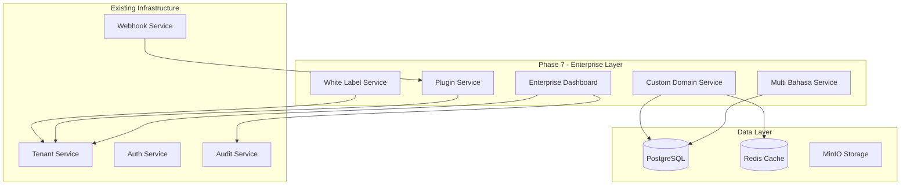
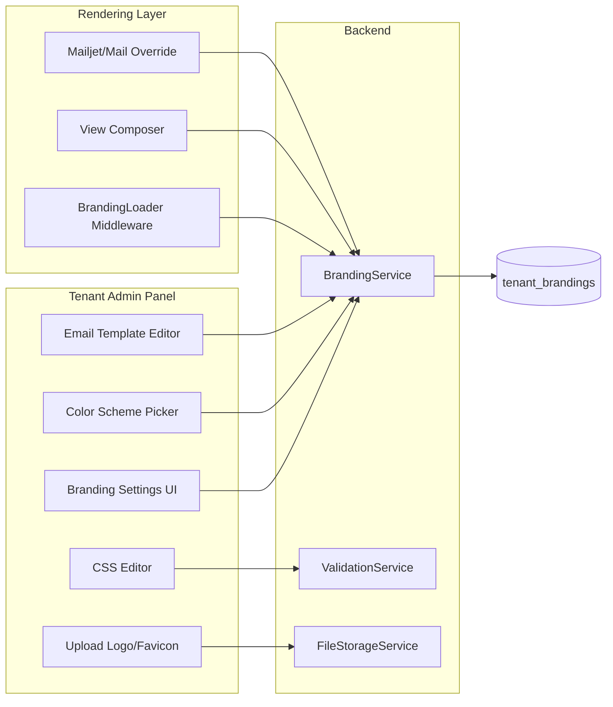
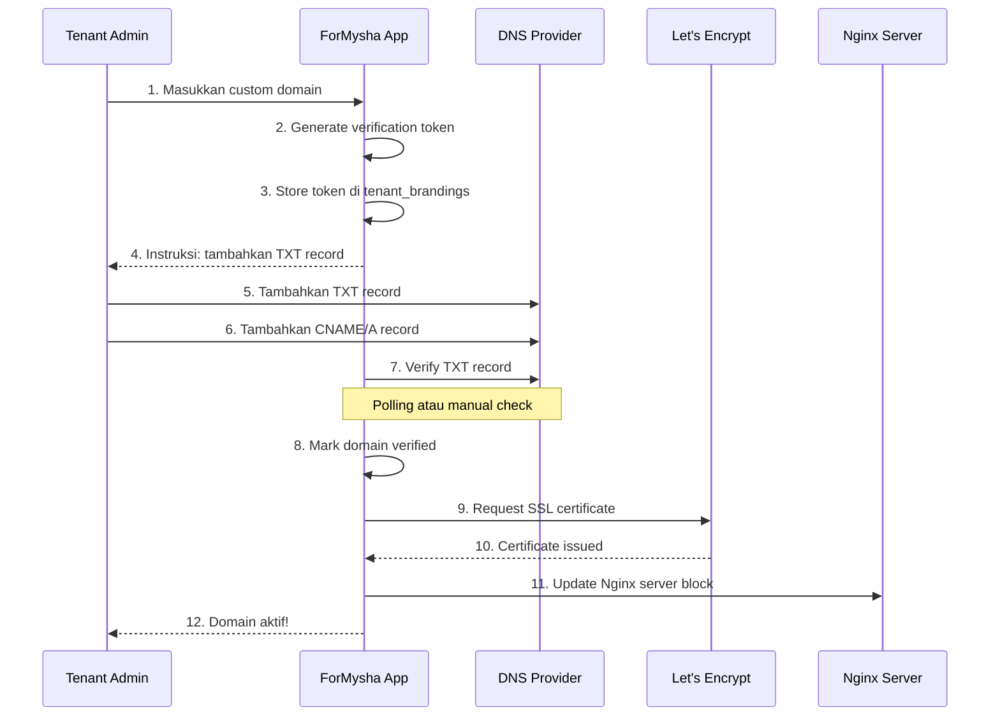
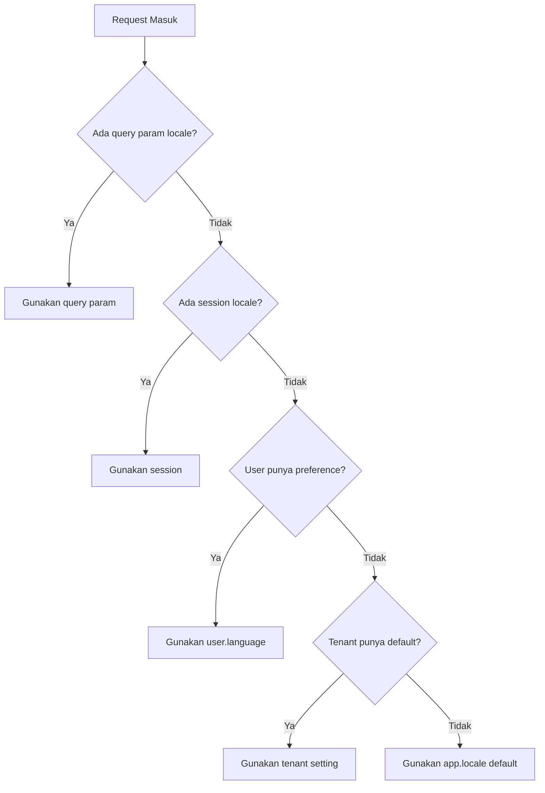
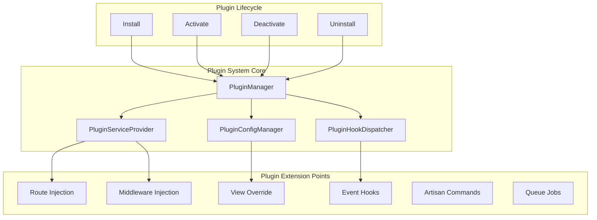
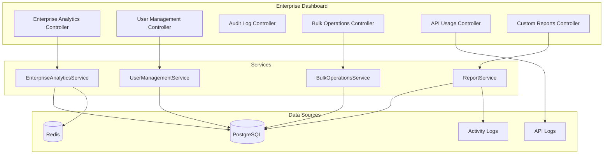
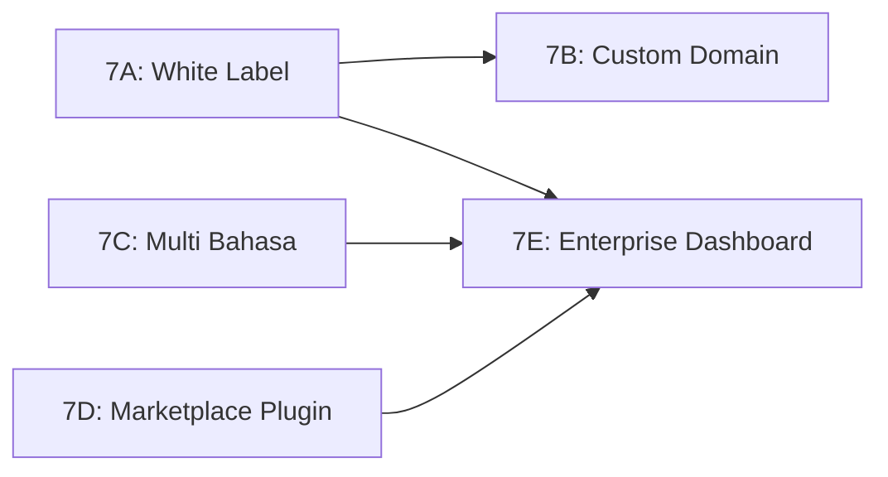

# Phase 7 — Enterprise Architecture

**ForMysha Digital Life Book SaaS**
**Versi Dokumen:** 1.0
**Terakhir Diperbarui:** 2026-08-08

---

## Table of Contents

1. [Overview & Goals](#1-overview--goals)
2. [Database Schema](#2-database-schema)
3. [Feature Specifications](#3-feature-specifications)
   - 3.1 [White Label Enhancement](#31-white-label-enhancement)
   - 3.2 [Custom Domain](#32-custom-domain)
   - 3.3 [Multi Bahasa - i18n](#33-multi-bahasa---i18n)
   - 3.4 [Marketplace Plugin](#34-marketplace-plugin)
   - 3.5 [Enterprise Dashboard](#35-enterprise-dashboard)
4. [Implementation Phases](#4-implementation-phases)
5. [Testing Strategy](#5-testing-strategy)
6. [Dependencies & Considerations](#6-dependencies--considerations)

---

## 1. Overview & Goals

### Tujuan Phase 7

Phase 7 Enterprise dirancang untuk mengubah ForMysha dari SaaS multi-tenant menjadi platform enterprise-grade yang mendukung:

1. **White Label Enhancement** — Tenant dapat menyesuaikan seluruh pengalaman visual dengan brand mereka sendiri
2. **Custom Domain** — Tenant dapat menggunakan domain sendiri (misalnya `anak.kliniksehat.id`)
3. **Multi Bahasa** — Dukungan bahasa Indonesia dan English dengan per-user preference
4. **Marketplace Plugin** — Sistem plugin yang memungkinkan ekstensi fitur tanpa mengubah core
5. **Enterprise Dashboard** — Analytics lanjutan, manajemen pengguna, dan operasi bulk untuk tenant enterprise

### State Saat Ini (setelah Phase 6)

| Komponen | Status |
|----------|--------|
| Multi-tenancy | Column-based `tenant_id UUID NULL` pada semua tabel |
| Subscription | 4 plan: Free, Basic 29K, Premium 59K, Enterprise 199K |
| Tenant Branding | `tenant_brandings` — organization_name, logo_path, favicon_path, primary/secondary/accent_color, custom_css, custom_domain, is_domain_verified |
| Tenant Settings | `tenant_settings` — key-value pairs |
| API | REST API lengkap dengan Sanctum auth, 100+ endpoints |
| Webhook | HMAC-SHA256 verification, event-driven |
| Super Admin | Dashboard, Tenant CRUD, Payment, Plans, Analytics, Monitoring |

### Arsitektur High-Level



---

## 2. Database Schema

### 2.1 Migration Baru

Semua migration menggunakan UUID primary key dan mengikuti konvensi yang sudah ada.

#### Migration 1: Enhance Tenant Branding

```php
// database/migrations/2026_08_08_100001_enhance_tenant_brandings_table.php

Schema::table('tenant_brandings', function (Blueprint $table) {
    // White Label Fields
    $table->string('login_heading')->nullable()->after('organization_name');
    $table->string('login_subheading')->nullable()->after('login_heading');
    $table->string('footer_text')->nullable()->after('login_subheading');
    $table->string('email_sender_name')->nullable()->after('footer_text');
    $table->string('email_sender_address', 100)->nullable()->after('email_sender_name');
    $table->text('email_header_html')->nullable()->after('email_sender_address');
    $table->text('email_footer_html')->nullable()->after('email_header_html');
    $table->boolean('is_white_label_enabled')->default(false)->after('email_footer_html');

    // Domain Fields (dipindah dari Tenant ke Branding untuk konsistensi)
    $table->string('domain_verification_token', 64)->nullable()->after('is_domain_verified');
    $table->timestamp('domain_verified_at')->nullable()->after('domain_verification_token');
    $table->string('ssl_status', 20)->default('pending')->after('domain_verified_at');
    $table->timestamp('ssl_renewed_at')->nullable()->after('ssl_status');

    // Index
    $table->index('is_white_label_enabled');
    $table->index('ssl_status');
});
```

#### Migration 2: Add Language to Users

```php
// database/migrations/2026_08_08_100002_add_language_to_users_table.php

Schema::table('users', function (Blueprint $table) {
    $table->string('language', 5)->default('id')->after('role');
    $table->string('timezone', 50)->nullable()->after('language');
    $table->index('language');
});
```

#### Migration 3: Plugin Tables

```php
// database/migrations/2026_08_08_100003_create_plugins_table.php

Schema::create('plugins', function (Blueprint $table) {
    $table->uuid('id')->primary();
    $table->string('name');
    $table->string('slug')->unique();
    $table->text('description')->nullable();
    $table->string('author')->nullable();
    $table->string('version', 20);
    $table->string('min_core_version', 20)->nullable();
    $table->string('icon_path')->nullable();
    $table->string('screenshot_path')->nullable();
    $table->json('permissions')->nullable();
    $table->json('config_schema')->nullable();
    $table->boolean('is_active')->default(false);
    $table->boolean('is_official')->default(false);
    $table->integer('install_count')->default(0);
    $table->integer('sort_order')->default(0);
    $table->timestamps();
    $table->softDeletes();

    $table->index('slug');
    $table->index('is_active');
    $table->index('is_official');
});
```

#### Migration 4: Tenant Plugin Pivot

```php
// database/migrations/2026_08_08_100004_create_tenant_plugins_table.php

Schema::create('tenant_plugins', function (Blueprint $table) {
    $table->uuid('id')->primary();
    $table->uuid('tenant_id');
    $table->uuid('plugin_id');
    $table->json('config')->nullable();
    $table->boolean('is_enabled')->default(true);
    $table->timestamp('installed_at');
    $table->timestamps();

    $table->foreign('tenant_id')->references('id')->on('tenants')->cascadeOnDelete();
    $table->foreign('plugin_id')->references('id')->on('plugins')->cascadeOnDelete();
    $table->unique(['tenant_id', 'plugin_id']);
    $table->index('tenant_id');
    $table->index('plugin_id');
});
```

#### Migration 5: Tenant Invitations

```php
// database/migrations/2026_08_08_100005_create_tenant_invitations_table.php

Schema::create('tenant_invitations', function (Blueprint $table) {
    $table->uuid('id')->primary();
    $table->uuid('tenant_id');
    $table->string('email');
    $table->string('role', 20)->default('parent');
    $table->string('token', 64)->unique();
    $table->timestamp('expires_at');
    $table->timestamp('accepted_at')->nullable();
    $table->uuid('invited_by');
    $table->timestamps();

    $table->foreign('tenant_id')->references('id')->on('tenants')->cascadeOnDelete();
    $table->foreign('invited_by')->references('id')->on('users')->cascadeOnDelete();
    $table->index('tenant_id');
    $table->index('token');
    $table->index('email');
});
```

#### Migration 6: Enterprise Analytics Tables

```php
// database/migrations/2026_08_08_100006_create_tenant_analytics_table.php

Schema::create('tenant_analytics', function (Blueprint $table) {
    $table->uuid('id')->primary();
    $table->uuid('tenant_id');
    $table->string('metric_type', 50);
    $table->string('metric_key', 100);
    $table->json('metric_value');
    $table->date('recorded_at');
    $table->timestamps();

    $table->foreign('tenant_id')->references('id')->on('tenants')->cascadeOnDelete();
    $table->index(['tenant_id', 'metric_type']);
    $table->index(['tenant_id', 'recorded_at']);
    $table->index(['tenant_id', 'metric_type', 'recorded_at']);
});
```

#### Migration 7: Plugin Logs

```php
// database/migrations/2026_08_08_100007_create_plugin_logs_table.php

Schema::create('plugin_logs', function (Blueprint $table) {
    $table->uuid('id')->primary();
    $table->uuid('plugin_id');
    $table->uuid('tenant_id')->nullable();
    $table->string('level', 20);
    $table->string('event', 100);
    $table->text('message')->nullable();
    $table->json('properties')->nullable();
    $table->timestamps();

    $table->foreign('plugin_id')->references('id')->on('plugins')->cascadeOnDelete();
    $table->foreign('tenant_id')->references('id')->on('tenants')->nullOnDelete();
    $table->index(['plugin_id', 'level']);
    $table->index(['tenant_id', 'created_at']);
});
```

#### Migration 8: Import Jobs

```php
// database/migrations/2026_08_08_100008_create_import_jobs_table.php

Schema::create('import_jobs', function (Blueprint $table) {
    $table->uuid('id')->primary();
    $table->uuid('tenant_id');
    $table->uuid('user_id');
    $table->string('type', 50);
    $table->string('status', 20)->default('pending');
    $table->string('file_path');
    $table->json('options')->nullable();
    $table->integer('total_rows')->default(0);
    $table->integer('processed_rows')->default(0);
    $table->integer('failed_rows')->default(0);
    $table->json('errors')->nullable();
    $table->timestamp('started_at')->nullable();
    $table->timestamp('completed_at')->nullable();
    $table->timestamps();

    $table->foreign('tenant_id')->references('id')->on('tenants')->cascadeOnDelete();
    $table->foreign('user_id')->references('id')->on('users')->cascadeOnDelete();
    $table->index(['tenant_id', 'status']);
    $table->index(['tenant_id', 'type']);
});
```

### 2.2 Ringkasan Tabel Baru

| Tabel | Deskripsi |
|-------|-----------|
| `plugins` | Registry plugin yang tersedia di marketplace |
| `tenant_plugins` | Plugin yang terinstall per tenant, termasuk config |
| `tenant_invitations` | Undangan user ke tenant |
| `tenant_analytics` | Metrik analytics harian per tenant |
| `plugin_logs` | Log aktivitas plugin |
| `import_jobs` | Job import/export data dalam jumlah besar |

### 2.2.1 Kolom Baru pada Tabel Existing

| Tabel | Kolom Baru | Tipe | Deskripsi |
|-------|-----------|------|-----------|
| `tenant_brandings` | `login_heading` | varchar, nullable | Heading halaman login |
| `tenant_brandings` | `login_subheading` | varchar, nullable | Subheading halaman login |
| `tenant_brandings` | `footer_text` | varchar, nullable | Teks footer |
| `tenant_brandings` | `email_sender_name` | varchar, nullable | Nama pengirim email |
| `tenant_brandings` | `email_sender_address` | varchar(100), nullable | Alamat pengirim email |
| `tenant_brandings` | `email_header_html` | text, nullable | Header HTML email template |
| `tenant_brandings` | `email_footer_html` | text, nullable | Footer HTML email template |
| `tenant_brandings` | `is_white_label_enabled` | boolean, default false | Status white label |
| `tenant_brandings` | `domain_verification_token` | varchar(64), nullable | Token verifikasi DNS |
| `tenant_brandings` | `domain_verified_at` | timestamp, nullable | Waktu domain terverifikasi |
| `tenant_brandings` | `ssl_status` | varchar(20), default 'pending' | Status SSL certificate |
| `tenant_brandings` | `ssl_renewed_at` | timestamp, nullable | Waktu SSL terakhir diperbarui |
| `users` | `language` | varchar(5), default 'id' | Preferensi bahasa user |
| `users` | `timezone` | varchar(50), nullable | Preferensi timezone user |

---

## 3. Feature Specifications

### 3.1 White Label Enhancement

#### 3.1.1 Deskripsi

White Label memungkinkan tenant untuk menggunakan ForMysha dengan brand mereka sendiri. Semua elemen visual, email, dan pengalaman pengguna dapat disesuaikan.

#### 3.1.2 Fitur yang Disediakan

| Fitur | Deskripsi | Prioritas |
|-------|-----------|-----------|
| Custom Logo Upload | Logo tenant dengan preview | P0 |
| Custom Color Scheme | Primary, secondary, accent colors | P0 |
| Custom CSS Injection | CSS khusus untuk styling lanjutan | P0 |
| Custom Email Templates | Header/footer HTML untuk email | P1 |
| Custom Login Page | Heading, subheading, background | P1 |
| Favicon Customization | Favicon per tenant | P1 |
| Per-tenant Email Sender | Nama dan alamat pengirim email | P2 |

#### 3.1.3 Arsitektur



#### 3.1.4 Model Enhancement

```php
// app/Models/TenantBranding.php — Tambahan Fields

/**
 * @property string|null $login_heading
 * @property string|null $login_subheading
 * @property string|null $footer_text
 * @property string|null $email_sender_name
 * @property string|null $email_sender_address
 * @property string|null $email_header_html
 * @property string|null $email_footer_html
 * @property bool $is_white_label_enabled
 * @property string|null $domain_verification_token
 * @property Carbon|null $domain_verified_at
 * @property string $ssl_status
 * @property Carbon|null $ssl_renewed_at
 */
```

#### 3.1.5 BrandingService API

```php
// app/Services/BrandingService.php

class BrandingService
{
    public function getBranding(Tenant $tenant): ?TenantBranding;
    public function updateBranding(Tenant $tenant, array $data): TenantBranding;
    public function uploadLogo(Tenant $tenant, UploadedFile $file): string;
    public function uploadFavicon(Tenant $tenant, UploadedFile $file): string;
    public function generateCustomCss(Tenant $tenant): string;
    public function getEmailConfig(Tenant $tenant): array;
    public function isWhiteLabelEnabled(Tenant $tenant): bool;
    public function getLoginCustomization(Tenant $tenant): array;
    public function clearBrandingCache(Tenant $tenant): void;
}
```

#### 3.1.6 Rendering Pipeline

1. **Middleware** — [`ResolveTenant`](app/Http/Middleware/ResolveTenant.php) memuat branding tenant
2. **View Composer** — Register global view data untuk branding variables
3. **Blade Components** — Komponen seperti `<x-brand-logo>`, `<x-brand-colors>` yang dinamis
4. **Mail Override** — Override `sender_name` dan `sender_address` via mail config per tenant

#### 3.1.7 File Storage Structure

```
storage/
  app/
    tenants/
      {tenant_id}/
        branding/
          logo.png
          favicon.ico
          email-header.html
          email-footer.html
          custom.css
```

#### 3.1.8 API Endpoints

| Method | Endpoint | Deskripsi |
|--------|----------|-----------|
| GET | `/super-admin/tenants/{tenant}/branding` | Lihat branding |
| PUT | `/super-admin/tenants/{tenant}/branding` | Update branding |
| POST | `/super-admin/tenants/{tenant}/branding/logo` | Upload logo |
| POST | `/super-admin/tenants/{tenant}/branding/favicon` | Upload favicon |
| DELETE | `/super-admin/tenants/{tenant}/branding/logo` | Hapus logo |
| GET | `/api/tenant/branding` | API: ambil branding |
| PUT | `/api/tenant/branding` | API: update branding |

---

### 3.2 Custom Domain

#### 3.2.1 Deskripsi

Fitur yang memungkinkan tenant menggunakan domain sendiri untuk mengakses aplikasi. Misalnya, Klinik Sehat dapat menggunakan `anak.kliniksehat.id` alih-alih `formysha.my.id/klinik-sehat`.

#### 3.2.2 Alur Domain Setup



#### 3.2.3 DNS Verification

Tenant harus menambahkan 2 record DNS:

| Record Type | Name | Value | Keterangan |
|-------------|------|-------|------------|
| TXT | `_fmverify.{domain}` | `formysha-verify={token}` | Verifikasi kepemilikan |
| CNAME | `{domain}` | `app.formysha.my.id` | Aplikasi (CNAME) |

Atau untuk apex domain:

| Record Type | Name | Value | Keterangan |
|-------------|------|-------|------------|
| A | `{domain}` | `{server_ip}` | Aplikasi (A record) |

#### 3.2.4 Domain Routing Middleware

```php
// app/Http/Middleware/ResolveCustomDomain.php

class ResolveCustomDomain
{
    public function handle(Request $request, Closure $next): Response
    {
        $host = $request->getHost();

        // Skip untuk domain utama
        if ($host === config('app.domain')) {
            return $next($request);
        }

        // Cari tenant berdasarkan custom domain
        $branding = TenantBranding::where('custom_domain', $host)
            ->where('is_domain_verified', true)
            ->first();

        if (! $branding) {
            abort(404, 'Domain tidak dikenali.');
        }

        // Set tenant context
        session()->put('tenant_id', $branding->tenant_id);

        return $next($request);
    }
}
```

#### 3.2.5 SSL Certificate Management

```php
// app/Services/DomainService.php

class DomainService
{
    public function requestVerification(Tenant $tenant, string $domain): array;
    public function verifyDomain(Tenant $tenant): bool;
    public function requestSslCertificate(string $domain): bool;
    public function renewSslCertificate(string $domain): bool;
    public function getDomainStatus(Tenant $tenant): array;
    public function checkDnsRecords(string $domain): array;
    public function updateNginxConfig(Tenant $tenant, string $domain): void;
}
```

**SSL Strategy:**

- Menggunakan Let's Encrypt via ACME protocol
- Auto-renewal 30 hari sebelum expiry
- Fallback ke manual upload SSL certificate
- Status tracking: `pending`, `verifying`, `active`, `expired`, `failed`

#### 3.2.6 Domain Conflict Detection

```php
// Rules:
// 1. Domain harus unik di seluruh sistem
// 2. Domain tidak boleh sama dengan app domain
// 3. Domain tidak boleh mengandung reserved words (api, admin, mail, etc.)
// 4. Subdomain dari domain utama diperbolehkan
// 5. Wildcard domain tidak didukung
```

#### 3.2.7 API Endpoints

| Method | Endpoint | Deskripsi |
|--------|----------|-----------|
| POST | `/super-admin/tenants/{tenant}/domain/verify` | Mulai verifikasi |
| GET | `/super-admin/tenants/{tenant}/domain/status` | Cek status |
| DELETE | `/super-admin/tenants/{tenant}/domain` | Hapus custom domain |
| POST | `/api/tenant/domain/verify` | API: mulai verifikasi |
| GET | `/api/tenant/domain/status` | API: cek status |

---

### 3.3 Multi Bahasa - i18n

#### 3.3.1 Deskripsi

Dukungan bahasa Indonesia dan English dengan per-user preference. Semua UI text, pesan error, date/time format, dan currency format disesuaikan dengan locale yang dipilih.

#### 3.3.2 Struktur Localization

```
lang/
  id/
    auth.php           — Pesan autentikasi
    pagination.php     — Pagination
    passwords.php      — Reset password
    validation.php     — Validasi
    saas.php           — Pesan SaaS
    dashboard.php      — Dashboard
    children.php       — Modul anak
    timeline.php       — Modul timeline
    album.php          — Modul album
    diary.php          — Modul diary
    growth.php         — Modul pertumbuhan
    health.php         — Modul kesehatan
    documents.php      — Modul dokumen
    calendar.php       — Modul kalender
    family.php         — Modul family sharing
    settings.php       — Pengaturan
    common.php         — Text umum (buttons, labels)
    errors.php         — Pesan error
  en/
    auth.php
    pagination.php
    passwords.php
    validation.php
    saas.php
    dashboard.php
    children.php
    timeline.php
    album.php
    diary.php
    growth.php
    health.php
    documents.php
    calendar.php
    family.php
    settings.php
    common.php
    errors.php
```

#### 3.3.3 Language Switcher Component

```blade
{{-- resources/views/components/language-switcher.blade.php --}}

<div x-data="{ open: false }" class="relative">
    <button @click="open = !open" class="flex items-center gap-2 px-3 py-2 rounded-xl">
        <span x-text="getCurrentFlag()"></span>
        <span x-text="getCurrentLabel()"></span>
    </button>

    <div x-show="open" @click.away="open = false"
         class="absolute right-0 mt-2 w-40 bg-white rounded-xl shadow-lg z-50">
        <a href="{{ route('language.switch', 'id') }}"
           class="flex items-center gap-2 px-4 py-2 hover:bg-softPink/10">
            <span>🇮🇩</span>
            <span>Bahasa Indonesia</span>
        </a>
        <a href="{{ route('language.switch', 'en') }}"
           class="flex items-center gap-2 px-4 py-2 hover:bg-softPink/10">
            <span>🇬🇧</span>
            <span>English</span>
        </a>
    </div>
</div>
```

#### 3.3.4 Locale Resolution Priority



#### 3.3.5 Date/Number Formatting

```php
// app/Helpers/LocalizationHelper.php

class LocalizationHelper
{
    /**
     * Format tanggal sesuai locale.
     * id: "8 Agustus 2026"
     * en: "August 8, 2026"
     */
    public static function formatDate(Carbon $date, ?string $locale = null): string;

    /**
     * Format datetime sesuai locale.
     * id: "8 Agustus 2026, 14:30"
     * en: "August 8, 2026, 2:30 PM"
     */
    public static function formatDateTime(Carbon $date, ?string $locale = null): string;

    /**
     * Format mata uang sesuai locale.
     * id: "Rp 29.000"
     * en: "Rp 29,000" atau "$1.93"
     */
    public static function formatCurrency(int $amount, ?string $locale = null): string;

    /**
     * Format angka sesuai locale.
     * id: "1.234.567"
     * en: "1,234,567"
     */
    public static function formatNumber(int $number, ?string $locale = null): string;
}
```

#### 3.3.6 Database Changes

- Kolom `users.language` — varchar(5), default `'id'`
- Kolom `users.timezone` — varchar(50), nullable
- Key `tenant_settings`: `default_locale` (id/en), `default_timezone`

#### 3.3.7 API Endpoints

| Method | Endpoint | Deskripsi |
|--------|----------|-----------|
| POST | `/language/{locale}` | Switch language |
| GET | `/api/user/preferences` | Ambil preference user |
| PUT | `/api/user/preferences` | Update preference user |

---

### 3.4 Marketplace Plugin

#### 3.4.1 Deskripsi

Sistem plugin memungkinkan developer dan tenant untuk memperluas fitur ForMysha tanpa mengubah core application. Plugin dapat menambahkan modul baru, integrasi, atau memodifikasi behavior yang ada.

#### 3.4.2 Arsitektur Plugin



#### 3.4.3 Plugin Manifest (JSON)

```json
{
    "name": "Klinik Integration",
    "slug": "klinik-integration",
    "description": "Integrasi dengan sistem klinik untuk imunisasi dan growth tracking",
    "author": "ForMysha Team",
    "version": "1.0.0",
    "min_core_version": "7.0.0",
    "icon": "icon.png",
    "screenshot": "screenshot.png",
    "permissions": [
        "read:children",
        "write:health_records",
        "read:growth",
        "write:growth"
    ],
    "config_schema": {
        "api_url": {
            "type": "string",
            "required": true,
            "label": "API URL Klinik"
        },
        "api_key": {
            "type": "string",
            "required": true,
            "label": "API Key"
        },
        "sync_interval": {
            "type": "select",
            "options": ["daily", "weekly", "monthly"],
            "default": "weekly",
            "label": "Interval Sinkronisasi"
        }
    },
    "routes": [
        {
            "prefix": "klinik",
            "middleware": ["auth", "verified"],
            "file": "routes.php"
        }
    ],
    "events": [
        "health_record.created",
        "growth.updated"
    ],
    "menu": [
        {
            "label": "Klinik",
            "route": "klinik.dashboard",
            "icon": "medical-icon",
            "position": "sidebar"
        }
    ]
}
```

#### 3.4.4 Plugin Directory Structure

```
plugins/
  klinik-integration/
    src/
      KlinikIntegrationPlugin.php    — Main plugin class
      Controllers/
        KlinikController.php
      Models/
        KlinikSync.php
      Services/
        KlinikApiService.php
      Listeners/
        SyncHealthRecordListener.php
    resources/
      views/
        dashboard.blade.php
      lang/
        id.php
        en.php
      css/
        plugin.css
      js/
        plugin.js
    routes.php
    config.php
    manifest.json
    composer.json
    README.md
```

#### 3.4.5 Plugin Service Provider

```php
// plugins/klinik-integration/src/KlinikIntegrationPlugin.php

namespace Plugins\KlinikIntegration;

use App\Contracts\PluginInterface;
use Illuminate\Support\ServiceProvider;

class KlinikIntegrationPlugin extends ServiceProvider implements PluginInterface
{
    public function boot(): void
    {
        // Load routes
        $this->loadRoutesFrom(__DIR__.'/../routes.php');

        // Load views
        $this->loadViewsFrom(__DIR__.'/../resources/views', 'klinik');

        // Load translations
        $this->loadTranslationsFrom(__DIR__.'/../resources/lang', 'klinik');

        // Register event listeners
        Event::listen(HealthRecordCreated::class, SyncHealthRecordListener::class);
    }

    public function register(): void
    {
        $this->app->bind(KlinikApiService::class, function ($app) {
            return new KlinikApiService(
                config('plugin.klinik.api_url'),
                config('plugin.klinik.api_key'),
            );
        });
    }

    public function getManifest(): array
    {
        return json_decode(file_get_contents(__DIR__.'/../manifest.json'), true);
    }

    public function install(Tenant $tenant): void
    {
        // Setup logic
    }

    public function uninstall(Tenant $tenant): void
    {
        // Cleanup logic
    }

    public function activate(Tenant $tenant): void
    {
        // Activation logic
    }

    public function deactivate(Tenant $tenant): void
    {
        // Deactivation logic
    }
}
```

#### 3.4.6 Plugin Hook System

```php
// app/Services/PluginService.php

class PluginService
{
    /**
     * Dispatch hook ke semua active plugins.
     */
    public function dispatchHook(string $hook, array $payload): array;

    /**
     * Register plugin route.
     */
    public function registerPluginRoutes(string $pluginSlug): void;

    /**
     * Get active plugins untuk tenant.
     */
    public function getActivePlugins(Tenant $tenant): Collection;

    /**
     * Install plugin untuk tenant.
     */
    public function installPlugin(Tenant $tenant, Plugin $plugin, array $config = []): TenantPlugin;

    /**
     * Uninstall plugin dari tenant.
     */
    public function uninstallPlugin(Tenant $tenant, Plugin $plugin): bool;

    /**
     * Activate/deactivate plugin.
     */
    public function togglePlugin(Tenant $tenant, Plugin $plugin, bool $active): bool;

    /**
     * Get plugin configuration.
     */
    public function getPluginConfig(Tenant $tenant, Plugin $plugin): array;

    /**
     * Update plugin configuration.
     */
    public function updatePluginConfig(Tenant $tenant, Plugin $plugin, array $config): bool;
}
```

#### 3.4.7 Plugin Interface

```php
// app/Contracts/PluginInterface.php

namespace App\Contracts;

interface PluginInterface
{
    /**
     * Manifest plugin.
     */
    public function getManifest(): array;

    /**
     * Dipanggil saat plugin diinstall ke tenant.
     */
    public function install(Tenant $tenant): void;

    /**
     * Dipanggil saat plugin diuninstall dari tenant.
     */
    public function uninstall(Tenant $tenant): void;

    /**
     * Dipanggil saat plugin diaktifkan.
     */
    public function activate(Tenant $tenant): void;

    /**
     * Dipanggil saat plugin dinonaktifkan.
     */
    public function deactivate(Tenant $tenant): void;
}
```

#### 3.4.8 Plugin Security

| Aspek | Strategi |
|-------|----------|
| Sandbox | Plugin berjalan dalam namespace sendiri |
| Permissions | Permission system berbasis manifest |
| Config Validation | Validasi config schema saat install |
| Rate Limiting | Plugin API calls dilimit per tenant |
| Audit Trail | Semua aktivitas plugin dilog |
| Isolation | Plugin tidak bisa akses data tenant lain |

#### 3.4.9 API Endpoints

| Method | Endpoint | Deskripsi |
|--------|----------|-----------|
| GET | `/super-admin/plugins` | List semua plugin |
| POST | `/super-admin/plugins` | Upload plugin baru |
| PUT | `/super-admin/plugins/{plugin}` | Update plugin |
| DELETE | `/super-admin/plugins/{plugin}` | Hapus plugin |
| POST | `/super-admin/plugins/{plugin}/toggle` | Aktifkan/nonaktifkan global |
| GET | `/tenant-admin/plugins` | List plugin untuk tenant |
| POST | `/tenant-admin/plugins/{plugin}/install` | Install plugin ke tenant |
| POST | `/tenant-admin/plugins/{plugin}/uninstall` | Uninstall plugin dari tenant |
| PUT | `/tenant-admin/plugins/{plugin}/config` | Update config plugin |
| GET | `/api/plugins` | API: list plugin |

---

### 3.5 Enterprise Dashboard

#### 3.5.1 Deskripsi

Dashboard analytics lanjutan untuk tenant dengan plan Enterprise. Menyediakan insight mendalam tentang penggunaan aplikasi, engagement pengguna, dan kemampuan operasional dalam skala besar.

#### 3.5.2 Fitur Enterprise Dashboard

| Fitur | Deskripsi | Prioritas |
|-------|-----------|-----------|
| Advanced Analytics | Retention, engagement, feature usage, growth trends | P0 |
| User Management | Invite users, role assignment, bulk operations | P0 |
| Audit Log Viewer | Filter, search, export audit logs | P0 |
| Bulk Operations | Import/export data dalam jumlah besar | P1 |
| API Usage Analytics | Endpoint usage, rate limiting stats, error rates | P1 |
| Custom Reports | Buat dan schedule report | P2 |

#### 3.5.3 Arsitektur Dashboard



#### 3.5.4 Advanced Analytics Metrics

```php
// app/Services/EnterpriseAnalyticsService.php

class EnterpriseAnalyticsService
{
    /**
     * User retention: berapa % user yang masih aktif setelah X hari.
     */
    public function getRetentionRate(Tenant $tenant, int $days = 30): array;

    /**
     * Feature usage: fitur mana yang paling sering digunakan.
     */
    public function getFeatureUsage(Tenant $tenant, string $period = '30d'): array;

    /**
     * Engagement score: kombinasi login frequency, actions per session, dll.
     */
    public function getEngagementScore(Tenant $tenant): float;

    /**
     * Growth trends: pertumbuhan jumlah children, media, dll.
     */
    public function getGrowthTrends(Tenant $tenant, string $period = '90d'): array;

    /**
     * Storage analytics: breakdown penggunaan storage per kategori.
     */
    public function getStorageAnalytics(Tenant $tenant): array;

    /**
     * Activity heatmap: aktivitas per jam/hari.
     */
    public function getActivityHeatmap(Tenant $tenant, string $period = '30d'): array;

    /**
     * Summary dashboard data.
     */
    public function getDashboardSummary(Tenant $tenant): array;
}
```

#### 3.5.5 User Management

```php
// app/Services/UserManagementService.php

class UserManagementService
{
    /**
     * Kirim undangan ke email.
     */
    public function inviteUser(Tenant $tenant, string $email, string $role, User $invitedBy): TenantInvitation;

    /**
     * Validasi dan terima undangan.
     */
    public function acceptInvitation(string $token, User $user): bool;

    /**
     * Update role user dalam tenant.
     */
    public function updateRole(Tenant $tenant, User $targetUser, string $newRole, User $admin): bool;

    /**
     * Hapus user dari tenant.
     */
    public function removeUser(Tenant $tenant, User $targetUser, User $admin): bool;

    /**
     * List semua user dalam tenant.
     */
    public function listUsers(Tenant $tenant, array $filters = []): LengthAwarePaginator;

    /**
     * Bulk update roles.
     */
    public function bulkUpdateRoles(Tenant $tenant, array $userIds, string $role, User $admin): int;

    /**
     * User activity summary.
     */
    public function getUserActivity(Tenant $tenant, User $user): array;
}
```

#### 3.5.6 Bulk Operations

```php
// app/Services/BulkOperationsService.php

class BulkOperationsService
{
    /**
     * Import children dari CSV/Excel.
     */
    public function importChildren(Tenant $tenant, UploadedFile $file, array $options): ImportJob;

    /**
     * Import timelines dari CSV/Excel.
     */
    public function importTimelines(Tenant $tenant, UploadedFile $file, array $options): ImportJob;

    /**
     * Export semua data tenant ke CSV/ZIP.
     */
    public function exportAll(Tenant $tenant, string $format = 'csv'): ImportJob;

    /**
     * Export children ke CSV.
     */
    public function exportChildren(Tenant $tenant, array $filters = []): string;

    /**
     * Export timelines ke CSV.
     */
    public function exportTimelines(Tenant $tenant, array $filters = []): string;

    /**
     * Bulk delete records.
     */
    public function bulkDelete(Tenant $tenant, string $type, array $ids, User $admin): int;

    /**
     * Check import job status.
     */
    public function getJobStatus(ImportJob $job): array;
}
```

#### 3.5.7 Audit Log Viewer

```php
// Fitur Audit Log untuk Enterprise

// Filter capabilities:
// - Date range
// - User
// - Event type
// - Entity type
// - IP address
// - Free text search

// Export capabilities:
// - CSV export
// - PDF export
// - Scheduled daily/weekly export via email
```

#### 3.5.8 API Usage Analytics

```php
// app/Services/ApiAnalyticsService.php

class ApiAnalyticsService
{
    /**
     * API call volume per hari/minggu/bulan.
     */
    public function getCallVolume(Tenant $tenant, string $period = '30d'): array;

    /**
     * Endpoint usage breakdown.
     */
    public function getEndpointUsage(Tenant $tenant, string $period = '30d'): array;

    /**
     * Error rate analysis.
     */
    public function getErrorRates(Tenant $tenant, string $period = '30d'): array;

    /**
     * Rate limiting stats.
     */
    public function getRateLimitStats(Tenant $tenant): array;

    /**
     * Response time analysis.
     */
    public function getResponseTimeStats(Tenant $tenant, string $period = '30d'): array;
}
```

#### 3.5.9 Custom Reports

```php
// app/Services/ReportService.php

class ReportService
{
    /**
     * Generate custom report.
     */
    public function generateReport(Tenant $tenant, array $config): ReportResult;

    /**
     * List saved reports.
     */
    public function listReports(Tenant $tenant): Collection;

    /**
     * Save report template.
     */
    public function saveReport(Tenant $tenant, string $name, array $config): Report;

    /**
     * Schedule report via email.
     */
    public function scheduleReport(Tenant $tenant, Report $report, string $frequency): ReportSchedule;

    /**
     * Send scheduled report.
     */
    public function sendScheduledReport(ReportSchedule $schedule): void;
}
```

#### 3.5.10 Enterprise Analytics Table Schema

```sql
-- tenant_analytics: Metrik harian per tenant
-- metric_type: 'retention', 'engagement', 'feature_usage', 'storage', 'activity'
-- metric_key: Nama spesifik metrik
-- metric_value: JSON value

-- Contoh data:
-- metric_type: 'retention'
-- metric_key: '30_day'
-- metric_value: {"active_users": 85, "total_users": 100, "rate": 0.85}
-- recorded_at: '2026-08-08'

-- metric_type: 'feature_usage'
-- metric_key: 'daily'
-- metric_value: {"timeline": 45, "album": 32, "diary": 18, "growth": 12, "health": 8}
-- recorded_at: '2026-08-08'
```

#### 3.5.11 API Endpoints

| Method | Endpoint | Deskripsi |
|--------|----------|-----------|
| GET | `/tenant-admin/enterprise/analytics` | Dashboard analytics |
| GET | `/tenant-admin/enterprise/analytics/retention` | Retention data |
| GET | `/tenant-admin/enterprise/analytics/engagement` | Engagement data |
| GET | `/tenant-admin/enterprise/analytics/features` | Feature usage |
| GET | `/tenant-admin/enterprise/analytics/storage` | Storage breakdown |
| GET | `/tenant-admin/enterprise/analytics/heatmap` | Activity heatmap |
| GET | `/tenant-admin/enterprise/users` | List users |
| POST | `/tenant-admin/enterprise/users/invite` | Invite user |
| PUT | `/tenant-admin/enterprise/users/{user}/role` | Update role |
| DELETE | `/tenant-admin/enterprise/users/{user}` | Remove user |
| POST | `/tenant-admin/enterprise/bulk/import` | Bulk import |
| POST | `/tenant-admin/enterprise/bulk/export` | Bulk export |
| GET | `/tenant-admin/enterprise/audit-logs` | Audit log viewer |
| GET | `/tenant-admin/enterprise/api-usage` | API usage stats |
| GET | `/tenant-admin/enterprise/reports` | List reports |
| POST | `/tenant-admin/enterprise/reports` | Create report |
| POST | `/tenant-admin/enterprise/reports/{report}/schedule` | Schedule report |
| GET | `/api/enterprise/analytics` | API: analytics |
| GET | `/api/enterprise/users` | API: user management |

---

## 4. Implementation Phases

### Sub-Phase 7A: White Label Enhancement

| # | Task | File/Path | Dependensi |
|---|------|-----------|------------|
| 7A.1 | Migration: tambah kolom ke `tenant_brandings` | `database/migrations/2026_08_08_100001_enhance_tenant_brandings_table.php` | — |
| 7A.2 | Update `TenantBranding` model | `app/Models/TenantBranding.php` | 7A.1 |
| 7A.3 | Buat `BrandingService` | `app/Services/BrandingService.php` | 7A.2 |
| 7A.4 | Buat `BrandingController` (Tenant Admin) | `app/Http/Controllers/TenantAdmin/BrandingController.php` | 7A.3 |
| 7A.5 | Buat Blade components dinamis | `resources/views/components/brand-*.blade.php` | 7A.2 |
| 7A.6 | Update View Composer untuk branding | `app/Providers/AppServiceProvider.php` | 7A.3 |
| 7A.7 | Buat halaman Branding Settings | `resources/views/tenant-admin/branding/` | 7A.4, 7A.5 |
| 7A.8 | File upload handler (logo, favicon) | `BrandingService` | 7A.3 |
| 7A.9 | Email template override | `app/Mail/` + `BrandingService` | 7A.3 |
| 7A.10 | Route: tenant admin branding | `routes/tenant-admin.php` | 7A.4 |
| 7A.11 | Tests | `tests/Feature/BrandingTest.php` | Semua 7A |

### Sub-Phase 7B: Custom Domain

| # | Task | File/Path | Dependensi |
|---|------|-----------|------------|
| 7B.1 | Migration: tambah kolom domain ke `tenant_brandings` | Sudah termasuk di 7A.1 | 7A.1 |
| 7B.2 | Buat `DomainService` | `app/Services/DomainService.php` | 7A.2 |
| 7B.3 | Buat `ResolveCustomDomain` middleware | `app/Http/Middleware/ResolveCustomDomain.php` | 7B.2 |
| 7B.4 | Register middleware di `bootstrap/app.php` | `bootstrap/app.php` | 7B.3 |
| 7B.5 | DNS verification logic | `DomainService` | 7B.2 |
| 7B.6 | SSL certificate management | `DomainService` | 7B.2 |
| 7B.7 | Nginx config generator | `DomainService` + artisan command | 7B.6 |
| 7B.8 | Domain management UI | `resources/views/tenant-admin/domain/` | 7B.2 |
| 7B.9 | Domain conflict detection | `DomainService` | 7B.2 |
| 7B.10 | API: domain endpoints | `app/Http/Controllers/Api/` | 7B.2 |
| 7B.11 | Tests | `tests/Feature/DomainTest.php` | Semua 7B |

### Sub-Phase 7C: Multi Bahasa

| # | Task | File/Path | Dependensi |
|---|------|-----------|------------|
| 7C.1 | Migration: tambah kolom `language`, `timezone` ke `users` | `database/migrations/2026_08_08_100002_add_language_to_users_table.php` | — |
| 7C.2 | Buat file localization `lang/id/*.php` | `lang/id/` | — |
| 7C.3 | Buat file localization `lang/en/*.php` | `lang/en/` | — |
| 7C.4 | Buat `LocalizationHelper` | `app/Helpers/LocalizationHelper.php` | 7C.2, 7C.3 |
| 7C.5 | Buat Language Switcher component | `resources/views/components/language-switcher.blade.php` | 7C.4 |
| 7C.6 | Buat `LanguageController` | `app/Http/Controllers/LanguageController.php` | 7C.4 |
| 7C.7 | Locale resolution middleware | `app/Http/Middleware/SetLocale.php` | 7C.4 |
| 7C.8 | Replace hardcoded strings di Blade | `resources/views/**/*.blade.php` | 7C.2, 7C.3 |
| 7C.9 | Update date/number formatting | `LocalizationHelper` + Blade | 7C.4 |
| 7C.10 | User preference update | `ProfileController` | 7C.1 |
| 7C.11 | API: preference endpoints | `app/Http/Controllers/Api/` | 7C.4 |
| 7C.12 | Tests | `tests/Feature/LanguageTest.php` | Semua 7C |

### Sub-Phase 7D: Marketplace Plugin

| # | Task | File/Path | Dependensi |
|---|------|-----------|------------|
| 7D.1 | Migration: `plugins`, `tenant_plugins`, `plugin_logs` | `database/migrations/2026_08_08_100003-04-07` | — |
| 7D.2 | Buat `Plugin` model | `app/Models/Plugin.php` | 7D.1 |
| 7D.3 | Buat `TenantPlugin` model | `app/Models/TenantPlugin.php` | 7D.1 |
| 7D.4 | Buat `PluginLog` model | `app/Models/PluginLog.php` | 7D.1 |
| 7D.5 | Buat `PluginInterface` | `app/Contracts/PluginInterface.php` | — |
| 7D.6 | Buat `PluginServiceProvider` | `app/Providers/PluginServiceProvider.php` | 7D.5 |
| 7D.7 | Buat `PluginManager` | `app/Services/PluginManager.php` | 7D.6 |
| 7D.8 | Buat `PluginService` | `app/Services/PluginService.php` | 7D.7 |
| 7D.9 | Buat `PluginHookDispatcher` | `app/Services/PluginHookDispatcher.php` | 7D.7 |
| 7D.10 | Buat `PluginConfigManager` | `app/Services/PluginConfigManager.php` | 7D.7 |
| 7D.11 | Plugin controller (Super Admin) | `app/Http/Controllers/SuperAdmin/PluginController.php` | 7D.8 |
| 7D.12 | Plugin controller (Tenant Admin) | `app/Http/Controllers/TenantAdmin/PluginController.php` | 7D.8 |
| 7D.13 | Plugin installation UI | `resources/views/super-admin/plugins/` | 7D.11 |
| 7D.14 | Plugin management UI (Tenant) | `resources/views/tenant-admin/plugins/` | 7D.12 |
| 7D.15 | Plugin routes injection | `PluginServiceProvider` | 7D.6 |
| 7D.16 | Plugin view override system | `PluginConfigManager` | 7D.10 |
| 7D.17 | Plugin factory & seeder | `database/factories/`, `database/seeders/` | 7D.2 |
| 7D.18 | Tests | `tests/Feature/PluginTest.php` | Semua 7D |

### Sub-Phase 7E: Enterprise Dashboard

| # | Task | File/Path | Dependensi |
|---|------|-----------|------------|
| 7E.1 | Migration: `tenant_analytics`, `tenant_invitations`, `import_jobs` | `database/migrations/2026_08_08_100005-06-08` | — |
| 7E.2 | Update `User` model (language, timezone) | `app/Models/User.php` | 7C.1 |
| 7E.3 | Buat `TenantInvitation` model | `app/Models/TenantInvitation.php` | 7E.1 |
| 7E.4 | Buat `TenantAnalytics` model | `app/Models/TenantAnalytics.php` | 7E.1 |
| 7E.5 | Buat `ImportJob` model | `app/Models/ImportJob.php` | 7E.1 |
| 7E.6 | Buat `EnterpriseAnalyticsService` | `app/Services/EnterpriseAnalyticsService.php` | 7E.4 |
| 7E.7 | Buat `UserManagementService` | `app/Services/UserManagementService.php` | 7E.3 |
| 7E.8 | Buat `BulkOperationsService` | `app/Services/BulkOperationsService.php` | 7E.5 |
| 7E.9 | Buat `ApiAnalyticsService` | `app/Services/ApiAnalyticsService.php` | 7E.4 |
| 7E.10 | Buat `ReportService` | `app/Services/ReportService.php` | 7E.6 |
| 7E.11 | Enterprise Dashboard controller | `app/Http/Controllers/TenantAdmin/EnterpriseController.php` | 7E.6-7E.10 |
| 7E.12 | User management controller | `app/Http/Controllers/TenantAdmin/EnterpriseUserController.php` | 7E.7 |
| 7E.13 | Bulk operations controller | `app/Http/Controllers/TenantAdmin/BulkController.php` | 7E.8 |
| 7E.14 | Audit log viewer (enhanced) | `app/Http/Controllers/TenantAdmin/AuditLogController.php` | — |
| 7E.15 | Enterprise dashboard UI | `resources/views/tenant-admin/enterprise/` | 7E.11 |
| 7E.16 | User management UI | `resources/views/tenant-admin/enterprise/users/` | 7E.12 |
| 7E.17 | Bulk import/export UI | `resources/views/tenant-admin/enterprise/bulk/` | 7E.13 |
| 7E.18 | API usage analytics UI | `resources/views/tenant-admin/enterprise/api-usage/` | 7E.9 |
| 7E.19 | Custom reports UI | `resources/views/tenant-admin/enterprise/reports/` | 7E.10 |
| 7E.20 | Analytics data collection job | `app/Jobs/CollectAnalyticsJob.php` | 7E.6 |
| 7E.21 | Schedule analytics collection | `routes/console.php` | 7E.20 |
| 7E.22 | API: enterprise endpoints | `app/Http/Controllers/Api/EnterpriseController.php` | 7E.6-7E.10 |
| 7E.23 | Tests | `tests/Feature/EnterpriseDashboardTest.php` | Semua 7E |

### Dependency Graph



**Urutan Implementasi yang Disarankan:**

1. **7C: Multi Bahasa** — Foundation untuk semua text
2. **7A: White Label Enhancement** — Enhance branding system
3. **7B: Custom Domain** — Building on branding
4. **7D: Marketplace Plugin** — Independent, bisa paralel
5. **7E: Enterprise Dashboard** — Menggunakan semua komponen di atas

---

## 5. Testing Strategy

### 5.1 Test Types

| Type | Jumlah Target | Coverage |
|------|--------------|----------|
| Feature Tests | 80+ | Semua endpoint dan alur utama |
| Unit Tests | 40+ | Service layer, helper, model |
| API Tests | 30+ | Semua API endpoints |
| Integration Tests | 15+ | Cross-service workflows |
| **Total** | **165+** | — |

### 5.2 Feature Test Coverage

#### 7A: White Label

```php
// tests/Feature/BrandingTest.php
describe('Branding Management', function () {
    it('can view branding settings');
    it('can update organization name');
    it('can upload custom logo');
    it('can upload custom favicon');
    it('can update color scheme');
    it('can inject custom css');
    it('can update email templates');
    it('can customize login page');
    it('validates file upload size');
    it('validates color format');
    it('prevents css injection attacks');
    it('clears branding cache after update');
    it('super admin can manage any tenant branding');
    it('tenant admin can manage own branding');
    it('parent cannot access branding settings');
});
```

#### 7B: Custom Domain

```php
// tests/Feature/DomainTest.php
describe('Custom Domain', function () {
    it('can request domain verification');
    it('generates unique verification token');
    it('can verify domain ownership via DNS');
    it('prevents duplicate domain assignment');
    it('prevents reserved word domains');
    it('can remove custom domain');
    it('resolves tenant via custom domain');
    it('returns 404 for unverified domain');
    it('manages SSL certificate lifecycle');
    it('detects domain conflicts');
    it('tenant admin can manage own domain');
    it('parent cannot access domain settings');
});
```

#### 7C: Multi Bahasa

```php
// tests/Feature/LanguageTest.php
describe('Multi Bahasa', function () {
    it('can switch language to english');
    it('can switch language to indonesia');
    it('persists language preference');
    it('formats dates in indonesian locale');
    it('formats dates in english locale');
    it('formats currency in indonesian locale');
    it('formats currency in english locale');
    it('resolves locale from user preference');
    it('resolves locale from tenant setting');
    it('falls back to app default locale');
    it('api returns localized responses');
    it('validates locale parameter');
});
```

#### 7D: Marketplace Plugin

```php
// tests/Feature/PluginTest.php
describe('Marketplace Plugin', function () {
    it('can list available plugins');
    it('can install plugin to tenant');
    it('can uninstall plugin from tenant');
    it('can activate plugin');
    it('can deactivate plugin');
    it('validates plugin permissions');
    it('validates plugin config schema');
    it('prevents duplicate installation');
    it('plugin routes are accessible');
    it('plugin views are rendered');
    it('plugin hooks are dispatched');
    it('super admin can manage global plugins');
    it('tenant admin can install plugins for own tenant');
    it('parent cannot manage plugins');
    it('plugin logs are recorded');
});
```

#### 7E: Enterprise Dashboard

```php
// tests/Feature/EnterpriseDashboardTest.php
describe('Enterprise Dashboard', function () {
    it('can view analytics dashboard');
    it('can view retention data');
    it('can view engagement data');
    it('can view feature usage');
    it('can view storage analytics');
    it('can view activity heatmap');
    it('can invite user');
    it('can accept invitation');
    it('can update user role');
    it('can remove user');
    it('can bulk import children');
    it('can bulk export data');
    it('can view audit logs with filters');
    it('can view api usage stats');
    it('can create custom report');
    it('can schedule report');
    it('only enterprise plan can access');
    it('collects analytics data via job');
});
```

### 5.3 Unit Test Coverage

```php
// tests/Unit/Services/BrandingServiceTest.php
// tests/Unit/Services/DomainServiceTest.php
// tests/Unit/Services/PluginServiceTest.php
// tests/Unit/Services/EnterpriseAnalyticsServiceTest.php
// tests/Unit/Services/UserManagementServiceTest.php
// tests/Unit/Services/BulkOperationsServiceTest.php
// tests/Unit/Helpers/LocalizationHelperTest.php
// tests/Unit/Middleware/ResolveCustomDomainTest.php
// tests/Unit/Middleware/SetLocaleTest.php
```

### 5.4 API Test Coverage

```php
// tests/Feature/Api/BrandingApiTest.php
// tests/Feature/Api/DomainApiTest.php
// tests/Feature/Api/LanguageApiTest.php
// tests/Feature/Api/PluginApiTest.php
// tests/Feature/Api/EnterpriseApiTest.php
```

### 5.5 Testing Checklist

- [ ] Semua feature tests passing
- [ ] Semua unit tests passing
- [ ] Semua API tests passing
- [ ] `php artisan test --compact` — 0 failures
- [ ] `vendor/bin/pint --dirty --format agent` — clean
- [ ] Manual QA: White Label flow
- [ ] Manual QA: Custom Domain setup
- [ ] Manual QA: Language switching
- [ ] Manual QA: Plugin install/activate
- [ ] Manual QA: Enterprise Dashboard analytics

---

## 6. Dependencies & Considerations

### 6.1 Package Dependencies

| Package | Versi | Kebutuhan | Keterangan |
|---------|-------|-----------|------------|
| Laravel Framework | 13.x | Core | Sudah terinstall |
| PHP | 8.4 | Core | Sudah terinstall |
| Laravel Sanctum | — | Core | Sudah terinstall (API auth) |
| Intervention Image | 3.x | White Label | Image processing untuk logo |
| PHPMailer/Symfony Mailer | — | White Label | Email override |
| Maatwebsite Excel | 3.1 | Enterprise | Import/export CSV/Excel |
| Spatie Laravel-medialibrary | 11.x | White Label | File management |
| acme-php/ssl | — | Custom Domain | Let's Encrypt ACME client |

### 6.2 Server Requirements

| Komponen | Requirement | Keterangan |
|----------|-------------|------------|
| Nginx | Wildcard SSL support | Untuk custom domain |
| Certbot | Let's Encrypt client | Auto SSL renewal |
| PHP | 8.4+ | Sudah terpenuhi |
| PostgreSQL | 15+ | Sudah terpenuhi |
| Redis | 7+ | Cache plugin, rate limiting |
| Disk Space | Tambahan 10GB | Plugin storage, backups |

### 6.3 Security Considerations

| Aspek | Strategi |
|-------|----------|
| Custom CSS Injection | HTMLPurifier untuk sanitasi, CSP header |
| Plugin Sandbox | Namespace isolation, permission checking |
| Domain Verification | DNS TXT record verification |
| SSL Management | Let's Encrypt rate limits awareness |
| CSRF Protection | Standard Laravel CSRF untuk semua form |
| XSS Prevention | Blade auto-escaping + HTMLPurifier |
| SQL Injection | Eloquent ORM protection |
| Rate Limiting | Per-tenant API rate limiting |

### 6.4 Performance Considerations

| Aspek | Strategi |
|-------|----------|
| Branding Cache | Redis cache untuk branding data (TTL: 1 hour) |
| Plugin Cache | Cache active plugins list per tenant |
| Domain Resolution | Redis cache untuk domain -> tenant mapping |
| Analytics | Background job untuk data collection |
| Bulk Operations | Queue-based processing, chunked queries |
| File Upload | Queue-based processing untuk file besar |

### 6.5 Migration Strategy

1. **Phase 7A-7B** — White Label & Custom Domain dapat dimulai tanpa dependency
2. **Phase 7C** — Multi Bahasa membutuhkan crowdin/string review
3. **Phase 7D** — Marketplace Plugin membutuhkan design review untuk API contract
4. **Phase 7E** — Enterprise Dashboard membutuhkan data seeding untuk analytics

### 6.6 Rollback Plan

- Setiap sub-phase memiliki migration `down()` method
- Plugin system dirancang non-invasive (tidak mengubah core)
- Custom domain dapat dinonaktifkan via config
- White label dapat di-reset ke default

### 6.7 Monitoring & Alerting

| Metric | Threshold | Action |
|--------|-----------|--------|
| Plugin error rate | > 5% | Disable plugin, alert admin |
| SSL certificate expiry | < 30 days | Auto-renewal trigger |
| Domain verification failure | > 3 retries | Alert tenant admin |
| Bulk operation failure | > 10% rows | Pause job, alert admin |
| API rate limit hits | > 100/min per tenant | Review plan limits |

---

## Appendix A: File Structure New

```
app/
  Contracts/
    PluginInterface.php
  Helpers/
    LocalizationHelper.php
  Http/
    Controllers/
      LanguageController.php
      TenantAdmin/
        BrandingController.php
        EnterpriseController.php
        EnterpriseUserController.php
        BulkController.php
        AuditLogController.php
        PluginController.php
        SettingsController.php
      SuperAdmin/
        PluginController.php
    Middleware/
      ResolveCustomDomain.php
      SetLocale.php
  Models/
    Plugin.php
    TenantPlugin.php
    PluginLog.php
    TenantInvitation.php
    TenantAnalytics.php
    ImportJob.php
    Report.php
    ReportSchedule.php
  Providers/
    PluginServiceProvider.php
  Services/
    BrandingService.php
    DomainService.php
    PluginManager.php
    PluginService.php
    PluginHookDispatcher.php
    PluginConfigManager.php
    EnterpriseAnalyticsService.php
    UserManagementService.php
    BulkOperationsService.php
    ApiAnalyticsService.php
    ReportService.php

lang/
  id/
    auth.php, dashboard.php, children.php, timeline.php, album.php,
    diary.php, growth.php, health.php, documents.php, calendar.php,
    family.php, settings.php, common.php, errors.php, saas.php,
    pagination.php, passwords.php, validation.php
  en/
    (same files as id/)

plugins/
  (plugin directories)

database/
  migrations/
    2026_08_08_100001_enhance_tenant_brandings_table.php
    2026_08_08_100002_add_language_to_users_table.php
    2026_08_08_100003_create_plugins_table.php
    2026_08_08_100004_create_tenant_plugins_table.php
    2026_08_08_100005_create_tenant_invitations_table.php
    2026_08_08_100006_create_tenant_analytics_table.php
    2026_08_08_100007_create_plugin_logs_table.php
    2026_08_08_100008_create_import_jobs_table.php
  factories/
    PluginFactory.php
    TenantPluginFactory.php
    TenantInvitationFactory.php
    TenantAnalyticsFactory.php
    ImportJobFactory.php

resources/
  views/
    components/
      language-switcher.blade.php
      brand-logo.blade.php
      brand-colors.blade.php
    tenant-admin/
      branding/
        index.blade.php
        edit.blade.php
      domain/
        index.blade.php
        verify.blade.php
      enterprise/
        dashboard.blade.php
        users/
          index.blade.php
          invite.blade.php
        bulk/
          import.blade.php
          export.blade.php
        api-usage/
          index.blade.php
        reports/
          index.blade.php
          create.blade.php
      plugins/
        index.blade.php
        show.blade.php
    super-admin/
      plugins/
        index.blade.php
        create.blade.php
        show.blade.php

routes/
  enterprise.php    — Enterprise dashboard routes
```

## Appendix B: API Response Format

Semua API Phase 7 mengikuti format yang sudah ada:

```json
// Success
{
    "success": true,
    "message": "Branding berhasil diperbarui",
    "data": { ... }
}

// Success with pagination
{
    "success": true,
    "message": "Berhasil",
    "data": [ ... ],
    "meta": {
        "current_page": 1,
        "last_page": 5,
        "per_page": 15,
        "total": 72
    }
}

// Error
{
    "success": false,
    "message": "Validasi gagal",
    "errors": {
        "email": ["Email sudah terdaftar"]
    }
}
```

## Appendix C: Configuration Additions

```php
// config/saas.php — Tambahan

'enterprise' => [
    'analytics_retention_days' => 365,
    'max_bulk_import_rows' => 10000,
    'max_plugins_per_tenant' => 10,
    'custom_domain_enabled' => true,
    'white_label_enabled' => true,
    'max_users_per_tenant' => -1, // unlimited for enterprise
],

'plugins' => [
    'directory' => base_path('plugins'),
    'allowed_file_types' => ['zip'],
    'max_upload_size' => 10240, // 10MB
    'sandbox_mode' => true,
],

'domains' => [
    'verification_token_ttl' => 72, // hours
    'ssl_auto_renew_days' => 30,
    'reserved_words' => ['api', 'admin', 'mail', 'www', 'app', 'cdn', 'static', 'assets'],
],

'localization' => [
    'supported_locales' => ['id', 'en'],
    'default_locale' => 'id',
    'fallback_locale' => 'id',
],
```
