# ForMysha — Phase 9: Quality, UX & Architecture Enhancement

**Tanggal:** 2026-08-09
**Status:** Ready for Implementation
**Baseline:** 461 tests, 1024 assertions — all passing (Phase 1-8 selesai)

---

## Ringkasan Hasil Audit

Proyek dalam kondisi **SANGAT BAIK**. Tidak ada bug kritis, broken routes, atau RBAC gaps. Semua Phase 1-8 sudah selesai. Pekerjaan Phase 9 berfokus pada:

1. **Bug & Sync** — Sinkronisasi dokumentasi, environment, dan konsistensi kode
2. **UX Consistency** — Standardisasi pattern yang belum konsisten
3. **Light Features** — Fitur ringan yang meningkatkan pengalaman pengguna
4. **Architecture** — Peningkatan arsitektur untuk skalabilitas

---

## Prioritas 1: Bug Fix & Documentation Sync (KRITIS)

### 1.1 Sync .env.example dengan .env
- `.env.example` memiliki `SAAS_MODE`, `BILLING_*`, `SUPER_ADMIN_PASSWORD` yang tidak ada di `.env`
- Tambahkan key yang missing ke `.env` (dengan placeholder values)
- Pastikan `.env.production` juga sinkron

### 1.2 Sync Laravel Version di AGENTS.md
- `composer.json` menunjukkan `laravel/framework: ^13.8` (Laravel 13)
- `AGENTS.md` masih menyebutkan "Laravel 12"
- Update semua referensi di AGENTS.md ke Laravel 13

### 1.3 Sync Test Count di Dokumentasi
- Verifikasi jumlah test aktual dengan `php artisan test --compact`
- Update angka di FEATURES.md dan ROADMAP.md jika berubah

### 1.4 Standardisasi Delete Confirmation (3 Views)
- `resources/views/timeline/show.blade.php` — gunakan `<x-confirm-delete>` untuk media delete
- `resources/views/diaries/show.blade.php` — gunakan `<x-confirm-delete>` untuk media delete
- `resources/views/albums/show.blade.php` — gunakan `<x-confirm-delete>` untuk media delete
- Pattern: ganti `onsubmit="return confirm(...)"` dengan Alpine.js `$dispatch('delete-confirm', ...)`

---

## Prioritas 2: Light Features (RINGAN)

### 2.1 Integrasi Loading Skeleton ke Dashboard
- Komponen `x-loading-skeleton` sudah ada tapi belum digunakan di view manapun
- Tambahkan `wire:loading` atau Alpine.js `x-show="loading"` skeleton ke dashboard cards
- Pattern: `x-data="{ loading: true }"` + `x-init="setTimeout(() => loading = false, 500)"`

### 2.2 Loading State pada Form Submit Utama
- Tambahkan `x-data="{ loading: false }"` + `@submit="loading = true"` pada form-form utama:
  - `children/create.blade.php`
  - `children/edit.blade.php`
  - `timeline/create.blade.php`
  - `albums/create.blade.php`
  - `diaries/create.blade.php`
- Disable submit button saat loading untuk mencegah double submit

### 2.3 Form Submit Loading di Auth Views
- `auth/login.blade.php` — loading state saat login
- `auth/register.blade.php` — loading state saat register
- Pattern: button text berubah ke "Memproses..." + spinner saat submit

### 2.4 Pagination Konsisten di Semua Index Views
- Audit semua `*Controller::index()` — pastikan menggunakan `->paginate()`
- Audit semua `*/index.blade.php` — pastikan ada `{{ $items->links() }}`
- Focus: family/index, documents/index, calendar/index, search/index

---

## Prioritas 3: UX Improvements (MEDIUM)

### 3.1 Child Selector di Dashboard
- "Lihat Semua" dan "Akses Cepat" selalu ke `$children->first()`
- Tambahkan child selector/tabs di dashboard untuk user dengan multiple children
- Pattern: horizontal tabs atau dropdown selector

### 3.2 Quick Actions di Child Show Page
- Tambahkan tombol "Export PDF", "Export ZIP", "Share Public" di child show page
- Memudahkan akses ke fitur export tanpa navigasi ke menu terpisah

### 3.3 Keyboard Shortcut untuk Navigasi
- Tambahkan keyboard shortcut untuk search (Ctrl+K atau /)
- Pattern: Alpine.js `@keydown.window` listener

### 3.4 Toast Notification untuk Aksi CRUD
- Pastikan semua controller mengirim `session('status')` yang konsisten
- Audit setiap controller store/update/destroy untuk memastikan toast muncul

---

## Prioritas 4: Architecture (BESAR)

### 4.1 API Versioning
- Tambahkan prefix `/api/v1/` untuk semua API routes
- Redirect `/api/` lama ke `/api/v1/` untuk backward compatibility
- Update API tests

### 4.2 Rate Limiting File Upload
- Tambahkan throttle middleware ke media upload routes
- Pattern: `throttle:30,1` (30 upload per menit)

### 4.3 Email Notification System
- Buat Laravel Notification classes untuk:
  - Welcome email saat registrasi
  - Subscription status change
  - Payment approval/rejection
- Gunakan database channel + mail channel

### 4.4 Automated Backup
- Buat scheduled command untuk backup database harian
- Gunakan spatie/laravel-backup atau custom command
- Storage: local + optional cloud storage

### 4.5 Image Optimization
- Install intervention-image untuk resize/compress upload
- Auto-generate thumbnails untuk gallery view
- Pattern: queue job untuk proses async

### 4.6 Full-Text Search
- Implementasi PostgreSQL full-text search (sesuai tech stack AGENTS.md)
- Atau gunakan Laravel Scout dengan TNTSearch driver
- Index: timeline, diary, documents, health records

---

## Peta Arsitektur Eksekusi

```mermaid
graph TD
    A[Phase 9 Execution] --> B[P1 Bug Fix & Sync]
    A --> C[P2 Light Features]
    A --> D[P3 UX Improvements]
    A --> E[P4 Architecture]
    
    B --> B1[Sync .env files]
    B --> B2[Sync Laravel version docs]
    B --> B3[Sync test counts]
    B --> B4[Standardize delete confirm]
    
    C --> C1[Integrate loading skeleton]
    C --> C2[Form submit loading states]
    C --> C3[Auth form loading]
    C --> C4[Consistent pagination]
    
    D --> D1[Child selector dashboard]
    D --> D2[Quick actions child show]
    D --> D3[Keyboard shortcuts]
    D --> D4[Toast notification audit]
    
    E --> E1[API versioning]
    E --> E2[Upload rate limiting]
    E --> E3[Email notifications]
    E --> E4[Automated backup]
    E --> E5[Image optimization]
    E --> E6[Full-text search]
```

---

## Execution Order

1. **P1.1-P1.4** — Sync & Bug Fix (harus duluan karena fondasi)
2. **P2.1-P2.4** — Light Features (ringan, cepat selesai)
3. **P3.1-P3.4** — UX Improvements (medium effort)
4. **P4.1-P4.6** — Architecture (besar, bertahap)

---

## Testing Strategy

Setelah setiap sub-fase:
1. Jalankan `vendor/bin/pint --dirty --format agent`
2. Jalankan `php artisan test --compact`
3. Pastikan semua test masih PASS
4. Buat test baru untuk fitur baru
5. Update FEATURES.md & ROADMAP.md

---

## File yang Akan Diubah

### Prioritas 1
- `.env` — tambah missing keys
- `AGENTS.md` — update Laravel version
- `FEATURES.md` — sync test counts
- `ROADMAP.md` — sync test counts
- `resources/views/timeline/show.blade.php` — x-confirm-delete
- `resources/views/diaries/show.blade.php` — x-confirm-delete
- `resources/views/albums/show.blade.php` — x-confirm-delete

### Prioritas 2
- `resources/views/dashboard.blade.php` — loading skeleton
- `resources/views/children/create.blade.php` — form loading
- `resources/views/children/edit.blade.php` — form loading
- `resources/views/timeline/create.blade.php` — form loading
- `resources/views/albums/create.blade.php` — form loading
- `resources/views/diaries/create.blade.php` — form loading
- `resources/views/auth/login.blade.php` — form loading
- `resources/views/auth/register.blade.php` — form loading
- Multiple index views — pagination audit

### Prioritas 3
- `resources/views/dashboard.blade.php` — child selector
- `resources/views/children/show.blade.php` — quick actions
- `resources/views/layouts/navigation.blade.php` — keyboard shortcut

### Prioritas 4
- `routes/api.php` — versioning
- `app/Http/Middleware/` — rate limiting
- `app/Notifications/` — new notification classes
- `app/Console/Commands/` — backup command
- `app/Services/` — image optimization service
