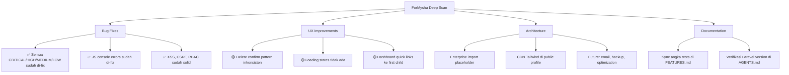

# ForMysha — Re-Audit Lengkap 2026

## Ringkasan Deep Scan

**Tanggal:** 2026-08-09  
**Tests:** 461 tests, 1024 assertions — all passing (Phase 1-8 selesai)  
**Metodologi:** Pemindaian menyeluruh seluruh kode sumber, Blade views, routes, controllers, models, services, dan konfigurasi.

---

## ✅ Status Bersih (Tidak Ada Masalah)

| No | Area Pemeriksaan | Hasil | Detail |
|----|-----------------|-------|--------|
| 1 | Debug statements (`dd()`, `dump()`, `console.log`) di Blade views | ✅ 0 ditemukan | Bersih |
| 2 | Dead links (`href="#"`) | ✅ 0 ditemukan | Bersih |
| 3 | Responsive tables — `overflow-x-auto` | ✅ 21/21 tabel | Semua tabel dibungkus dengan benar |
| 4 | CSRF protection — `@csrf` di semua form | ✅ 78 form | Semua form terlindungi |
| 5 | RBAC di controllers — `abort_if`/`abort_unless` | ✅ 116 checks | Semua controllers terproteksi |
| 6 | Route ordering — auth sebelum catch-all | ✅ Benar | `auth.php` sebelum `/{slug}` |
| 7 | Empty states di semua views | ✅ 21+ views | Menggunakan `x-empty-state` atau inline |
| 8 | Fallback images/avatars | ✅ Semua views | Pattern `@if($child->photo)` / `@else` emoji |
| 9 | `@push('scripts')` di views | ✅ 0 ditemukan | Semua sudah di-fix ke inline `` bukan Vite build
- **Dampak:** Performance (CDN load) + tidak recommended untuk production
- **Prioritas:** Low — ini sengaja karena public profile adalah standalone page
- **Rekomendasi:** Biarkan apa adanya atau compile CSS khusus untuk public profile

### 2.5 Enterprise Import Tidak Memproses File
- **Lokasi:** `app/Http/Controllers/TenantAdmin/EnterpriseController.php` line 128-150
- **Masalah:** `processImport()` membuat `ImportJob` record tapi tidak menyimpan/memproses file yang di-upload
- **Dampak:** Fitur import placeholder — file di-upload tapi tidak diproses
- **Prioritas:** Low — fitur enterprise, bukan MVP
- **Rekomendasi:** Implementasi saat dibutuhkan, atau tambah note di UI bahwa fitur belum aktif

### 2.6 Tidak Ada Loading State pada Form Submit
- **Masalah:** Tidak ditemukan `wire:loading`, `x-loading`, atau loading skeleton di views
- **Dampak:** UX — user tidak mendapat visual feedback saat form submit
- **Prioritas:** Low — form berjalan normal tanpa loading state
- **Rekomendasi:** Tambahkan `x-data="{ loading: false }"` + `@submit="loading = true"` pada form utama

### 2.7 Subscription Plans Tidak Ada Loading Skeleton
- **Lokasi:** `resources/views/subscription/plans.blade.php`
- **Masalah:** Plans langsung render dari DB tanpa skeleton loading
- **Dampak:** Minimal — plans data kecil dan cepat load
- **Prioritas:** Low
- **Rekomendasi:** Opsional — tambah skeleton saat diperlukan

---

## 🏗️ Items Arsitektur (Future Enhancement)

| No | Item | Status | Keterangan |
|----|------|--------|------------|
| 3.1 | Multi-tenancy tanpa global scope | Design choice | Column-based tenancy via middleware, bukan global scope |
| 3.2 | Tidak ada image optimization | Future | Bisa tambah intervention-image atau spatie/laravel-medialibrary |
| 3.3 | Tidak ada email notification | Future | Bisa tambah Mail/Notification classes |
| 3.4 | Tidak ada automated backup | Future | Bisa tambah spatie/laravel-backup |
| 3.5 | Tidak ada API versioning | Future | Bisa tambah prefix `/api/v1/` |
| 3.6 | Search tidak full-text index | Future | Bisa tambah PostgreSQL full-text search |
| 3.7 | Tidak ada rate limiting file upload | Future | Bisa tambah throttle middleware |
| 3.8 | Subscription lifecycle tidak terautomasi | Future | Bisa tambah scheduled command |

---

## 📝 Items Dokumentasi

| No | Item | Status | Keterangan |
|----|------|--------|------------|
| 4.1 | AGENTS.md menyebutkan Laravel 12 | Perlu verifikasi | Project mungkin sudah upgrade ke 12 |
| 4.2 | Database MySQL vs PostgreSQL | Perlu verifikasi | Pastikan konsisten |
| 4.3 | MinIO Storage tidak terkonfigurasi | Future | Storage config ada tapi MinIO belum setup |
| 4.4 | Redis & Horizon tidak terkonfigurasi | Future | Config ada tapi service belum setup |

---

## Peta Arsitektur

---

## Prioritas Eksekusi

### Prioritas 1: Verifikasi & Sync (Mendesak)
1. ✅ Jalankan test suite — pastikan semua 461 tests masih passing
2. Jalankan Pint formatter
3. Sync angka tests di FEATURES.md jika berubah

### Prioritas 2: UX Consistency (Ringan)
4. Standarisasi delete confirmation ke `x-confirm-delete` component (opsional)
5. Tambah loading state pada form submit utama (opsional)

### Prioritas 3: Architecture (Bulan Depan)
6. Enterprise import implementation
7. Image optimization
8. Email notifications
9. Automated backup

---

## Kesimpulan

**Status Proyek: SANGAT BAIK** 🟢

Setelah deep scan menyeluruh, tidak ditemukan bug kritis, error console, broken routes, atau RBAC gaps. Semua temuan dari audit sebelumnya (C1-C4, H1-H4, M1-M2, L1) sudah terimplementasi. 

Temuan yang tersisa adalah **inkonsistensi UX minor** (delete confirmation pattern, loading states) dan **placeholder features** (enterprise import) yang bukan bug dan tidak mempengaruhi fungsionalitas.

Proyek siap untuk production deployment dengan confidence tinggi.
