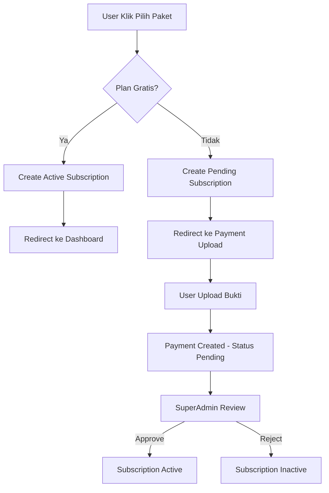

# Perbaikan Kritis: Flow Subscription & Payment

## Ringkasan Investigasi

User melaporkan beberapa bug kritis yang bisa menyebabkan kerugian finansial:
1. Tenant dashboard menampilkan `children=0` meskipun sudah menambah anak
2. Feature limits (gratis = 1 anak) tidak diterapkan
3. Flow upload bukti pembayaran tidak berfungsi dengan benar
4. SuperAdmin tidak ada aktivitas pembayaran

---

## Root Cause Analysis

### BUG 1: Tenant `children_count` = 0 di SuperAdmin

**Root Cause**: Tabel `children` **TIDAK memiliki kolom `tenant_id`**!

Migration `2026_08_07_175220_create_children_table.php` hanya punya kolom:
- `id`, `user_id`, `name`, `slug`, `nickname`, `gender`, `date_of_birth`, dll.

Tapi `Tenant::children()` menggunakan `HasMany` yang otomatis cari foreign key `tenant_id` di tabel children. Karena kolom tidak ada, query selalu return 0.

```php
// Tenant.php
public function children(): HasMany
{
    return $this->hasMany(Child::class); // Cari Tenant.id = Child.tenant_id → SELALU 0
}
```

### BUG 2: Feature Limits Tidak Diterapkan

**Root Cause**: Middleware `feature.limit:children` sudah **terdaftar** di `bootstrap/app.php` tapi **TIDAK DITERAPKAN** ke route manapun!

```php
// routes/web.php — TIDAK ada middleware feature.limit
Route::resource('children', ChildController::class)->except(['edit', 'show']);
```

Bahkan test sendiri mengakui:
```php
// FeatureLimitTest.php line 53-54
// Since the child store route doesn't use this middleware, we test the service directly
```

### BUG 3: Payment Upload Flow

**Root Cause**: Flow sebenarnya sudah ada (subscribe → current → upload), tapi:
1. Setelah subscribe ke plan berbayar, redirect ke `subscription.current` dengan flash message saja
2. User harus klik tombol "Upload Bukti Pembayaran" secara manual
3. Tidak ada redirect langsung ke halaman upload
4. `config('saas.banks')` mungkin kosong jika config tidak ter-load

### BUG 4: SuperAdmin Tidak Ada Aktivitas Payment

**Root Cause**: Karena flow payment upload bermasalah, tidak ada data payment yang masuk ke SuperAdmin. Juga perlu dipastikan sidebar SuperAdmin memiliki link ke halaman payments.

### BUG 5: Subscription Current View

**Root Cause**: View menggunakan `$tenant?->children_count ?? 0` yang selalu 0 karena children tidak punya `tenant_id`.

---

## Rencana Perbaikan

### Prioritas 1: Migration & Model (Foundation)

#### 1.1 Migration: Tambahkan `tenant_id` ke children table
- Buat migration baru: `add_tenant_id_to_children_table`
- Tambah kolom `tenant_id` (nullable foreign key ke tenants)
- Backfill existing data: set `tenant_id` berdasarkan `user.tenant_id`

#### 1.2 Update Child Model
- Tambah `tenant_id` ke `$fillable`
- Pastikan relationship `tenant()` sudah ada (sudah ada di line 107-110)

#### 1.3 Update ChildFactory
- Tambah `tenant_id` ke factory definition

### Prioritas 2: Feature Limit Enforcement

#### 2.1 Apply middleware ke routes
- `routes/web.php`: Tambah `feature.limit:children` ke children store route
- `routes/web.php`: Tambah `feature.limit:photos` ke media upload routes
- `routes/web.php`: Tambah `feature.limit:videos` ke media upload routes

#### 2.2 Update ChildController::store()
- Set `tenant_id` dari current tenant saat create child
- Handle case jika tenant tidak ada (single-tenant mode)

#### 2.3 Update ChildController::index()
- Filter children by tenant_id untuk multi-tenant mode

### Prioritas 3: Payment Flow Fix

#### 3.1 Update SubscriptionController::subscribe()
- Setelah subscribe ke plan berbayar, redirect ke `subscription.payment.upload`
- Setelah subscribe ke plan gratis, redirect ke `subscription.current`

#### 3.2 Update subscription.current view
- Load `children_count` dengan benar dari tenant
- Tambah banner jelas untuk pending subscription
- Perbaiki link navigation ke payment upload

#### 3.3 Pastikan config banks ter-load
- Verifikasi `config('saas.banks')` dikirim ke view dengan benar
- Fallback ke `Payment::BANKS` constant jika config kosong

### Prioritas 4: SuperAdmin Improvements

#### 4.1 Sidebar Navigation
- Pastikan sidebar SuperAdmin ada link ke halaman payments
- Tambah badge count untuk pending payments

#### 4.2 Dashboard Enhancement
- Tambah payment stats card (sudah ada)
- Pastikan recent payments section berfungsi

#### 4.3 Tenant Detail View
- Tambah payment history section di tenant show view
- Tambah subscription detail section

### Prioritas 5: Testing

#### 5.1 Update FeatureLimitTest
- Test middleware secara end-to-end via HTTP
- Test feature limit dengan tenant yang benar

#### 5.2 New Test: SubscriptionFlowTest
- Test flow lengkap: subscribe → payment upload → approval
- Test redirect behavior

#### 5.3 Update TenantTest
- Test children_count setelah menambah child
- Test tenant relationship

#### 5.4 Update ChildTest
- Test child creation dengan tenant_id
- Test tenant isolation

### Prioritas 6: Documentation

#### 6.1 Update AGENTS.md
- Tambah catatan tentang `tenant_id` di children table
- Update SaaS Architecture section

#### 6.2 Update FEATURES.md
- Tambah section tentang feature limit enforcement
- Update subscription flow documentation

---

## Diagram Alur Perbaikan



---

## File Yang Perlu Diubah

### Migration
- `database/migrations/2026_08_09_XXXXXX_add_tenant_id_to_children_table.php` (BARU)

### Models
- `app/Models/Child.php` — tambah `tenant_id` ke fillable

### Controllers
- `app/Http/Controllers/ChildController.php` — set tenant_id, filter by tenant
- `app/Http/Controllers/Subscription/SubscriptionController.php` — fix redirect

### Routes
- `routes/web.php` — tambah middleware `feature.limit`

### Views
- `resources/views/subscription/current.blade.php` — fix children_count, tambah banner
- `resources/views/super-admin/partials/sidebar.blade.php` — pastikan ada link payments

### Factories
- `database/factories/ChildFactory.php` — tambah tenant_id

### Tests
- `tests/Feature/FeatureLimitTest.php` — update test
- `tests/Feature/SubscriptionTest.php` — tambah flow test
- `tests/Feature/ChildTest.php` — update test

### Config
- `config/saas.php` — pastikan banks config lengkap

---

## Risiko & Mitigasi

| Risiko | Mitigasi |
|--------|----------|
| Data existing tidak punya tenant_id | Backfill migration: `children.tenant_id = user.tenant_id` |
| Feature limit middleware block user existing | Cek existing children sebelum apply limit |
| Payment upload route tidak bisa diakses | Verifikasi route registration order |
| Config banks kosong | Fallback ke `Payment::BANKS` constant |

---

## Checklist Eksekusi

- [ ] 1. Buat migration `add_tenant_id_to_children_table`
- [ ] 2. Update Child model `$fillable`
- [ ] 3. Update ChildFactory
- [ ] 4. Update ChildController::store() — set tenant_id
- [ ] 5. Update ChildController::index() — filter by tenant
- [ ] 6. Apply `feature.limit:children` ke routes
- [ ] 7. Apply `feature.limit:photos` ke media routes
- [ ] 8. Apply `feature.limit:videos` ke media routes
- [ ] 9. Fix SubscriptionController::subscribe() redirect
- [ ] 10. Fix subscription.current view
- [ ] 11. Verifikasi sidebar SuperAdmin
- [ ] 12. Update tests
- [ ] 13. Jalankan full test suite
- [ ] 14. Run Pint formatting
- [ ] 15. Update documentation
