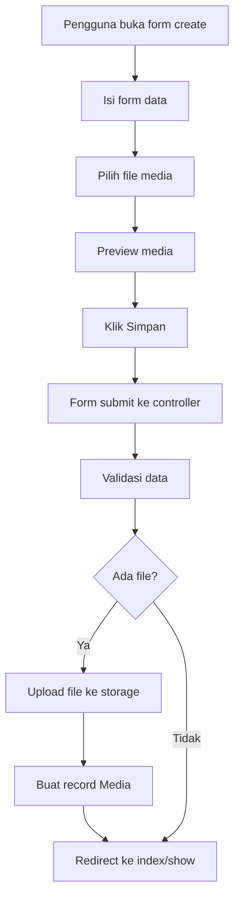

# Rencana: Super Admin Seeder & Media Upload Fix

**Tanggal:** 2026-08-08
**Status:** Draft — Menunggu Approval

---

## Temuan Investigasi

### 1. Login Super Admin

**Status: Sudah Berfungsi**

Super admin menggunakan route login yang sama (`/login`) dengan pengguna lain. Setelah login, role `super_admin` diidentifikasi dan mengakses route `/super-admin/dashboard`.

- Route: `routes/saas.php` — prefix `/super-admin`, middleware `role:super_admin`
- Controller: [`DashboardController`](app/Http/Controllers/SuperAdmin/DashboardController.php) (single action)
- View: [`super-admin/dashboard.blade.php`](resources/views/super-admin/dashboard.blade.php)
- Sidebar: [`super-admin/partials/sidebar.blade.php`](resources/views/super-admin/partials/sidebar.blade.php)

**Masalah:** Tidak ada seeder untuk membuat akun super admin. [`DatabaseSeeder.php`](database/seeders/DatabaseSeeder.php) hanya membuat user parent (`budi@for-mysha.my.id`) dan children.

### 2. Dashboard Super Admin

**Status: Sudah Selesai**

Dashboard super admin sudah lengkap dengan fitur:
- Stats cards: Total Tenant, Pending Payments, Revenue, Total Plans
- Recent Pending Payments (dengan link ke detail)
- Recent Tenants (dengan status aktif/nonaktif)
- Quick Actions: Tambah Tenant, Tambah Paket, Verifikasi Bayar, Audit Log
- Full CRUD: Tenants, Plans, Payments, Audit Logs, Analytics, Monitoring, Plugins

### 3. Media Upload — MASALAH UTAMA

**Status: Form Upload TIDAK ADA**

Ini adalah temuan kritis. Model [`Media`](app/Models/Media.php) dan API [`MediaController`](app/Http/Controllers/Api/MediaController.php) sudah ada, tetapi **form web untuk upload media belum diimplementasikan** di modul-modul berikut:

| Modul | Form Create Ada | Upload Field | `enctype` | Controller Handle Upload | Status |
|-------|----------------|--------------|-----------|--------------------------|--------|
| **Timeline** | ✅ Ya | ❌ **Tidak** | ❌ **Tidak ada** | ❌ **Tidak** | 🔴 BUG |
| **Album** | ✅ Ya | ❌ **Tidak** | ❌ **Tidak ada** | ❌ **Tidak** | 🔴 BUG |
| **Diary** | ✅ Ya | ❌ **Tidak** | ❌ **Tidak ada** | ❌ **Tidak** | 🔴 BUG |
| **Document** | ✅ Ya | ✅ Ya | ✅ `multipart/form-data` | ✅ Ya | ✅ OK |

**Detail Masalah:**

#### Timeline
- [`timeline/create.blade.php`](resources/views/timeline/create.blade.php) — Tidak ada input file, tidak ada `enctype`
- [`StoreTimelineRequest`](app/Http/Requests/StoreTimelineRequest.php) — Tidak ada validasi `file`
- [`TimelineController::store()`](app/Http/Controllers/TimelineController.php) — Tidak handle file upload
- [`timeline/show.blade.php`](resources/views/timeline/show.blade.php) — Tampilkan section media tapi tidak ada tombol upload

#### Album
- [`albums/create.blade.php`](resources/views/albums/create.blade.php) — Tidak ada input file, tidak ada `enctype`
- [`StoreAlbumRequest`](app/Http/Requests/StoreAlbumRequest.php) — Tidak ada validasi `file`
- [`AlbumController::store()`](app/Http/Controllers/AlbumController.php) — Tidak handle file upload
- [`albums/show.blade.php`](resources/views/albums/show.blade.php) — Tampilkan grid media tapi tidak ada tombol upload

#### Diary
- [`diaries/create.blade.php`](resources/views/diaries/create.blade.php) — Tidak ada input file, tidak ada `enctype`
- [`StoreDiaryRequest`](app/Http/Requests/StoreDiaryRequest.php) — Tidak ada validasi `file`
- [`DiaryController::store()`](app/Http/Controllers/DiaryController.php) — Tidak handle file upload

**Yang Sudah Benar (Referensi):**
- [`documents/create.blade.php`](resources/views/documents/create.blade.php) — Sudah ada file upload dengan drag-and-drop area
- [`DocumentController::store()`](app/Http/Controllers/DocumentController.php) — Sudah handle file upload ke `storage/app/public/documents`

---

## Rencana Perbaikan

### Task 1: Buat SuperAdminSeeder

**File baru:** `database/seeders/SuperAdminSeeder.php`

Buat seeder yang membuat akun super admin:
- Name: Super Admin
- Email: admin@formysha.my.id
- Password: password (atau dari env)
- Role: `super_admin`
- Email verified: `now()`
- Tenant: tidak perlu (super admin tidak terikat tenant)

**Update:** [`DatabaseSeeder.php`](database/seeders/DatabaseSeeder.php) — tambahkan `SuperAdminSeeder::class` ke `$this->call()`

### Task 2: Buat MediaService

**File baru:** `app/Services/MediaService.php`

Service untuk handle upload media secara terpusat:
- `uploadFile(UploadedFile $file, Model $mediable, ?string $albumId = null, ?string $altText = null): Media`
- Validasi file type (image: jpg, png, gif, webp; video: mp4, mov, webm; audio: mp3, wav, ogg)
- Store ke `storage/app/public/media/`
- Buat record di tabel `media`
- Hapus file dari storage saat media dihapus

### Task 3: Tambah Upload ke Timeline

#### 3a. Update [`StoreTimelineRequest`](app/Http/Requests/StoreTimelineRequest.php)
- Tambah validasi: `'media' => ['nullable', 'array'], 'media.*' => ['file', 'max:10240'], 'media.*.mimes' => 'jpg,jpeg,png,gif,webp,mp4,mov,webm'`

#### 3b. Update [`TimelineController::store()`](app/Http/Controllers/TimelineController.php)
- Tambah `enctype="multipart/form-data"` ke form
- Handle upload media setelah timeline dibuat
- Simpan file ke `storage/app/public/media/`
- Buat record `Media` dengan `mediable_type: Timeline::class`

#### 3c. Update [`timeline/create.blade.php`](resources/views/timeline/create.blade.php)
- Tambah `enctype="multipart/form-data"` ke tag `<form>`
- Tambah section upload media (drag-and-drop area seperti documents/create)
- Tambah preview area untuk file yang dipilih

#### 3d. Update [`timeline/show.blade.php`](resources/views/timeline/show.blade.php)
- Tambah tombol "Upload Media" atau inline upload form
- Tampilkan media yang sudah ada dengan preview

### Task 4: Tambah Upload ke Album

#### 4a. Update [`StoreAlbumRequest`](app/Http/Requests/StoreAlbumRequest.php)
- Tambah validasi: `'media' => ['nullable', 'array'], 'media.*' => ['file', 'max:10240']`

#### 4b. Update [`AlbumController::store()`](app/Http/Controllers/AlbumController.php)
- Handle upload media setelah album dibuat

#### 4c. Update [`albums/create.blade.php`](resources/views/albums/create.blade.php)
- Tambah `enctype="multipart/form-data"` ke tag `<form>`
- Tambah section upload media

#### 4d. Update [`albums/show.blade.php`](resources/views/albums/show.blade.php)
- **KRITIS:** Tambah tombol/upload form "Tambah Media" di halaman album
- Saat ini halaman show hanya menampilkan media tapi tidak ada cara untuk menambahkannya
- Tambahkan upload form atau modal untuk upload media ke album

### Task 5: Tambah Upload ke Diary

#### 5a. Update [`StoreDiaryRequest`](app/Http/Requests/StoreDiaryRequest.php)
- Tambah validasi: `'media' => ['nullable', 'array'], 'media.*' => ['file', 'max:10240']`

#### 5b. Update [`DiaryController::store()`](app/Http/Controllers/DiaryController.php)
- Handle upload media setelah diary dibuat

#### 5c. Update [`diaries/create.blade.php`](resources/views/diaries/create.blade.php)
- Tambah `enctype="multipart/form-data"` ke tag `<form>`
- Tambah section upload media (lampiran foto/video)

### Task 6: Buat Reusable Media Upload Component

**File baru:** `resources/views/components/media-upload.blade.php`

Buat Blade component reusable untuk upload media:
- Drag-and-drop area
- File picker button
- Preview area (thumbnail untuk foto, icon untuk video/audio)
- Support multiple files
- Max file size display
- Accepted file types display
- Progress indicator (opsional, bisa pakai Alpine.js)

Props:
- `name` — input name (default: `media[]`)
- `multiple` — boolean (default: true)
- `maxFiles` — integer (default: 10)
- `accept` — string (default: `image/*,video/*,audio/*`)
- `maxSize` — string (default: `10MB`)
- `model` — optional, untuk preview media yang sudah ada

### Task 7: Tambah Routes untuk Media Management

**Update:** [`routes/web.php`](routes/web.php)

Tambah route untuk upload media via web:
```
POST /children/{child}/media — upload media
DELETE /children/{child}/media/{media} — hapus media
```

Atau gunakan route existing yang sudah ada di API dan buat web controller yang mirip.

### Task 8: Update Tests

- Buat test untuk `SuperAdminSeeder`
- Buat test untuk `MediaService`
- Update test untuk Timeline, Album, Diary yang mencakup file upload
- Pastikan semua test passing

### Task 9: Run Pint

- Jalankan `vendor/bin/pint --dirty --format agent` setelah semua perubahan

---

## Diagram Alur Upload Media



---

## Urutan Eksekusi

1. **SuperAdminSeeder** — Quick win, tidak ada dependensi
2. **MediaService** — Foundation untuk semua upload
3. **Media Upload Component** — Reusable component
4. **Timeline Upload** — Update request, controller, view
5. **Album Upload** — Update request, controller, view
6. **Diary Upload** — Update request, controller, view
7. **Routes** — Tambah web routes untuk media
8. **Tests** — Tulis dan update tests
9. **Pint** — Format code

---

## File yang Perlu Diubah

| File | Aksi |
|------|------|
| `database/seeders/SuperAdminSeeder.php` | **BARU** |
| `database/seeders/DatabaseSeeder.php` | Edit |
| `app/Services/MediaService.php` | **BARU** |
| `resources/views/components/media-upload.blade.php` | **BARU** |
| `app/Http/Requests/StoreTimelineRequest.php` | Edit |
| `app/Http/Requests/StoreAlbumRequest.php` | Edit |
| `app/Http/Requests/StoreDiaryRequest.php` | Edit |
| `app/Http/Controllers/TimelineController.php` | Edit |
| `app/Http/Controllers/AlbumController.php` | Edit |
| `app/Http/Controllers/DiaryController.php` | Edit |
| `resources/views/timeline/create.blade.php` | Edit |
| `resources/views/timeline/show.blade.php` | Edit |
| `resources/views/albums/create.blade.php` | Edit |
| `resources/views/albums/show.blade.php` | Edit |
| `resources/views/diaries/create.blade.php` | Edit |
| `routes/web.php` | Edit |
| Tests (baru + update) | Edit |
