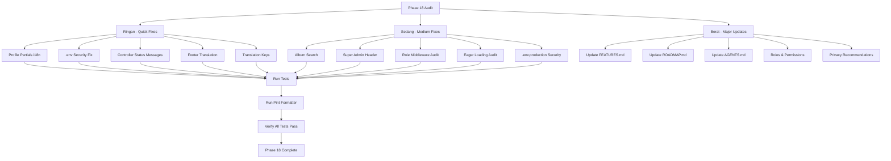

# ForMysha — Audit & Improvement Plan (Phase 18)

## Ringkasan Audit

Proyek ForMysha berada di **Phase 17** dengan 624 tests, 1417 assertions — semua passing. Arsitektur sudah matang dengan multi-tenant SaaS, B2B/B2C, REST API, dan fitur lengkap. Audit ini mengidentifikasi area perbaikan yang dikelompokkan berdasarkan prioritas.

---

## Temuan Audit

### 🔴 Ringan — Quick Fixes

#### 1. Profile Partials Masih Menggunakan Teks Bahasa Inggris
**File:** `resources/views/profile/partials/update-profile-information-form.blade.php`, `update-password-form.blade.php`, `delete-user-form.blade.php`

**Masalah:** Menggunakan `__('Profile Information')`, `__('Name')`, `__('Email')`, `__('Delete Account')` dll. Key translation ini TIDAK ada di `lang/id/app.php`, sehingga `__()` fallback ke teks Inggris asli.

**Solusi:**
- Tambahkan keys translation section `profile_form` di `lang/id/app.php` dan `lang/en/app.php`
- Update semua `__()` calls di profile partials menggunakan keys yang benar

#### 2. `.env` Memiliki SUPER_ADMIN_PASSWORD Hardcoded
**File:** `.env`

**Masalah:** `SUPER_ADMIN_PASSWORD=Wahyu123456789@` — password asli ada di file environment lokal.

**Solusi:** Ganti dengan placeholder kosong: `SUPER_ADMIN_PASSWORD=`

#### 3. Hardcoded Status Messages di Controllers
**File:** `app/Http/Controllers/ChildController.php` dan lainnya

**Masalah:** String hardcoded seperti `'Profil anak berhasil dibuat!'`, `'Profil anak berhasil diperbarui!'`, `'Profil anak berhasil dihapus.'` — tidak konsisten dengan pendekatan i18n.

**Solusi:** Ganti dengan `__('')` translation helpers menggunakan keys yang sesuai.

#### 4. Hardcoded Footer Text di App Layout
**File:** `resources/views/layouts/app.blade.php`

**Masalah:** Footer memiliki hardcoded text: `'Tentang Kami'`, `'Kebijakan Privasi'`, `'Syarat & Ketentuan'`.

**Solusi:** Ganti dengan `__('pages.about')`, `__('pages.privacy')`, `__('pages.terms')`.

#### 5. Missing Translation Keys untuk Profile Partials
**File:** `lang/id/app.php`, `lang/en/app.php`

**Masalah:** Section `profile` sudah ada tapi tidak lengkap — tidak ada keys untuk form labels seperti `profile_information_title`, `profile_information_description`, `current_password`, `new_password`, `confirm_password`, `delete_account_warning`, dll.

**Solusi:** Tambahkan subsection `profile_form` yang lengkap.

---

### 🟡 Sedang — Medium Fixes

#### 6. Album Search Tidak Ada di SearchController
**File:** `app/Http/Controllers/SearchController.php`

**Masalah:** SearchController mencari timeline, diary, document, health, growth — tapi TIDAK mencari albums. Padahal album adalah fitur utama.

**Solusi:** Tambahkan pencarian album di SearchController dengan mapping results yang konsisten.

#### 7. Super Admin Dashboard Header Tidak Responsive
**File:** `resources/views/super-admin/dashboard.blade.php`

**Masalah:** Header hanya menggunakan `<h2>` tanpa responsive flex pattern.

**Solusi:** Tambahkan `
` pattern.

#### 8. Audit Role Middleware
**File:** `routes/web.php`, `routes/saas.php`, `routes/tenant-admin.php`, `routes/facility-admin.php`

**Masalah:** Perlu verifikasi bahwa semua route sudah memiliki middleware yang benar.

**Solusi:** Audit semua route groups dan pastikan:
- Super Admin routes → `role:super_admin`
- Tenant Admin routes → `role:tenant_admin`
- Facility Admin routes → staff-based middleware
- Child routes → `child.ownership`
- Feature-limited routes → `feature.limit:{feature}`

#### 9. Audit Eager Loading
**File:** Semua controllers

**Masalah:** Perlu verifikasi tidak ada N+1 query yang terlewat.

**Solusi:** Audit semua controller methods dan pastikan eager loading sudah benar.

#### 10. `.env.production` Security
**File:** `.env.production`

**Masalah:**
- `APP_KEY` sama dengan `.env` lokal — production harus unik
- File berisi credentials sensitif (DB password, Redis password, Mail password, bank account details)

**Solusi:**
- Rekomendasikan generated APP_KEY unik untuk production
- Pastikan file di `.gitignore` (sudah benar)

---

### 🔵 Berat — Major Updates

#### 11. Update FEATURES.md
- Tambahkan section Audit & Improvement Phase 18
- Document profile partials i18n fix
- Document album search addition
- Tambahkan rekomendasi keamanan

#### 12. Update ROADMAP.md
- Tambahkan Phase 18 dengan detail temuan dan perbaikan

#### 13. Update AGENTS.md
- Update Quality Assurance section
- Tambahkan temuan audit
- Update test count setelah perubahan

#### 14. Rekomendasi Roles & Permissions
Buat dokumen rekomendasi untuk:

**B2C (Family) Roles:**
- `parent` — Full access ke semua data anak, keluarga, dokumen
- `family_member` (future) — Read-only access ke data anak tertentu

**B2B (Facility) Roles:**
- `tenant_admin` — Kelola fasilitas, staf, branding, settings
- `doctor` — Akses catatan klinis pasien
- `midwife` — Akses catatan klinis pasien
- `nurse` — Akses catatan klinis pasien (read-only)
- `staff_admin` — Kelola data administrasi
- `staff` — Akses terbatas

**Super Admin:**
- `super_admin` — Full access ke semua tenant, billing, monitoring

#### 15. Rekomendasi Privacy
- **Data Anak**: Foto, nama, tanggal lahir harus terenkripsi di rest
- **Dokumen**: Akta lahir, KK, KIA, BPJS, Paspor harus memiliki akses terbatas
- **Kesehatan**: Catatan klinis hanya bisa diakses oleh fasilitas yang terkait
- **Public Profile**: Hanya data yang dipilih user yang tampil
- **Export**: Harus log semua aktivitas export di audit log
- **API**: Rate limiting sudah diterapkan (60/min general, 5/min auth)
- **Webhook**: Hanya event yang relevan yang dikirim

---

## Diagram Alur Perbaikan

---

## Urutan Eksekusi

1. **Langkah 1**: Tambahkan translation keys baru di `lang/id/app.php` dan `lang/en/app.php`
2. **Langkah 2**: Fix profile partials English text → Indonesian
3. **Langkah 3**: Fix `.env` SUPER_ADMIN_PASSWORD
4. **Langkah 4**: Fix hardcoded status messages di controllers
5. **Langkah 5**: Fix hardcoded footer text di app layout
6. **Langkah 6**: Tambahkan Album search di SearchController
7. **Langkah 7**: Fix Super Admin Dashboard header responsiveness
8. **Langkah 8**: Audit role middleware
9. **Langkah 9**: Audit eager loading
10. **Langkah 10**: Rekomendasi .env.production security
11. **Langkah 11**: Update FEATURES.md
12. **Langkah 12**: Update ROADMAP.md
13. **Langkah 13**: Update AGENTS.md
14. **Langkah 14**: Jalankan `php artisan test --compact`
15. **Langkah 15**: Jalankan `vendor/bin/pint --dirty --format agent`

---

## Catatan Penting

- **Production Safety**: Semua perubahan database harus melalui migration baru, tidak boleh mengubah tabel yang sudah ada
- **Backward Compatible**: Semua perubahan harus backward compatible
- **Test Coverage**: Setiap perubahan harus di-test
- **i18n Consistency**: Semua teks UI harus menggunakan `__()` translation helpers
