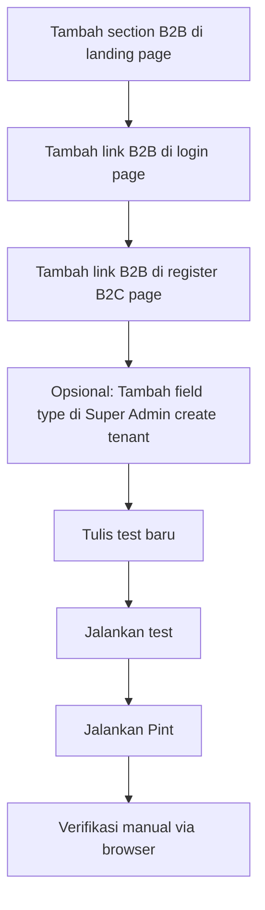

# Rencana Perbaikan Flow Registrasi B2B

## Masalah

Halaman registrasi fasilitas (`/register/facility`) sudah ada dan berfungsi, tetapi **tidak dapat dijangkau dari UI manapun**. Pengguna harus mengetik URL secara manual.

### Gap yang Ditemukan

| Halaman | Link ke `/register/facility` | Status |
|---------|------------------------------|--------|
| Landing Page (`welcome.blade.php`) | ❌ Tidak ada | Hanya tombol "Daftar Gratis" → B2C |
| Login Page (`login.blade.php:55-63`) | ❌ Tidak ada | Hanya link "Daftar Gratis" → B2C |
| Register B2C (`register.blade.php:54-62`) | ❌ Tidak ada | Tidak ada alternatif ke B2B |
| Register B2B (`register-facility.blade.php:108-121`) | ✅ Ada | Link "Daftar Keluarga" (reverse) |

### Tambahan: Super Admin Tenant Creation

[`SuperAdmin\TenantController::store()`](app/Http/Controllers/SuperAdmin/TenantController.php:38) hanya membuat record Tenant (name + slug). Tidak membuat user, staff, atau subscription. Ini bukan bug — tapi perlu dipertimbangkan apakah perlu ditingkatkan.

---

## Rencana Perbaikan

### Task 1: Landing Page — Tambah Section B2B

**File:** [`resources/views/welcome.blade.php`](resources/views/welcome.blade.php)

Tambah section baru **sebelum CTA Section** (sekitar line 438) yang menampilkan opsi registrasi untuk dua jenis pengguna:

```blade
{{-- User Type Selection Section --}}
<section class="py-16 sm:py-20">
    <div class="max-w-4xl mx-auto px-4 sm:px-6 lg:px-8">
        <div class="text-center mb-12">
            <h2 class="text-2xl sm:text-3xl font-bold text-gray-800 dark:text-gray-100 mb-4">
                Pilih Jenis Akun Anda
            </h2>
            <p class="text-gray-500 dark:text-gray-400">
                ForMysha tersedia untuk keluarga dan fasilitas kesehatan
            </p>
        </div>

        <div class="grid grid-cols-1 sm:grid-cols-2 gap-6">
            {{-- B2C Card --}}
            <a href="{{ route('register') }}" class="bg-white dark:bg-gray-800 rounded-2xl p-8 text-center shadow-soft hover:shadow-soft-md transition group border-2 border-transparent hover:border-softPink-300">
                <div class="w-16 h-16 mx-auto mb-4 rounded-2xl bg-softPink-100 dark:bg-softPink-950/30 flex items-center justify-center group-hover:scale-110 transition">
                    <span class="text-3xl">👨‍👩‍👧</span>
                </div>
                <h3 class="text-lg font-bold text-gray-800 dark:text-gray-100 mb-2">Keluarga</h3>
                <p class="text-gray-500 dark:text-gray-400 text-sm">
                    Simpan kenangan perjalanan hidup anak Anda
                </p>
            </a>

            {{-- B2B Card --}}
            <a href="{{ route('register.facility') }}" class="bg-white dark:bg-gray-800 rounded-2xl p-8 text-center shadow-soft hover:shadow-soft-md transition group border-2 border-transparent hover:border-skyBlue-300">
                <div class="w-16 h-16 mx-auto mb-4 rounded-2xl bg-skyBlue-100 dark:bg-skyBlue-950/30 flex items-center justify-center group-hover:scale-110 transition">
                    <span class="text-3xl">🏥</span>
                </div>
                <h3 class="text-lg font-bold text-gray-800 dark:text-gray-100 mb-2">Fasilitas Kesehatan</h3>
                <p class="text-gray-500 dark:text-gray-400 text-sm">
                    Klinik, rumah sakit, bidan, posyandu, daycare, sekolah
                </p>
            </a>
        </div>
    </div>
</section>
```

**Pertimbangan Desain:**
- Menggunakan pattern card yang sudah ada di landing page (rounded-2xl, shadow-soft, hover effect)
- Warna konsisten: softPink untuk B2C, skyBlue untuk B2B
- Responsive: 1 kolom di mobile, 2 kolom di desktop
- Icon emoji untuk kesan friendly (sesuai brand personality)

---

### Task 2: Login Page — Tambah Link B2B

**File:** [`resources/views/auth/login.blade.php`](resources/views/auth/login.blade.php:55-63)

Tambah link "Daftar sebagai Fasilitas" di bawah link "Daftar Gratis":

```blade
{{-- Register Links --}}
<div class="mt-6 text-center space-y-2">
    <p class="text-sm text-gray-500 dark:text-gray-400">
        Belum punya akun?
        @if (Route::has('register'))
            <a href="{{ route('register') }}" class="font-semibold text-softPink-400 hover:text-softPink-500 dark:text-softPink-300 dark:hover:text-softPink-200 transition-colors">
                Daftar Gratis
            </a>
        @endif
    </p>
    <p class="text-sm text-gray-500 dark:text-gray-400">
        Ingin daftar sebagai fasilitas kesehatan?
        <a href="{{ route('register.facility') }}" class="font-semibold text-skyBlue-400 hover:text-skyBlue-500 dark:text-skyBlue-300 dark:hover:text-skyBlue-200 transition-colors">
            Daftar Fasilitas
        </a>
    </p>
</div>
```

**Pertimbangan:**
- Mengikuti pola yang sudah ada di [`register-facility.blade.php:108-121`](resources/views/auth/register-facility.blade.php:108)
- Warna skyBlue untuk B2B, konsisten dengan card di landing page
- `space-y-2` untuk jarak antar link

---

### Task 3: Register B2C Page — Tambah Link B2B

**File:** [`resources/views/auth/register.blade.php`](resources/views/auth/register.blade.php:54-62)

Tambah link "Daftar sebagai Fasilitas Kesehatan" di bawah form:

```blade
{{-- Register Links --}}
<div class="mt-6 text-center space-y-2">
    <p class="text-sm text-gray-500 dark:text-gray-400">
        Sudah punya akun?
        <a href="{{ route('login') }}" class="font-semibold text-softPink-400 hover:text-softPink-500 dark:text-softPink-300 dark:hover:text-softPink-200 transition-colors">
            Masuk
        </a>
    </p>
    <p class="text-sm text-gray-500 dark:text-gray-400">
        Ingin daftar sebagai fasilitas kesehatan?
        <a href="{{ route('register.facility') }}" class="font-semibold text-skyBlue-400 hover:text-skyBlue-500 dark:text-skyBlue-300 dark:hover:text-skyBlue-200 transition-colors">
            Daftar Fasilitas
        </a>
    </p>
</div>
```

---

### Task 4: (Opsional) Super Admin Tenant Creation — Tambah Field B2B

**File:** [`app/Http/Controllers/SuperAdmin/TenantController.php`](app/Http/Controllers/SuperAdmin/TenantController.php:38)
**File:** [`resources/views/super-admin/tenants/create.blade.php`](resources/views/super-admin/tenants/create.blade.php)

**Status:** OPSIONAL — Diskusikan dulu

Saat ini Super Admin hanya bisa membuat Tenant dengan name + slug. Untuk B2B, idealnya juga bisa membuat user + staff + subscription.

**Opsi A (Minimal):** Tambah dropdown `type` (Family/B2B) di form create tenant
**Opsi B (Lengkap):** Tambah field untuk owner name, email, password, facility type — lalu panggil `createB2BTenant()`

Rekomendasi: **Opsi A** dulu — cukup tambah field `type` agar Super Admin bisa membedakan tenant B2C vs B2B. Pembuatan user/staff tetap via self-registration.

---

### Task 5: Testing

**File:** [`tests/Feature/FacilityRegistrationTest.php`](tests/Feature/FacilityRegistrationTest.php)

Tambah test untuk memastikan:
1. Halaman `/register/facility` bisa diakses (GET 200)
2. Link ke `/register/facility` ada di landing page
3. Link ke `/register/facility` ada di login page
4. Link ke `/register/facility` ada di register B2C page

---

### Task 6: Pint Formatting

Jalankan `vendor/bin/pint --dirty --format agent` setelah semua perubahan.

---

## Urutan Eksekusi



## Estimasi File yang Diubah

| File | Perubahan |
|------|-----------|
| `resources/views/welcome.blade.php` | Tambah section B2B (~30 baris) |
| `resources/views/auth/login.blade.php` | Tambah link B2B (~6 baris) |
| `resources/views/auth/register.blade.php` | Tambah link B2B (~6 baris) |
| `resources/views/super-admin/tenants/create.blade.php` | (Opsional) Tambah dropdown type |
| `app/Http/Controllers/SuperAdmin/TenantController.php` | (Opsional) Tambah validasi type |
| `tests/Feature/FacilityRegistrationTest.php` | Tambah 3-4 test baru |

## Catatan

- Semua perubahan view mengikuti responsive design patterns yang sudah ada
- Warna konsisten: softPink untuk B2C, skyBlue untuk B2B
- Dark mode sudah ter-support (menggunakan dark: variants yang sudah ada)
- Tidak ada perubahan backend logic yang diperlukan untuk Task 1-3
