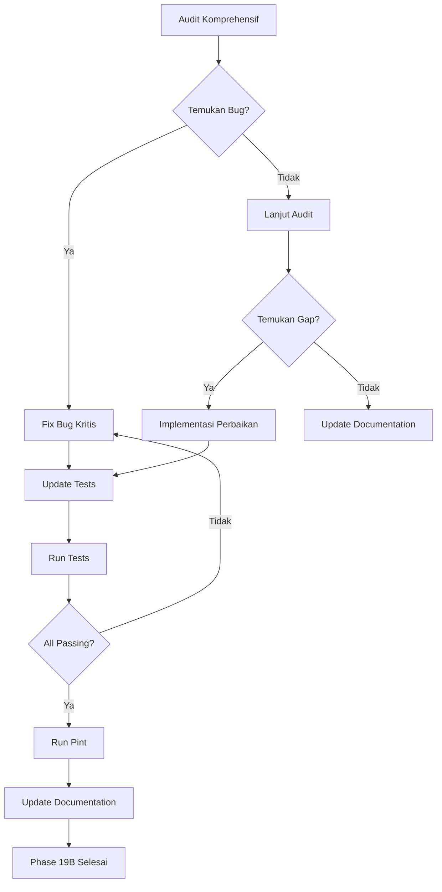

# Phase 19B — Comprehensive Audit & Production Readiness

## Temuan Audit Komprehensif

### 🔴 Bug & Critical Issues

#### 1. ChildController::destroy() — Hanya Hapus Foto, Tidak Hapus Data Relasi
- **Lokasi**: `app/Http/Controllers/ChildController.php:111-122`
- **Masalah**: Method `destroy()` hanya menghapus foto child dari storage, tapi tidak menghapus data relasi (timelines, albums, diaries, documents, health records, growths, events, family members, consents, media)
- **Dampak**: Orphaned records di database setelah child dihapus
- **Fix**: Gunakan `AccountDeletionService::deleteChildData()` atau tambahkan cascade delete
- **Catatan**: `ErasureController::destroyChild()` sudah benar menggunakan `AccountDeletionService`

#### 2. SubscriptionController — Hardcoded String Indonesia
- **Lokasi**: `app/Http/Controllers/Subscription/SubscriptionController.php:43,51,58`
- **Masalah**: String error/success masih hardcoded dalam Bahasa Indonesia, bukan menggunakan `__()` translation helper
- **Contoh**: `'Anda belum memiliki organisasi.'`, `'Paket gratis berhasil diaktifkan!'`, `'Langganan berhasil dibuat. Silakan lakukan pembayaran.'`
- **Dampak**: Tidak kompatibel dengan fitur multi-bahasa yang sudah ada

#### 3. Missing .env.production File
- **Masalah**: File `.env.production` belum ada
- **Dampak**: Deployment ke production memerlukan manual env setup
- **Fix**: Buat `.env.production` dengan konfigurasi production-safe

#### 4. .env Missing APP_TIMEZONE
- **Lokasi**: `.env` line 10 tidak punya `APP_TIMEZONE` (tapi `.env.example` punya)
- **Masalah**: Inconsistency antara `.env` dan `.env.example`

### 🟡 Navigation & Role Permission Issues

#### 5. Erasure/Hapus Akun Tidak Ada di Navigation
- **Masalah**: Fitur "Hapus Akun" (Right to Erasure) hanya bisa diakses via URL langsung `/erasure`
- **Dampak**: Pengguna tidak tahu fitur ini ada
- **Fix**: Tambahkan link ke erasure di dropdown settings atau halaman profile

#### 6. Super Admin Tidak Ada Link ke Dashboard B2C
- **Masalah**: Super admin bisa akses `/dashboard` tapi navigation tidak menampilkan link ke dashboard B2C
- **Dampak**: Super admin harus manually navigasi
- **Fix**: Tambahkan link "Dashboard Pengguna" di navigation super admin

#### 7. Facility Admin Tidak Ada di Main Navigation Mobile
- **Masalah**: Link "Fasilitas" hanya muncul untuk user yang `isFacilityAdmin()`, tapi tidak ada penjelasan apa yang terjadi jika user adalah both parent dan facility admin
- **Dampak**: User mungkin bingung dengan dual role
- **Fix**: Pastikan navigation menampilkan semua role yang relevan

#### 8. Tenant Admin Link ke Super Admin
- **Masalah**: Tidak ada link dari tenant admin ke super admin (jika user juga super admin)
- **Dampak**: Super admin yang juga tenant admin harus logout login untuk switch role
- **Fix**: Tambahkan role switcher atau link yang sesuai

### 🟡 Data Loading & Relationship Issues

#### 9. DashboardService — Media Query Hanya Ambil Direct Child Media
- **Lokasi**: `app/Services/DashboardService.php:144-149`
- **Masalah**: Media query menggunakan `mediable_type = Child::class` tapi media juga bisa di-attach ke Timeline, Album, Diary (polymorphic)
- **Dampak**: Dashboard "Momen Terbaru" tidak menampilkan media dari timeline/album/diary
- **Fix**: Extend query untuk include media dari semua polymorphic types

#### 10. Children Index — family_members_count Bisa Null
- **Lokasi**: `resources/views/children/index.blade.php:83`
- **Masalah**: `{{ $child->family_members_count ?? 0 }}` — withCount sudah ada di controller, tapi jika null akan menampilkan 0
- **Status**: Ini sudah benar, tapi sebaiknya pastikan konsisten

#### 11. ChildController::show() — Load Relasi Terbatas
- **Lokasi**: `app/Http/Controllers/ChildController.php:67-74`
- **Masalah**: Hanya load `familyMembers`, tapi view `children/show.blade.php` mungkin membutuhkan relasi lain
- **Status**: View saat ini tidak membutuhkan relasi lain, tapi perlu verifikasi

### 🟡 Translation & i18n Issues

#### 12. Banyak View Masih Hardcoded String Indonesia
- **Contoh**: 
  - `resources/views/children/show.blade.php:65`: `"Panggilan:"` tidak pakai `__()`
  - `resources/views/children/show.blade.php:86-108`: Label "Tanggal Lahir", "Usia", "Tempat Lahir", "Golongan Darah" hardcoded
  - `resources/views/children/show.blade.php:116`: `"Lihat Semua →"` hardcoded
  - `resources/views/dashboard.blade.php:11`: `"Selamat datang kembali, "` hardcoded
  - `resources/views/super-admin/dashboard.blade.php`: Banyak label hardcoded
  - `resources/views/subscription/plans.blade.php`: Banyak teks hardcoded
- **Dampak**: Fitur multi-bahasa tidak berfungsi sempurna
- **Fix**: Wrap semua string dengan `__()` atau gunakan `{{ __('key') }}`

#### 13. Lang File Hanya Punya Key Terbatas
- **Lokasi**: `lang/id/app.php` hanya punya key untuk profile form dan status
- **Dampak**: Banyak string yang belum terjemahkan

### 🟡 UI/UX Issues

#### 14. children/show.blade.php — Status Message Auto-hide
- **Lokasi**: `resources/views/children/show.blade.php:46-49`
- **Masalah**: Status message menggunakan `x-init="setTimeout(() => show = false, 3000)"` tapi tidak konsisten dengan view lain yang menggunakan pattern serupa
- **Status**: Minor, tapi perlu konsistensi

#### 15. Subscription Plans — Loading State Konsisten
- **Lokasi**: `resources/views/subscription/plans.blade.php:116-126`
- **Status**: Sudah benar, menggunakan Alpine.js loading states

### 🟡 Security & Privacy Issues

#### 16. ErasureController — Tidak Ada Audit Log
- **Lokasi**: `app/Http/Controllers/ErasureController.php`
- **Masalah**: Penghapusan data tidak dicatat ke audit log
- **Dampak**: Tidak ada jejak untuk compliance audit
- **Fix**: Tambahkan `AuditService::log()` untuk setiap penghapusan

#### 17. AccountDeletionService — Tidak Hapus Data achievements dan milestone_alerts
- **Lokasi**: `app/Services/AccountDeletionService.php:77-86`
- **Masalah**: `deleteChildData()` tidak menghapus data `achievements` dan `milestone_alerts`
- **Dampak**: Orphaned records
- **Fix**: Tambahkan `$child->achievements()->delete()` dan `MilestoneAlert::where('child_id', $child->id)->delete()`

#### 18. AccountDeletionService — Tidak Hapus Data Referrals dan Clinical Notes (B2B)
- **Lokasi**: `app/Services/AccountDeletionService.php`
- **Masalah**: Jika child memiliki patient links, clinical notes, atau referrals terkait, tidak dihapus
- **Status**: Ini mungkin OK karena B2B data dimiliki oleh tenant, bukan user

### 🟡 Business Model Issues

#### 19. Subscription Plans — Tidak Ada Perbandingan Fitur
- **Lokasi**: `resources/views/subscription/plans.blade.php`
- **Masalah**: Tidak ada tabel perbandingan fitur antar paket
- **Dampak**: Pengguna sulit memilih paket yang tepat
- **Fix**: Tambahkan tabel perbandingan fitur atau feature matrix

#### 20. Free Plan — Tidak Ada Batasan yang Jelas
- **Masalah**: Free plan memberikan akses penuh tanpa batasan yang jelas
- **Dampak**: Pengguna mungkin tidak merasa perlu upgrade
- **Fix**: Pastikan batasan free plan terlihat jelas di UI

### 🟡 Database & Migration Issues

#### 21. Tidak Ada Cascade Delete untuk Child Relations
- **Masalah**: Tidak ada foreign key cascade delete untuk relasi child
- **Dampak**: Orphaned records jika child dihapus langsung dari database
- **Fix**: Buat migration baru untuk menambahkan cascade delete (BUkan alter existing migration)

#### 22. Missing Indexes untuk Performance
- **Masalah**: Beberapa query mungkin membutuhkan index tambahan
- **Contoh**: `media` table — `mediable_type` + `mediable_id` sudah ada composite index, tapi `file_type` mungkin perlu index
- **Fix**: Buat migration baru untuk index tambahan

### 🟡 Test Coverage Issues

#### 23. Tidak Ada Test untuk ErasureController
- **Masalah**: Tidak ada test untuk fitur erasure
- **Dampak**: Regresi mungkin terjadi tanpa terdeteksi
- **Fix**: Buat test untuk ErasureController

#### 24. Tidak Ada Test untuk SubscriptionController::subscribe()
- **Masalah**: Flow subscribe belum ter-test sepenuhnya
- **Dampak**: Bug mungkin terjadi pada flow kritis
- **Fix**: Buat test untuk subscription flow

---

## Rencana Perbaikan (Prioritas)

### Prioritas 1 — Bug Fixes (Mendesak)

- [ ] **P1.1**: Fix `ChildController::destroy()` — gunakan `AccountDeletionService::deleteChildData()` atau tambahkan cleanup data relasi
- [ ] **P1.2**: Fix `AccountDeletionService::deleteChildData()` — tambahkan hapus `achievements` dan `milestone_alerts`
- [ ] **P1.3**: Fix `SubscriptionController` — ganti hardcoded string dengan `__()` translation helper
- [ ] **P1.4**: Fix `DashboardService::getRecentMedia()` — extend query untuk include media dari timeline/album/diary

### Prioritas 2 — Security & Privacy (Penting)

- [ ] **P2.1**: Tambahkan `AuditService::log()` di `ErasureController` untuk setiap penghapusan
- [ ] **P2.2**: Buat `.env.production` file dengan konfigurasi production-safe
- [ ] **P2.3**: Sync `.env` dengan `.env.example` (tambahkan `APP_TIMEZONE`, `AWS_URL`, `AWS_ENDPOINT`)

### Prioritas 3 — Navigation & UX (Medium)

- [ ] **P3.1**: Tambahkan link "Hapus Akun" di halaman profile atau dropdown settings
- [ ] **P3.2**: Tambahkan link "Dashboard Pengguna" untuk super admin di navigation
- [ ] **P3.3**: Verifikasi navigation untuk dual-role users (parent + facility admin)

### Prioritas 4 — Translation & i18n (Medium)

- [ ] **P4.1**: Wrap hardcoded string di `children/show.blade.php` dengan `__()`
- [ ] **P4.2**: Wrap hardcoded string di `super-admin/dashboard.blade.php` dengan `__()`
- [ ] **P4.3**: Wrap hardcoded string di `subscription/plans.blade.php` dengan `__()`
- [ ] **P4.4**: Tambahkan translation keys ke `lang/id/app.php`

### Prioritas 5 — Business Model Enhancement (Medium)

- [ ] **P5.1**: Tambahkan tabel perbandingan fitur di halaman subscription plans
- [ ] **P5.2**: Pastikan batasan free plan terlihat jelas di UI

### Prioritas 6 — Database & Performance (Rendah)

- [ ] **P6.1**: Buat migration untuk cascade delete pada relasi child (BUKAN alter existing)
- [ ] **P6.2**: Buat migration untuk index tambahan jika diperlukan

### Prioritas 7 — Testing (Penting untuk Production)

- [ ] **P7.1**: Buat test untuk `ErasureController` (Feature Test)
- [ ] **P7.2**: Buat test untuk `SubscriptionController::subscribe()` flow
- [ ] **P7.3**: Buat test untuk `ChildController::destroy()` dengan data relasi

### Prioritas 8 — Documentation Update

- [ ] **P8.1**: Update `FEATURES.md` dengan Phase 19B info
- [ ] **P8.2**: Update `ROADMAP.md` dengan Phase 19B info
- [ ] **P8.3**: Update `AGENTS.md` dengan Phase 19B info

---

## Diagram Alur Perbaikan

---

## Status

| Item | Status |
|------|--------|
| Audit Komprehensif | ✅ Selesai |
| Identifikasi Bug | ✅ 4 bug ditemukan |
| Identifikasi Gap | ✅ 18 gap ditemukan |
| Rencana Perbaikan | ✅ 24 item teridentifikasi |
| Implementasi | ⏳ Menunggu persetujuan |
| Testing | ⏳ Menunggu implementasi |
| Documentation | ⏳ Menunggu implementasi |
