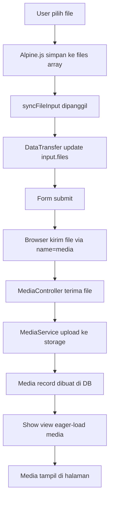

# Rencana Perbaikan: Media Upload Tidak Tampil

## Ringkasan Masalah

Media yang diupload melalui komponen `<x-media-upload>` **tidak pernah dikirim ke server** saat form disubmit. Akibatnya, halaman detail timeline, album, dan diary selalu menampilkan "Belum ada media" meskipun user sudah upload.

## Akar Masalah

**File:** [`media-upload.blade.php`](resources/views/components/media-upload.blade.php:86)

```html
<input
    type="file"
    x-ref="fileInput"
    class="sr-only"
    {{ $multiple ? 'multiple' : '' }}
    accept="{{ $accept }}"
    @change="handleFileSelect($event)"
>
```

**Masalah:** `<input type="file">` **TIDAK memiliki atribut `name`**.

Ketika user memilih file:
1. File disimpan ke Alpine.js state `this.files[]` melalui `handleFileSelect()`
2. TETAPI `<input type="file">` tidak memiliki `name="media[]"`
3. Saat form submit, browser **tidak mengirim file** karena input tidak punya name
4. Hidden input `media_count` hanya mengirim angka count, bukan file

**Mengapa test passing?** Test menggunakan `$this->post(route(...), ['media' => [$file]])` yang langsung menyediakan file array ke request — tidak melewati komponen Blade.

## Yang Sudah Benar

| Komponen | Status | Keterangan |
|----------|--------|------------|
| [`TimelineController::show()`](app/Http/Controllers/TimelineController.php:73) | ✅ | Sudah eager-load `$timeline->load('media')` |
| [`AlbumController::show()`](app/Http/Controllers/AlbumController.php:72) | ✅ | Sudah eager-load `$album->load('media')` |
| [`DiaryController::show()`](app/Http/Controllers/DiaryController.php:71) | ✅ | Sudah eager-load `$diary->load('media')` |
| [`MediaController` store methods](app/Http/Controllers/MediaController.php:19) | ✅ | Validasi dan upload benar |
| [`MediaService::upload()`](app/Services/MediaService.php:30) | ✅ | Simpan ke disk `public` folder `media` |
| [`Media` model](app/Models/Media.php:21) | ✅ | Polymorphic relationship benar |
| Routes media | ✅ | `media.store.timeline`, `.album`, `.diary` terdaftar |
| View display logic | ✅ | `$timeline->media->isEmpty()` logic benar |
| Document upload | ✅ | Pakai `<input name="file">` biasa — berfungsi normal |

## Rencana Perbaikan

### Langkah 1: Perbaiki [`media-upload.blade.php`](resources/views/components/media-upload.blade.php)

**Approach:** Tambahkan `name="media[]"` pada file input dan sinkronkan file selection menggunakan `DataTransfer` API.

Perubahan yang diperlukan:

1. **Tambahkan `name="media[]"`** pada `<input type="file">`
2. **Tambahkan method `syncFileInput()`** yang menggunakan `DataTransfer` API untuk memperbarui `.files` pada input element setiap kali file ditambah/dihapus
3. **Panggil `syncFileInput()`** di `addFiles()` dan `removeFile()`
4. **Hapus hidden input `media_count`** (tidak diperlukan lagi)

```javascript
syncFileInput() {
    const dt = new DataTransfer();
    this.files.forEach(file => dt.items.add(file));
    this.$refs.fileInput.files = dt.files;
}
```

### Langkah 2: Verifikasi View Upload Lainnya

Periksa apakah ada view lain yang menggunakan `<x-media-upload>` atau punya upload serupa:
- `timeline/create.blade.php` — pakai `<x-media-upload>` → otomatis ter-fix
- `albums/create.blade.php` — pakai `<x-media-upload>` → otomatis ter-fix
- `diaries/create.blade.php` — pakai `<x-media-upload>` → otomatis ter-fix
- `documents/create.blade.php` — pakai `<input name="file">` biasa → sudah benar
- `health/create.blade.php` — perlu dicek
- `growth/create.blade.php` — perlu dicek

### Langkah 3: Jalankan Test Suite

```bash
php artisan test --compact
```

Memastikan tidak ada regressi. Tests yang ada sudah menguji backend secara langsung.

### Langkah 4: Jalankan Pint Formatter

```bash
vendor/bin/pint --dirty --format agent
```

### Langkah 5: Update Dokumentasi (jika diperlukan)

Update `AGENTS.md` jika ada konvensi baru tentang media upload component.

## Diagram Alur Perbaikan



## Dampak

- **File yang berubah:** 1 file (`media-upload.blade.php`)
- **View yang terpengaruh:** 6 view (3 create + 3 show) — otomatis ter-fix
- **Risk:** Rendah — hanya memperbaiki frontend component, backend sudah benar
- **Test:** Existing tests sudah cukup, tidak perlu test baru
