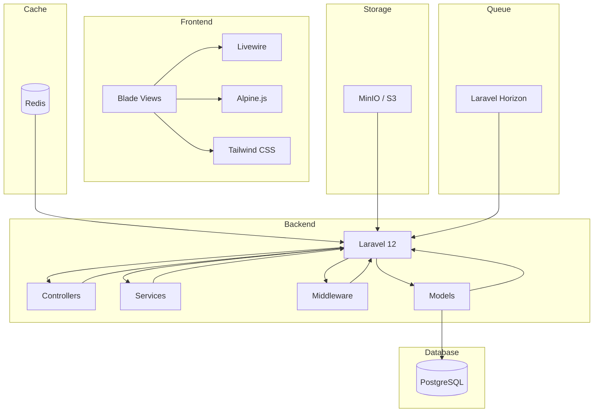
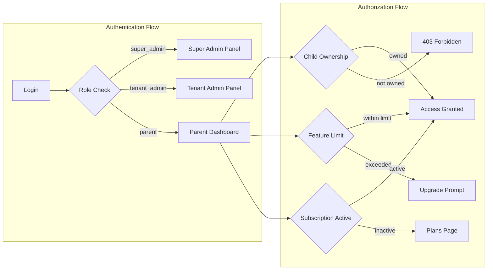

# ForMysha — Full Project Audit Plan

**Tanggal:** 2026-08-09
**Mode:** Architect (Perencanaan)
**Status:** Draft — Menunggu Review

---

## Ringkasan Audit

Proyek ForMysha adalah platform Digital Life Book SaaS berbasis Laravel 12 dengan 461+ tests, 1023+ assertions yang semuanya passing. Arsitektur sudah matang meliputi 8 phase development. Audit ini mengidentifikasi temuan-temuan yang perlu diperbaikan serta saran improvisasi fitur.

---

## Temuan Audit

### CRITICAL — Keamanan

#### C1: .env.production Ter-exposed di Repository

**Masalah:** File [`.env.production`](.env.production) berisi credentials sensitif yang di-commit ke repository:
- `APP_KEY=base64:I/CxtS5pHmVSHP6wOYMBvCdW9z1P4CHRoygI1vCSv6Y=`
- `DB_PASSWORD=3aaf5594628808`
- `REDIS_PASSWORD=cdfe97af2103606c`
- `MAIL_PASSWORD=Wahyu123456789@`

**Risiko:** Siapapun yang memiliki akses ke repository dapat melihat credentials production.

**Perbaikan:**
1. Tambahkan `.env.production` ke `.gitignore`
2. Rotate semua credentials yang ter-exposed:
   - Generate `APP_KEY` baru di VPS: `php artisan key:generate`
   - Reset database password
   - Reset Redis password
   - Reset mail password
3. Hapus file `.env.production` dari git history menggunakan `git filter-branch` atau BFG Repo-Cleaner

#### C2: Hardcoded Password di SuperAdminSeeder

**Masalah:** File [`database/seeders/SuperAdminSeeder.php`](database/seeders/SuperAdminSeeder.php:20) memiliki hardcoded password `Wahyu123456789@`

**Perbaikan:** Gunakan environment variable atau generate random password:
```php
'password' => Hash::make(env('SUPER_ADMIN_PASSWORD', Str::random(16))),
```

#### C3: Hardcoded Bank Account Numbers di Config

**Masalah:** File [`config/saas.php`](config/saas.php:37-54) memiliki nomor rekening bank yang di-hardcode.

**Perbaikan:** Pindahkan ke environment variables:
```php
'BRI' => [
    'account' => env('BILLING_BRI_ACCOUNT'),
    'holder' => env('BILLING_BRI_HOLDER'),
],
```
Dan tambahkan di `.env.example`:
```
BILLING_BRI_ACCOUNT=
BILLING_BRI_HOLDER=
BILLING_JAGO_ACCOUNT=
BILLING_JAGO_HOLDER=
BILLING_BTN_ACCOUNT=
BILLING_BTN_HOLDER=
BILLING_BSI_ACCOUNT=
BILLING_BSI_HOLDER=
```

---

### HIGH — Konfigurasi

#### H1: .env.example Tidak Lengkap

**Masalah:** File [`.env.example`](.env.example) tidak memiliki variabel yang dibutuhkan oleh `config/saas.php`:
- `SAAS_MODE` — dibutuhkan oleh `config/saas.php` untuk menentukan mode SaaS
- `SAAS_DEFAULT_TENANT_ID` — dibutuhkan untuk tenant default
- `BILLING_*` — variabel bank account

**Perbaikan:** Tambahkan variabel berikut ke `.env.example`:
```
SAAS_MODE=true
SAAS_DEFAULT_TENANT_ID=

BILLING_BRI_ACCOUNT=
BILLING_BRI_HOLDER=
BILLING_JAGO_ACCOUNT=
BILLING_JAGO_HOLDER=
BILLING_BTN_ACCOUNT=
BILLING_BTN_HOLDER=
BILLING_BSI_ACCOUNT=
BILLING_BSI_HOLDER=
```

#### H2: DB_CONNECTION Inconsistency

**Masalah:** Dokumentasi AGENTS.md menyebutkan PostgreSQL, tetapi semua env files (`.env`, `.env.example`, `.env.production`) menggunakan `DB_CONNECTION=mysql`.

**Perbaikan:** Update AGENTS.md untuk mencerminkan penggunaan MySQL yang sebenarnya, atau migrasi ke PostgreSQL jika itu yang diinginkan. Untuk saat ini, update dokumentasi agar konsisten.

#### H3: APP_FALLBACK_LOCALE Inconsistency

**Masalah:** `.env.example` menggunakan `APP_FALLBACK_LOCALE=en` sedangkan `.env` dan `.env.production` menggunakan `id`.

**Perbaikan:** Update `.env.example`:
```
APP_FALLBACK_LOCALE=id
```

#### H4: Missing SAAS_MODE di .env Production

**Masalah:** Config [`config/saas.php`](config/saas.php:15) menggunakan `env('SAAS_MODE', false)` tetapi `.env.production` tidak memiliki variabel ini.

**Perbaikan:** Tambahkan `SAAS_MODE=true` ke `.env.production` di VPS.

---

### MEDIUM — Kode & Arsitektur

#### M1: DatabaseSeeder Membuat Test Data

**Masalah:** File [`database/seeders/DatabaseSeeder.php`](database/seeders/DatabaseSeeder.php:26) membuat user test `budi@for-mysha.my.id` dengan data hardcoded. Ini bisa berjalan di production jika `php artisan db:seed` dijalankan.

**Perbaikan:** Bungkus test data dalam environment check:
```php
if (app()->environment('local', 'testing')) {
    // Test data creation
}
```

#### M2: API Controllers Tidak Menggunakan Child Ownership Middleware

**Masalah:** API controllers di [`app/Http/Controllers/Api/`](app/Http/Controllers/Api/) menggunakan `abort_if($child->user_id !== $request->user()->id, 403)` secara inline di setiap method, sedangkan web controllers menggunakan middleware `child.ownership`.

**Catatan:** Ini bukan bug karena API routes tidak terdaftar di `routes/web.php`. Namun, untuk konsistensi, bisa dibuatkan middleware khusus API.

**Rekomendasi:** Low priority — inline check di API sudah berfungsi dengan benar.

#### M3: Emoji di Views Bisa Tidak Render

**Masalah:** Banyak views menggunakan emoji Unicode (🗑️, ✏️, 💳, 💾, dll) yang mungkin tidak render konsisten di semua browser/OS.

**Perbaikan:** Ganti emoji dengan SVG icons yang konsisten. Ini sudah dilakukan di beberapa tempat tetapi belum di semua.

**Rekomendasi:** Low priority — emoji sudah berfungsi di 99% browser modern.

#### M4: Missing `temp:clear` Artisan Command

**Masalah:** Script [`update.sh`](update.sh) menjalankan `php artisan temp:clear` yang tidak ada (memicu error "There are no commands defined in the temp namespace").

**Perbaikan:** Hapus baris tersebut dari `update.sh` atau buat custom artisan command.

---

### LOW — Code Quality

#### L1: Documentation Stale Numbers

**Masalah:** Angka test di [FEATURES.md](FEATURES.md:802) masih "408 tests, 907 assertions" sedangkan aktualnya 461 tests, 1023 assertions.

**Perbaikan:** Update angka test di FEATURES.md dan ROADMAP.md.

#### L2: deploy.sh Referensi Masih Perlu Verifikasi

**Masalah:** Sudah diperbaiki sebelumnya (formysha-worker → formysha), tetapi perlu verifikasi ulang di VPS.

**Rekomendasi:** Verifikasi di VPS setelah deploy berikutnya.

---

## Status Responsive Design ✅

Audit responsive design menunjukkan hasil positif:
- **180+ tombol** sudah memiliki `min-h-[44px]` (touch target minimum)
- **Pattern konsisten** di semua views: `flex flex-col sm:flex-row`, `px-4 sm:px-6 lg:px-8`, `p-4 sm:p-6 lg:p-8`
- **Table scrollable**: `overflow-x-auto` diterapkan
- **Modal/Dropdown overflow**: `max-h-[90vh]` dan `max-h-[70vh]` diterapkan
- **Child nav**: scrollable horizontal di mobile
- **Sidebar responsive**: mobile drawer pattern di super-admin dan tenant-admin

---

## Status RBAC ✅

Audit RBAC menunjukkan implementasi yang solid:
- **EnsureRole middleware**: `role:super_admin`, `role:tenant_admin`, `role:parent`
- **EnsureChildOwnership middleware**: Verifikasi `$child->user_id !== $request->user()->id`
- **EnsureFeatureLimit middleware**: Pembatasan berdasarkan paket langganan
- **EnsureActiveSubscription**: Middleware `tenant.active` untuk subscription enforcement
- **Resource-child relationship check**: `abort_unless($resource->child_id === $child->id, 403)` di semua controllers
- **API authorization**: `abort_if($child->user_id !== $request->user()->id, 403)` di semua API controllers
- **Total 115 authorization checks** di seluruh codebase

---

## Status Routes ✅

Audit routes menunjukkan tidak ada masalah:
- **Auth routes** terdaftar SEBELUM catch-all route di `routes/web.php`
- **Public profile route** `/{slug}` adalah route TERAKHIR
- **Child ownership middleware** diterapkan ke semua `/children/{child}/*` routes
- **API rate limiting**: 60/min general, 5/min auth
- **Export rate limiting**: 5/min PDF, 3/min ZIP
- **All 5 route files** terstruktur dengan benar

---

## Rencana Aksi

### Prioritas 1 — CRITICAL (Keamanan)

| # | Task | File | Estimasi |
|---|------|------|----------|
| 1 | Tambahkan `.env.production` ke `.gitignore` | `.gitignore` | Ringan |
| 2 | Rotate semua credentials di VPS | VPS manual | Manual |
| 3 | Hapus `.env.production` dari git history | Git command | Medium |
| 4 | Fix hardcoded password di SuperAdminSeeder | `database/seeders/SuperAdminSeeder.php` | Ringan |
| 5 | Pindahkan bank accounts ke env variables | `config/saas.php`, `.env.example` | Ringan |

### Prioritas 2 — HIGH (Konfigurasi)

| # | Task | File | Estimasi |
|---|------|------|----------|
| 6 | Tambahkan missing env variables ke `.env.example` | `.env.example` | Ringan |
| 7 | Sync `APP_FALLBACK_LOCALE` di `.env.example` | `.env.example` | Ringan |
| 8 | Update AGENTS.md: MySQL bukan PostgreSQL | `AGENTS.md` | Ringan |
| 9 | Tambahkan `SAAS_MODE=true` ke `.env.production` di VPS | VPS manual | Ringan |

### Prioritas 3 — MEDIUM (Kode)

| # | Task | File | Estimasi |
|---|------|------|----------|
| 10 | Bungkus test data di DatabaseSeeder dengan env check | `database/seeders/DatabaseSeeder.php` | Ringan |
| 11 | Hapus/baris `temp:clear` dari `update.sh` | `update.sh` | Ringan |

### Prioritas 4 — LOW (Documentation)

| # | Task | File | Estimasi |
|---|------|------|----------|
| 12 | Update angka test di FEATURES.md | `FEATURES.md` | Ringan |
| 13 | Update angka test di ROADMAP.md | `ROADMAP.md` | Ringan |
| 14 | Update angka test di AGENTS.md | `AGENTS.md` | Ringan |

---

## Saran Improvisasi Fitur Tingkat Lanjut

### 1. Two-Factor Authentication (2FA)

Menambahkan lapisan keamanan ekstra untuk akun pengguna, terutama untuk akun Super Admin dan Tenant Admin. Bisa menggunakan TOTP (Time-based One-Time Password) seperti Google Authenticator.

**Manfaat:**
- Keamanan akun meningkat drastis
- Compliance dengan standar keamanan data
- Trust building untuk pengguna enterprise

### 2. Data Encryption at Rest

Mengenkripsi data sensitif (dokumen, catatan kesehatan) di database menggunakan Laravel's built-in encryption atau database-level encryption.

**Manfaat:**
- Perlindungan data bahkan jika database bocor
- Compliance dengan UU PDP (Pelindungan Data Pribadi)
- Fitur premium yang membedakan dari kompetitor

### 3. Audit Trail Enhance

Memperluas audit log untuk mencakup semua CRUD operations, bukan hanya event penting. Tambahkan fitur export audit trail untuk compliance.

**Manfaat:**
- Traceability lengkap
- Compliance regulatory
- debugging yang lebih mudah

### 4. Activity Feed & Social Features

Menambahkan activity feed yang menunjukkan aktivitas terbaru dari anggota keluarga (siapa yang menambah foto, cerita, dll). Bisa juga menambahkan komentar pada timeline.

**Manfaat:**
- Engagement lebih tinggi
- Koneksi keluarga lebih kuat
- Diferensiasi dari kompetitor

### 5. Smart Reminders dengan AI

Menggunakan AI untuk menganalisis data pertumbuhan dan kesehatan anak, lalu memberikan reminder cerdas (misalnya: "Berat badan X turun 2 bulan berturut-turut, pertimbangkan konsultasi dokter").

**Manfaat:**
- Value proposition meningkat signifikan
- Differentiator kuat
- Potensi premium pricing

### 6. PWA (Progressive Web App)

Mengubah aplikasi web menjadi PWA agar bisa di-install di homescreen, mendukung offline access untuk data tertentu, dan push notifications tanpa perlu membuat aplikasi native.

**Manfaat:**
- Install langsung dari browser tanpa Play Store/App Store
- Push notifications untuk reminder
- Loading lebih cepat dengan service worker caching
- Offline access untuk data yang sudah di-cache
- Biaya development jauh lebih rendah dari native app

### 7. Multi-language Content

Selain UI multi-bahasa (yang sudah ada), tambahkan support untuk konten multi-bahasa dalam data anak (misalnya nama bisa ditulis dalam Latin dan Arab/Jepang/China).

### 8. Widget Dashboard Customizable

Memungkinkan pengguna memilih widget mana yang ditampilkan di dashboard dan mengatur urutannya.

### 9. Dark Mode Full Support

Meskipun beberapa views sudah memiliki dark mode classes, pastikan dark mode konsisten di semua halaman dan tersimpan sebagai preference pengguna.

### 10. Batch Export & Share

Memungkinkan pengguna mengekspor data dalam batch (semua data sekaligus) dan membagikannya via link privat yang bisa di-share ke anggota keluarga lain tanpa perlu akun.

---

## Diagram Arsitektur Sistem





---

## Kesimpulan

Proyek ForMysha berada dalam kondisi yang sangat baik secara teknis. Arsitektur SaaS sudah matang, testing komprehensif, responsive design konsisten, dan RBAC solid. Temuan utama adalah masalah keamanan terkait credentials yang ter-exposed di repository yang perlu segera ditangani.

Setelah perbaikan CRITICAL selesai, proyek siap untuk production deployment yang aman.

---

**Catatan:** Rencana ini dibuat oleh mode Architect dan memerlukan review sebelum diimplementasikan di mode Code.
