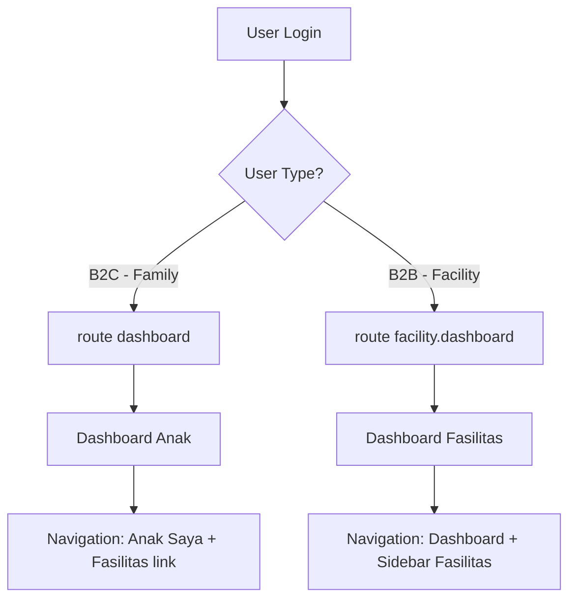

# Phase 15B — B2B/B2C Login & Navigation Differentiation

## Problem Statement

Saat ini tidak ada perbedaan experience antara user B2B (fasilitas kesehatan) dan B2C (keluarga) setelah login. Kedua tipe user selalu diarahkan ke `route('dashboard')` yang sama, meskipun:
- B2B users memiliki facility admin panel lengkap di `/facility/*`
- B2B users memiliki sidebar khusus dengan menu Staf, Pasien, Catatan Klinis, Rujukan
- B2B users seharusnya menggunakan facility dashboard sebagai halaman utama

## Flow Diagram



## Changes Required

### 1. AuthenticatedSessionController — Smart Redirect

**File:** `app/Http/Controllers/Auth/AuthenticatedSessionController.php`

**Current Code (line 42):**
```php
return redirect()->intended(route('dashboard', absolute: false));
```

**New Code:**
```php
// Smart redirect based on user type
if ($user->isFacilityAdmin()) {
    return redirect()->intended(route('facility.dashboard', absolute: false));
}

return redirect()->intended(route('dashboard', absolute: false));
```

**Rationale:**
- `isFacilityAdmin()` sudah ada di User model (line 156-159)
- Method check: `$this->role === 'tenant_admin' && $this->tenant?->isB2B()`
- B2B users akan otomatis diarahkan ke facility dashboard setelah login

### 2. Navigation Already Correct

**File:** `resources/views/layouts/navigation.blade.php`

Navigation sudah memiliki link "Fasilitas" untuk facility admins:
- Desktop: line 27-31
- Mobile: line 204-208

Link aktif menggunakan `request()->routeIs('facility.*')` yang sudah benar.

### 3. Facility Admin Panel Already Complete

**Routes:** `routes/facility-admin.php`
- Protected by `auth`, `verified`, `tenant.active` middleware
- Staff role middleware untuk akses terbatas

**Views:** `resources/views/facility-admin/`
- Dashboard dengan stats (Staff, Patients, Clinical Notes, Referrals)
- Sidebar navigasi lengkap
- 7 controllers di `app/Http/Controllers/FacilityAdmin/`

### 4. Subscription Middleware Already Skips B2B

**File:** `app/Http/Middleware/EnsureActiveSubscription.php`

Sudah benar - skip untuk `super_admin` dan `tenant_admin` roles.

## Implementation Steps

- [ ] **Step 1:** Modify `AuthenticatedSessionController::store()` untuk smart redirect berdasarkan user type
- [ ] **Step 2:** Update test `tests/Feature/FacilityRegistrationTest.php` untuk verify redirect ke facility dashboard
- [ ] **Step 3:** Update test `tests/Feature/Auth/AuthenticationTest.php` untuk verify B2C redirect tetap ke dashboard
- [ ] **Step 4:** Jalankan test suite untuk verifikasi
- [ ] **Step 5:** Run Laravel Pint untuk code formatting
- [ ] **Step 6:** Update FEATURES.md dan ROADMAP.md dengan B2B/B2C improvements

## Testing Strategy

### Facility Registration Test Updates
```php
it('redirects facility admin to facility dashboard after login', function () {
    // Register facility user
    // Login
    // Assert redirect to route('facility.dashboard')
});
```

### Authentication Test Updates
```php
it('redirects family user to dashboard after login', function () {
    // Register family user
    // Login
    // Assert redirect to route('dashboard')
});
```

## Files to Modify

1. `app/Http/Controllers/Auth/AuthenticatedSessionController.php` — Add smart redirect logic
2. `tests/Feature/FacilityRegistrationTest.php` — Add redirect assertion
3. `tests/Feature/Auth/AuthenticationTest.php` — Add B2C redirect assertion
4. `FEATURES.md` — Document B2B/B2C differentiation
5. `ROADMAP.md` — Add Phase 15B entry

## Risk Assessment

- **Low Risk:** Change is minimal and isolated to login flow
- **Backward Compatible:** B2C users unaffected, B2B users get improved experience
- **No Database Changes:** Only controller logic modification
- **No Migration Required:** Per user constraint satisfied

## Expected Outcome

Setelah implementasi:
1. B2C users (keluarga) login → redirect ke `/dashboard` (seperti sekarang)
2. B2B users (fasilitas) login → redirect ke `/facility/dashboard` (baru)
3. Navigation tetap konsisten dengan link "Fasilitas" untuk B2B users
4. User experience lebih intuitif dan terdiferensiasi
