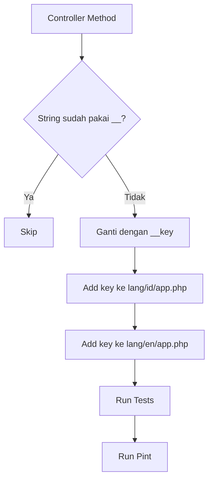
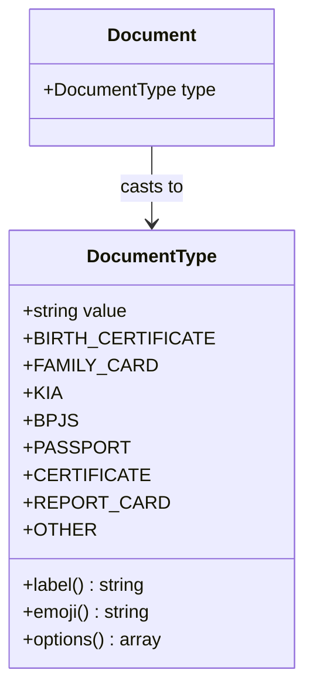

# Phase 20 — Comprehensive Audit & Code Quality

## Ringkasan Temuan Audit

Audit dilakukan terhadap seluruh codebase ForMysha setelah Phase 19B. Temuan difokuskan pada:
- Konsistensi i18n (translation helpers)
- Konsistensi tipe return type di controllers
- Konsistensi dependency injection pattern
- Bug potensial dan edge cases

---

## Temuan Audit

### 1. Hardcoded Strings — 42 Instance

Sebanyak 42 string hardcoded masih ditemukan di controllers yang belum di-wrap dengan `__()` translation helper. Ini mencakup:

| Area | Controller | Jumlah | Status |
|------|-----------|--------|--------|
| SuperAdmin | TenantController | 3 | Hardcoded `with('success', ...)` |
| SuperAdmin | PluginController | 3 | Hardcoded `with('success', ...)` |
| SuperAdmin | PlanController | 3 | Hardcoded `with('success', ...)` |
| SuperAdmin | PaymentController | 2 | Hardcoded `with('success', ...)` |
| SuperAdmin | ErrorLogController | 1 | Hardcoded `with('success', ...)` |
| TenantAdmin | SettingsController | 1 | Hardcoded `with('success', ...)` |
| TenantAdmin | PluginController | 1 | Hardcoded `with('success', ...)` |
| TenantAdmin | DomainController | 3 | Hardcoded `with('success', ...)` |
| TenantAdmin | BrandingController | 2 | Hardcoded `with('success', ...)` |
| FacilityAdmin | StaffController | 3 | Hardcoded `with('success', ...)` |
| FacilityAdmin | ClinicalNoteController | 3 | Hardcoded `with('success', ...)` |
| FacilityAdmin | ReferralController | 4 | Hardcoded `with('success', ...)` |
| FacilityAdmin | PatientLinkController | 4 | Hardcoded `with('success', ...)` |
| FacilityAdmin | FacilitySettingsController | 1 | Hardcoded `with('success', ...)` |
| Subscription | PaymentController | 2 | Hardcoded `with('success/error', ...)` |
| Core | NotificationController | 2 | Hardcoded `with('success', ...)` |
| Core | ExportController | 4 | Hardcoded `with('error', ...)` |
| Middleware | EnsureActiveSubscription | 1 | Hardcoded `with('warning', ...)` |
| Core | ErasureController | 1 | Hardcoded `__('...')` tapi string belum ada di translation file |

**Catatan**: Core controllers (ChildController, TimelineController, AlbumController, dll) sudah benar menggunakan `__('status.xxx')` pattern.

### 2. DocumentController — Hardcoded Document Type Labels

[`DocumentController.php`](app/Http/Controllers/DocumentController.php:39) memiliki hardcoded document type labels:

```php
$documentTypes = [
    'birth_certificate' => '📜 Akta Lahir',
    'family_card' => '🏠 Kartu Keluarga',
    // ...
];
```

Ini belum ada Enum dan belum di-translate. Perlu dibuat [`DocumentType`](app/Enums/DocumentType.php) enum.

### 3. FacilityAdmin — Missing Return Type Hints (15 Methods)

15 method di FacilityAdmin controllers tidak memiliki return type hint:

| Controller | Method | Return Type yang Seharusnya |
|-----------|--------|---------------------------|
| StaffController | `store()` | `: RedirectResponse` |
| StaffController | `update()` | `: RedirectResponse` |
| StaffController | `destroy()` | `: RedirectResponse` |
| ClinicalNoteController | `store()` | `: RedirectResponse` |
| ClinicalNoteController | `update()` | `: RedirectResponse` |
| ClinicalNoteController | `destroy()` | `: RedirectResponse` |
| ReferralController | `store()` | `: RedirectResponse` |
| ReferralController | `accept()` | `: RedirectResponse` |
| ReferralController | `complete()` | `: RedirectResponse` |
| ReferralController | `cancel()` | `: RedirectResponse` |
| PatientLinkController | `store()` | `: RedirectResponse` |
| PatientLinkController | `update()` | `: RedirectResponse` |
| PatientLinkController | `destroy()` | `: RedirectResponse` |
| PatientLinkController | `revoke()` | `: RedirectResponse` |
| FacilitySettingsController | `update()` | `: RedirectResponse` |

### 4. MediaService — Manual Instantiation (5 Instance)

5 instance `new MediaService` ditemukan di controllers alih-alih menggunakan constructor injection:

| Controller | Jumlah |
|-----------|--------|
| [`TimelineController`](app/Http/Controllers/TimelineController.php:84) | 1 |
| [`MediaController`](app/Http/Controllers/MediaController.php:28) | 4 |

---

## Rencana Implementasi

### Sub-Phase 20.1 — DocumentType Enum

- [ ] Buat [`DocumentType`](app/Enums/DocumentType.php) enum dengan cases: `birth_certificate`, `family_card`, `kia`, `bpjs`, `passport`, `certificate`, `report_card`, `other`
- [ ] Tambahkan method `label()`, `emoji()`, dan `options()` pada enum
- [ ] Update [`DocumentModel`](app/Models/Document.php) untuk cast `type` ke `DocumentType`
- [ ] Update [`DocumentController`](app/Http/Controllers/DocumentController.php) untuk gunakan `DocumentType::cases()` alih-alih hardcoded array
- [ ] Update [`StoreDocumentRequest`](app/Http/Requests/StoreDocumentRequest.php) dan [`UpdateDocumentRequest`](app/Http/Requests/UpdateDocumentRequest.php) untuk gunakan enum
- [ ] Tambah translation keys untuk document types di `lang/id/app.php` dan `lang/en/app.php`
- [ ] Tambah unit test untuk `DocumentType` enum

### Sub-Phase 20.2 — Translation Keys Baru

- [ ] Tambah section `super_admin` di `lang/id/app.php` dan `lang/en/app.php` dengan keys:
  - `tenant_created`, `tenant_updated`, `tenant_deleted`
  - `plugin_created`, `plugin_updated`, `plugin_deleted`
  - `plan_created`, `plan_updated`, `plan_deleted`
  - `payment_approved`, `payment_rejected`
  - `logs_cleared`
- [ ] Tambah section `tenant_admin` di translation files:
  - `settings_saved`
  - `plugin_settings_saved`
  - `domain_saved`, `domain_verified`, `domain_deleted`
  - `branding_updated`, `branding_advanced_updated`
- [ ] Tambah section `facility` di translation files:
  - `staff_created`, `staff_updated`, `staff_deactivated`
  - `clinical_note_created`, `clinical_note_updated`, `clinical_note_deleted`
  - `referral_created`, `referral_accepted`, `referral_completed`, `referral_cancelled`
  - `patient_link_created`, `patient_link_updated`, `patient_link_revoked`
  - `settings_updated`
- [ ] Tambah keys lain:
  - `subscription_warning` → EnsureActiveSubscription
  - `no_organization` → PaymentController
  - `payment_proof_sent` → PaymentController
  - `notifications_all_read` → NotificationController
  - `notification_deleted` → NotificationController
  - `export_pdf_profile_failed`, `export_pdf_health_failed`, `export_pdf_growth_failed`, `export_zip_failed` → ExportController
  - `account_deleted_permanently` → ErasureController

### Sub-Phase 20.3 — Wrap Hardcoded Strings dengan `__()` Helper

- [ ] Update [`SuperAdmin/TenantController`](app/Http/Controllers/SuperAdmin/TenantController.php) — 3 string
- [ ] Update [`SuperAdmin/PluginController`](app/Http/Controllers/SuperAdmin/PluginController.php) — 3 string
- [ ] Update [`SuperAdmin/PlanController`](app/Http/Controllers/SuperAdmin/PlanController.php) — 3 string
- [ ] Update [`SuperAdmin/PaymentController`](app/Http/Controllers/SuperAdmin/PaymentController.php) — 2 string
- [ ] Update [`SuperAdmin/ErrorLogController`](app/Http/Controllers/SuperAdmin/ErrorLogController.php) — 1 string
- [ ] Update [`TenantAdmin/SettingsController`](app/Http/Controllers/TenantAdmin/SettingsController.php) — 1 string
- [ ] Update [`TenantAdmin/PluginController`](app/Http/Controllers/TenantAdmin/PluginController.php) — 1 string
- [ ] Update [`TenantAdmin/DomainController`](app/Http/Controllers/TenantAdmin/DomainController.php) — 3 string
- [ ] Update [`TenantAdmin/BrandingController`](app/Http/Controllers/TenantAdmin/BrandingController.php) — 2 string
- [ ] Update [`FacilityAdmin/StaffController`](app/Http/Controllers/FacilityAdmin/StaffController.php) — 3 string
- [ ] Update [`FacilityAdmin/ClinicalNoteController`](app/Http/Controllers/FacilityAdmin/ClinicalNoteController.php) — 3 string
- [ ] Update [`FacilityAdmin/ReferralController`](app/Http/Controllers/FacilityAdmin/ReferralController.php) — 4 string
- [ ] Update [`FacilityAdmin/PatientLinkController`](app/Http/Controllers/FacilityAdmin/PatientLinkController.php) — 4 string
- [ ] Update [`FacilityAdmin/FacilitySettingsController`](app/Http/Controllers/FacilityAdmin/FacilitySettingsController.php) — 1 string
- [ ] Update [`Subscription/PaymentController`](app/Http/Controllers/Subscription/PaymentController.php) — 2 string
- [ ] Update [`NotificationController`](app/Http/Controllers/NotificationController.php) — 2 string
- [ ] Update [`ExportController`](app/Http/Controllers/ExportController.php) — 4 string
- [ ] Update [`EnsureActiveSubscription`](app/Http/Middleware/EnsureActiveSubscription.php) — 1 string
- [ ] Update [`ErasureController`](app/Http/Controllers/ErasureController.php) — 1 string

### Sub-Phase 20.4 — Return Type Hints untuk FacilityAdmin

- [ ] Tambah `use Illuminate\Http\RedirectResponse;` di semua FacilityAdmin controllers yang belum punya
- [ ] Tambah `: RedirectResponse` return type ke 15 method yang belum punya (lihat tabel di atas)

### Sub-Phase 20.5 — MediaService Constructor Injection

- [ ] Update [`TimelineController`](app/Http/Controllers/TimelineController.php) — inject `MediaService` via constructor, hapus `new MediaService`
- [ ] Update [`MediaController`](app/Http/Controllers/MediaController.php) — inject `MediaService` via constructor, hapus 4x `new MediaService`

### Sub-Phase 20.6 — Tests & Quality Assurance

- [ ] Tambah test untuk `DocumentType` enum (unit test)
- [ ] Jalankan `php artisan test --compact` untuk memastikan semua tests passing
- [ ] Jalankan `.\vendor\bin\pint --dirty --format agent` untuk formatting

### Sub-Phase 20.7 — Documentation Update

- [ ] Update `AGENTS.md` — tambahkan Phase 20 entries di roadmap dan Quality Assurance section
- [ ] Update `ROADMAP.md` — tambahkan Phase 20 entries
- [ ] Update `FEATURES.md` — tambahkan DocumentType enum entry

---

## Diagram Alur Translation Pattern



## Diagram Arsitektur DocumentType Enum



## Prioritas Eksekusi

| Prioritas | Sub-Phase | Impact | Kompleksitas |
|-----------|-----------|--------|-------------|
| Tinggi | 20.2 — Translation Keys | Fondasi untuk semua controller | Rendah |
| Tinggi | 20.3 — Wrap Hardcoded Strings | Konsistensi i18n | Rendah |
| Sedang | 20.1 — DocumentType Enum | Type safety + i18n | Sedang |
| Sedang | 20.4 — Return Type Hints | Code quality | Rendah |
| Rendah | 20.5 — MediaService DI | Code consistency | Rendah |
| Wajib | 20.6 — Tests | Quality assurance | Rendah |
| Wajib | 20.7 — Documentation | Project docs | Rendah |
